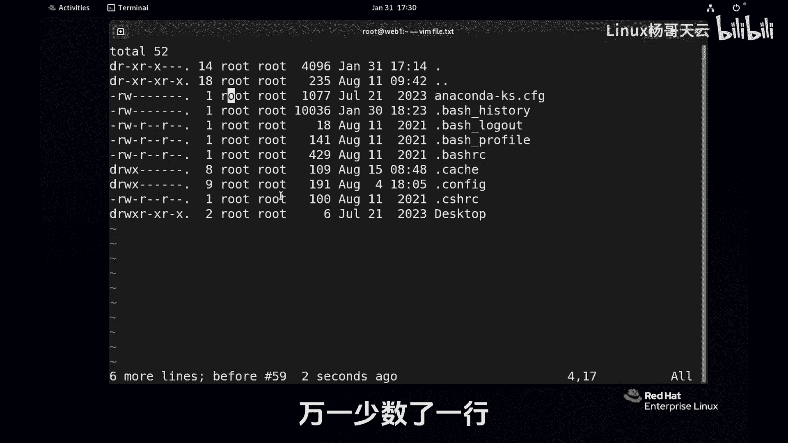
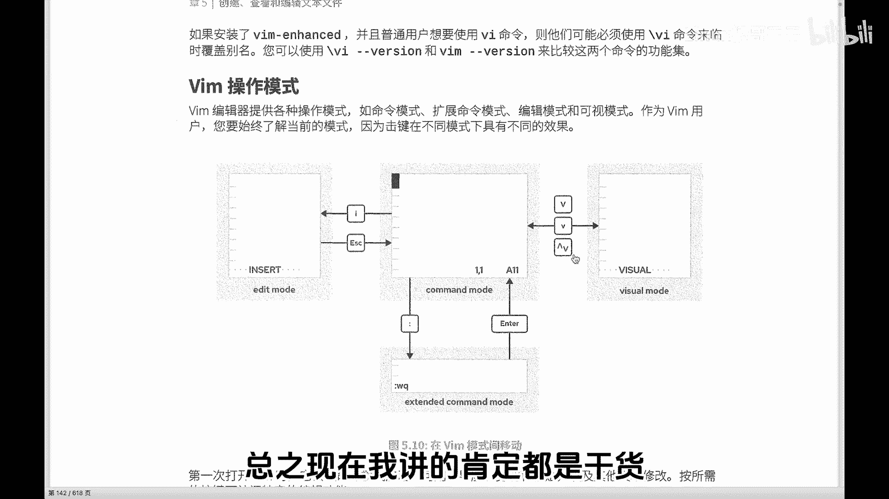
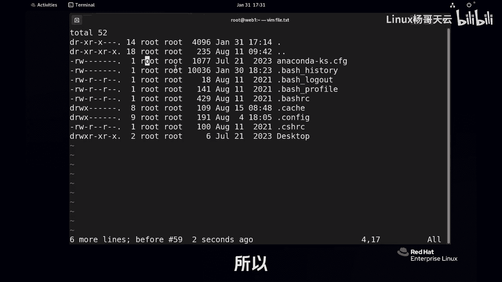
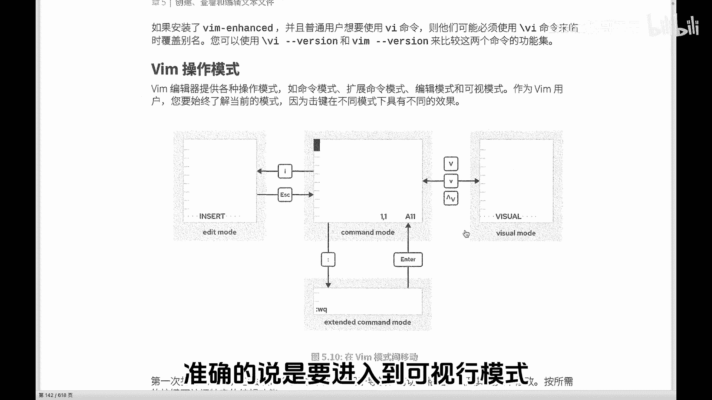
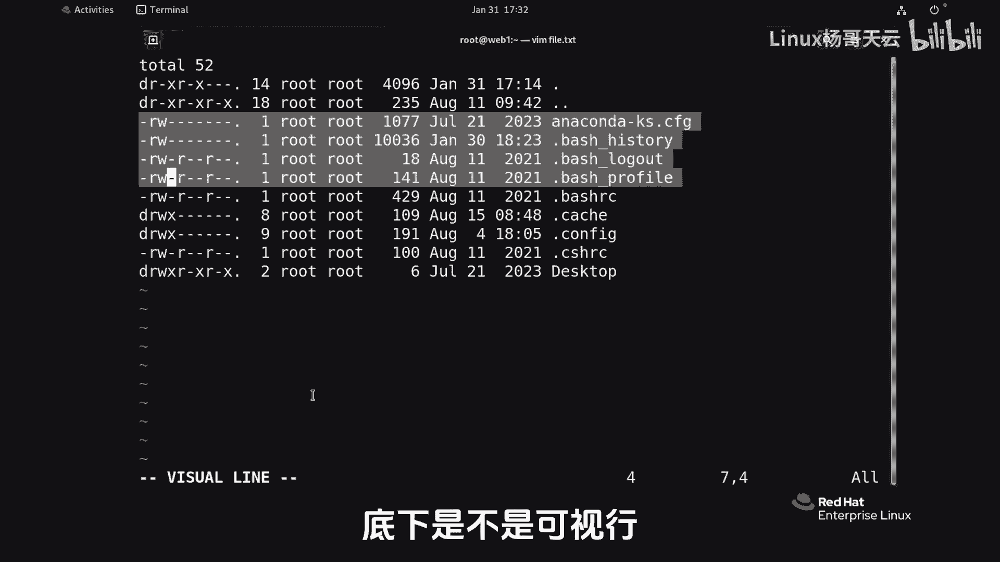
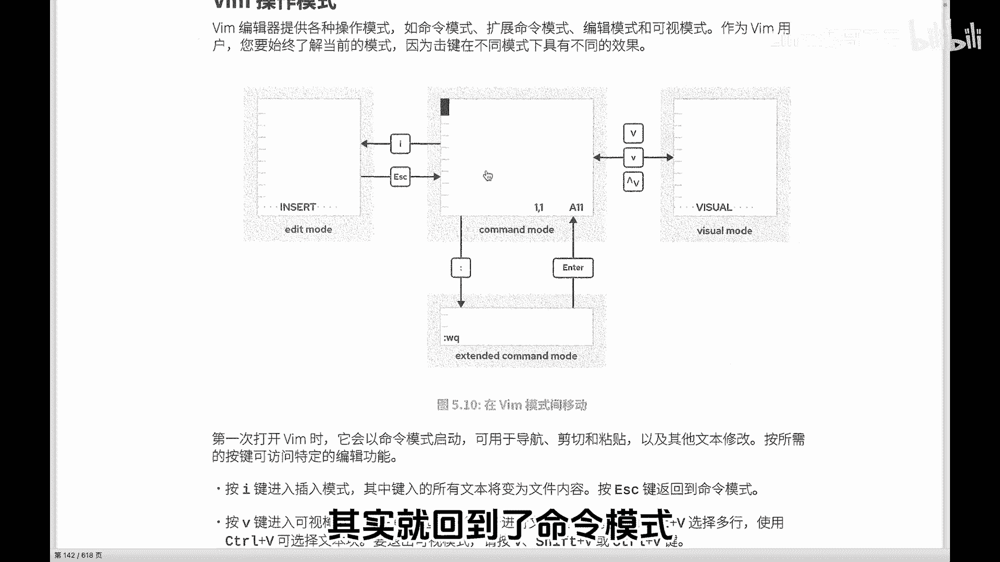
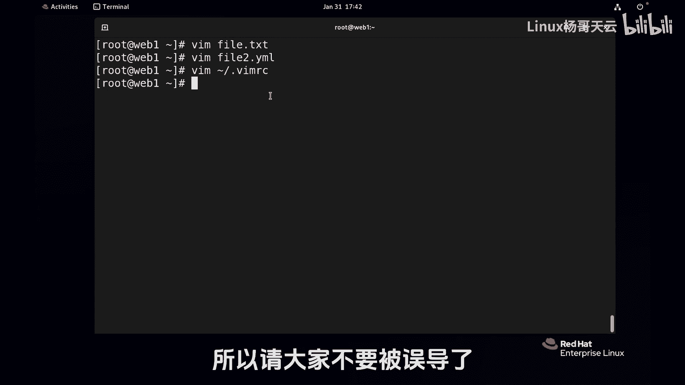

# Linux入门与红帽认证RHCE通关教程：P38：Vim的正确打开方式（下）

在本节课中，我们将继续深入学习Vim编辑器的进阶操作，特别是可视模式的使用、查找替换技巧以及如何通过配置文件定制Vim的工作环境。掌握这些技能将帮助你更高效、更准确地编辑文本文件。

上一节我们介绍了Vim的基本模式切换和基础编辑命令，本节中我们来看看如何利用可视模式进行精确的文本选择与操作。



## 可视模式：精确操作的利器

当需要删除或修改多行文本，但不确定具体行数时，手动计数容易出错。Vim的可视模式允许你直观地选择文本区域，再进行操作。



以下是进入可视行模式的步骤：
1.  在命令模式下，按下 `Shift + V` 进入可视行模式。
2.  使用方向键（上/下）或 `j`/`k` 键移动光标，高亮选择多行文本。
3.  选择完成后，直接按 `d` 即可删除选中的所有行。



可视模式操作后，Vim会自动返回到命令模式。



除了可视行模式，Vim还提供了可视块模式，用于处理列对齐的文本。



以下是进入可视块模式的操作：
1.  在命令模式下，按下 `Ctrl + V` 进入可视块模式。
2.  移动光标，选择一个矩形文本块。
3.  此时可以进行批量操作，例如：
    *   按 `r`，再输入一个新字符（如 `y`），可将选中块内的所有字符替换为新字符。
    *   按 `d`，可删除整个选中的文本块。



## 文本查找与基础导航

在命令模式下，可以进行文本查找。

以下是基本的查找命令：
*   **查找**：输入 `/` 后接要查找的字符串（如 `/bash`），然后按回车。所有匹配项会高亮显示。
*   **跳转**：按 `n` 跳转到下一个匹配项，按 `N` 跳转到上一个匹配项。

若要清除查找后的高亮显示，可以查找一个不存在的字符串（如 `/asdfghjkl`）。

## 保存、退出与强制操作

编辑完成后，需要保存或退出文件。

以下是常用的保存与退出命令（在命令模式下输入 `:` 进入末行模式后使用）：
*   `:w`：保存文件。
*   `:q`：退出Vim（仅当文件未修改时有效）。
*   `:wq`：保存文件并退出。
*   `:q!`：不保存修改，强制退出。

## 显示行号与持久化设置

显示行号有助于精确定位。

在末行模式下输入 `:set number` 或 `:set nu` 可以显示行号。但此设置仅对当前会话有效。

若希望每次打开Vim都自动显示行号，需要修改用户配置文件。

每个用户的家目录（`~`）下可以创建一个名为 `.vimrc` 的隐藏配置文件。在此文件中添加设置，即可永久生效。

例如，创建或编辑 `~/.vimrc` 文件，加入以下内容：
```vim
set number
```
保存后，再次使用Vim打开任何文件，都会默认显示行号。

## 高级配置：针对文件类型设置

`.vimrc` 文件功能强大，可以针对不同文件类型进行个性化设置。

例如，在编写YAML文件（常用于Ansible）时，通常希望Tab键缩进为2个空格，而非默认的8个。

可以在 `~/.vimrc` 文件中添加如下配置：
```vim
autocmd FileType yaml setlocal ts=2
```
这段配置的含义是：自动检测文件类型，当文件类型为 `yaml` 时，将Tab键宽度（`ts`）设置为2个字符。

这样，当你编辑 `.yml` 或 `.yaml` 文件时，按Tab键会产生2个空格的缩进，而编辑其他类型文件则不受影响。

## 常用编辑技巧补充

在命令模式下，有两个快速插入新行的技巧：
*   按 `o`：在当前行下方**另起一行**，并进入插入模式。
*   按 `O`（大写）：在当前行上方插入新行，并进入插入模式。



本节课中我们一起学习了Vim的可视模式操作、文本查找、保存退出命令，以及如何通过 `~/.vimrc` 配置文件永久定制Vim的编辑环境（如行号、Tab宽度）。Vim的学习关键在于实践，通过不断练习，这些操作会逐渐成为你的肌肉记忆，最终达到“手中无剑，心中有剑”的熟练境界。后续课程中遇到新的Vim操作时，我们会结合实际场景再进行讲解。