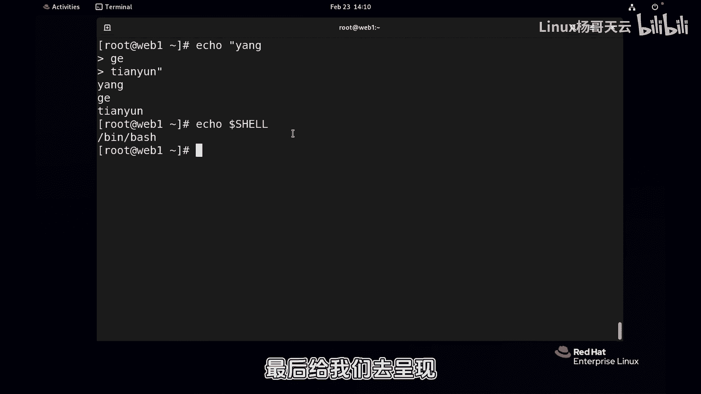
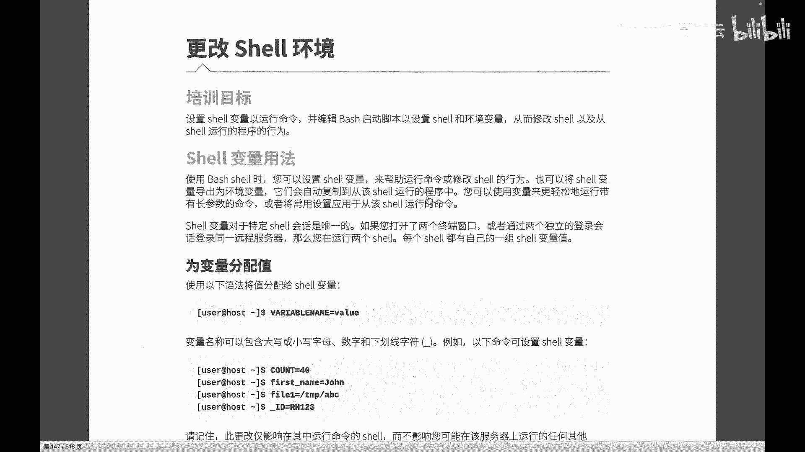
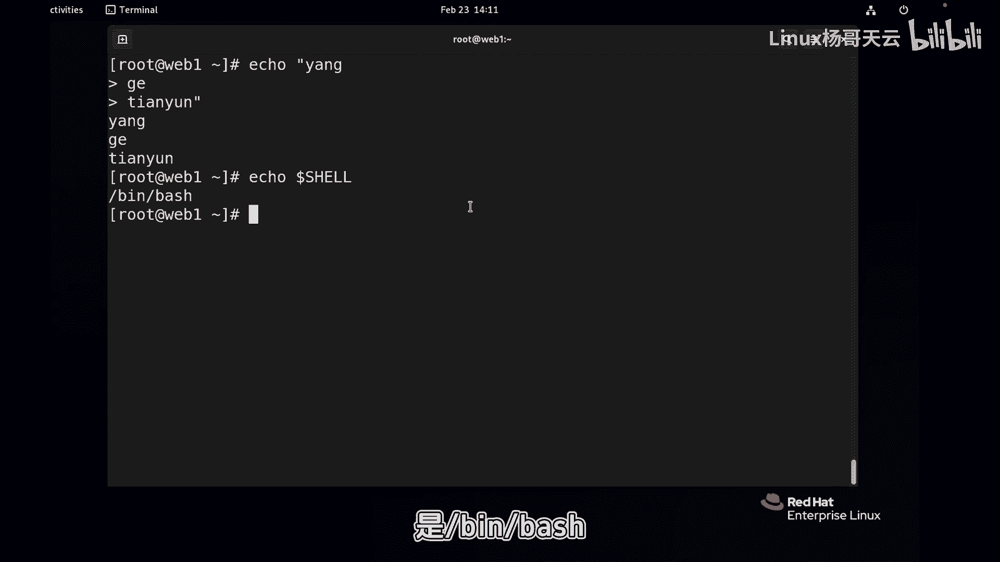
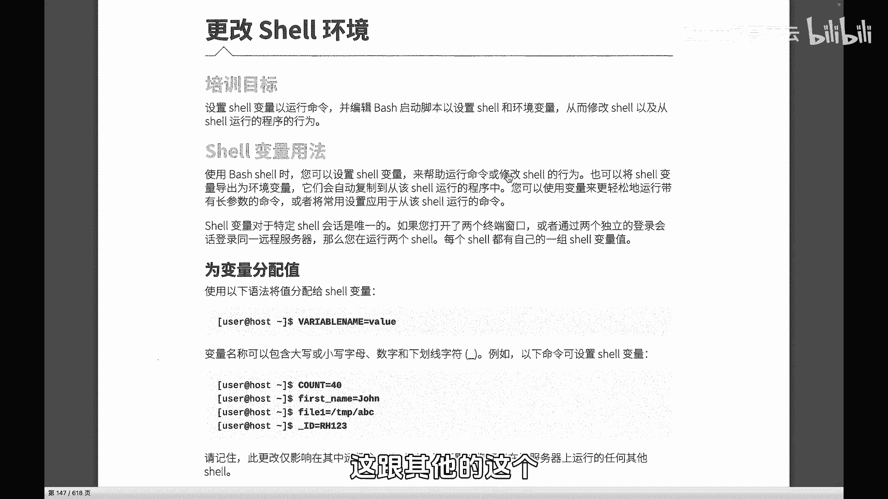
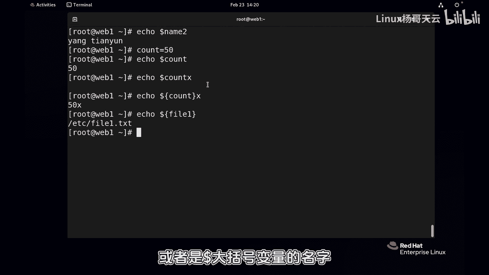
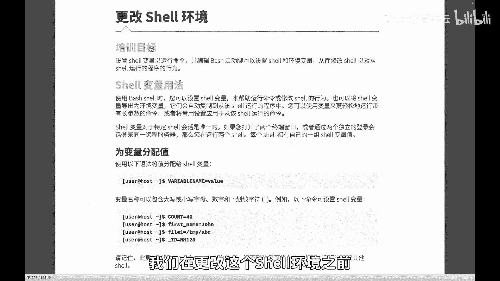
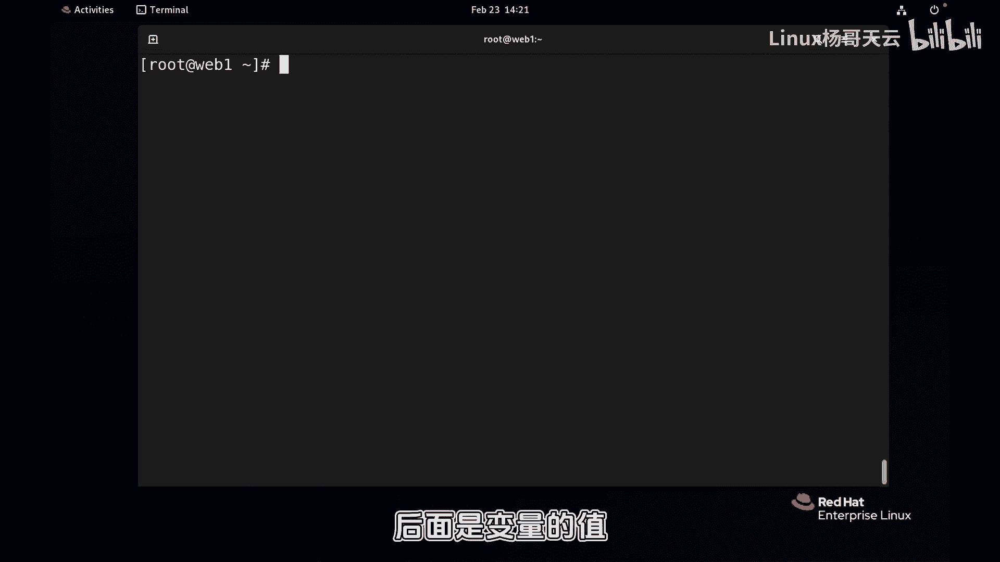

# Linux入门教程：39：了解Shell变量 🐚

在本节课中，我们将学习Shell变量的基本概念、定义方法以及如何引用它们。理解变量是掌握Shell环境配置和后续编写Shell脚本的基础。

## 概述

Shell变量是存储数据的容器，其值可以是数字、字符串或文件路径等。通过变量，我们可以方便地引用和修改数据，从而影响Shell的运行环境。本节将介绍如何定义、查看和引用Shell变量。

## 变量的定义与语法

定义Shell变量的语法非常简单，直接使用变量名、等号和变量值即可。等号在这里是赋值的意思，而不是数学上的相等。



**公式：**
```
变量名=变量值
```



例如，定义一个名为`name`的变量，其值为`book`：
```bash
name=book
```



再定义一个名为`file1`的变量，其值为一个文件路径：
```bash
file1=/etc/l1.tst
```

变量名只能包含大小写字母、数字和下划线。如果变量值中包含空格，建议使用引号将其括起来，以避免解析错误。



例如，定义一个包含空格的变量：
```bash
name2="杨哥天云"
```

## 查看变量

我们可以使用`set`命令查看当前Shell会话中定义的所有变量和函数。这个列表会包含系统预定义的变量和我们自定义的变量。

例如，运行`set`命令会显示大量信息，我们可以配合`less`命令进行分页查看：
```bash
set | less
```

在输出的末尾，你可以找到我们刚才定义的变量，如`name`、`file1`和`name2`。

## 引用变量

在Shell中，我们通过美元符号`$`来引用一个变量的值。这是使用变量的核心操作。

**公式：**
```
$变量名
或
${变量名}
```

例如，要显示变量`file1`的值：
```bash
echo $file1
```

这将输出`/etc/l1.tst`。

在某些情况下，为了明确变量名的边界，我们需要使用花括号`{}`将变量名括起来。例如，当变量名后面需要紧跟其他字符时：

```bash
count=50
echo ${count}X
```

这将输出`50X`。如果不加花括号，Shell会尝试寻找一个名为`countX`的变量，从而导致错误或空输出。

## 环境变量与Shell环境

上一节我们介绍了如何定义和引用自定义变量。本节中我们来看看那些由系统预定义、用于控制Shell环境的变量，即环境变量。

环境变量影响着Shell的诸多行为，例如：
*   **命令搜索路径**：当我们输入一个命令（如`ls`）时，Shell会根据`PATH`变量中定义的目录列表去查找该命令。
*   **历史命令记录**：`HISTSIZE`变量决定了历史命令列表保存的数量，而`HISTFILE`变量指定了保存历史命令的文件位置。
*   **提示符样式**：`PS1`、`PS2`等变量定义了命令行提示符的显示格式。



我们可以使用`env`或`printenv`命令专门查看环境变量：
```bash
env
```



例如，查看当前的命令搜索路径：
```bash
echo $PATH
```

查看当前Shell程序的路径：
```bash
echo $SHELL
```

## 总结



本节课中我们一起学习了Shell变量的核心知识。我们掌握了定义变量的基本语法，学会了使用`set`命令查看所有变量，以及通过`$`符号引用变量值的方法。我们还了解到，除了自定义变量，系统预定义的环境变量（如`PATH`、`HISTSIZE`）对Shell的运行环境起着关键作用。理解这些是后续配置Shell环境和编写脚本的重要基础。