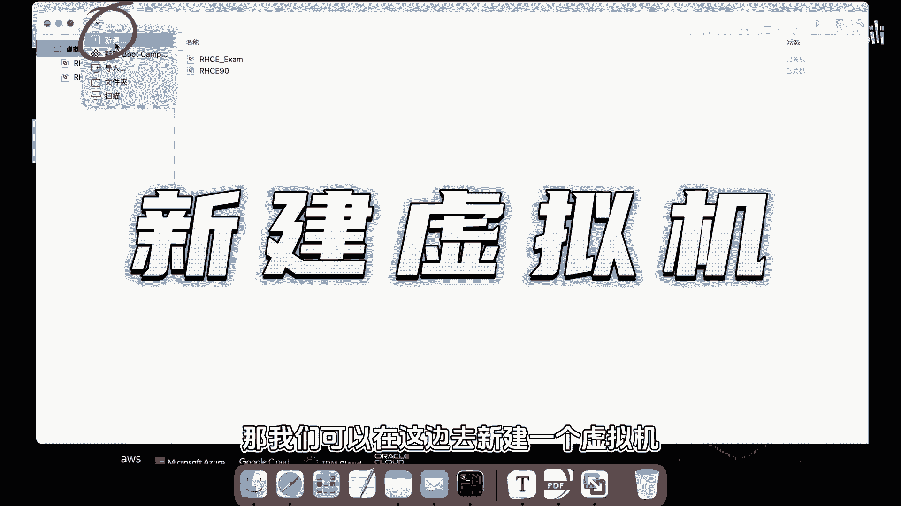
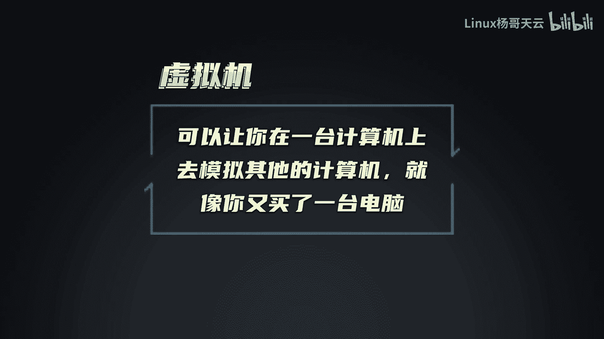
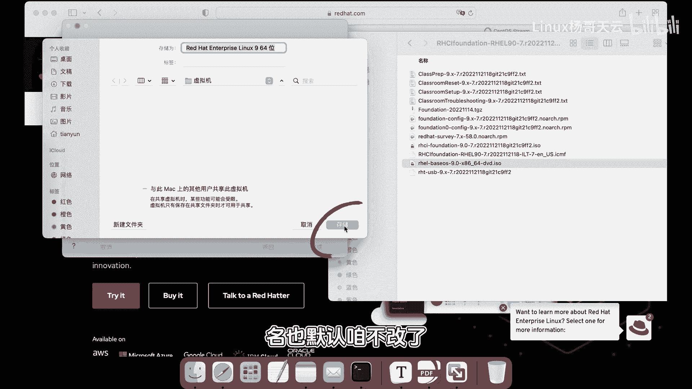
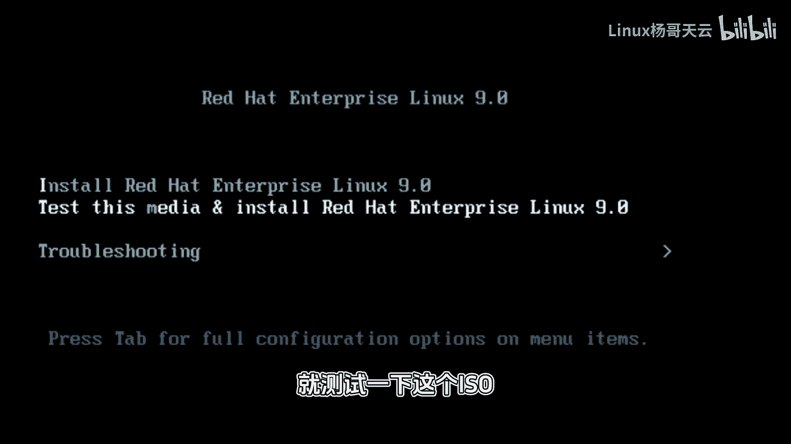
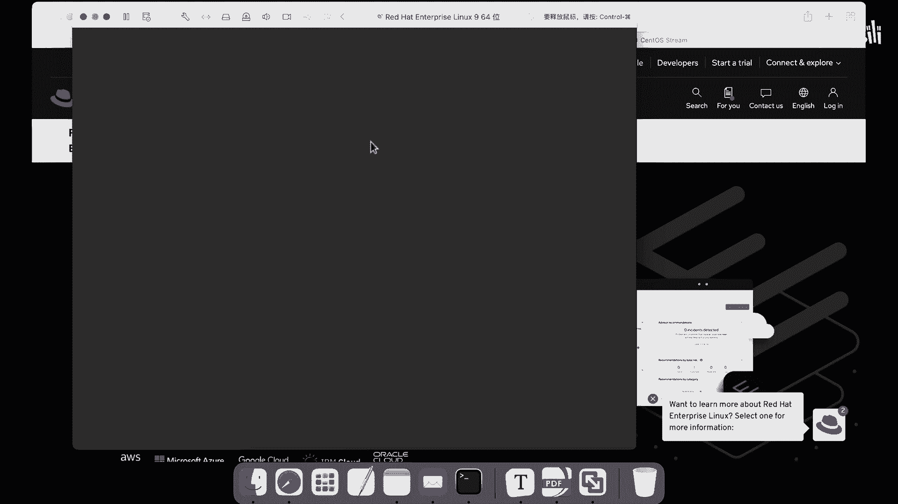
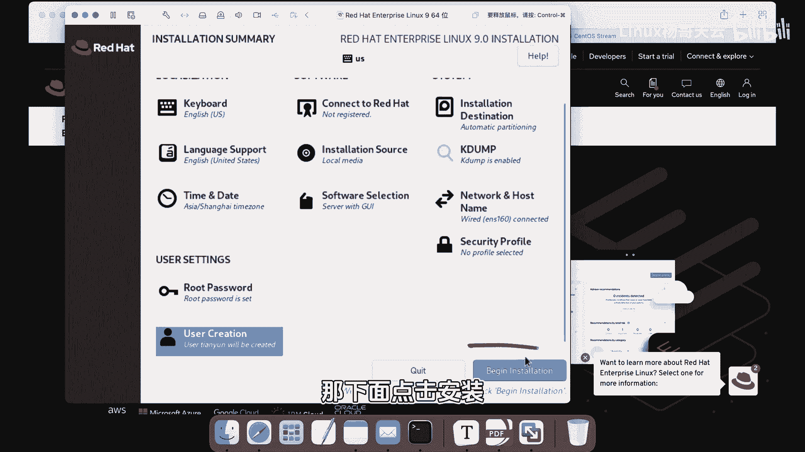
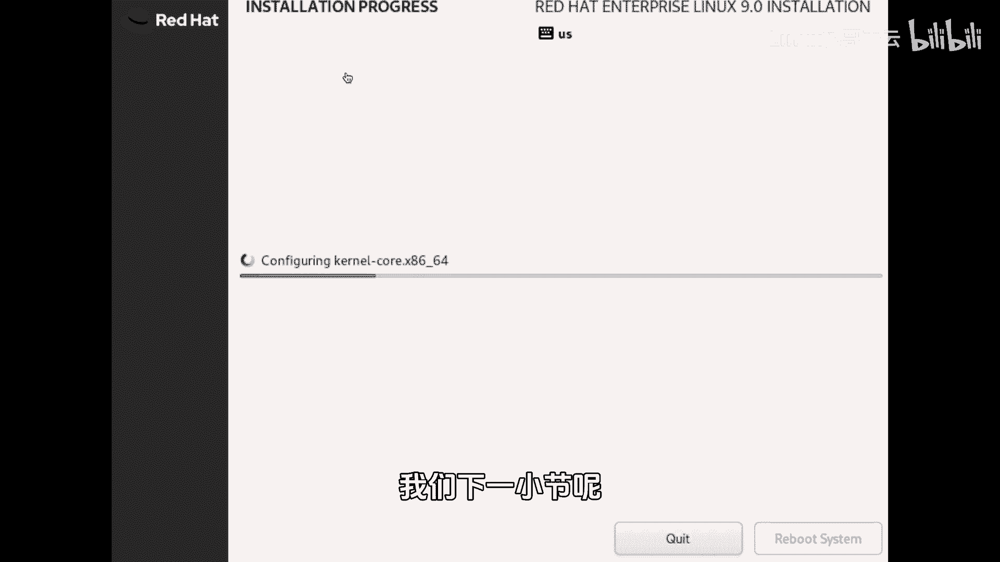

# Linux入门教程：P3：手把手安装Linux系统 🖥️

在本节课中，我们将学习如何使用虚拟机软件，在一台计算机上模拟并安装一个全新的Linux操作系统。整个过程将分为创建虚拟机、配置安装选项和完成初始设置几个步骤。

---

## 创建虚拟机

虚拟机软件可以让你在一台计算机上模拟运行其他计算机的操作系统，就像你拥有另一台电脑一样。

以下是创建虚拟机的步骤：
1.  打开虚拟机软件，选择新建一个虚拟机。
2.  将Linux系统镜像文件（ISO）拖拽到虚拟机创建界面。
3.  在安装向导中，选择“继续”。
4.  暂时不使用快捷安装功能，点击“继续”。
5.  后续的配置选项均保持默认设置，包括虚拟机名称和存储位置。
6.  完成配置后，启动虚拟机。

## 启动与安装设置

启动虚拟机后，会进入安装引导界面。上一节我们创建了虚拟机，本节中我们来看看如何进行具体的安装设置。

安装引导界面通常提供两个选项：
*   **安装企业版Linux 9**：直接开始安装系统。
*   **测试安装媒体**：检查你下载的ISO镜像文件是否完整。

我们选择第一项“安装企业版Linux 9”并开始安装。

## 配置系统选项

接下来，我们需要对即将安装的系统进行一些基本配置。以下是需要配置的主要项目：

**语言与键盘**
*   系统语言建议选择英文，以避免后续使用中可能出现的显示异常。
*   键盘布局保持默认设置即可。

**安装信息摘要**
此界面汇总了所有待配置项，必须全部完成才能开始安装。主要配置包括：

1.  **安装目的地（分区）**：点击进入后，选择“自动分区”方案，然后点击“完成”。系统会自动为你创建合理的磁盘分区。
2.  **Root密码**：Root是Linux系统中权限最高的管理员账户，相当于Windows的Administrator。必须为其设置一个强密码。
    *   **密码要求**：应包含英文字母（大小写）、数字和特殊符号，以保证系统安全。
    *   **示例公式**：`密码强度 = 长度 + 字符种类多样性`
3.  **用户创建**：除了Root账户，强烈建议创建一个供日常使用的普通用户账号。
    *   输入用户名（例如：tianyun）。
    *   为该用户设置密码。
    *   注意：出于安全考虑，不建议将此普通用户设为管理员。

**其他设置**
*   **时区**：选择“亚洲/上海”。
*   **软件选择**：这里决定安装的系统类型。
    *   **带GUI的服务器**：安装图形界面。
    *   **服务器**：不安装图形界面，仅命令行操作。
    *   对于初学者，可以选择默认项或根据喜好选择。保持系统精简有利于运行效率。
*   **网络和主机名**：保持默认的联网设置即可。

完成所有配置后，点击“开始安装”。

## 安装过程与总结

系统安装过程需要一些时间，请耐心等待。安装完成后，系统会提示重启。

本节课中我们一起学习了Linux系统的完整安装流程。我们首先使用虚拟机软件创建了一个虚拟计算机，然后通过配置语言、分区、Root密码、创建用户等关键选项，最终成功启动了系统安装。记住，为Root设置强密码和创建日常使用的普通用户是保证系统安全的重要步骤。下一节，我们将从安装完成的系统开始，进行初始登录和探索。