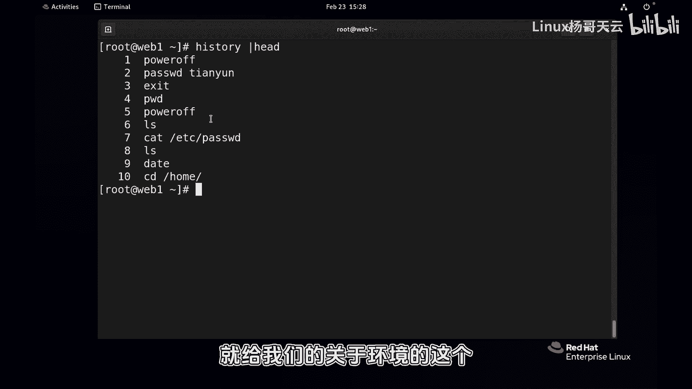
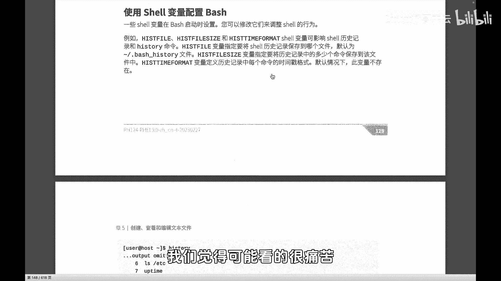
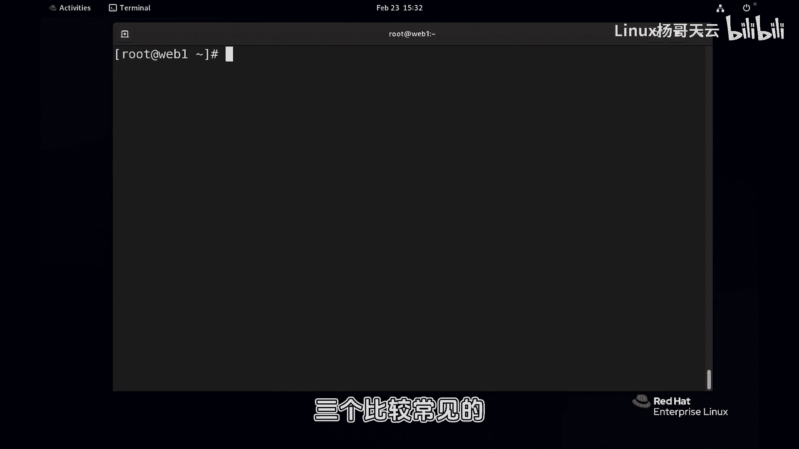
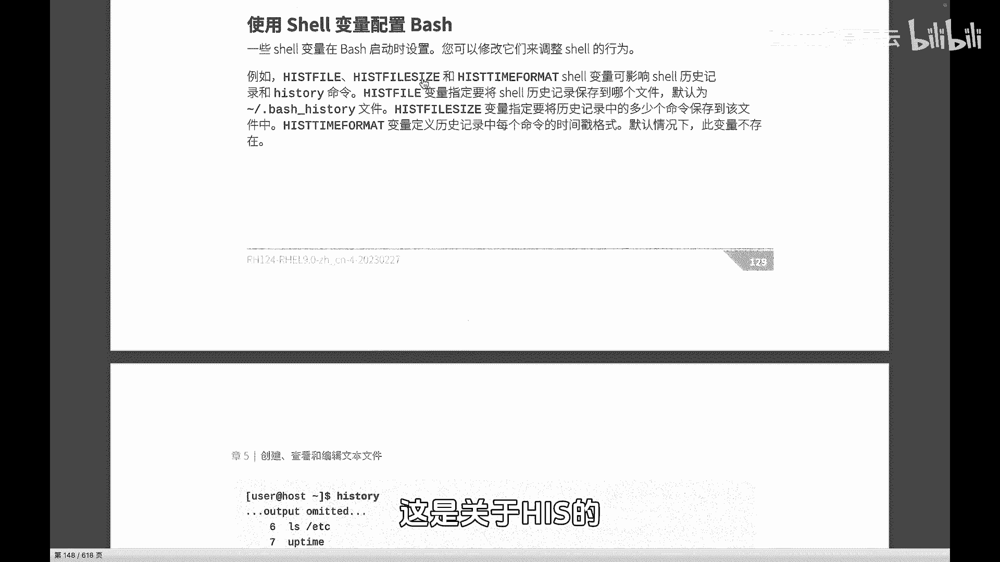
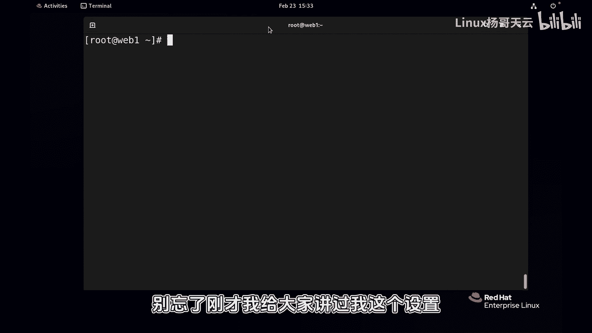
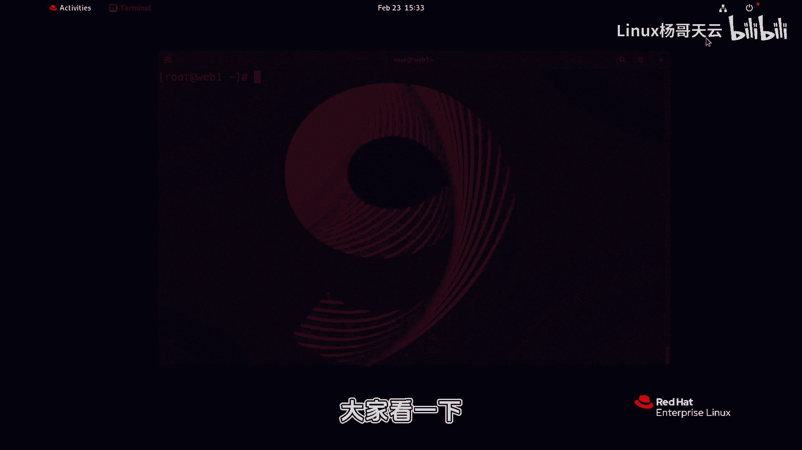
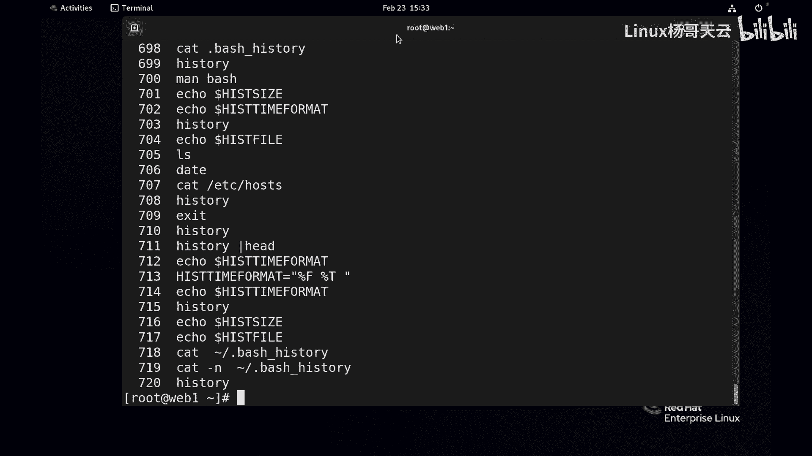
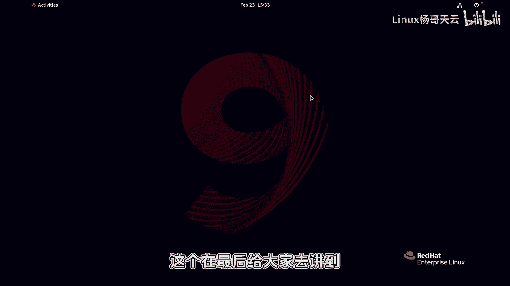

# Linux入门教程：P40：历史命令时间戳设置 📜

在本节课中，我们将学习如何配置Shell环境变量，特别是与历史命令`history`相关的设置。我们将重点介绍如何为历史命令添加时间戳，以便于追溯命令执行的时间，这对于系统排错和安全审计非常有帮助。

---

上一节我们介绍了Shell环境变量的基本概念，本节中我们来看看如何通过设置环境变量来定制历史命令的显示格式。



默认情况下，`history`命令仅显示命令的编号和内容，不包含执行时间。这在需要追溯问题根源或进行安全审计时非常不便。

## 设置历史命令时间戳



为了在历史记录中显示时间戳，我们需要设置一个名为 `HISTTIMEFORMAT` 的环境变量。该变量定义了时间戳的显示格式。

以下是设置步骤：

1.  **临时设置**：在当前的Shell会话中设置变量，关闭终端后失效。
    ```bash
    export HISTTIMEFORMAT="%Y-%m-%d %H:%M:%S "
    ```
    此命令将时间戳格式设置为“年-月-日 时:分:秒 ”。

2.  **验证效果**：设置后，再次执行 `history` 命令，即可看到每条命令前都带上了执行时间。
    ```bash
    history
    ```
    输出示例：
    ```
    1  2024-02-23 15:29:59 ls
    2  2024-02-23 15:30:01 cd /var/log
    ```

## 其他相关历史命令变量

除了时间戳，还有其他几个与历史命令相关的环境变量可以配置，以满足不同需求。

以下是几个常见的变量：

*   **`HISTSIZE`**：定义在内存中保存的历史命令条数。默认通常是1000条。超过此数量，最早的记录会被覆盖。
    ```bash
    echo $HISTSIZE
    ```
    你可以通过 `export HISTSIZE=5000` 将其修改为5000条。

*   **`HISTFILE`**：定义历史命令持久化保存的文件路径。默认是当前用户家目录下的 `.bash_history` 文件。
    ```bash
    echo $HISTFILE
    cat ~/.bash_history | wc -l
    ```
    修改此变量可以将历史记录保存到其他位置，这在一定程度上可以防止恶意清除操作痕迹。



*   **`HISTFILESIZE`**：定义历史命令文件（如 `.bash_history`）中最大保存的条数。超过此限制，文件头部的旧记录会被清除。

## 关于环境变量的持久化



需要注意的是，使用 `export` 命令进行的设置是临时的，仅对当前Shell会话有效。一旦关闭终端或开启新的会话，设置就会失效。





为了使设置永久生效，需要将 `export` 命令写入Shell的配置文件中（例如 `~/.bashrc` 或 `~/.bash_profile`）。我们将在后续课程中详细讲解如何永久设置环境变量。



---



本节课中我们一起学习了如何通过设置 `HISTTIMEFORMAT` 环境变量为历史命令添加时间戳，并了解了 `HISTSIZE`、`HISTFILE` 等控制历史记录行为的其他变量。掌握这些配置能极大地帮助系统管理和安全排查工作。记住，目前的设置方法是临时的，在后续课程中我们将学习如何永久保存这些配置。