Linux入门教程：41：Shell提示符自定义指南 🖥️

在本节课中，我们将学习如何自定义Linux Shell的提示符。通过调整提示符的显示内容，我们可以更清晰地了解当前登录的用户、主机以及工作目录，从而提升工作效率并避免操作失误。

---

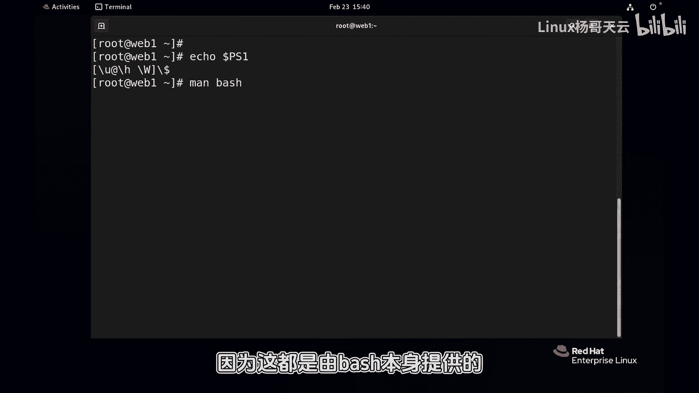

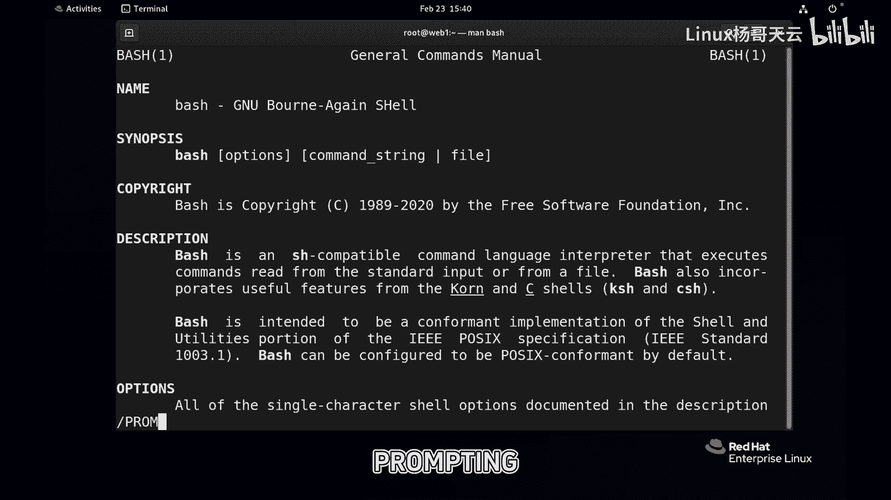

上一节我们介绍了Shell的基本概念，本节中我们来看看如何自定义Shell提示符的显示格式。

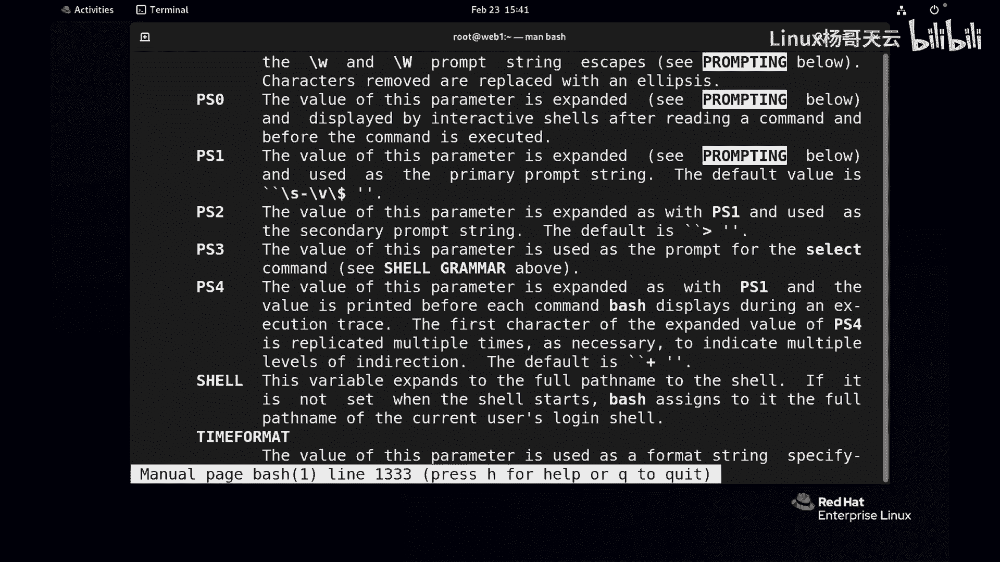

在管理多台服务器时，仅从默认的主机名可能无法快速识别当前操作的服务器。此外，默认的提示符可能只显示当前目录的基名（basename），而非完整路径。为了解决这些问题，我们可以自定义Shell的提示符变量 `PS1`。

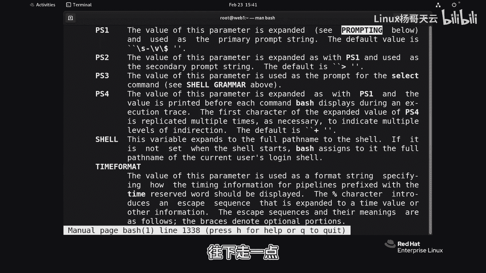

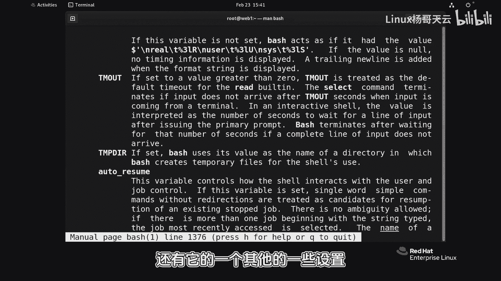

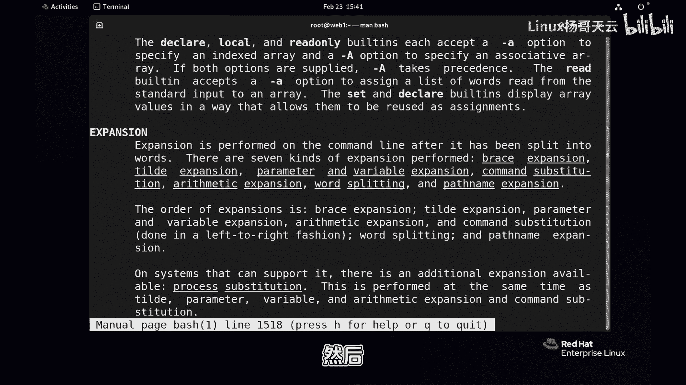

Shell的主提示符由环境变量 `PS1` 定义。其默认格式通常包含用户名、主机名和工作目录等信息。例如，一个常见的格式是 `\u@\h \W\$`，其中：
*   `\u` 代表当前用户名。
*   `\h` 代表主机名（短格式）。
*   `\W` 代表当前工作目录的基名。
*   `\$` 代表提示符（普通用户为`$`，root用户为`#`）。

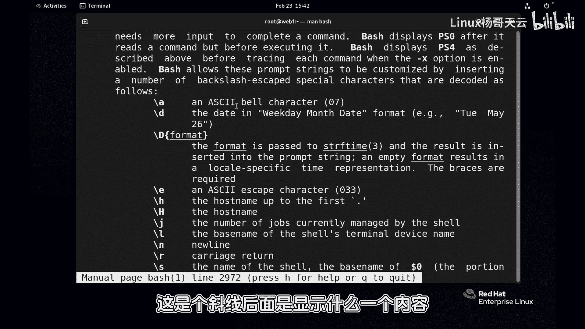

如果我们希望显示完整的主机名和当前目录的绝对路径，就需要修改 `PS1` 变量。

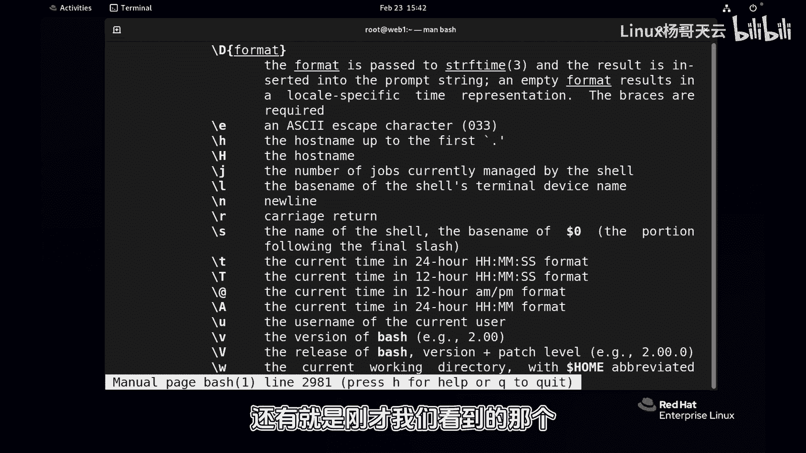

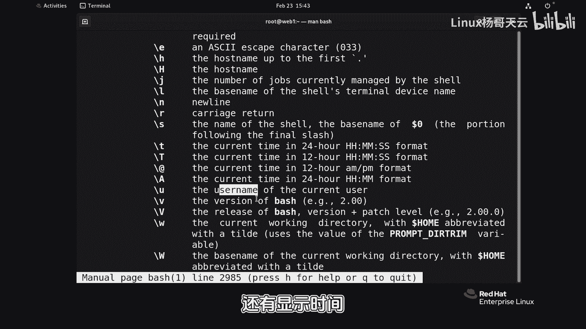

---

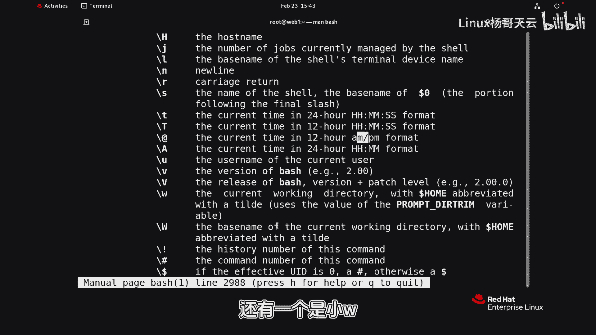

以下是查看和修改提示符的详细步骤。

首先，我们可以通过 `man bash` 命令查看Bash手册中关于提示符的详细说明。在手册中搜索 `PROMPTING` 可以找到关于 `PS1`、`PS2` 等提示符变量的定义和可用转义序列。

常见的提示符变量有 `PS1`（主提示符）和 `PS2`（次提示符）。`PS2` 在命令输入未完成时（例如使用了转义字符 `\` 换行，或引号未闭合）出现。

`PS1` 变量支持多种转义序列来控制显示内容，例如：
*   `\H`：完整的主机名。
*   `\w`：当前工作目录的绝对路径。
*   `\t`：24小时制时间（HH:MM:SS）。
*   `\T`：12小时制时间（HH:MM:SS）。

要修改 `PS1`，可以直接为其赋值。建议先复制默认值再进行修改，以确保格式正确。赋值时需要使用引号将整个字符串括起来，并注意各部分之间的空格。

例如，将提示符设置为显示完整主机名和绝对路径：
```bash
PS1="[\u@\H \w]\\$ "
```
请注意，`\$` 前需要两个反斜杠 `\\` 来正确转义，以确保能根据用户身份动态显示 `$` 或 `#`。设置后，提示符将变为类似 `[user@host.full.name /home/user]` 的格式。

修改 `PS2` 的方法类似，但通常没有必要更改。例如，将其改为 `+++ `：
```bash
PS2="+++ "
```
这样，在输入未完成的命令时，续行提示符将显示为 `+++`。

需要注意的是，通过命令行直接修改变量是临时的，只对当前Shell会话有效。要永久生效，需要将设置语句写入用户的Shell配置文件（如 `~/.bashrc`）中。

---

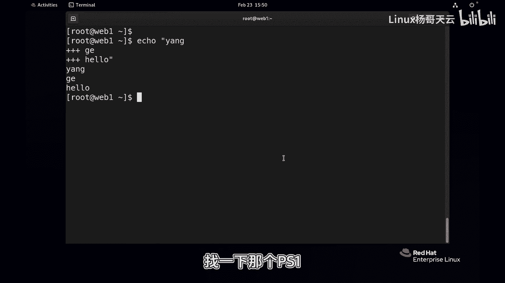

本节课中我们一起学习了如何自定义Shell提示符。我们了解了 `PS1` 和 `PS2` 变量的作用，掌握了通过修改 `PS1` 来显示完整主机名和绝对路径的方法，并知道了如何使设置永久生效。合理配置提示符能让命令行环境更加直观和高效。