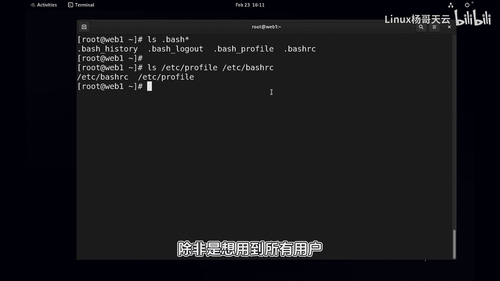
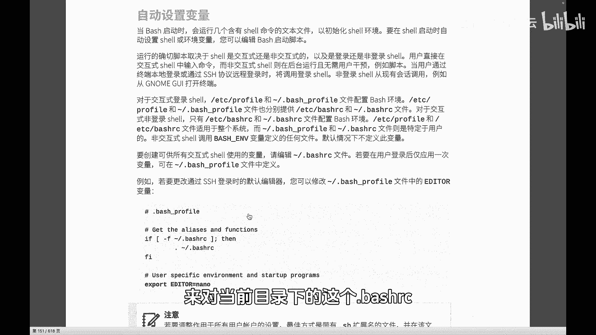
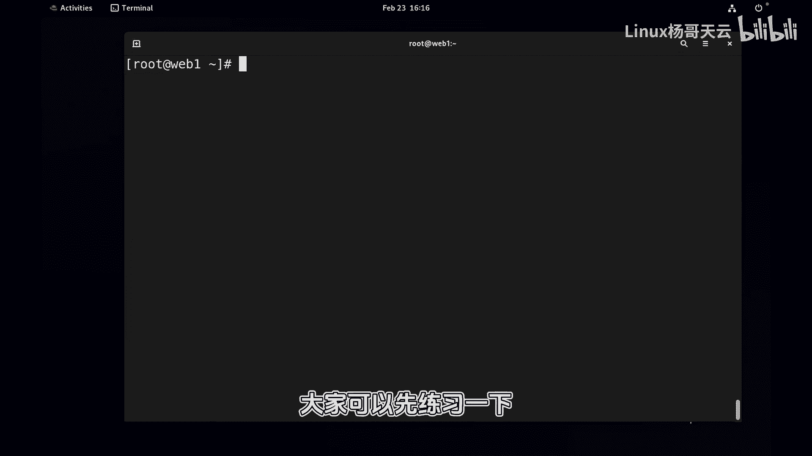

# Linux入门教程：42：Shell会去哪儿找命令？ 🔍

在本节课中，我们将要学习Shell如何查找并执行命令。我们将深入探讨一个关键的环境变量——`PATH`，并了解如何通过修改配置文件来永久改变Shell的行为，例如命令的搜索路径和命令提示符的格式。

---

在上一节中，我们介绍了变量的设置，但忽略了一个关于引号使用的细节。本节中，我们来看看单引号和双引号在变量引用时的区别，并引出命令查找的核心机制。

当我们设置变量 `P1` 时，使用了双引号。例如：
```bash
P1="\u@\h \W\$ "
```
如果希望其中的 `\$` 被原样显示，而不是被解释为变量引用符，就需要使用单引号。这是因为双引号是“弱引用”，它会解释其中的变量（如 `$name`）；而单引号是“强引用”，其中的所有字符都会被原样处理。

例如：
```bash
name="杨哥"
echo "$name, hello"  # 输出：杨哥, hello
echo '$name, hello'  # 输出：$name, hello
```
因此，当需要原样输出 `$` 符号时，应使用单引号。

---

当我们输入一个命令（如 `ls` 或 `cd`）时，Shell并不知道这个命令对应的程序文件在磁盘的哪个位置，但它却能找到并执行。这是如何做到的呢？

这依赖于一个非常重要的环境变量：`PATH`。当你输入一个命令时，Shell会按照 `PATH` 变量中定义的目录顺序，依次在这些目录中查找是否存在该命令的可执行文件。

我们可以通过 `echo` 命令查看当前的 `PATH` 值：
```bash
echo $PATH
```
输出结果通常是由冒号 `:` 分隔的一系列目录路径，例如：
```
/usr/local/bin:/usr/bin:/bin:/usr/sbin:/sbin
```
Shell会按顺序在这些目录中查找命令。如果找到了，就执行；如果所有目录中都找不到，就会报错“command not found”。

---

以下是关于 `PATH` 变量和命令查找的几个关键点：

1.  **指定路径优先**：如果你在命令前明确指定了路径（如 `./my_script` 或 `/bin/ls`），Shell会直接使用该路径下的程序，而不会去 `PATH` 变量中搜索。
2.  **`PATH` 不包含当前目录**：出于安全考虑，默认的 `PATH` 通常不包含当前目录 `.`。这意味着，即使你在当前目录下有一个可执行脚本 `my_script`，直接输入 `my_script` 也无法执行，除非使用 `./my_script`。
3.  **修改 `PATH`**：你可以临时修改 `PATH` 变量，将自定义目录（如存放自己脚本的目录）添加进去，这样就能像系统命令一样直接使用。
    ```bash
    # 将 /root 目录添加到 PATH 的末尾
    PATH=$PATH:/root
    # 或者添加到开头
    PATH=/root:$PATH
    ```
    但请注意，这种修改只对当前Shell会话有效。

---



为了让对 `PATH` 等环境变量的修改永久生效，我们需要将其写入Shell的配置文件中。



Shell在启动时会读取特定的配置文件来设置环境。这些文件主要分为两类：
*   **系统级配置文件**：如 `/etc/profile` 和 `/etc/bashrc`（或其变体），对所有用户生效。
*   **用户级配置文件**：如用户家目录下的 `~/.bash_profile`、`~/.bash_login`、`~/.profile` 和 `~/.bashrc`。对于交互式Bash Shell，最常用的是 `~/.bashrc`。

我们一般将个人化的配置（如别名、环境变量）写入 `~/.bashrc` 文件。

例如，我们可以编辑 `~/.bashrc` 文件，在末尾添加以下几行：
```bash
# 设置历史命令带时间戳
HISTTIMEFORMAT="%F %T "
# 设置历史命令保存条数
HISTSIZE=2000
# 将 /root 目录永久添加到 PATH 环境变量
export PATH=$PATH:/root
```
`export` 命令用于将变量设置为“环境变量”，这样其值就能被子Shell进程继承。

修改配置文件后，新设置不会立即在当前已打开的Shell中生效。你需要“加载”这个文件。有两种方法：
1.  关闭当前终端并重新打开一个新的。
2.  使用 `source` 命令（或 `.` 命令）立即加载配置文件：
    ```bash
    source ~/.bashrc
    # 或
    . ~/.bashrc
    ```
    执行后，新的配置就会在当前Shell中生效。

---



本节课中我们一起学习了Shell查找命令的原理。我们了解了 `PATH` 环境变量的核心作用，它决定了Shell在哪些目录中搜索可执行文件。我们还学习了单引号与双引号在变量引用时的区别（强引用 vs 弱引用）。最后，我们掌握了如何通过修改 `~/.bashrc` 配置文件并配合 `source` 命令，来永久性地定制Shell环境，例如修改命令提示符、历史记录格式以及扩展命令的搜索路径。这些知识是熟练使用Linux命令行环境的基础。