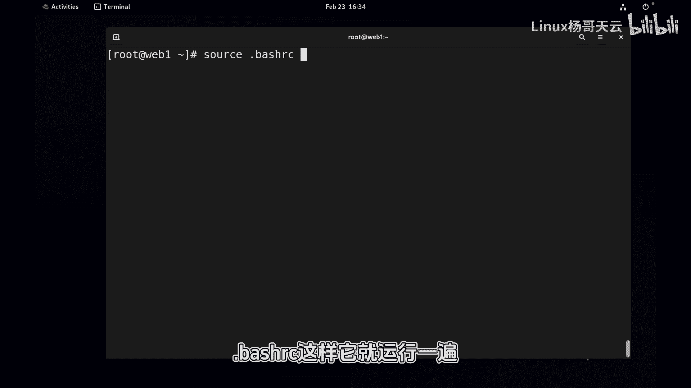
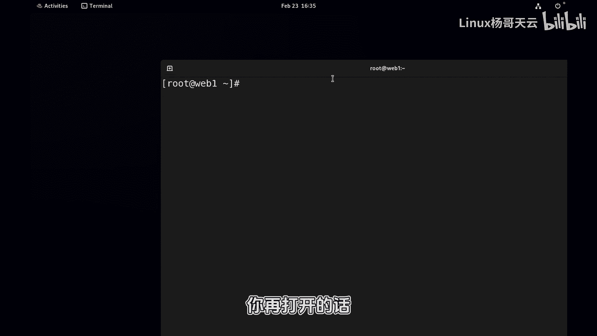
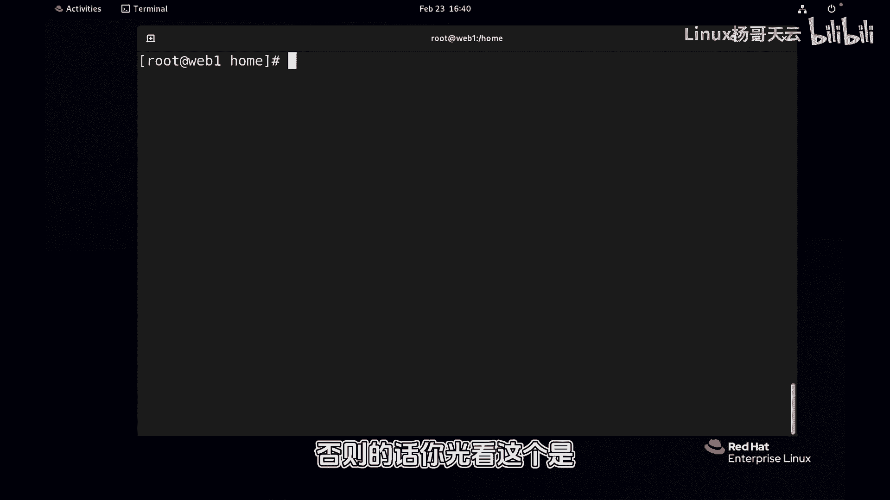

# Linux入门与RHCE认证：43：Shell别名详解 🐚

在本节课中，我们将要学习Shell别名的概念、作用以及如何创建和使用别名。别名是Shell中一个非常实用的功能，它允许我们为复杂的命令创建简短的替代名称，从而提高工作效率。

## 概述

上一节我们介绍了命令的搜索路径。本节中我们来看看Shell别名是什么，以及它如何影响命令的执行。

当我们执行一个命令时，Shell会按照特定顺序去查找这个命令。例如，执行`cd`或`ls`时，Shell会根据`PATH`变量的路径去搜索。直接输入命令的绝对路径或相对路径也可以执行，例如`/usr/bin/ls`。

执行`/bin/ls`查看当前目录时，会发现显示结果与直接输入`ls`不同，它没有颜色。只有手动加上`--color`参数，显示效果才一样。这说明我们平常执行的`ls`命令，并不直接是`/usr/bin/ls`。

## 别名的概念与优先级

当我们输入一条命令时，Shell会从多个地方、按顺序查找该命令。`PATH`变量只是其中的一个环节。其中一个重要的查找位置就是**别名**。

以下是查看当前Shell中所有别名的方法：
```bash
alias
```
系统为当前账号预设了一些别名。例如：
*   `cp` 实际上是 `cp -i`（交互模式）。
*   `ls` 实际上是 `ls --color=auto`。
*   `mv` 实际上是 `mv -i`。
*   `rm` 实际上是 `rm -i`。
*   `ll` 实际上是 `ls -l`。

**别名在命令查找顺序中拥有最高优先级**。我们可以使用`type -a`命令来验证：
```bash
type -a ls
```
输出会显示`ls`首先是一个别名（`alias ls='ls --color=auto'`），其次才是`/usr/bin/ls`这个可执行文件。

## 创建与使用别名

我们可以将一些较长或复杂的命令定义为简短的别名。

以下是创建别名的方法，其基本语法为：
```bash
alias 别名名称='原始命令'
```
例如，我们经常需要查看网络配置，命令`ip addr show`较长，可以为其创建别名：
```bash
alias lsnet='ip addr show'
```
现在，输入`lsnet`就等同于输入`ip addr show`。使用`type -a lsnet`可以查看其定义。




## 取消别名



临时取消别名有两种方法：
1.  使用`unalias`命令：
    ```bash
    unalias lsnet
    ```
2.  在命令前使用反斜杠`\`，可以跳过别名，直接执行原始命令：
    ```bash
    \ls
    ```
    这将执行`/usr/bin/ls`，而不是别名`ls --color=auto`。

## 永久设置别名

通过`alias`命令设置的别名仅在当前Shell会话中有效。关闭终端后就会失效。若想永久生效，需要将别名定义写入Shell的配置文件中。

对于Bash Shell（我们常用的Shell），用户个人的别名通常定义在`~/.bashrc`文件中。

以下是操作步骤：
1.  编辑配置文件：
    ```bash
    vim ~/.bashrc
    ```
2.  在文件末尾添加别名定义，例如：
    ```bash
    alias lsnet='ip addr show'
    ```
3.  保存文件后，让配置立即生效：
    ```bash
    source ~/.bashrc
    ```
    或者，关闭当前终端并重新打开一个新的终端窗口。

重新打开终端时，Shell会自动执行`~/.bashrc`文件，从而使别名生效。

## 关于Shell的补充说明

我们目前操作的系统（如红帽Linux）默认使用的Shell是**Bash Shell**。Shell是用户与操作系统内核之间的桥梁，除了Bash，还有Zsh、Csh等多种Shell。

不同Shell的默认配置可能不同。例如，在某些Shell中`ll`别名可能不存在。因此，养成使用标准命令（如`ls -l`）的习惯更为通用。

`type`命令非常有用，它可以查看一个命令的来源。例如：
```bash
type -a cd
type -a [
```
你会发现`cd`是Shell的内置命令，而`[`既是内置命令，也是一个真实的程序（`/usr/bin/[`）。

命令的查找顺序大致为：别名 > Shell内置命令/关键字 > 函数 > `PATH`路径中的可执行文件。如果`PATH`变量被错误修改，很多命令将无法找到。

## 总结



本节课中我们一起学习了Shell别名的核心知识。我们了解了别名的概念及其在命令执行中的优先性，掌握了如何创建、使用、取消别名，并学会了将别名永久写入配置文件的方法。同时，我们也对Shell的类型和命令查找机制有了更深入的理解。合理使用别名可以极大地提升命令行操作的效率。