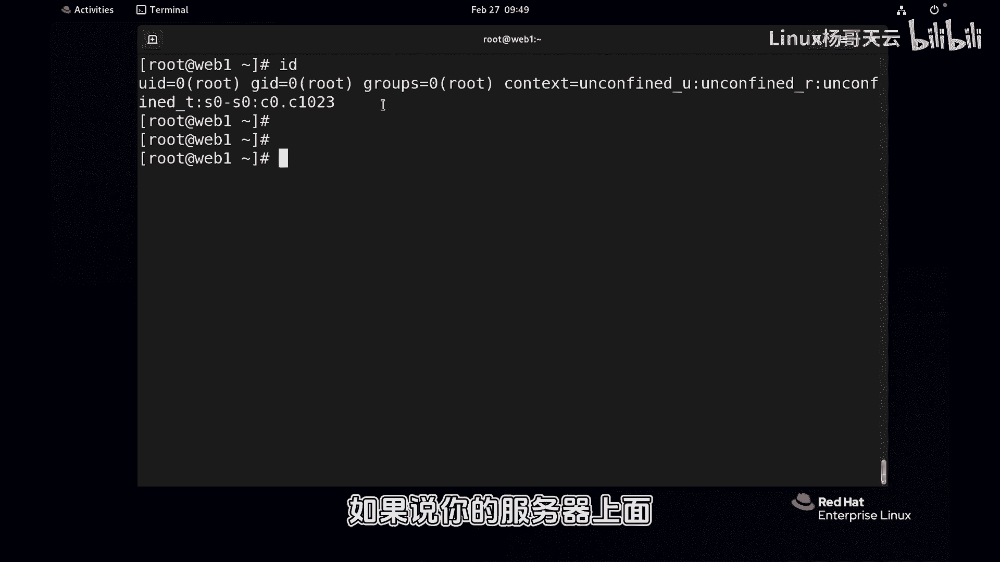
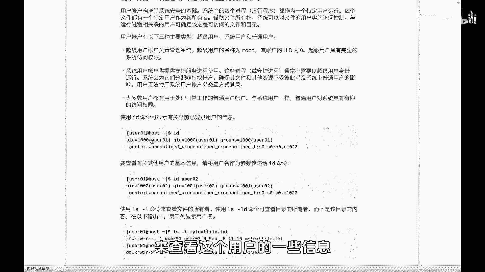
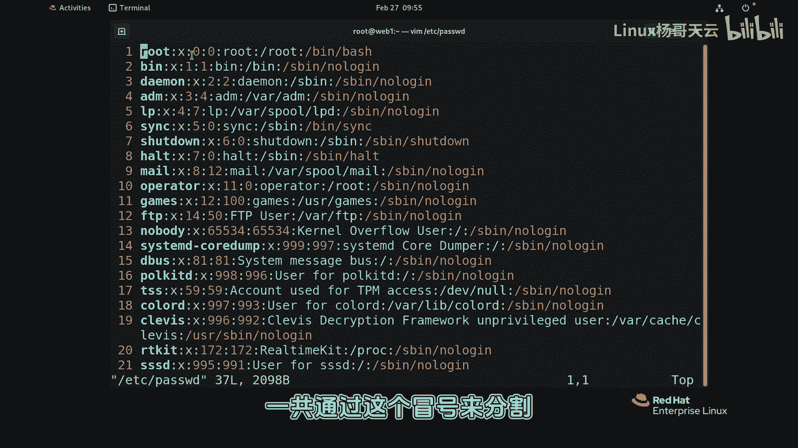
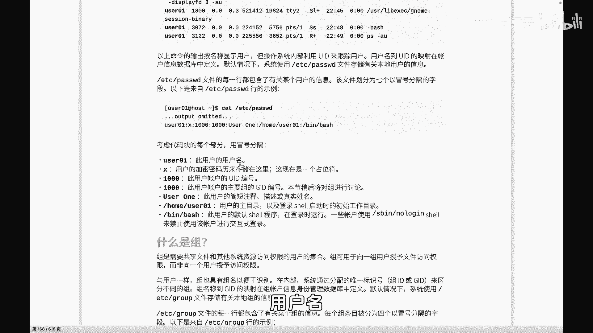
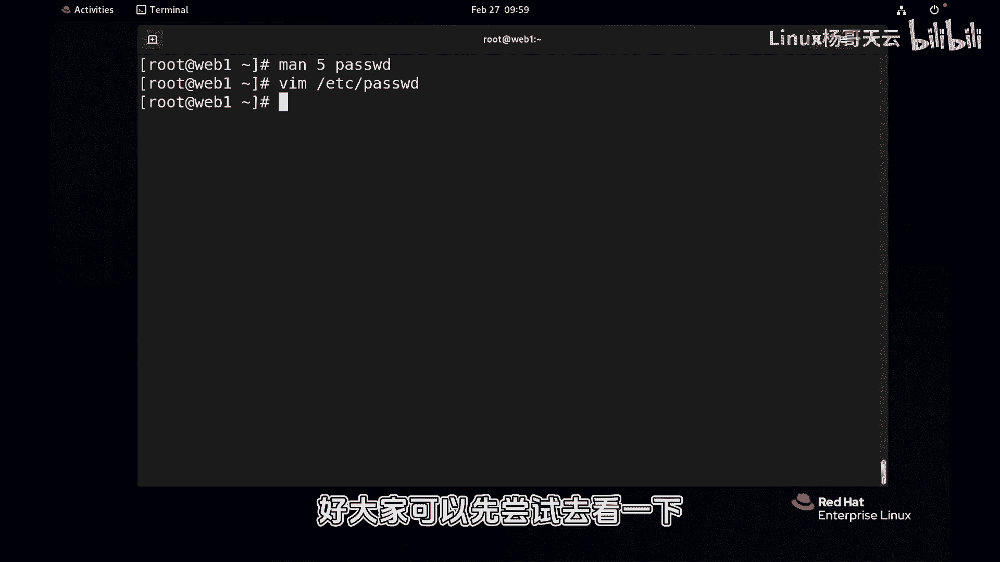

# Linux入门与RHCE认证：44：了解Linux中的用户 👤

在本节课中，我们将开始学习Linux系统中用户和组的相关管理知识。用户和组是Linux权限与安全体系的基础，理解它们对于系统管理、服务部署和安全运维至关重要。

上一节我们介绍了系统进程与文件权限的基本概念。本节中，我们来看看Linux中用户的具体定义、分类以及相关信息存储的位置。

## 用户的作用与重要性

在Linux系统中，每一个进程都会以一个用户的身份运行。我们可以使用 `ps aux` 命令查看进程及其运行用户。

```bash
ps aux | head -10
```

输出结果的第一列显示了运行每个进程的用户。绝大多数系统服务进程不会以管理员（root）身份运行，这是出于安全考虑。如果一个服务进程存在漏洞并被攻击者利用，攻击者将获得该进程运行用户的权限。因此，使用低权限用户运行服务可以限制潜在的安全风险。

同样，系统中的每一个文件也都有其所有者和所属组。通过 `ls -l` 命令可以查看。



```bash
ls -l
```

文件的所有者和所属组决定了哪些用户或组可以访问该文件。因此，根据业务需求管理用户和组，是控制资源访问权限的核心。

## Linux用户的三种类型

在红帽（RHEL）系列系统中，用户主要分为三种类型。

### 1. 超级用户 (Super User)
超级用户即管理员用户，用户名默认为 **root**。在系统层面，每个用户都有一个唯一的用户ID（UID），超级管理员的 **UID 为 0**。root用户对整个系统拥有完全的控制权限。

### 2. 系统用户 (System User)
这类用户通常用于启动系统服务进程。为了安全，服务进程不应使用root身份运行。系统用户通常被设置为**无法交互式登录系统**，它们的登录Shell通常是 `/sbin/nologin` 或 `/bin/false`。这确保了它们只能用于运行服务，而不能用于登录系统执行其他操作，从而降低了安全风险。

### 3. 普通用户 (Regular User)
普通用户是供日常管理或常规操作使用的账户。默认情况下，它们只拥有有限的权限。管理员可以根据需要，通过后续课程中将讲到的提权方法（如 `su` 或 `sudo`），临时赋予这些用户更高的管理权限。



## 查看用户信息

我们可以使用 `id` 命令来查看用户信息。

```bash
id
```
如果不指定用户名，`id` 命令默认显示当前用户的信息。输出包括：
*   **用户名**
*   **UID** (用户ID)
*   **GID** (主组ID)
*   **Groups** (用户所属的所有组)



若要查看特定用户（如 `tianyun`）的信息，可以执行：
```bash
id tianyun
```
从输出中可以看到，普通用户的UID通常从1000开始。



## 用户信息存储文件

用户的核心账户信息（不包括密码）存储在 `/etc/passwd` 文件中。我们可以使用 `cat` 或 `vi` 命令查看。

```bash
cat /etc/passwd
```
或
```bash
vi /etc/passwd
```

以下是 `/etc/passwd` 文件中一行的示例及其字段含义（由冒号 `:` 分隔）：
```
tianyun:x:1000:1000:User Tianyun:/home/tianyun:/bin/bash
```

1.  **用户名**：用户的登录名，如 `tianyun`。
2.  **密码占位符**：历史上这里存储加密密码，现在密码已移至 `/etc/shadow` 文件以提高安全性。`x` 表示密码信息存在于影子文件中。
3.  **UID**：用户ID。
4.  **GID**：用户的主组（初始组）ID。
5.  **描述信息**：用户的全名或简短描述。
6.  **家目录**：用户登录后进入的默认工作目录。
7.  **登录Shell**：用户登录后启动的第一个程序（Shell）。例如 `/bin/bash` 表示可交互登录。系统用户的Shell通常是 `/sbin/nologin`，这阻止了其登录行为。

关于此文件的更详细信息，可以通过 `man` 命令查看：
```bash
man 5 passwd
```

用户的加密密码信息则单独存储在 `/etc/shadow` 文件中，该文件权限设置严格，普通用户无法读取，进一步保障了密码安全。



本节课中我们一起学习了Linux用户的分类、作用以及如何查看用户信息及其存储位置。理解用户是管理Linux系统权限的第一步。下一节，我们将开始学习如何创建和管理用户与组。