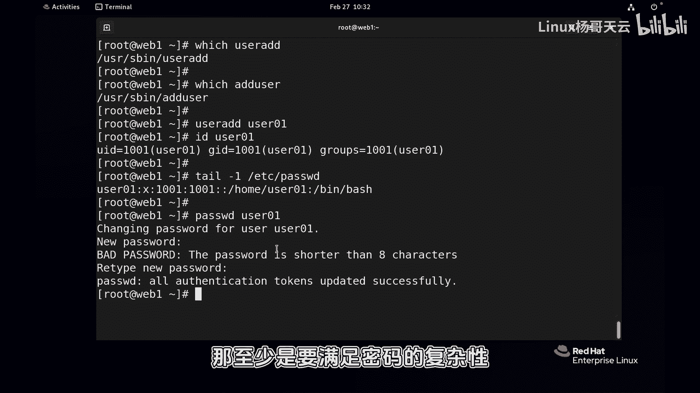
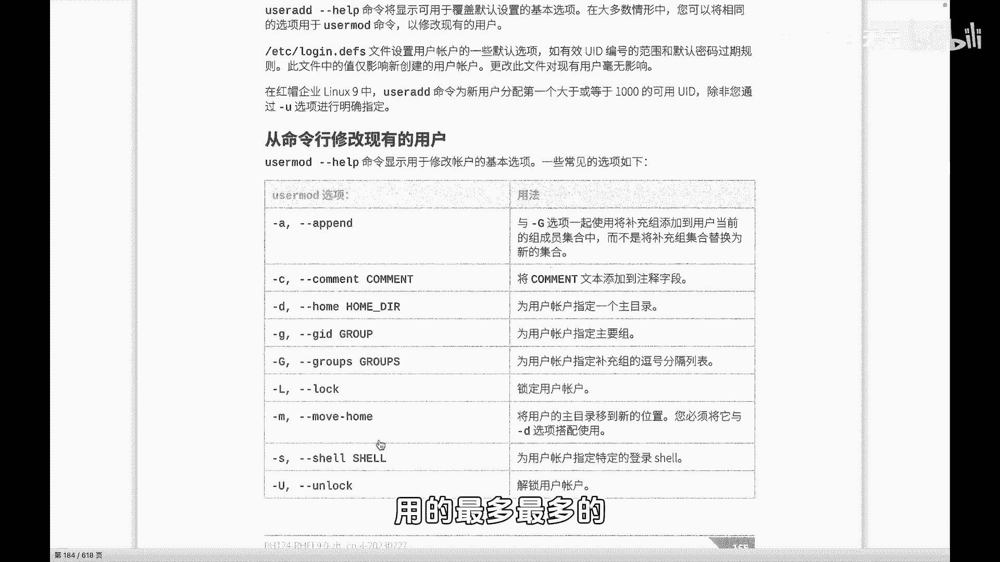
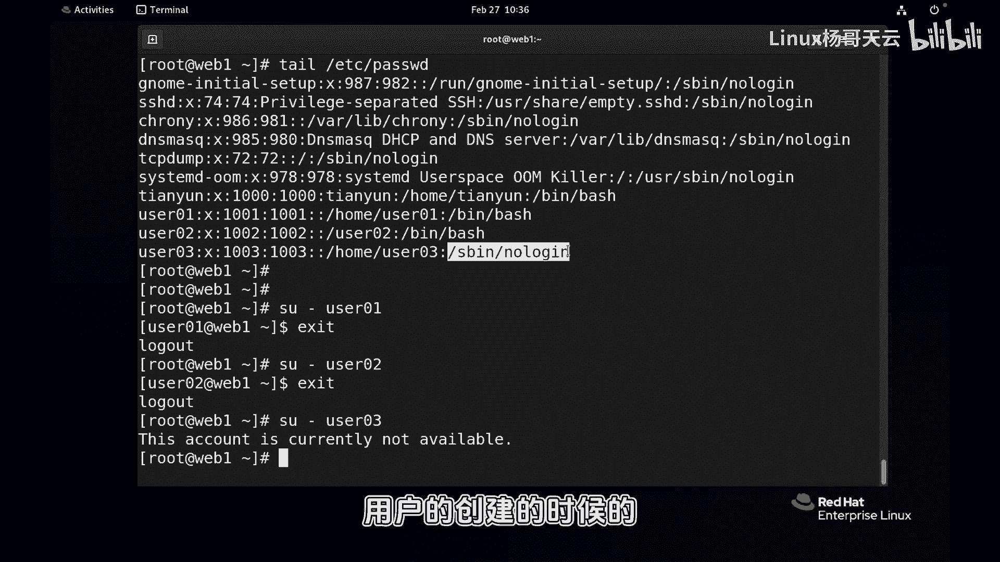
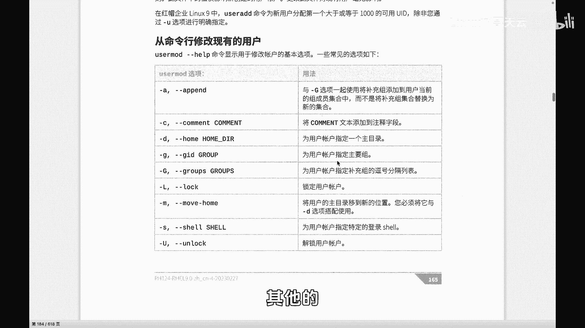
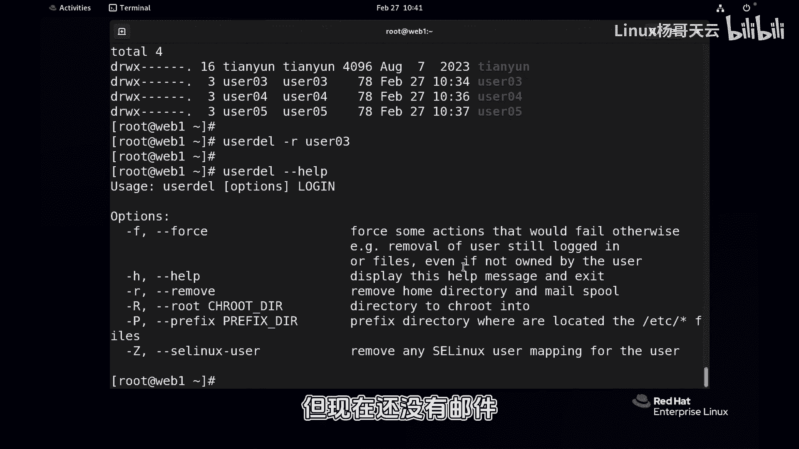
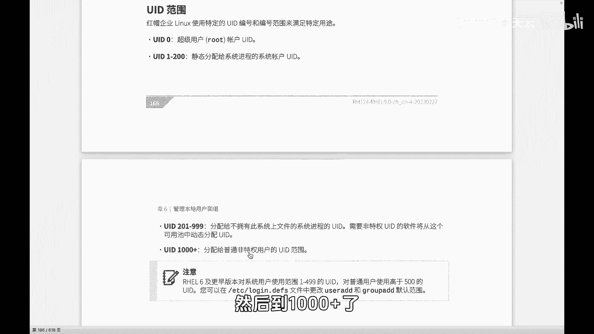
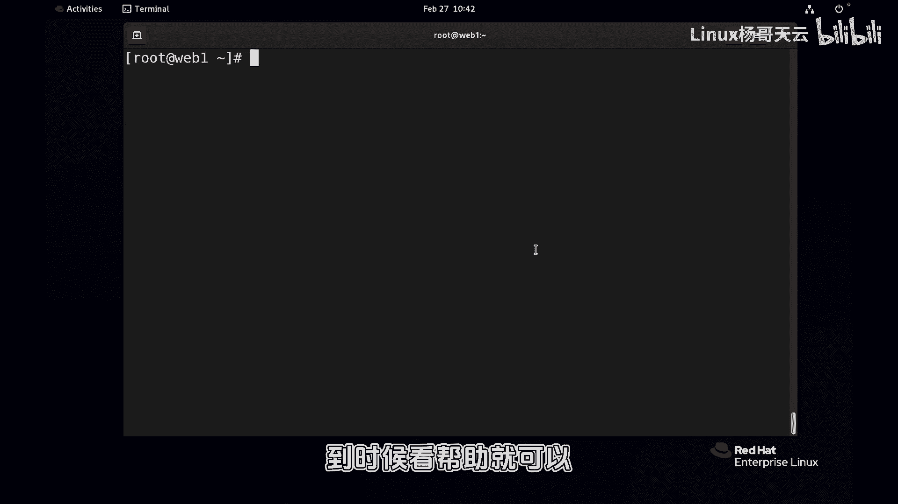

# Linux用户管理：P45：用户创建与删除 🧑‍💻

在本节课中，我们将学习Linux系统中用户管理的基础操作，重点是用户账号的创建与删除。我们将使用`useradd`和`adduser`命令，并了解创建用户时可以使用的关键参数。

## 用户创建命令

创建用户账号主要使用`useradd`命令。系统中还存在另一个命令`adduser`，两者功能相同，选择使用哪个命令取决于个人习惯。

例如，可以执行以下命令创建一个名为`user01`的用户：
```bash
useradd user01
```
在Linux中，命令执行后若无报错信息，通常表示操作成功。



创建完成后，可以使用`id`命令查看用户信息：
```bash
id user01
```
输出会显示用户的UID（用户ID）、主组（GID）等信息。每个用户至少属于一个组，即其主组。用户还可以属于多个附加组。

用户信息存储在`/etc/passwd`文件中。可以使用以下命令查看新创建的用户：
```bash
tail /etc/passwd
```
文件中的每一行都包含用户名、密码占位符、UID、主组GID、家目录路径以及默认的shell程序（通常是`/bin/bash`）。



为用户设置密码使用`passwd`命令：
```bash
passwd user01
```
输入密码时，终端不会回显字符。作为管理员，可以设置简单密码，但普通用户为自己设置密码时，必须满足系统的密码复杂性要求。

## 创建用户的常用参数

上一节我们介绍了基本的用户创建，本节中我们来看看创建用户时可以使用的参数，以满足不同需求。

以下是创建用户时一些常用的参数：
*   **`-G`**：在创建用户的同时，将其添加到一个或多个已存在的附加组中。多个组名用逗号分隔。
*   **`-c` 或 `--comment`**：为用户添加描述或注释信息。
*   **`-d` 或 `--home`**：指定用户的家目录路径，而非默认的`/home/用户名`。
*   **`-g`**：指定用户的主组。
*   **`-s`**：指定用户的登录shell。
*   **`-u`**：指定用户的UID（用户ID）。

其中，`-d`和`-s`参数最为常用。





例如，创建一个家目录在根目录下的用户：
```bash
useradd -d /user02 user02
```
创建一个使用非登录shell（如`/sbin/nologin`）的用户，该用户将无法登录系统：
```bash
useradd -s /sbin/nologin user03
```
创建一个用户并指定其UID为2000：
```bash
useradd -u 2000 user05
```
创建一个用户并将其加入`hr`和`it`附加组（需确保组已存在）：
```bash
groupadd hr
groupadd it
useradd -G hr,it user04
```
如果创建用户时未考虑周全，后续也可以使用`usermod`命令修改用户属性。

## 用户删除操作

创建用户后，有时也需要删除。删除用户使用`userdel`命令。

例如，删除`user01`：
```bash
userdel user01
```
执行后，`/etc/passwd`和`/etc/group`文件中该用户的信息会被移除。**但是，该用户的家目录（如`/home/user01`）默认会被保留**。

如果查看保留的家目录，其文件属主仍显示为原用户的UID（如1001）。若后续新建用户恰好使用了相同的UID，则会“继承”这个目录的所有权，可能引发问题。

因此，通常在删除用户时，建议同时删除其家目录。使用`-r`参数即可实现：
```bash
userdel -r user03
```
`-r`参数的作用是删除用户的家目录及其邮件列表。

## 用户ID（UID）范围

在Linux中，UID有特定的分配范围：
*   **0**：保留给`root`管理员账号。
*   **1-999**：分配给系统进程和服务使用。
*   **1000及以上**：通常分配给普通登录用户使用。



在创建用户时，若未通过`-u`参数指定UID，系统会从1000开始顺序分配。



## 总结



本节课中我们一起学习了Linux用户管理的基础操作。我们掌握了使用`useradd`命令创建用户，并了解了指定家目录(`-d`)、登录shell(`-s`)、附加组(`-G`)和UID(`-u`)等常用参数。同时，我们也学会了使用`userdel`命令删除用户，并强调使用`-r`参数来同步清理用户家目录的重要性。理解UID的分配范围有助于我们更好地管理系统用户。下一节，我们将探讨用户密码及账号有效期的管理。