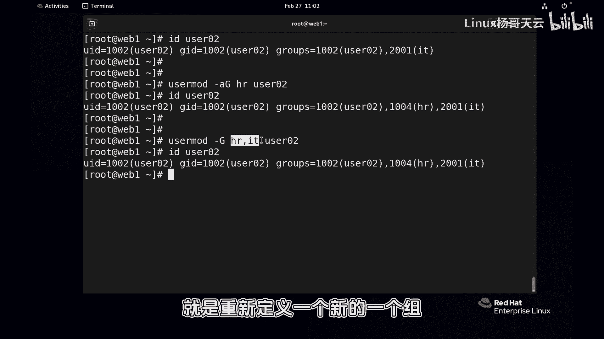
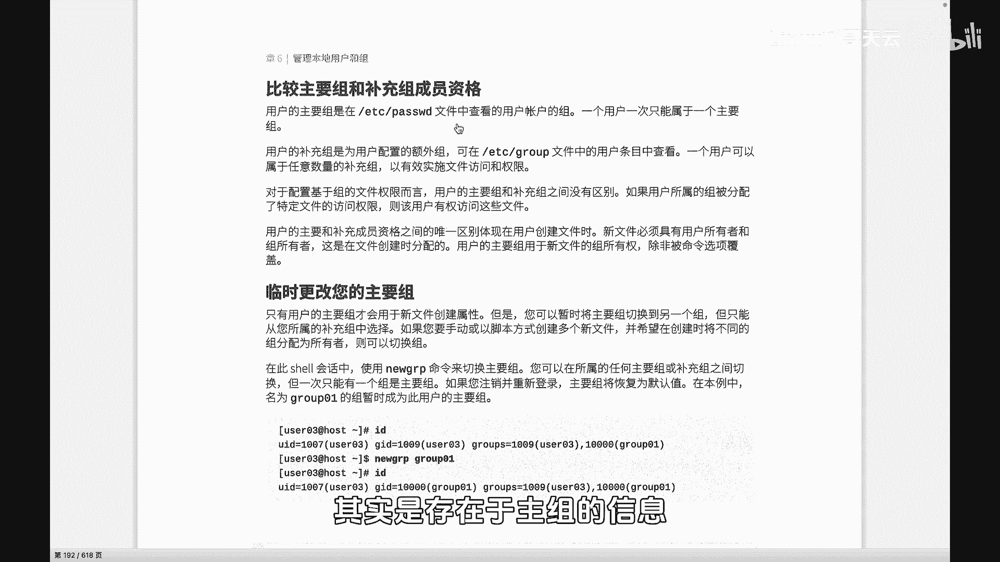
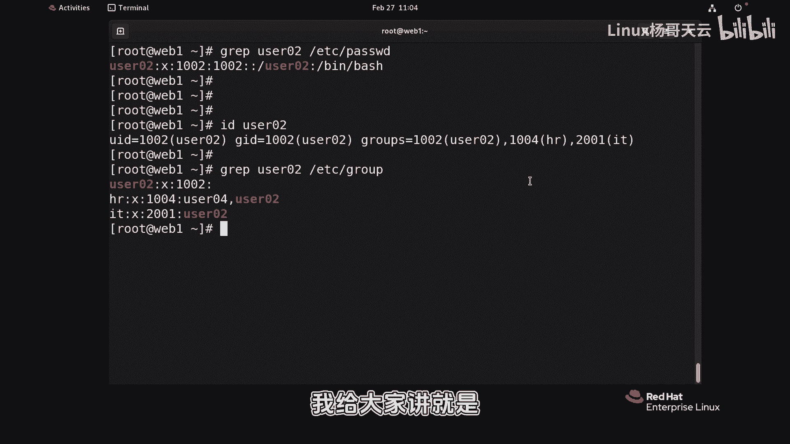
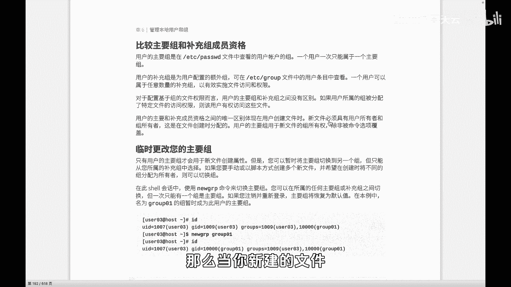
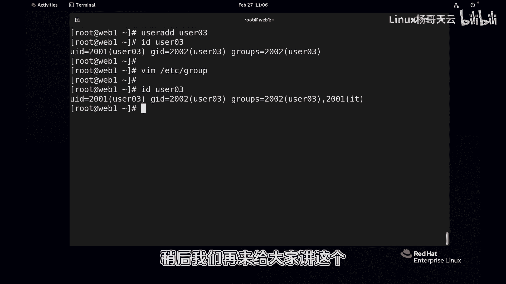

Linux用户与组管理：第46章：用户组管理详解

在本节课中，我们将要学习Linux系统中用户组管理的核心概念与操作，特别是主组与附加组的区别，以及如何管理用户的组成员资格。

上一节我们介绍了用户管理的基础知识，本节中我们来看看用户组的管理。组管理相对简单，但理解主组和附加组的区别至关重要。

### 创建与删除组

创建组的命令在前面的课程中已经演示过，使用的是 `groupadd` 命令。

例如，我们之前创建了 `hr` 组和 `IT` 组：
```bash
groupadd hr
groupadd IT
```

删除组则使用 `groupdel` 命令。删除一个组的同时，其在 `/etc/group` 文件中的信息也会被移除。
```bash
groupdel hr
```
如果某个用户原本属于这个被删除的组，该用户会自动从该组中移除。

### 管理用户的组成员资格

对于已存在的用户，我们可以使用 `usermod` 命令来改变其所属的组。这包括改变主组和附加组。

首先，我们查看用户 `user02` 当前的组信息：
```bash
id user02
```
输出可能显示其主组为 `1002 (user02)`，且所属的所有组只有这一个。这说明 `user02` 目前只属于其主组，没有加入任何附加组。

使用 `usermod` 命令可以修改用户的附加组。**注意**：`-G` 选项用于指定用户的附加组列表，但直接使用会覆盖用户原有的附加组。

例如，以下命令会将 `user02` 的附加组设置为 `hr`，并**覆盖**掉之前的所有附加组：
```bash
usermod -G hr user02
```



如果我们想在不影响原有附加组的情况下，为用户添加新的附加组，需要使用 `-aG` 选项（`a` 代表 append，追加）。



例如，为 `user02` 追加 `IT` 组：
```bash
usermod -aG IT user02
```
这样，`user02` 就同时属于 `hr` 和 `IT` 两个附加组，而不会丢失原有的 `hr` 组资格。

以下是关于 `usermod` 命令用法的总结列表：
*   `usermod -G group1,group2 user`：将用户的附加组设置为 `group1` 和 `group2`，这会覆盖原有的附加组列表。
*   `usermod -aG newgroup user`：为用户追加一个新的附加组 `newgroup`，保留原有的所有附加组。

### 主组与附加组的区别

理解主组和附加组的区别是本节的核心。



*   **主组**：也称为初始组或主要组。每个用户有且仅有一个主组。用户创建时自动生成，信息记录在 `/etc/passwd` 文件的第四个字段。
*   **附加组**：也称为补充组。用户可以属于零个、一个或多个附加组。信息记录在 `/etc/group` 文件中。



我们可以通过命令查看：
```bash
# 查看用户的主组信息（在/etc/passwd中）
grep user02 /etc/passwd
# 查看用户所属的所有组（包括主组和附加组）
grep user02 /etc/group
# 或使用id命令
id user02
```

主组的一个重要特性是：当用户创建新文件或目录时，该文件的默认属组就是用户的主组。
```bash
# 切换到 user02 用户
su - user02
# 创建一个新文件
touch newfile.txt
# 查看文件详情，属组通常是 user02（其主组）
ls -l newfile.txt
```

### 权限继承与手动修改组

用户会继承其所属的所有组（包括主组和附加组）的权限。如果用户从一个附加组中被移除，他将失去访问该组所拥有资源的权限。

如果忘记了如何将用户加入组，也可以直接编辑 `/etc/group` 文件。每个组对应一行，格式为 `组名:密码占位符:GID:成员列表`。

例如，要将 `user03` 加入 `IT` 组，可以找到 `IT` 组所在行，在成员列表末尾加上 `,user03`（注意用逗号分隔）：
```
IT:x:1003:user02,user03
```
**注意**：直接编辑系统文件需要谨慎，建议在掌握命令行操作后再尝试。



本节课中我们一起学习了Linux用户组的管理。我们掌握了使用 `groupadd` 和 `groupdel` 命令创建与删除组，重点理解了使用 `usermod -aG` 命令为用户添加附加组而不覆盖原有设置。最关键的是，我们厘清了**主组**与**附加组**的区别：主组是用户创建文件时的默认属组且唯一，而附加组用于让用户继承额外的权限。理解这些概念对于管理Linux系统的文件权限和用户访问控制至关重要。