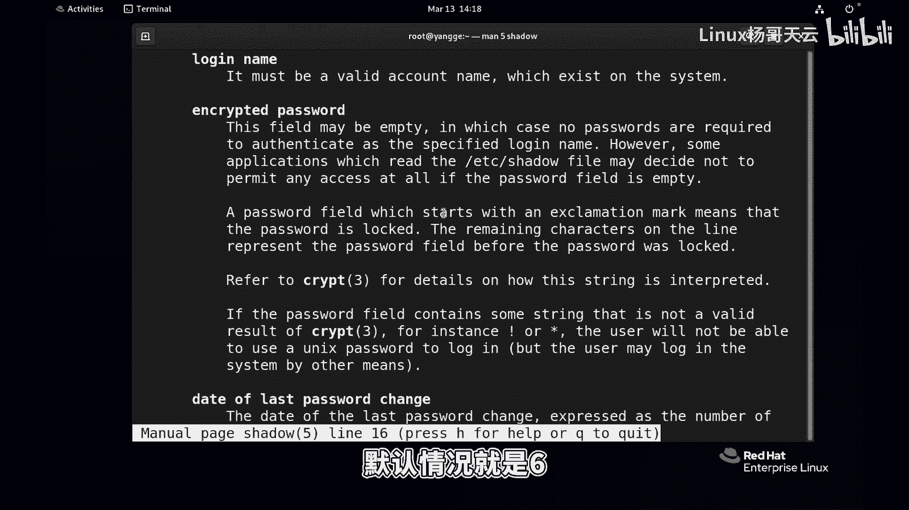
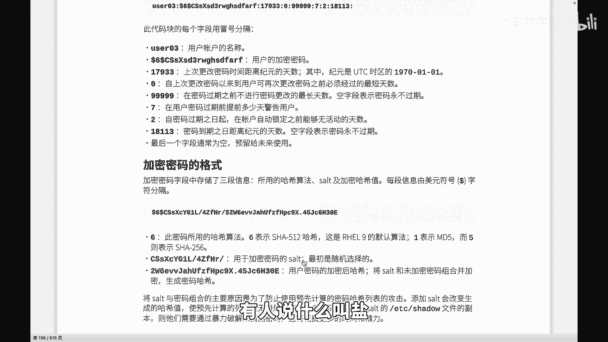
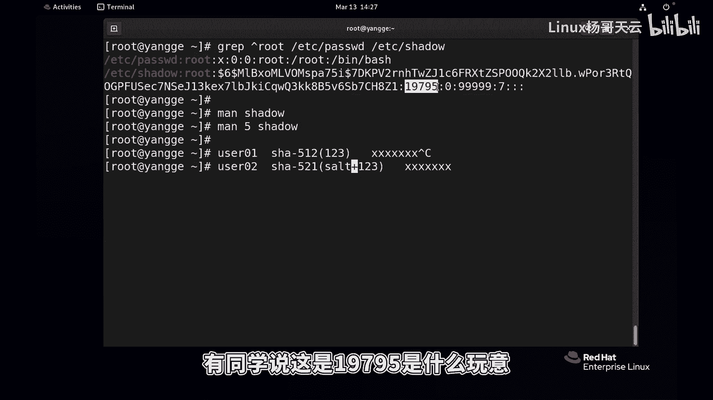
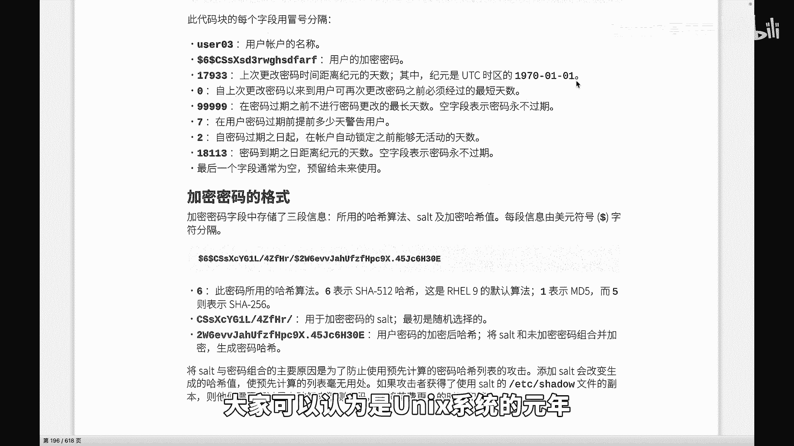
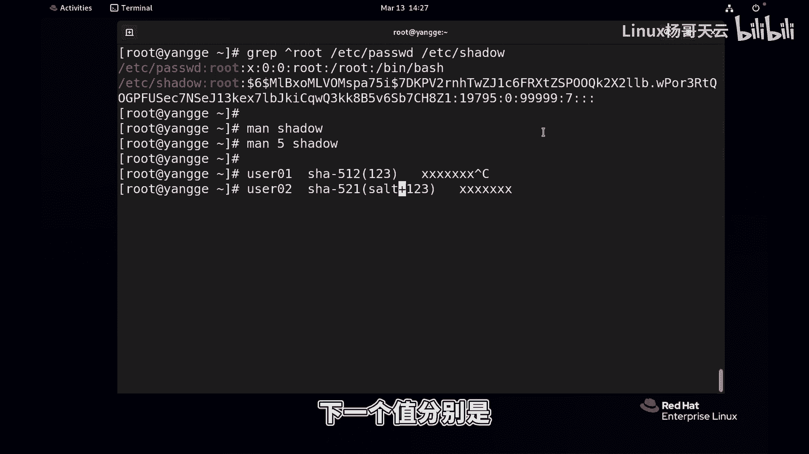
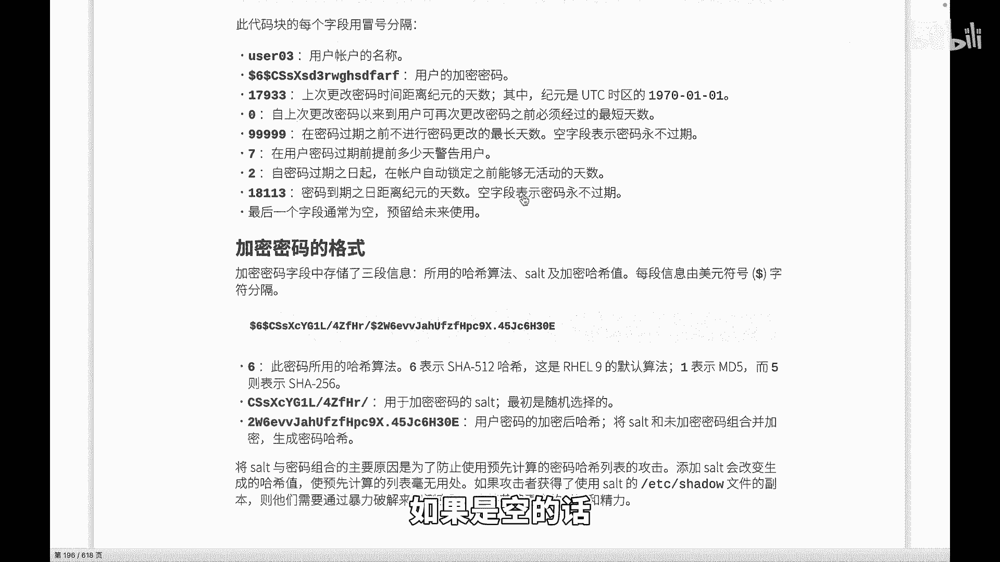
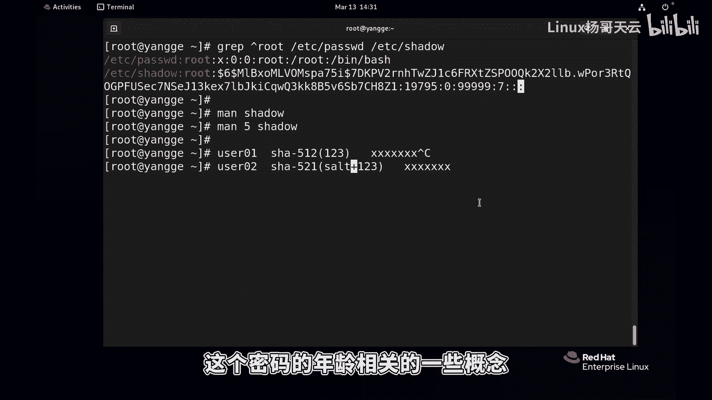

# Linux用户管理：47：密码文件shadow深度解析 🔐

在本节课中，我们将深入学习Linux系统中存储用户密码的核心文件——`/etc/shadow`。我们将解析其结构、理解密码加密机制，并了解与密码策略相关的各个字段含义。

---



上一节我们介绍了用户和组管理的基础知识，本节中我们来看看用户密码是如何被安全存储和管理的。我们知道，每个用户都需要设置密码才能登录系统。密码信息并非存储在`/etc/passwd`文件中，而是存储在一个权限更严格的文件里。



这个文件就是`/etc/shadow`。我们可以使用`vi`命令查看它，但内容较多。在`/etc/passwd`文件中，用户密码字段只是一个占位符`x`，真实的密码哈希值就存储在这个`/etc/shadow`文件里。

`/etc/shadow`文件同样由冒号`:`分割成多个字段。我们可以通过`man 5 shadow`命令查看其官方格式说明。以下是该文件九个字段的详细解析：

以下是`/etc/shadow`文件的字段结构：

1.  **登录名**：用户的登录名称，与`/etc/passwd`文件中的用户名一一对应。
2.  **加密密码**：这是最核心的部分，它本身又由`$`符号分割为三段。格式通常为：`$id$salt$encrypted`。
    *   **`id`**：表示加密算法类型。例如，`6`代表SHA-512，`5`代表SHA-256，`1`代表MD5。
    *   **`salt`**：盐值。这是一个随机字符串，用于增加密码哈希的复杂度，防止通过彩虹表攻击。
    *   **`encrypted`**：将用户明文密码与盐值组合后，再经过指定哈希算法计算得到的最终哈希串。
3.  **上次修改密码的日期**：表示从1970年1月1日（UNIX纪元）到上次修改密码那天的天数。
4.  **密码最小修改间隔**：两次修改密码之间必须间隔的最少天数。`0`表示可以随时修改。
5.  **密码有效期**：密码保持有效的最大天数。在此之后，用户必须更改密码。
6.  **密码过期前警告天数**：在密码即将到期前，提前多少天向用户发出警告。
7.  **密码过期后宽限天数**：密码过期后，账户仍然可以登录的宽限天数。超过此期限，账户将被锁定。
8.  **账户失效日期**：指定一个绝对的日期（自纪元起的天数），在此之后，账户将无法使用。
9.  **保留字段**：目前未使用，留作未来扩展。

---

现在，让我们重点解析第二个字段——**加密密码**。其核心概念可以用以下伪代码描述：

```plaintext
存储的密码哈希 = $算法ID$随机盐值$哈希(用户密码 + 随机盐值)
```

**盐值**的作用至关重要。如果没有盐值，两个使用相同密码的用户，其加密后的哈希串将完全一样。这非常危险，因为攻击者可以通过对比哈希值来推测密码。加入随机盐值后，即使密码相同，最终的哈希串也截然不同，极大地增强了安全性。





当用户登录时，系统会执行以下验证过程：
1.  获取用户输入的明文密码。
2.  从`/etc/shadow`中读取该用户对应的盐值和算法ID。
3.  将用户输入的密码与盐值组合，使用指定的哈希算法进行计算。
4.  将计算结果与`/etc/shadow`中存储的哈希串进行比对。如果一致，则密码正确。



---

关于密码策略字段（第4至8字段），我们可以这样理解：
*   **字段4（最小间隔）**：防止用户频繁修改密码，影响他人使用。例如设为`5`，则5天内不能再次修改。
*   **字段5（有效期）**：强制用户定期更新密码，提升安全性。例如设为`30`，则密码在30天后失效。
*   **字段6（警告期）**：在密码到期前（如到期前7天）提醒用户。
*   **字段7（宽限期）**：密码到期后，给予用户一个缓冲期（如2天）来修改密码，期间仍可登录。
*   **字段8（失效日）**：设置一个绝对的账户过期日期。

以root用户常见的`::0:99999:7:::`为例：
*   密码上次修改时间未记录（::）。
*   最小修改间隔为`0`天（可随时修改）。
*   密码有效期为`99999`天（几乎永久）。
*   到期前`7`天警告。
*   无宽限期和绝对失效日。



---



本节课中我们一起学习了`/etc/shadow`文件的结构和重要性。我们深入探讨了密码的加密存储机制，特别是**盐值**在其中的关键安全作用，并逐一解读了控制密码生命周期的各个策略字段。理解这些内容，是进行系统用户安全管理和故障排查的基础。