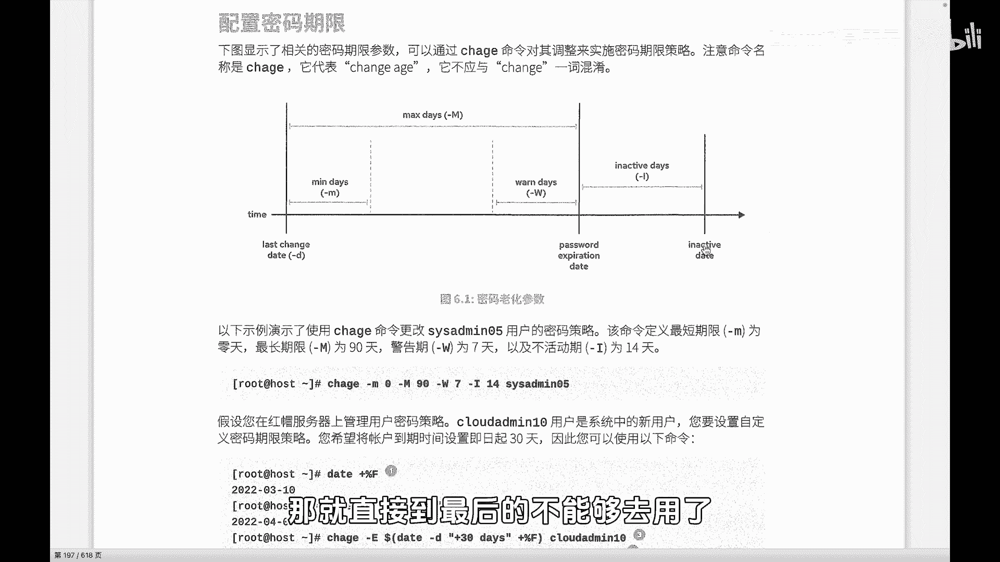
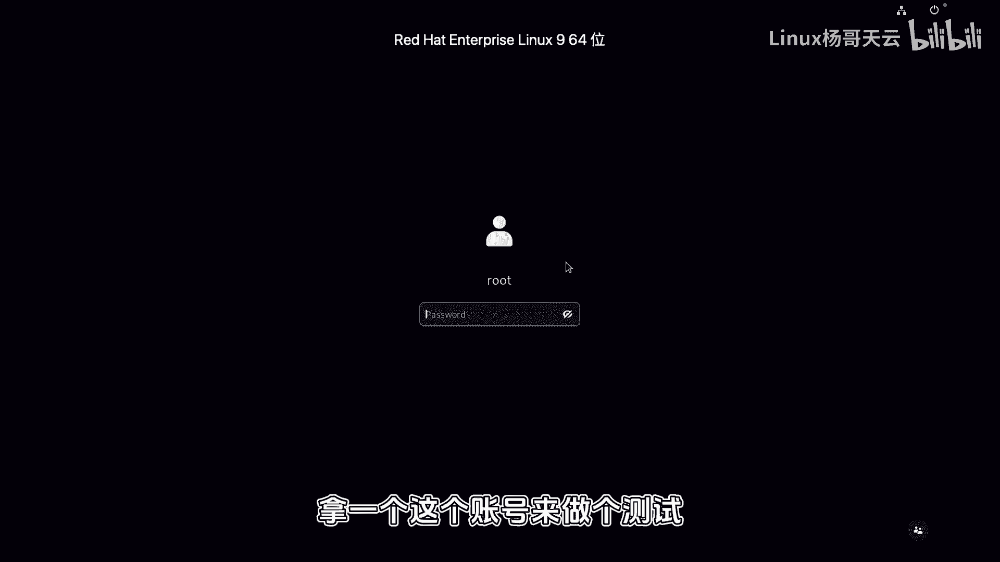
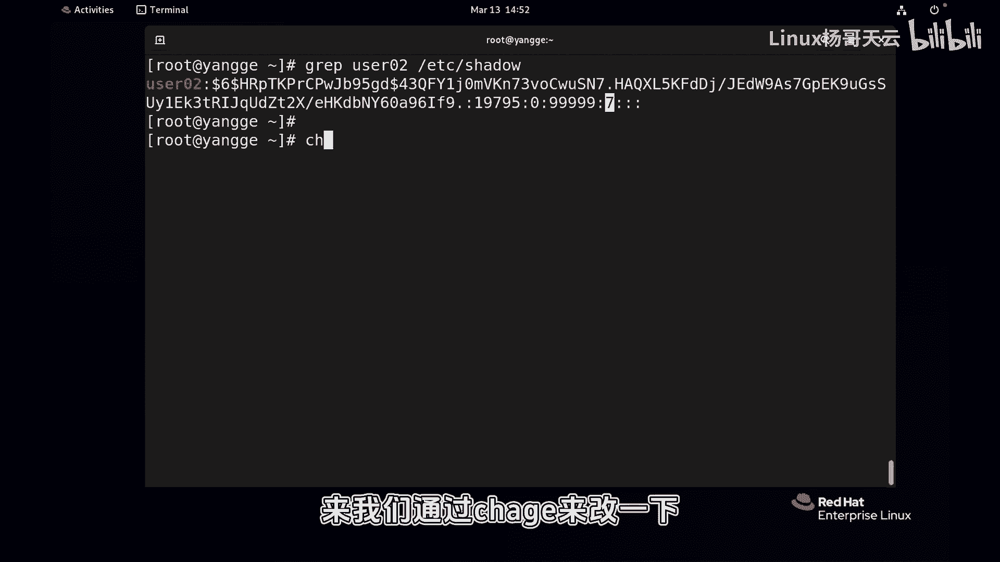
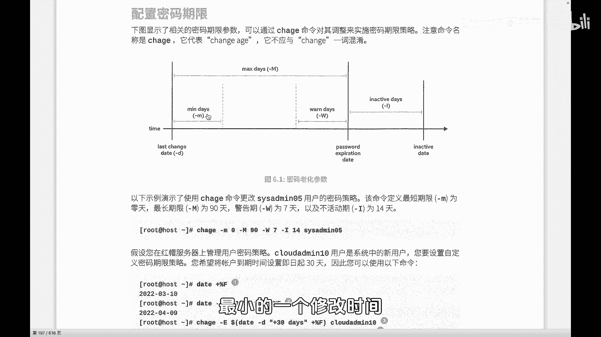
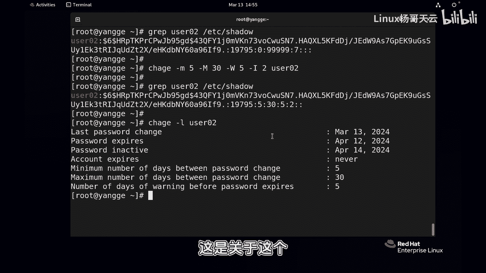
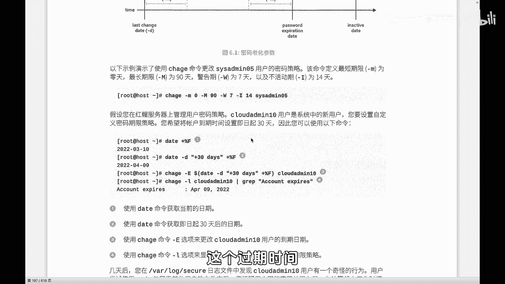
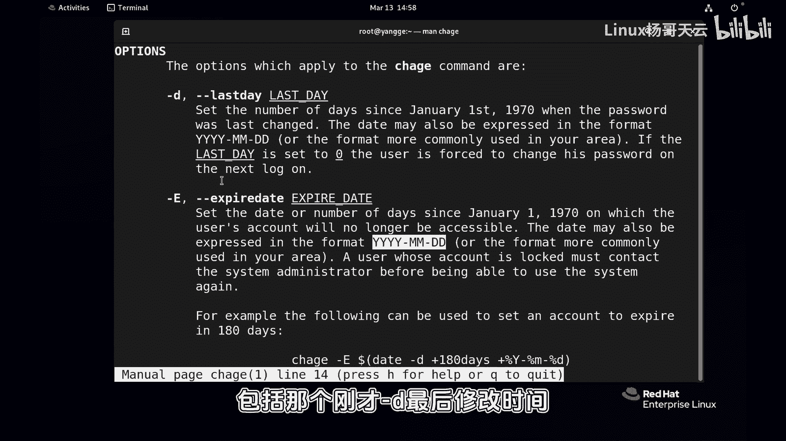
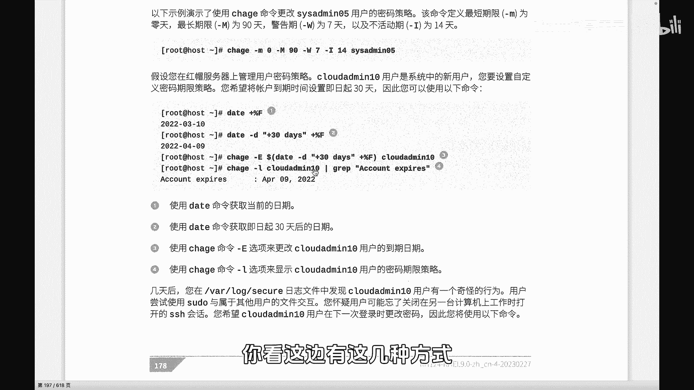
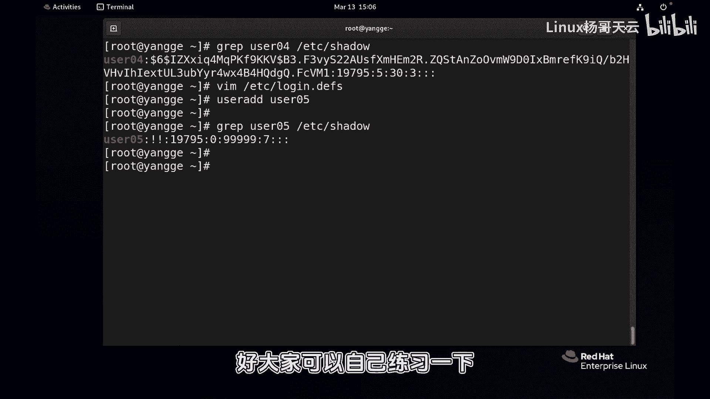

# Linux用户管理：P48：密码年龄管理 🔑

在本节课中，我们将学习Linux系统中用户密码的年龄管理机制。密码年龄管理是系统安全策略的重要组成部分，它规定了密码的有效期、修改频率以及过期后的处理方式。我们将通过`chage`命令来详细探讨如何查看和设置这些参数。

## 密码年龄概念解析

上一节我们介绍了`/etc/shadow`文件的结构，其中包含了密码相关的多个时间字段。本节中我们来看看这些字段的具体含义以及如何管理它们。

密码的“年龄”管理本质上是指密码的有效期策略，而非账号本身的过期。它主要包含以下几个关键时间点：

*   **最后修改时间**：密码最近一次被修改的日期。
*   **最小年龄**：密码在修改后，必须经过多少天才允许再次修改。
*   **最大年龄**：密码自上次修改后，最多可以使用多少天，到期后必须更改。
*   **警告期**：在密码到期前多少天开始向用户发出警告。
*   **宽限期**：密码到期后，用户仍可登录并修改密码的天数。在此期间，系统会强制用户修改密码。
*   **账号过期日**：一个绝对的日期，超过此日期后，账号将完全无法使用。





以下是这些时间点在一个时间轴上的直观表示：

```
最后修改日 ---(最小年龄)---> 允许修改 ---(最大年龄-警告期)---> 警告开始 ---(警告期)---> 密码到期 ---(宽限期)---> 账号禁用
```

## 使用 `chage` 命令管理密码年龄





`chage`命令是专门用于修改用户密码年龄信息的工具。它的名字来源于“change age”。

### 查看密码年龄信息

我们可以使用`chage -l [用户名]`命令来清晰地查看某个用户的密码年龄策略。

```bash
chage -l user02
```

执行上述命令会输出类似以下格式的信息，比直接查看`/etc/shadow`文件更易读：
```
Last password change                                    : Mar 13, 2024
Password expires                                        : Apr 12, 2024
Password inactive                                       : Apr 14, 2024
Account expires                                         : never
Minimum number of days between password change          : 5
Maximum number of days between password change          : 30
Number of days of warning before password expires       : 5
```



### 设置密码年龄策略



以下是`chage`命令常用的选项，用于设置不同的密码年龄参数：

*   `-m [天数]`：设置密码**最小年龄**。例如，`chage -m 5 user02` 表示设置user02用户在修改密码后，5天内不能再次修改。
*   `-M [天数]`：设置密码**最大年龄**。例如，`chage -M 30 user02` 表示user02的密码30天后过期。
*   `-W [天数]`：设置**警告期**天数。例如，`chage -W 5 user02` 表示在密码过期前5天开始警告用户。
*   `-I [天数]`：设置密码过期后的**宽限期**（非活动天数）。例如，`chage -I 2 user02` 表示密码过期后，用户还有2天时间可以登录并修改密码。
*   `-d [日期]`：设置密码**最后修改日期**。日期格式可以是“YYYY-MM-DD”，也可以是自1970年1月1日以来的天数。
*   `-E [日期]`：设置**账号的绝对过期日期**。过了这个日期，账号将无法使用。日期格式同上。

**综合示例**：以下命令为用户user02设置一套完整的密码策略。
```bash
chage -m 5 -M 30 -W 5 -I 2 user02
```
这条命令的含义是：密码修改后5天内不能再次修改；密码有效期为30天；到期前5天发出警告；过期后给予2天宽限期。



### 设置绝对过期日期



`-E`选项用于设置一个绝对的账号过期日，这是一个非常有用的功能，尤其适用于临时账户。日期可以使用“YYYY-MM-DD”格式直接指定。

```bash
chage -E “2024-04-13” user02
```

如果无法直接计算出未来的具体日期，我们可以结合`date`命令和**命令替换**来实现。例如，设置账号在120天后过期：

```bash
chage -E “$(date -d “+120 days” +%F)” user02
```
这里，`$(date -d “+120 days” +%F)` 是一个命令替换。系统会先执行括号内的`date`命令，计算出120天后的日期（格式为YYYY-MM-DD），然后将结果作为`-E`选项的参数。

## 配置新用户的默认密码策略

上一节我们学会了如何修改现有用户的密码策略，本节中我们来看看如何为新创建的用户设置默认的密码年龄规则，避免每次创建后都需要手动调整。

系统新用户的默认密码策略定义在`/etc/login.defs`配置文件中。我们可以修改这个文件来全局生效。

以下是该文件中与密码年龄相关的主要参数：

*   `PASS_MAX_DAYS`：密码的**最大年龄**（默认值常为99999，即几乎不过期）。
*   `PASS_MIN_DAYS`：密码的**最小年龄**（默认值常为0，表示可随时修改）。
*   `PASS_WARN_AGE`：密码过期前的**警告期**天数。

**修改示例**：
1.  使用文本编辑器（如`vim`）打开配置文件：
    ```bash
    vim /etc/login.defs
    ```
2.  找到上述参数并进行修改，例如：
    ```
    PASS_MAX_DAYS   30
    PASS_MIN_DAYS   5
    PASS_WARN_AGE   7
    ```
3.  保存并退出编辑器。

完成此设置后，**新创建**的用户（如`useradd newuser`）将自动采用“密码有效期30天，修改后5天内不能改，到期前7天警告”的策略。**此修改对已存在的用户无效**。

## 课程总结



本节课中我们一起学习了Linux系统下的密码年龄管理。我们首先理解了密码年龄的各个组成部分及其安全意义，然后掌握了使用`chage`命令查看和修改用户密码策略的具体方法，包括设置最小/最大年龄、警告期、宽限期以及绝对账号过期日。最后，我们还了解了如何通过修改`/etc/login.defs`配置文件来为新用户定义全局的默认密码年龄策略。合理配置密码年龄是提升系统账户安全性的基础手段之一。