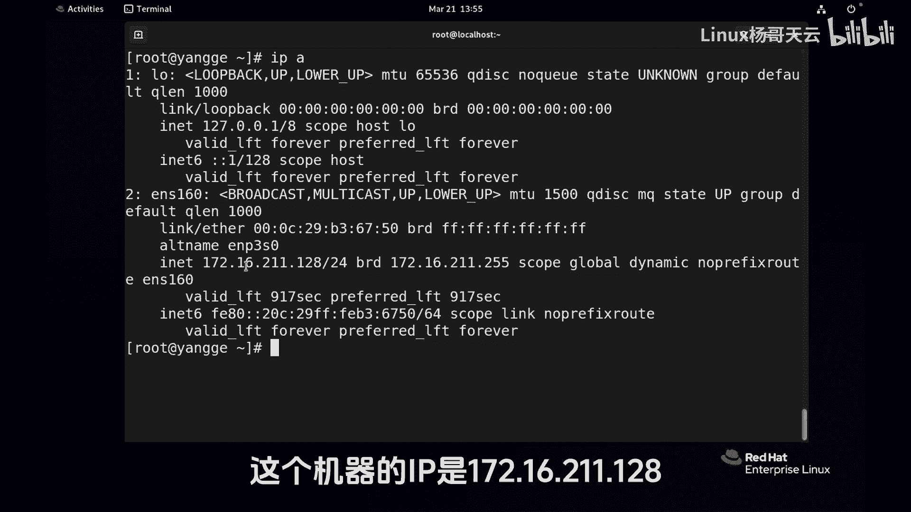
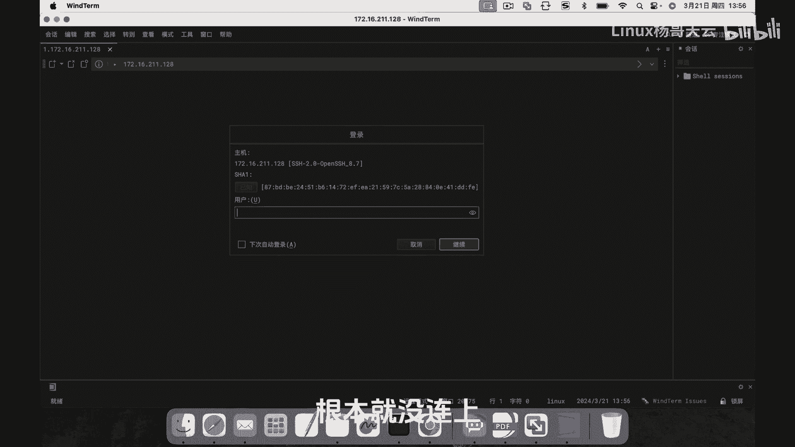
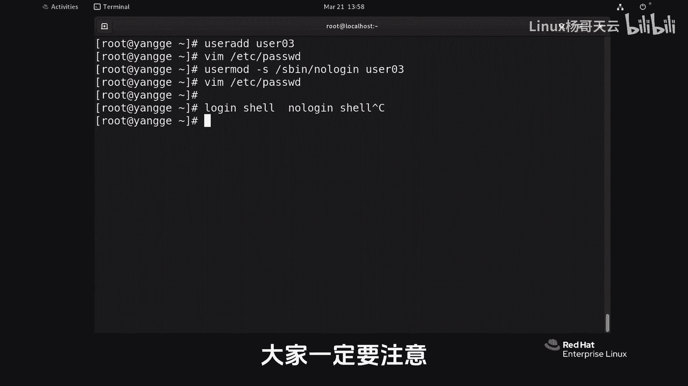

# Linux入门教程：P49：no-login Shell详解 🔐

在本节课中，我们将学习Linux中一个重要的安全概念——no-login Shell。我们将了解它与普通登录Shell的区别，以及为何及如何在系统管理中应用它来提升安全性。

---

## 什么是Shell？

在Linux系统中，当用户输入用户名和密码登录后，系统会为用户启动的第一个程序就是Shell。Shell可以理解为用户与操作系统内核之间的“翻译官”或“命令解释器”。它接收用户输入的命令，并将其传递给内核执行。

最常见的交互式Shell是`bash`，它允许用户执行命令、管理文件并与系统交互。在`/etc/passwd`文件中，每个用户条目的最后一个字段就指定了该用户登录后默认启动的Shell程序。

## 登录Shell vs. no-login Shell

上一节我们介绍了Shell的基本概念，本节中我们来看看两种不同类型的Shell。

*   **登录Shell (Login Shell)**：例如`/bin/bash`。用户成功登录后启动的交互式Shell，可以接收命令并与系统内核交互。
*   **no-login Shell (非登录Shell)**：例如`/sbin/nologin`或`/bin/false`。这类Shell**不允许用户登录系统进行交互式操作**。它们通常只是一个简单的占位程序，当用户尝试登录时，会直接显示一条消息并拒绝登录。

在`/etc/passwd`文件中，我们可以看到许多系统服务账号（如`ftp`、`apache`、`nginx`等）的Shell被设置为`/sbin/nologin`。这是出于系统安全考虑。

## 为何要使用no-login Shell？

以下是使用no-login Shell的主要目的：

1.  **提升系统安全性**：限制不必要的交互式登录。如果一个服务账号（如运行Web服务器的`apache`用户）被入侵，攻击者将无法直接通过该账号登录系统并执行命令，从而限制了攻击面。
2.  **遵循最小权限原则**：许多进程（如邮件服务、FTP服务、Web服务）只需要以某个用户的身份运行，而不需要该用户具备登录系统的能力。使用no-login Shell可以精确地赋予其运行进程的权限，同时剥夺其登录权限。
3.  **防止权限提升**：即使系统存在某些漏洞，攻击者也无法轻易地通过一个无法登录的普通用户账号进行交互式操作，从而增加了利用漏洞提升到管理员权限的难度。

简而言之，**no-login Shell让一个账号“只能干活，不能说话”**，这极大地增强了系统的安全性。

## 如何创建或修改用户使用no-login Shell？

了解了no-login Shell的重要性后，我们来看看如何具体操作。主要分为两种情况：创建新用户时指定，以及修改现有用户的Shell。

### 情况一：创建新用户时指定no-login Shell

在创建用户时，可以使用`useradd`命令的`-s`选项来直接指定其Shell为`/sbin/nologin`。

**命令格式**：
```bash
sudo useradd -s /sbin/nologin <用户名>
```



**操作示例**：
```bash
# 创建一个名为`user01`且无法登录的用户
sudo useradd -s /sbin/nologin user01
# 为用户设置密码（示例中使用简单密码仅为演示，生产环境必须使用强密码）
sudo passwd user01
```
执行后，查看`/etc/passwd`文件，可以看到`user01`用户的Shell字段已经是`/sbin/nologin`。

**测试登录**：
*   本地切换用户：`su - user01` 会提示“This account is currently not available.”
*   远程SSH连接：使用SSH客户端连接，输入用户名`user01`和密码后，连接会立即断开，无法登录。



### 情况二：修改现有用户的Shell为no-login Shell

对于已经存在的用户，我们可以使用`usermod`命令来修改其Shell。

**命令格式**：
```bash
sudo usermod -s /sbin/nologin <用户名>
```

**操作示例**：
```bash
# 假设`user03`是一个已存在的可登录用户
sudo usermod -s /sbin/nologin user03
```
执行此命令后，`user03`用户的Shell信息会在`/etc/passwd`文件中被更新，此后该用户将无法登录系统。

> **注意**：你也可以直接编辑`/etc/passwd`文件来修改用户的Shell字段，但使用`usermod`命令是更安全、更推荐的做法。

---

## 总结

本节课中我们一起学习了Linux中的no-login Shell。

*   我们首先区分了**登录Shell**和**no-login Shell**，后者是提升系统安全的关键配置。
*   我们探讨了使用no-login Shell的**核心目的**：遵循最小权限原则，限制服务账号的交互式登录能力，从而有效防范安全风险。
*   最后，我们掌握了两种设置no-login Shell的**实践方法**：在创建用户时通过`useradd -s`指定，以及对现有用户使用`usermod -s`进行修改。



请记住，在管理Linux服务器时，应严格控制拥有有效登录Shell的用户数量。对于仅用于运行进程或访问特定服务（如FTP）的账号，务必将其Shell设置为`/sbin/nologin`，这是构建安全Linux环境的一个基础且重要的习惯。