Linux入门教程：P4：root账号和普通账号登录 🔑


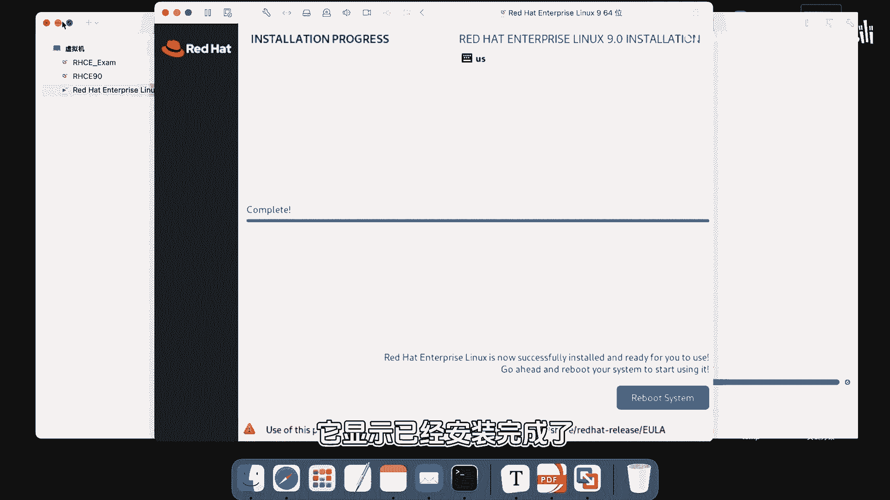

在本节课程中，我们将学习如何登录Linux系统中的两种主要账户类型：超级管理员（root）账户和普通用户账户。我们将了解它们之间的关键区别，并通过图形界面和终端进行实际操作演示。

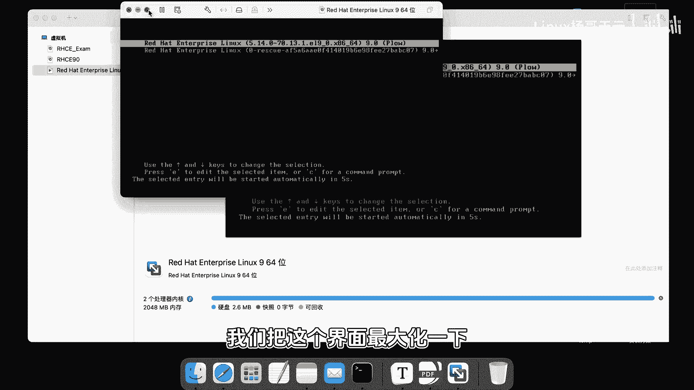

---

上一节我们完成了系统的安装，现在系统已经重启并进入了登录界面。

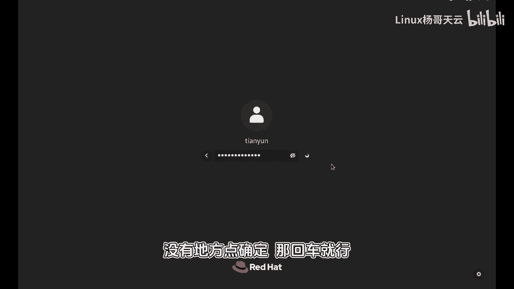

登录界面会显示已创建的用户账户。在我们的系统中，有两个账户：
*   **root**：这是系统的超级管理员账户，拥有最高权限。
*   **tianyun**：这是我们在安装过程中创建的普通用户账户。

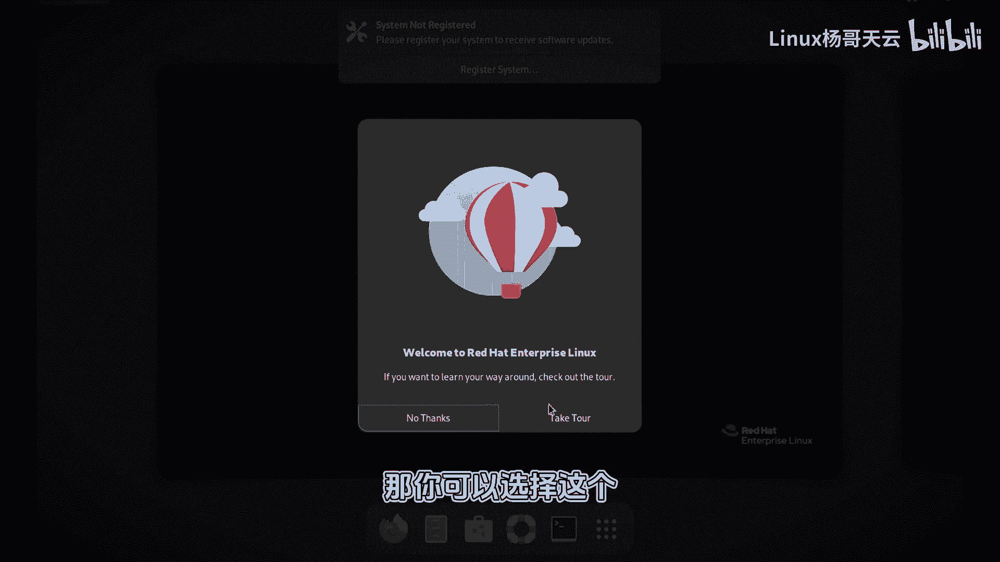

如果账户名没有直接显示在列表中，可以点击“Not listed?”选项进行手动输入登录。

以下是登录普通用户账户的步骤：
1.  在登录界面选择或输入用户名 `tianyun`。
2.  输入密码（本例中为 `redhat`），输入时密码默认隐藏。
3.  按回车键登录系统。

登录成功后，会进入图形化桌面环境。这是因为我们在安装时选择了带有图形界面的安装模式。


桌面环境包含应用程序菜单、系统设置等元素。对于Linux系统管理而言，更常用的工具是“终端”（Terminal），它是一个命令行操作界面。

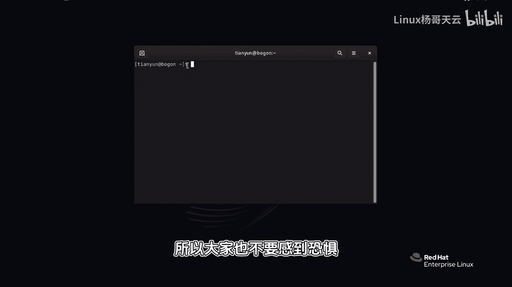

我们可以通过点击应用程序菜单中的“终端”图标来打开它。打开终端后，会看到一个命令行提示符，其格式通常包含用户名和当前目录等信息。

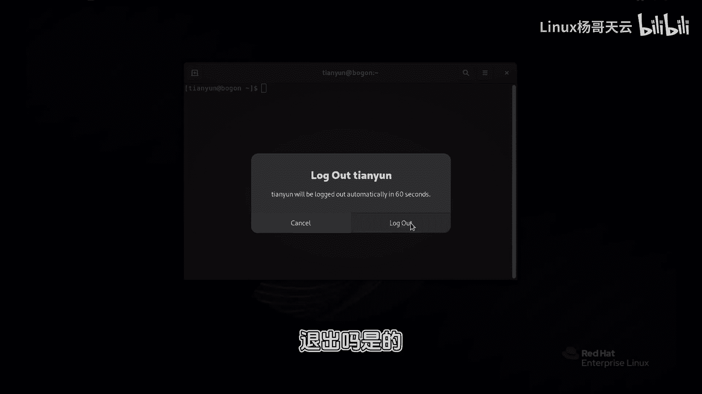

对于普通用户 `tianyun`，其命令提示符的结尾是一个**美元符号（$）**，例如：
```
[tianyun@localhost ~]$
```

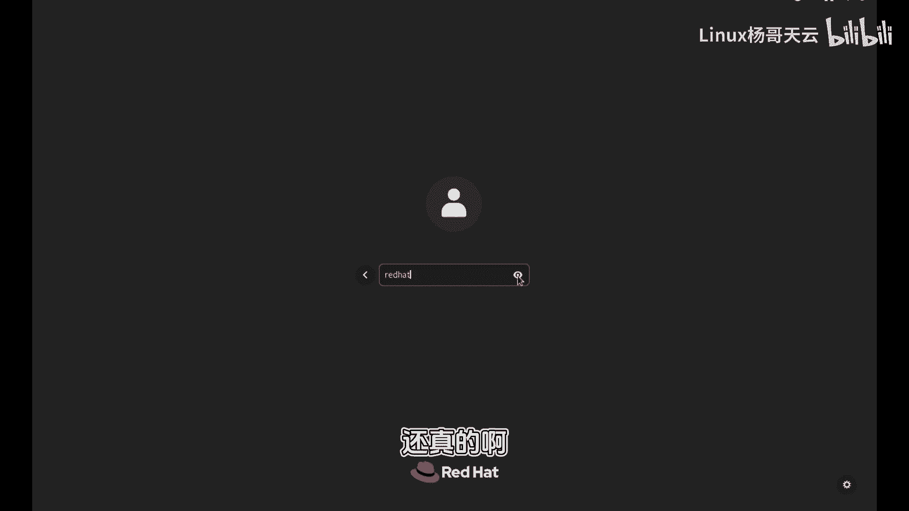

现在，让我们注销当前用户，尝试使用root账户登录。

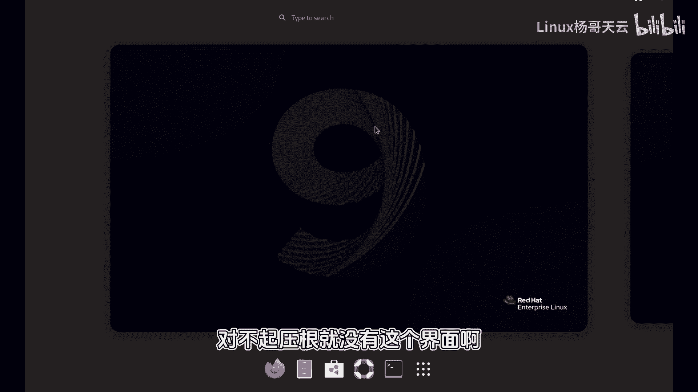

以下是登录root管理员账户的步骤：
1.  点击桌面右上角的系统菜单，选择“注销”（Log Out）。
2.  返回登录界面后，点击“Not listed?”。
3.  手动输入用户名 `root`。
4.  输入root账户的密码（本例中为 `redhat`），然后按回车键登录。

使用root账户登录后，同样可以打开终端应用程序。

此时，观察命令提示符，你会发现它发生了变化。root用户的命令提示符结尾是一个**井号（#）**，例如：
```
[root@localhost ~]#
```

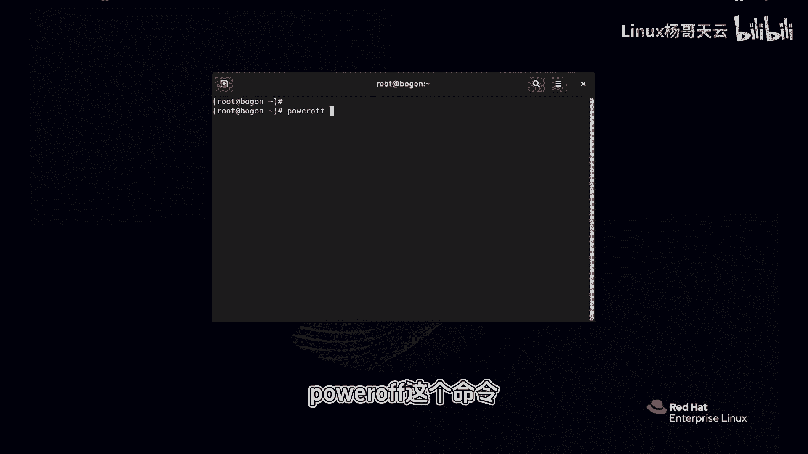

**`$`** 和 **`#`** 这两个符号是区分用户权限的重要标志：
*   **`$`** 表示当前是普通用户权限，操作受到限制。
*   **`#`** 表示当前是超级管理员（root）权限，可以执行所有系统命令。


拥有root权限意味着可以对系统进行任何操作，包括那些可能破坏系统的危险命令。因此，初学者在操作时需要格外谨慎。

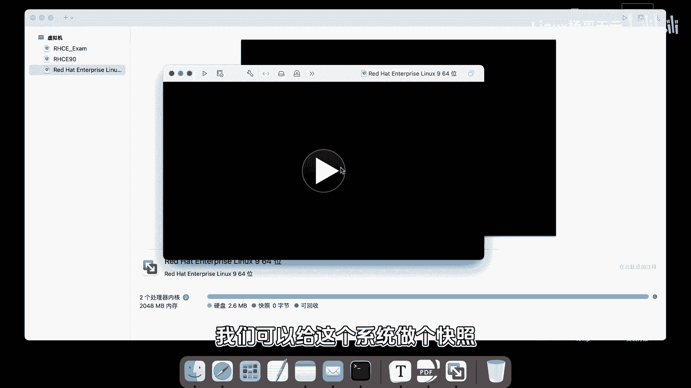

最后，我们来学习一个简单的关机命令。在终端中输入以下命令并回车，可以关闭系统：
```bash
poweroff
```

系统关闭后，建议在虚拟机软件（如VMware）中为当前纯净的系统状态创建一个“快照”。快照功能允许你将系统状态保存为一个还原点，日后如果系统被意外修改或破坏，可以快速恢复到创建快照时的状态。这是一个非常实用的学习保障措施。

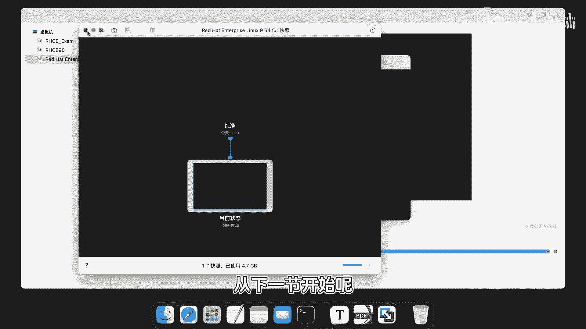

---

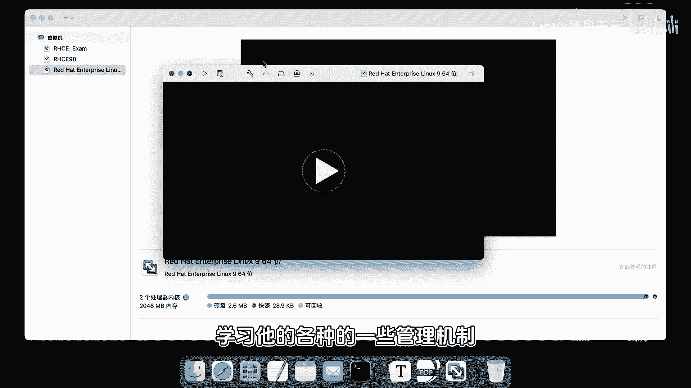


本节课中我们一起学习了Linux系统中root账户和普通账户的登录方法，认识了图形界面与终端，并理解了 `$` 和 `#` 提示符所代表的权限区别。我们还学会了使用 `poweroff` 命令关机以及创建系统快照的重要性。从下一节开始，我们将深入命令行，逐步学习Linux的各种管理操作。