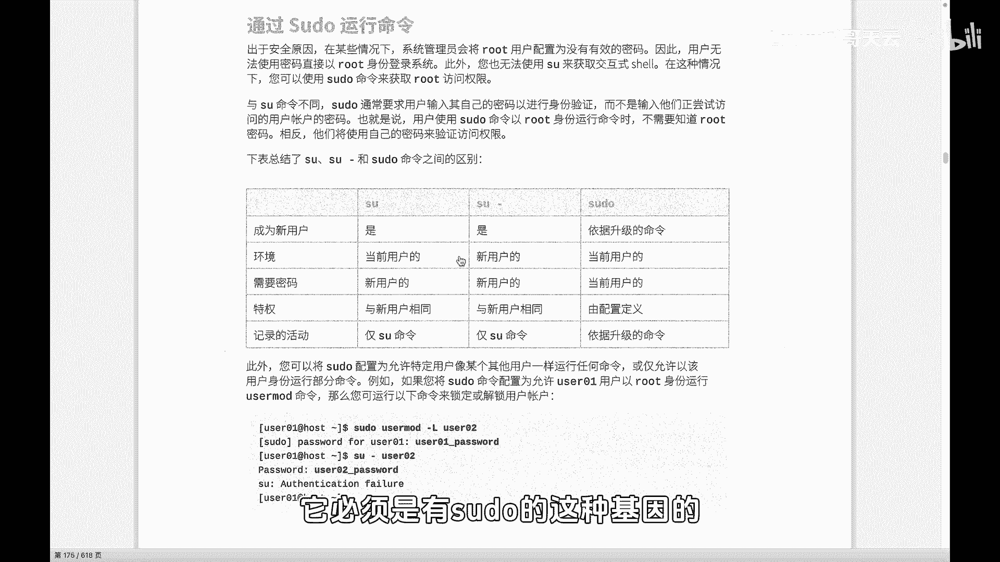
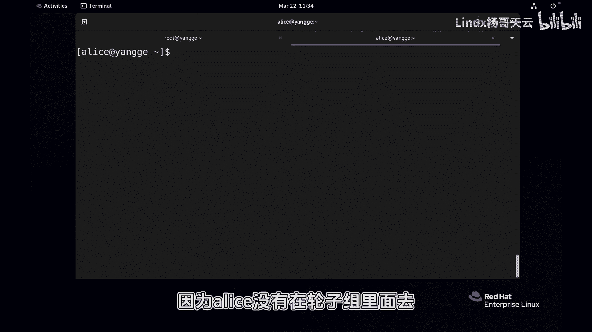
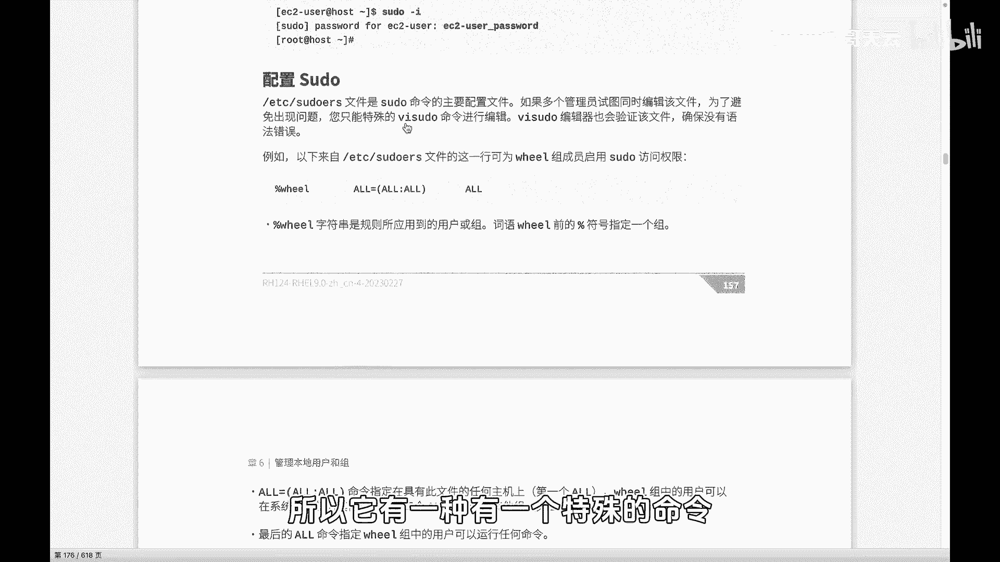
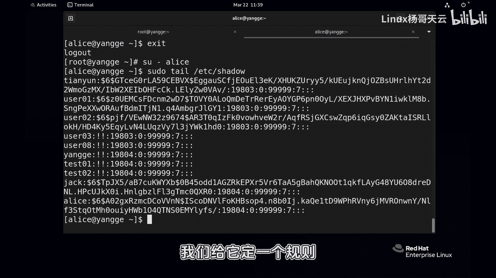
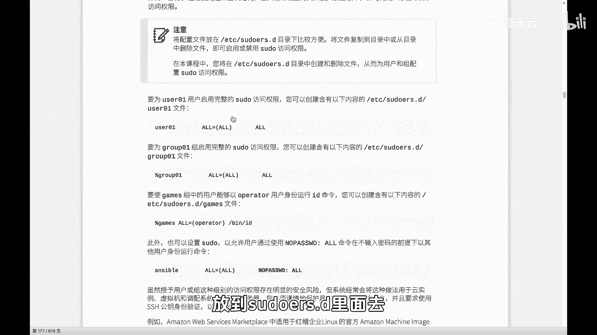
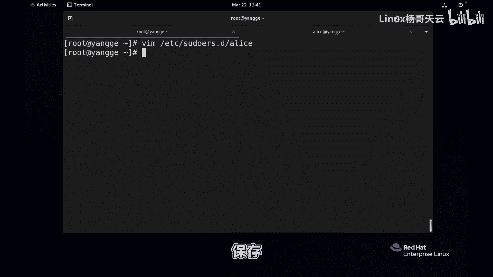
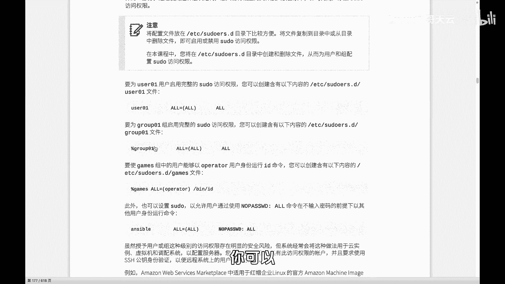
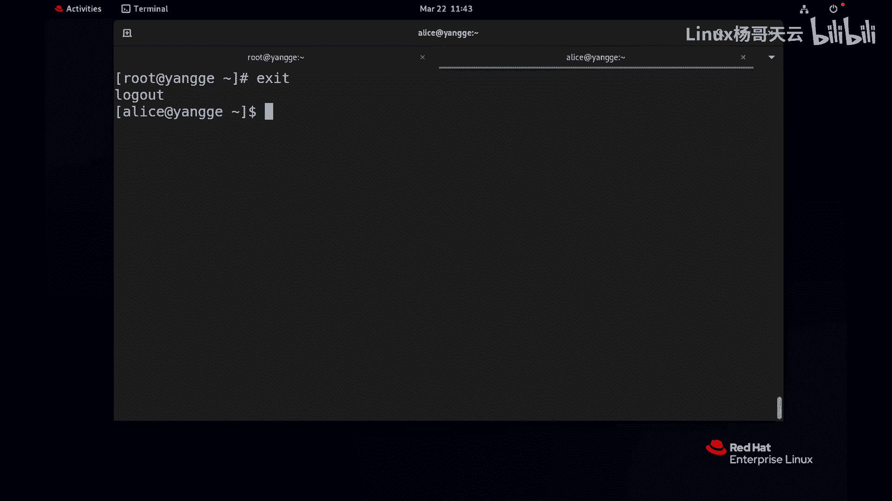

# Linux提权方式之sudo：50：sudo基础入门与配置

## 概述
在本节课中，我们将要学习Linux系统中另一种重要的用户提权方式——`sudo`。与之前学习的`su`命令不同，`sudo`允许普通用户在不需知晓管理员密码的情况下，以特定权限执行命令。我们将了解其工作原理、如何配置授权规则，以及它与`su`命令的核心区别。



## 从`su`到`sudo`的过渡
上一节我们介绍了使用`su`命令进行用户切换和提权。`su`命令需要目标用户的密码，这带来了密码管理和审计追踪上的不便。本节中，我们来看看`sudo`如何解决这些问题，实现更精细和安全的权限控制。

`sudo`允许用户以自己的密码（而非root密码）来临时获得执行特定命令的权限。这既保证了安全性，又便于日志记录操作者身份。

## `sudo`的基本概念与前提
并非所有用户都能使用`sudo`。一个普通用户想要通过`sudo`执行管理员命令（如创建用户、管理存储），必须被授予相应的`sudo`权限，即拥有“sudo基因”。

以下是理解`sudo`权限的一个简单示例环境：
*   创建用户组 `it`。
*   创建两个用户 `jack` 和 `alice`，密码均设为 `1`，并将其加入 `it` 组。

以 `jack` 用户身份尝试查看受保护文件：
```bash
# 切换到jack用户
su - jack
# 尝试查看shadow文件（需要root权限）
cat /etc/shadow
```
命令执行会失败，提示权限不足。即使尝试使用 `sudo`：
```bash
sudo cat /etc/shadow
```
系统会提示输入`jack`用户自己的密码，但输入后依然会拒绝，并显示类似 `jack is not in the sudoers file` 的错误。这说明 `jack` 用户目前不具备 `sudo` 权限。

## 授予用户`sudo`权限的两种方式
要让用户获得`sudo`权限，管理员需要进行配置。以下是两种常见方法。

### 方法一：将用户加入`wheel`组
在Linux中，有一个特殊的组叫 `wheel`。类似于Windows中的 `Administrators` 组，默认配置下，属于 `wheel` 组的成员就拥有了使用 `sudo` 执行任何命令的潜力。



以下是操作步骤：
1.  将用户 `jack` 加入 `wheel` 组。
    ```bash
    usermod -aG wheel jack
    ```
2.  使用 `id` 命令验证 `jack` 用户已加入 `wheel` 组。
    ```bash
    id jack
    ```
3.  用户需要**重新登录**以使新的组成员身份生效。
4.  登录后，`jack` 用户即可在命令前添加 `sudo` 来提权执行。
    ```bash
    sudo cat /etc/shadow
    ```
    此时，系统会提示输入 `jack` 用户自己的密码，验证成功后命令将以root权限执行。



**注意**：用户 `alice` 未加入 `wheel` 组，因此即使使用 `sudo` 并输入自己的密码，也无法执行需要特权的命令。

### 方法二：直接编辑`sudoers`规则文件
`sudo` 的授权规则定义在 `/etc/sudoers` 文件中。直接编辑此文件可以更精细地控制每个用户的权限。

**警告**：必须使用 `visudo` 命令来编辑此文件，因为它会进行语法检查，防止错误的配置导致所有 `sudo` 权限失效。
```bash
visudo
```
在打开的文件中，可以看到类似以下的规则：
```
## Allows people in group wheel to run all commands
%wheel  ALL=(ALL)       ALL
```
这条规则解读如下：
*   `%wheel`： 授权对象是 `wheel` 组（`%` 表示组）。
*   `ALL`： 允许从任何主机登录。
*   `(ALL)`： 允许以任何用户的身份执行命令。
*   `ALL`： 允许执行任何命令。

若希望 `wheel` 组成员使用 `sudo` 时**无需输入自己的密码**，可以启用下面这行（移除行首的 `#` 注释）：
```
## Same thing without a password
# %wheel        ALL=(ALL)       NOPASSWD: ALL
```
修改为：
```
%wheel        ALL=(ALL)       NOPASSWD: ALL
```
保存后，`wheel` 组成员使用 `sudo` 将不再需要输入密码。

若要为单个用户（如 `alice`）授权，可以添加一行：
```
alice        ALL=(ALL)       NOPASSWD: ALL
```
这条规则允许 `alice` 用户从任何主机，以任何用户身份，无需密码地执行任何命令。

## 推荐的配置方式：`/etc/sudoers.d/` 目录
直接修改 `/etc/sudoers` 主文件在管理多台主机或复杂规则时容易混乱。更推荐的做法是在 `/etc/sudoers.d/` 目录下为每个用户或每个权限单元创建独立的配置文件。



以下是操作步骤：
1.  使用 `visudo` 移除之前为 `alice` 在主文件中添加的规则。
2.  在 `/etc/sudoers.d/` 目录下为 `alice` 创建一个新文件。
    ```bash
    visudo -f /etc/sudoers.d/alice
    ```
3.  在新文件中写入授权规则。
    ```
    alice ALL=(ALL) NOPASSWD: ALL
    ```
4.  保存并退出。该文件会自动被主配置文件包含。



这种方式的好处是管理清晰：添加权限就创建文件，撤销权限就删除文件，无需触碰复杂的主配置文件。



## `sudo` 的便捷用法：`sudo -i`
如果需要在短时间内连续执行多条需要特权的命令，反复输入 `sudo` 可能比较繁琐。这时可以使用 `sudo -i` 命令。
```bash
sudo -i
```
该命令会启动一个**交互式的root用户shell**。在此shell中执行的所有命令都拥有root权限，直到输入 `exit` 退出该shell。这为执行一系列管理任务提供了便利，同时所有操作仍会被记录在安全日志中。



## `sudo` 与 `su` 的核心区别总结
本节课中我们一起学习了 `sudo` 的基础知识。最后，我们来总结一下 `sudo` 与 `su` 的核心区别：

| 特性 | `su` | `sudo` |
| :--- | :--- | :--- |
| **密码需求** | 需要**目标用户**的密码（如root密码）。 | 需要**当前用户**自己的密码。 |
| **权限粒度** | 切换用户身份后，获得该用户的全部权限。 | 可以精细控制允许执行的**特定命令**。 |
| **操作记录** | 日志中只记录切换到某个用户，难以追踪具体操作者。 | 日志中清晰记录是哪个用户通过 `sudo` 执行了哪条命令，便于审计。 |
| **使用场景** | 需要完全切换到另一个用户环境进行长时间工作。 | 临时提权执行个别管理命令，兼顾安全与便利。 |



简而言之，`su` 是“成为某个用户”，而 `sudo` 是“以某个用户的权限执行某条命令”。在现代Linux系统管理中，`sudo` 因其更好的安全性和可审计性而被更广泛地使用。