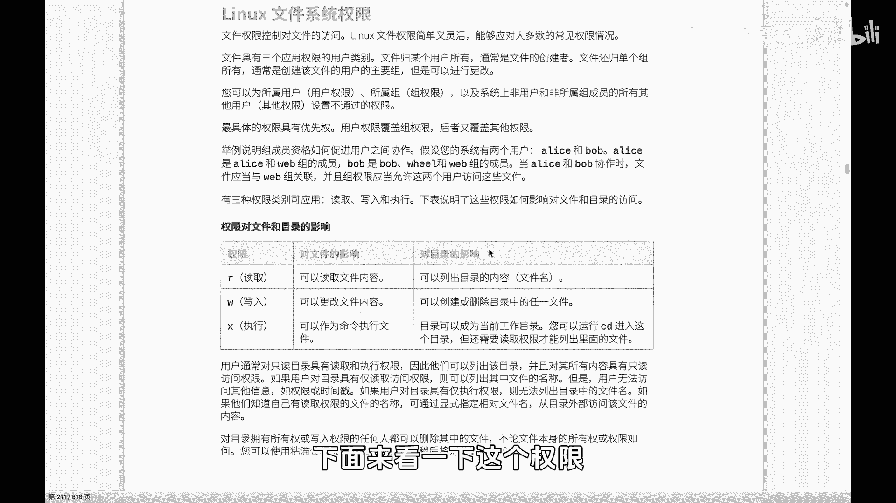
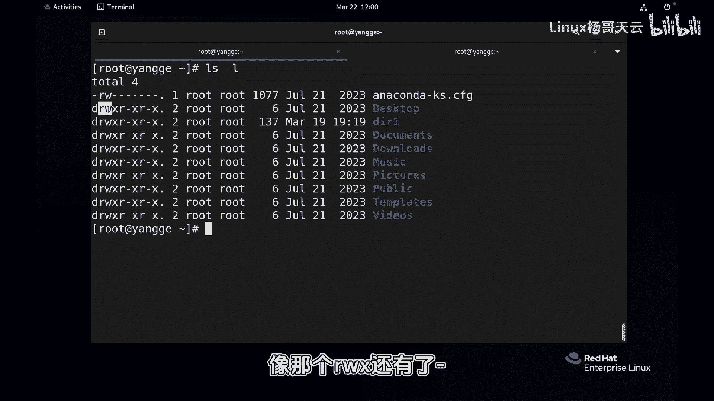
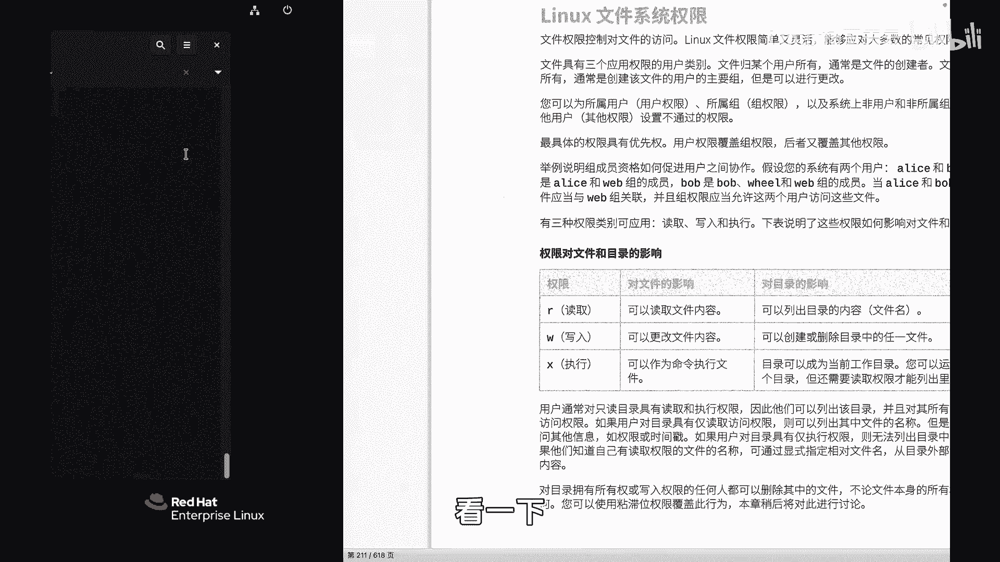
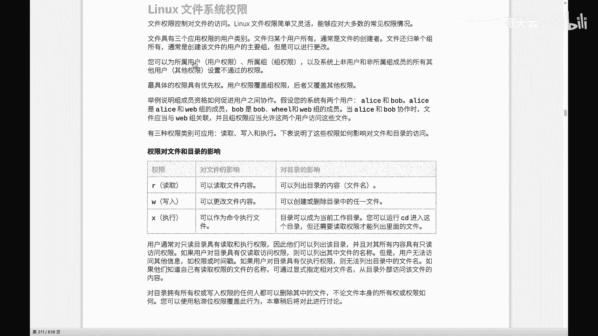
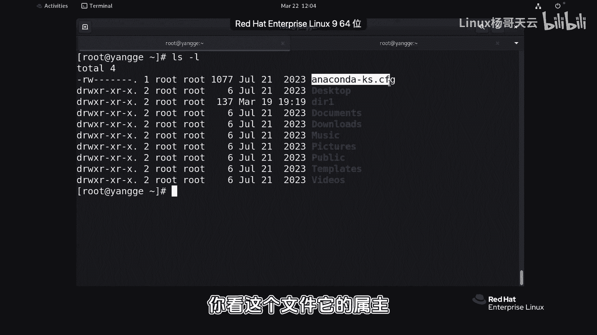
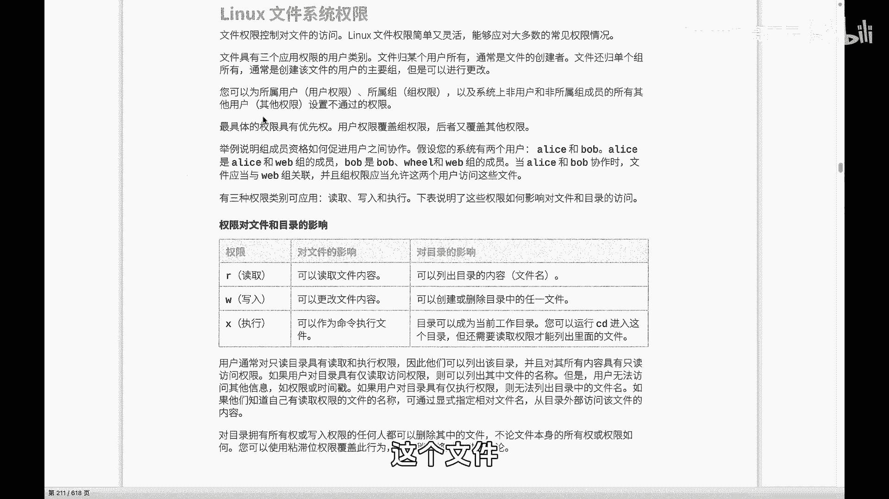
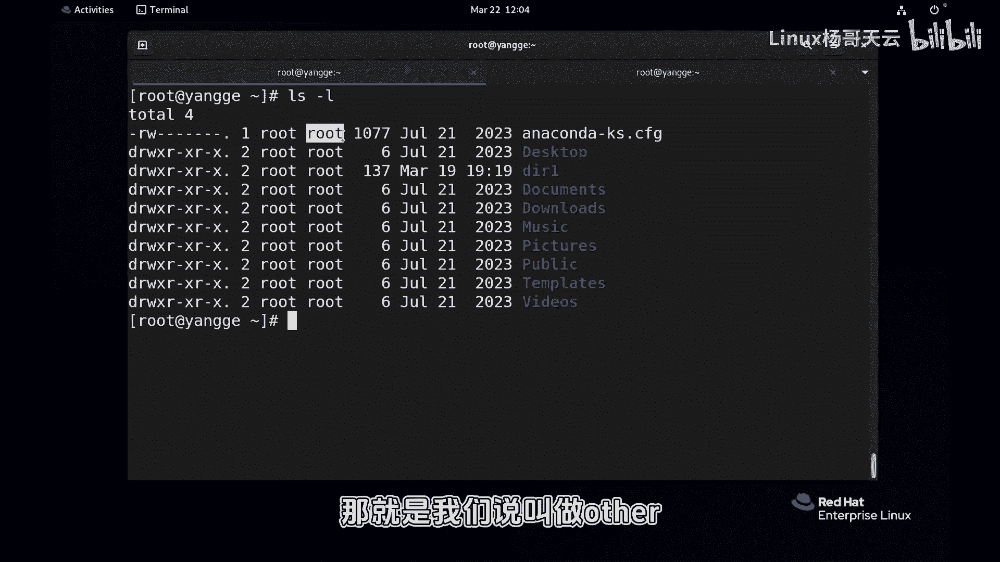
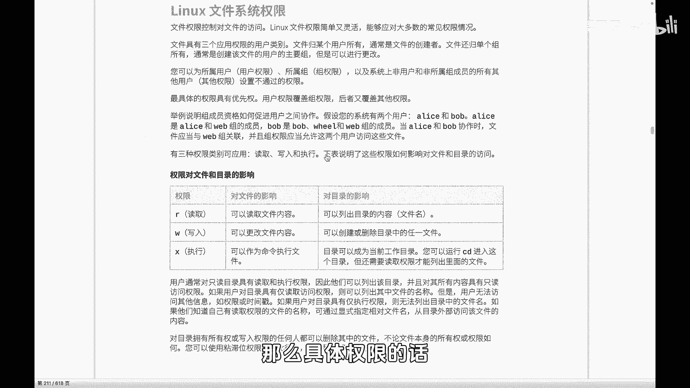
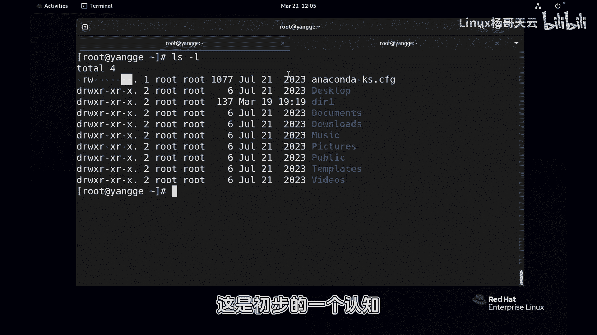
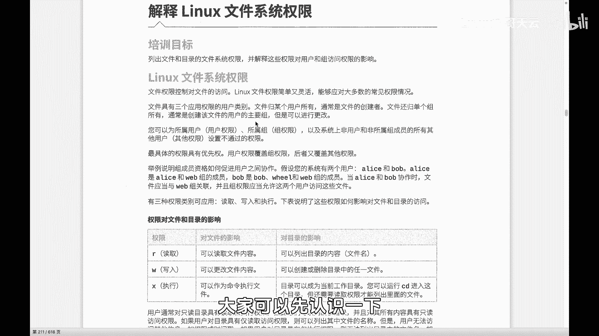

# Linux入门教程：第七章：初识Linux文件权限 🔑

在本节课中，我们将要学习Linux系统中至关重要的文件权限概念。理解文件权限是管理用户访问、保障系统安全的基础。我们将了解权限的类型、作用对象以及其基本表示方法。



## 权限的基本概念与查看

上一节我们介绍了文件系统的基本结构，本节中我们来看看如何控制对文件和目录的访问。文件权限决定了系统中的用户和进程能以何种方式访问特定的文件或目录。

使用 `ls -l` 或 `ll` 命令可以查看文件的详细信息，其中包含了权限信息。

```
[root@localhost ~]# ls -l
total 4
-rw-r--r--. 1 root root 0 Jan 1 10:00 example.txt
drwxr-xr-x. 2 root root 4096 Jan 1 10:00 example_dir/
```

输出结果中，第一个字符表示文件类型，最常见的是：
*   `-`：普通文件
*   `d`：目录



紧接着的九个字符（有时末尾还有一个点）代表文件的权限。这九个字符分为三组，每组三个，分别对应不同的访问对象。



## 权限的作用对象

权限的设置针对三种不同的对象：

1.  **所有者 (Owner/User)**：即文件的“主人”，在 `ls -l` 的输出中对应“root root”的第一个“root”。
2.  **所属组 (Group)**：文件所属的用户组，在 `ls -l` 的输出中对应“root root”的第二个“root”。组内的所有成员共享此权限。
3.  **其他人 (Other)**：既不是文件所有者，也不在文件所属组内的其他所有用户。

权限字符的前三位对应所有者的权限，中间三位对应所属组的权限，最后三位对应其他人的权限。

## 权限的三种基本类型

权限本身分为三种基本类型，用不同的字母表示：

*   **读 (r - Read)**：对于文件，表示可以读取文件内容（如使用 `cat`, `more` 命令）。对于目录，表示可以列出目录内的文件名（如使用 `ls` 命令）。
*   **写 (w - Write)**：对于文件，表示可以修改或写入文件内容（如使用 `vi` 编辑器或重定向 `>`）。对于目录，表示可以在目录内创建、删除或重命名文件。
*   **执行 (x - Execute)**：对于文件，表示可以将文件作为程序或脚本运行（如 `./script.sh`）。对于目录，表示可以进入该目录（如使用 `cd` 命令）。

在 `ls -l` 的输出中，如果某个位置是 `-`，则表示没有对应的权限。例如 `rw-r--r--` 表示所有者有读和写权限，所属组和其他人只有读权限。

## 文件与目录权限的区别





需要注意的是，相同的权限字母对文件和目录的含义有重要区别。





以下是读写执行权限在文件和目录上的具体作用：



*   **读权限**
    *   文件：查看文件内容。
    *   目录：查看目录中包含的文件列表。
*   **写权限**
    *   文件：修改文件内容。
    *   目录：在目录中创建、删除或重命名文件。
*   **执行权限**
    *   文件：运行该文件（如果它是可执行程序或脚本）。
    *   目录：进入该目录（`cd`）或访问目录内文件的元数据。

一个关键点是：即使你对目录有读权限（能看到文件名），但如果没有目录的执行权限，你仍然无法 `cd` 进入该目录。同样，你对目录内某个文件的具体操作权限，取决于该文件自身的权限设置。



## 总结



本节课中我们一起学习了Linux文件权限的基础知识。我们了解到权限通过 `ls -l` 命令查看，它针对**所有者**、**所属组**和**其他人**三种对象，设置了**读**、**写**、**执行**三种基本权限。同时，我们明确了这些权限在**普通文件**和**目录**上具有不同的行为含义。理解这些概念是后续进行精确权限管理和配置的基础。