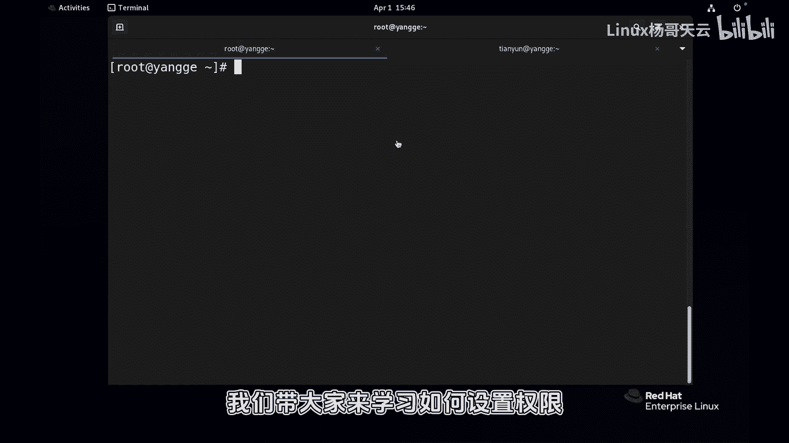
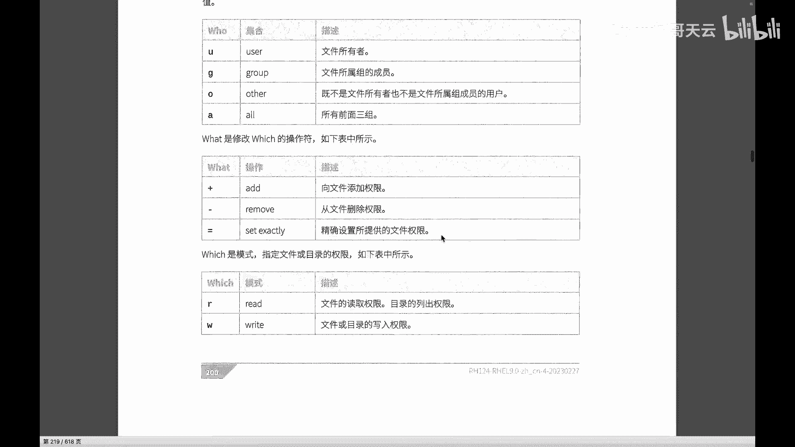
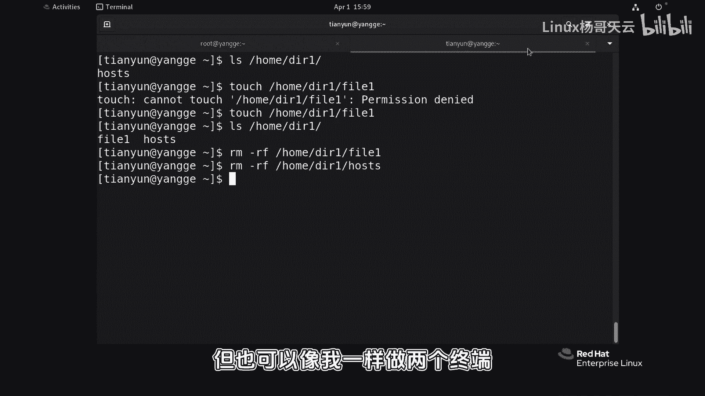

# Linux权限管理：P52：通过符号法更改权限 🔧

## 概述
在本节课中，我们将学习如何使用符号法来设置和更改Linux系统中文件与目录的权限。我们将从权限的基本概念出发，通过具体的场景演示，详细讲解`chmod`命令的符号法语法及其应用。



---

## 权限设置回顾与场景准备
上一节我们介绍了权限的基本概念，包括进程以用户身份运行、权限对访问资源的控制，以及读写执行权限对文件和目录的不同意义。本节中，我们来看看如何根据需求，使用符号法来具体设置这些权限。

设置权限的主要命令是 `chmod`。它有两种常用方法：符号法和数字法（八进制）。本节重点讲解符号法。

为了演示，我们需要准备一个测试场景。首先，我们使用root用户创建一个测试文件。



```bash
cp /etc/passwd /home/passwd.test
```

此命令将`/etc/passwd`文件复制到`/home`目录下，并命名为`passwd.test`。选择`/home`目录是为了确保所有用户都能访问到这个公共位置，避免因路径权限问题影响实验。

我们假设系统中有一个名为`tianyun`的普通用户，他不属于任何特殊组，也不是root用户。我们将以`tianyun`用户的视角来测试权限。

---

## 分析用户权限
要了解`tianyun`用户对`/home/passwd.test`文件有何权限，我们可以通过“灵魂两问”来分析：

1.  `tianyun`用户是该文件的所有者吗？
    *   查看文件所有者：`ls -l /home/passwd.test`
    *   如果不是（通常不是），则无法获得所有者权限。
2.  `tianyun`用户是该文件所属组的成员吗？
    *   查看用户所属组：`groups tianyun`
    *   如果用户不在文件所属组内，则无法获得组权限。

既然`tianyun`用户既不是所有者，也不是组成员，那么他就属于“其他人”（other）。因此，他获得的将是文件为“其他人”设置的权限。默认情况下，新文件给其他人的权限通常是“只读”（r--）。

我们可以验证一下。切换到`tianyun`用户，尝试读取和修改文件：
*   读取文件：`cat /home/passwd.test` （成功）
*   修改文件：`echo “test” > /home/passwd.test` （失败，提示“Permission denied”）

测试证实，`tianyun`用户当前只有读权限，没有写权限。

---

## 使用符号法更改权限
现在，我们需要为`tianyun`用户添加写权限。由于他是“其他人”，我们使用`chmod`命令的符号法来操作。

**符号法基本语法：**
`chmod [who][operator][permissions] file...`

*   **who** (对谁设置):
    *   `u`: 文件所有者 (user)
    *   `g`: 文件所属组 (group)
    *   `o`: 其他人 (others)
    *   `a`: 所有人 (all)，即 u+g+o
*   **operator** (操作):
    *   `+`: 添加权限
    *   `-`: 移除权限
    *   `=`: 设定权限（覆盖原有）
*   **permissions** (权限):
    *   `r`: 读
    *   `w`: 写
    *   `x`: 执行

根据需求，我们为“其他人”（o）添加（+）写权限（w）：
```bash
chmod o+w /home/passwd.test
```

执行后，再次查看文件权限：`ls -l /home/passwd.test`。可以看到“其他人”的权限位出现了`w`。
现在`tianyun`用户再次尝试写入文件：`echo “test” >> /home/passwd.test`，操作成功。

如果想一次性为“其他人”设置读、写、执行权限，可以使用等号（=）覆盖：
```bash
chmod o=rwx /home/passwd.test
```
此时文件对于其他人将拥有全部权限。如果文件内容是可执行脚本，`tianyun`用户就可以运行它。

---

## 组合设置与默认行为
`chmod`符号法支持同时对多个对象进行组合设置。

例如，以下命令同时设置了所有者、组和其他人的权限：
```bash
chmod u+x,g=rw,o=r /home/passwd.test
```
这条命令的含义是：
*   为所有者（u）添加（+）执行权限（x）。
*   将组（g）的权限设定为（=）读和写（rw）。
*   将其他人（o）的权限设定为（=）只读（r）。

更简洁的写法是使用`a`代表所有人：
```bash
chmod a=r /home/passwd.test  # 所有人只读
chmod a-x /home/passwd.test   # 所有人移除执行权限
```

此外，如果省略`who`部分，默认代表`a`（所有人）。例如：
```bash
chmod +x /home/passwd.test
```
这条命令等价于 `chmod a+x /home/passwd.test`，为所有人添加执行权限。

---

## 目录权限的设置
目录的权限设置与文件类似，但含义不同：
*   **读（r）**：可以列出目录内的文件名。
*   **写（w）**：可以在目录内创建、删除、重命名文件。
*   **执行（x）**：可以进入（cd）该目录。

让我们创建一个目录并测试：
```bash
mkdir /home/testdir
ls -ld /home/testdir  # 使用 `-d` 选项查看目录本身权限
```
默认情况下，目录给其他人的权限通常是`r-x`（可读、可进入，不可写）。

以`tianyun`用户身份测试：
*   进入目录：`cd /home/testdir` （成功）
*   列出内容：`ls /home/testdir` （成功，但目录为空）
*   创建文件：`touch /home/testdir/myfile` （失败，无写权限）

要为`tianyun`用户（其他人）添加在目录内创建文件的权限，需要给目录添加写权限：
```bash
chmod o+w /home/testdir
```
再次以`tianyun`用户尝试创建文件，操作成功。同样，删除文件的权限也依赖于对目录的写权限。

---

## 总结
本节课中我们一起学习了如何使用符号法更改Linux文件和目录的权限。

我们首先回顾了权限分析的基本方法，然后详细讲解了`chmod`命令符号法的语法结构，包括操作对象（u/g/o/a）、操作符（+/-/=）和权限类型（r/w/x）。通过文件与目录的实例演示，我们实践了如何根据实际需求添加、移除或覆盖权限。最后，我们还了解了组合设置权限以及`chmod`命令的默认行为。



符号法的优势在于直观、易于理解，特别适合进行精细的、针对特定用户的权限调整。建议你在练习时打开多个终端窗口，分别以管理员和普通用户身份操作，以加深对不同权限效果的理解。