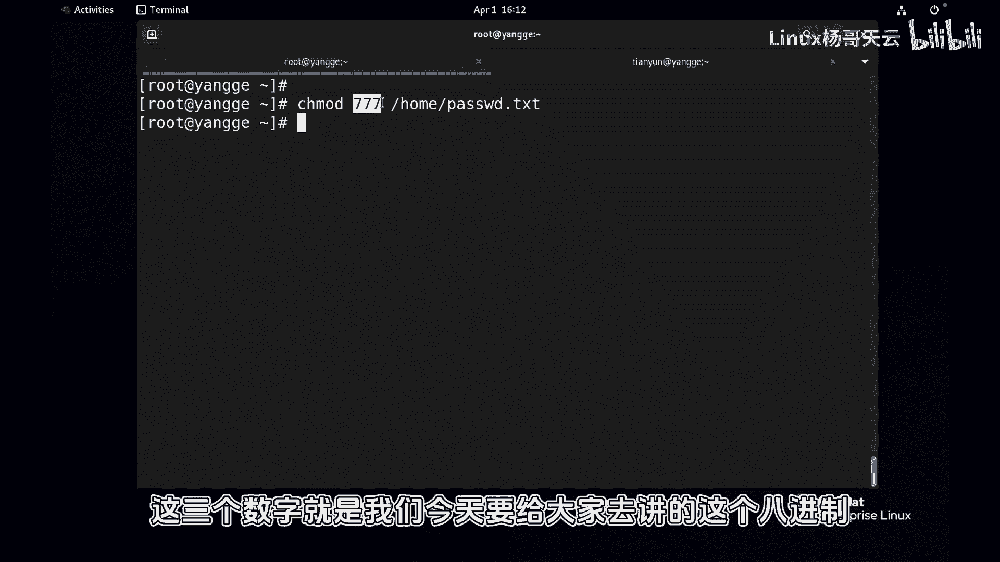
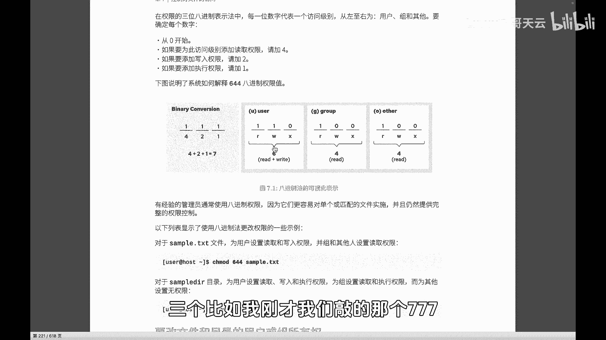
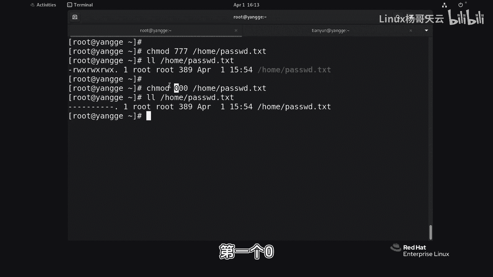
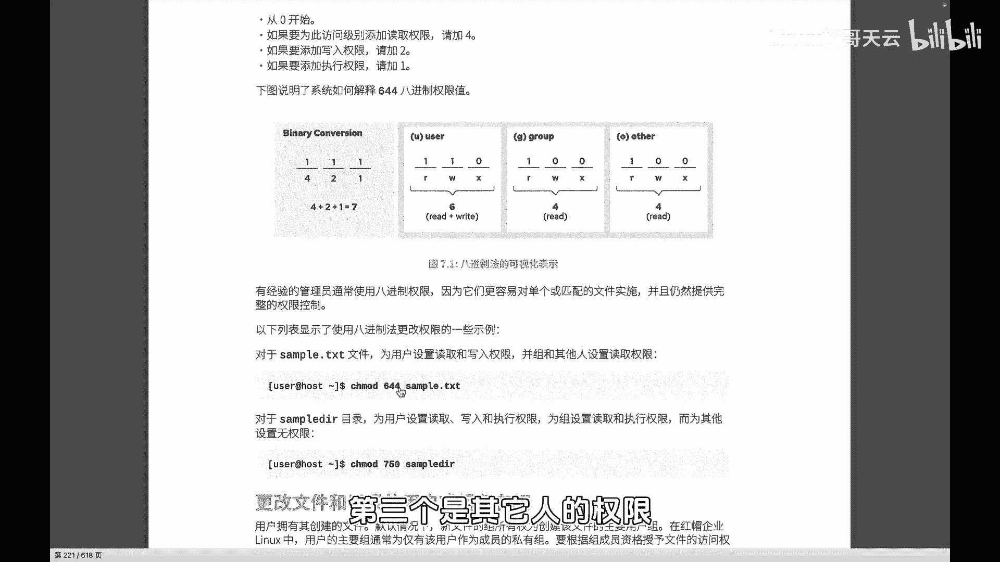
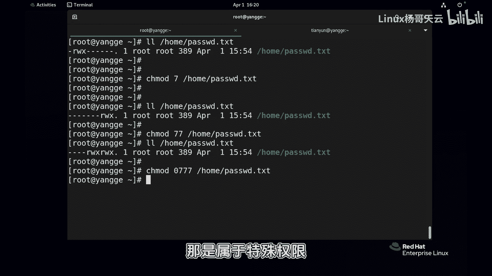
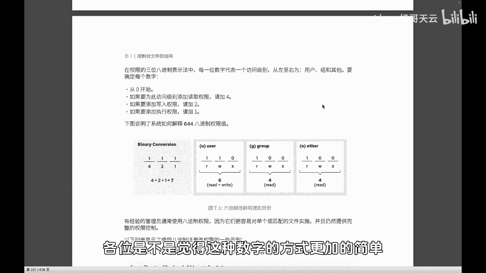

# Linux权限管理：53：通过数字法更改权限 🔢



在本节课中，我们将学习如何使用数字（八进制）法来设置Linux系统中的文件或目录权限。这种方法比字符法更为简洁直观。



上一节我们介绍了使用字符（u/g/o/a, +/-/=, r/w/x）来更改权限。本节中我们来看看如何使用数字来精确地设置权限。

## 数字权限的原理



数字权限使用三个八进制数字，分别代表**所有者（user）**、**所属组（group）** 和**其他人（other）** 的权限。

每个数字由三个基本权限值相加得到：
*   **读（r）** 的值为 **4**
*   **写（w）** 的值为 **2**
*   **执行（x）** 的值为 **1**
*   **无权限** 的值为 **0**

因此，权限组合对应的数字计算方式为：
**权限数字 = (r ? 4 : 0) + (w ? 2 : 0) + (x ? 1 : 0)**

例如：
*   `rw-` (读+写) = 4 + 2 + 0 = **6**
*   `r-x` (读+执行) = 4 + 0 + 1 = **5**
*   `rwx` (读+写+执行) = 4 + 2 + 1 = **7**

## 命令格式与示例

使用 `chmod` 命令配合数字设置权限的格式如下：
```bash
chmod [数字组合] 文件名
```

以下是几个常见的权限数字组合示例：



*   **`755`**：所有者拥有读、写、执行权限（7）；组和其他人拥有读和执行权限（5）。常用于可执行程序或脚本。
    *   对应字符权限：`rwxr-xr-x`
*   **`644`**：所有者拥有读、写权限（6）；组和其他人只有读权限（4）。这是普通文件的常见默认权限。
    *   对应字符权限：`rw-r--r--`
*   **`777`**：所有者、组和其他人都拥有读、写、执行的全部权限（7）。**警告：此设置会极大降低安全性，请谨慎使用。**
    *   对应字符权限：`rwxrwxrwx`
*   **`700`**：只有所有者拥有读、写、执行的全部权限（7）；组和其他人没有任何权限（0）。常用于保护私人文件或目录。
    *   对应字符权限：`rwx------`

## 实践操作

让我们通过命令来验证上述原理。

1.  将 `/home/passwd` 文件的权限设置为 `644`：
    ```bash
    chmod 644 /home/passwd
    ```
    第一个数字 `6` 设置所有者为 `rw-`，第二个数字 `4` 设置组为 `r--`，第三个数字 `4` 设置其他人也为 `r--`。

2.  将权限更改为 `755`：
    ```bash
    chmod 755 /home/passwd
    ```
    此时，所有者权限为 `rwx` (7)，组和其他人权限为 `r-x` (5)。

3.  将权限更改为 `700`：
    ```bash
    chmod 700 /home/passwd
    ```
    此时，只有所有者拥有 `rwx` 全部权限，组和其他人无任何权限。

**重要提示**：使用数字法设置权限时，必须明确指定三个数字（分别对应 u, g, o）。它直接设置“最终权限”，而无需像字符法那样考虑是“增加(+)”还是“移除(-)”权限。



## 数字法与字符法的对比

数字法设置权限更加直接和精确，特别适合需要一次性设定完整权限的场景。你只需要记住 **4（读）、2（写）、1（执行）** 这三个核心数字，并通过加法组合即可。



本节课中我们一起学习了如何使用数字（八进制）法来管理Linux文件权限。你掌握了权限数字（4、2、1）的含义、组合计算方式以及如何使用 `chmod` 命令进行设置。数字法提供了一种快速、准确设置完整权限的方案，是系统管理中的常用技能。