# Linux入门教程：55：更改文件属主与属组 chown & chgrp 🔧

在本节课中，我们将学习如何更改文件的**所有者**和**所属组**。这是Linux文件权限管理的重要组成部分，能帮助我们更精确地控制谁可以访问和修改文件。

上一节我们介绍了使用数字和符号两种方式更改文件权限。本节中我们来看看如何配合更改文件的**属主**和**属组**，以实现更灵活的权限控制。

---

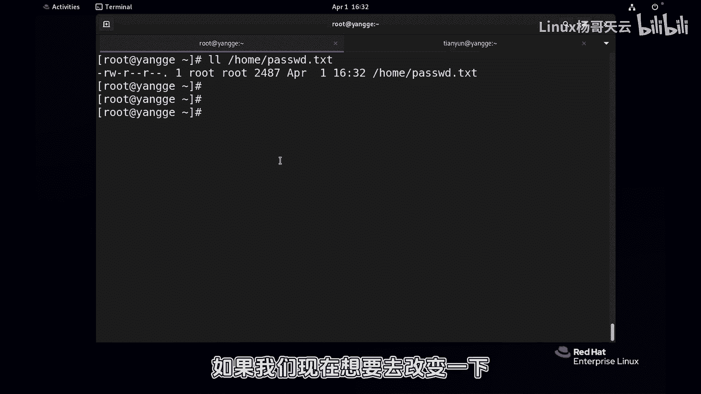

## 命令概述

在Linux中，更改文件属主和属组主要涉及两个命令：
*   **`chgrp`**：仅用于更改文件的**所属组**。
*   **`chown`**：功能更强大，可以同时更改文件的**所有者**和**所属组**。

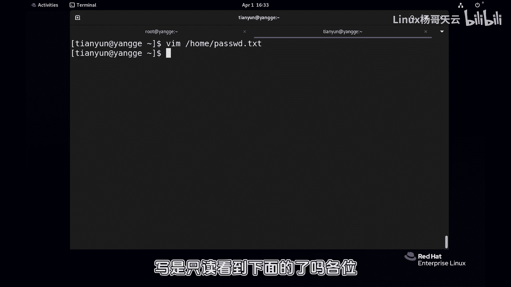

---

## 实践操作：更改文件所属组 (chgrp)

首先，我们通过一个例子来理解`chgrp`命令的用法。假设我们有一个文件 `/home/password.txt`，其当前所有者和组都是`root`。

以下是更改文件所属组的步骤：

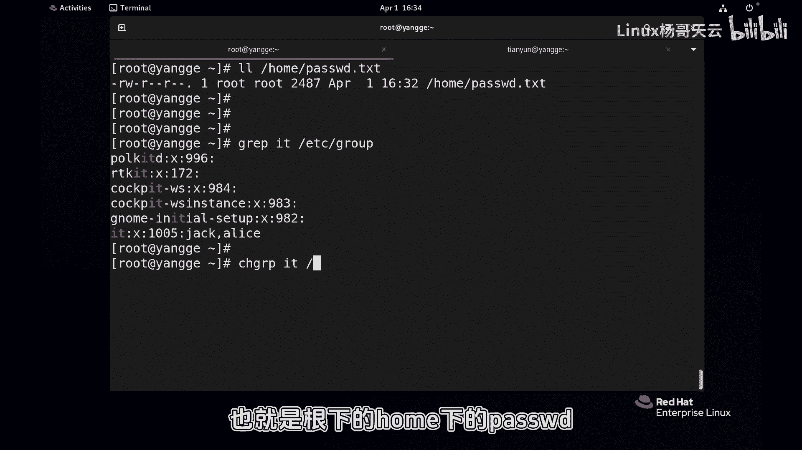

1.  查看文件当前的所有者和组信息。
    ```bash
    ls -l /home/password.txt
    ```
    输出可能类似：`-rw-r--r--. 1 root root ...`，表示所有者为`root`，组也为`root`。

2.  使用`chgrp`命令将文件的所属组更改为一个已存在的组，例如`it`组。
    ```bash
    sudo chgrp it /home/password.txt
    ```
    *   `it`：新的组名，该组必须在系统中存在。
    *   `/home/password.txt`：要更改的目标文件。

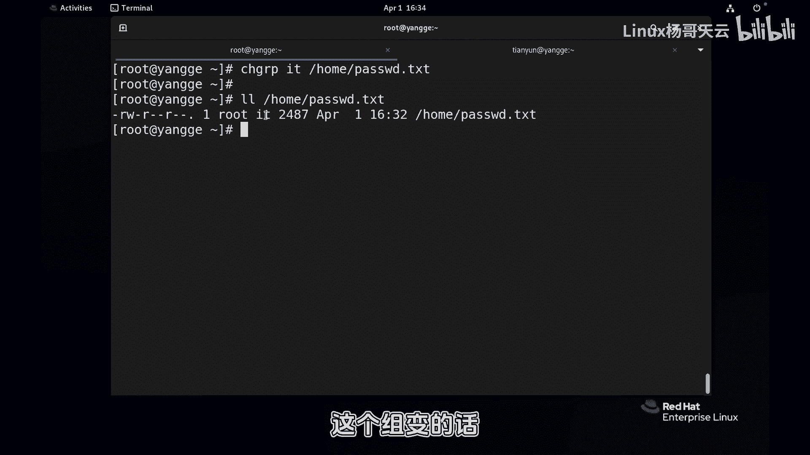

3.  再次查看文件信息，确认组已更改。
    ```bash
    ls -l /home/password.txt
    ```
    输出将变为：`-rw-r--r--. 1 root it ...`，表示组已成功改为`it`。

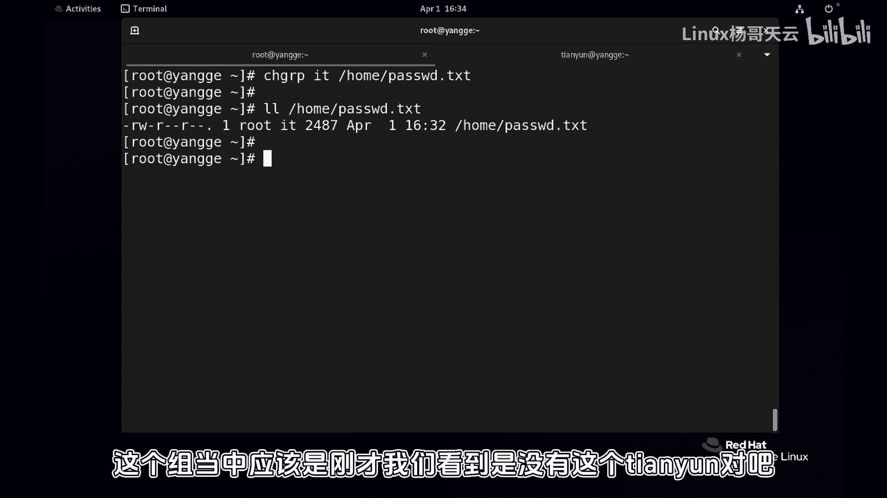

**核心概念**：`chgrp`命令的**基本语法**为：
```bash
chgrp [新组名] [文件名]
```
更改后，属于新组的用户将根据该文件的**组权限**来获得相应的访问能力。

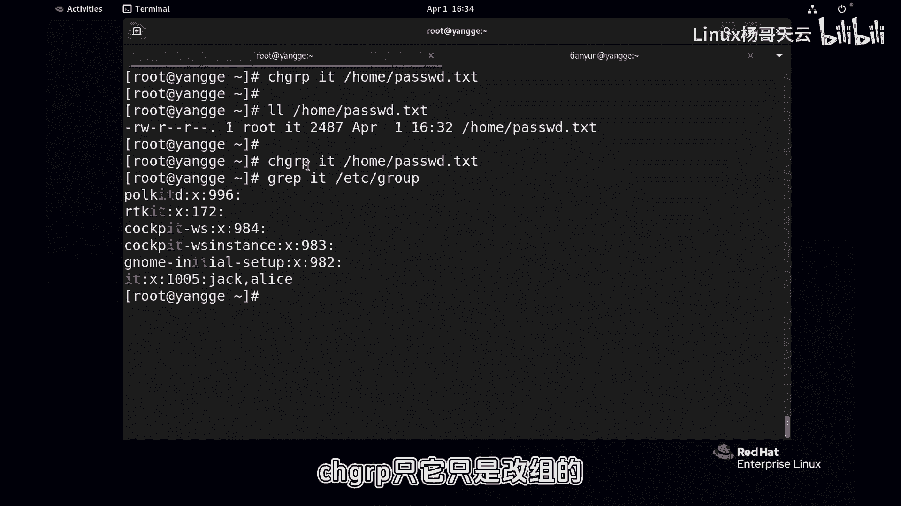

---

## 实践操作：更改文件所有者与组 (chown)

`chown`命令更为常用，因为它可以一次性更改所有者和组。让我们继续操作。

上一节我们使用`chgrp`更改了组。现在，我们使用`chown`命令来同时更改文件的所有者和组。

以下是使用`chown`命令的几种常见方式：

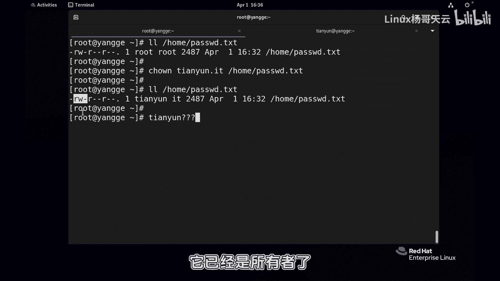

1.  **同时更改所有者和组**：将文件所有者改为`tianyun`，组改为`it`。
    ```bash
    sudo chown tianyun.it /home/password.txt
    ```
    或者使用冒号分隔，效果相同：
    ```bash
    sudo chown tianyun:it /home/password.txt
    ```
    *   `tianyun`：新的所有者。
    *   `.` 或 `:`：分隔符。
    *   `it`：新的组。

    执行后，`tianyun`用户作为文件的所有者，将自动拥有该文件的所有者权限（例如读写），而`it`组中的成员将拥有组权限。

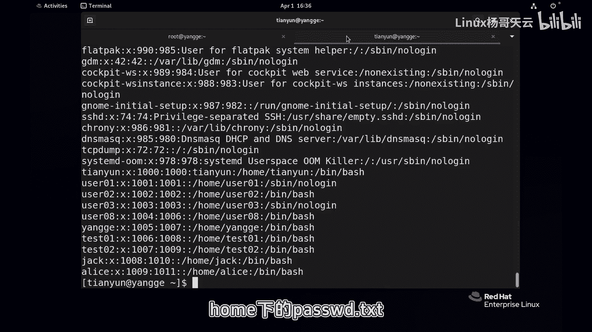

2.  **仅更改所有者**：如果只想更改所有者而保持组不变，可以省略组部分。
    ```bash
    sudo chown alice /home/password.txt
    ```
    此命令将所有者改为`alice`，组保持不变。

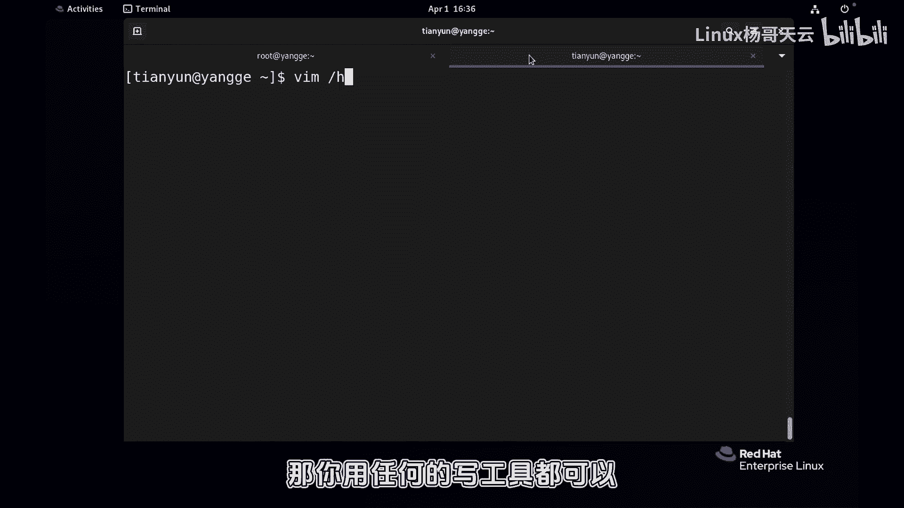

3.  **仅更改所属组**：使用`chown`也可以实现仅更改组，这时需要在所有者位置保留原值（或使用空值），后接分隔符和新的组名。
    ```bash
    sudo chown :root /home/password.txt
    ```
    此命令将组改回`root`，所有者不变。

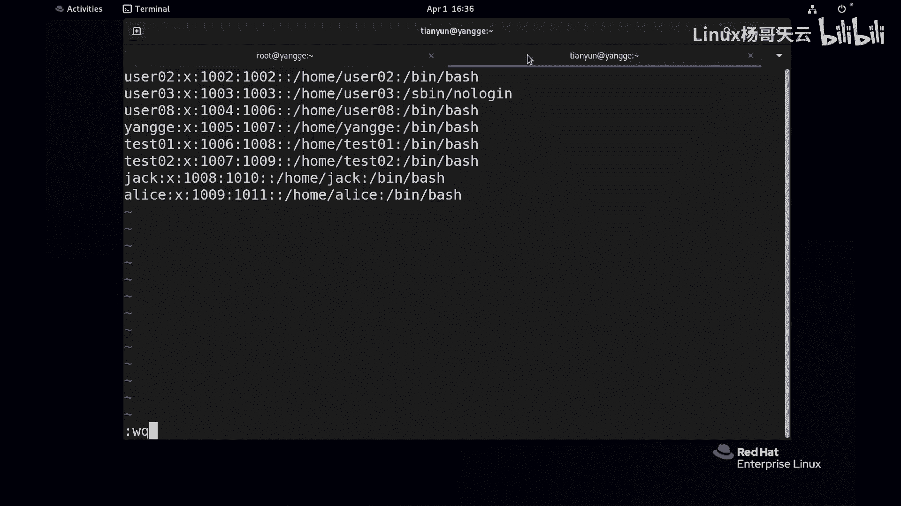

**核心概念**：`chown`命令的**基本语法**为：
```bash
chown [新所有者][:或.][新组名] [文件名]
```
*   同时改：`chown owner.group file`
*   仅改主：`chown owner file`
*   仅改组：`chown .group file` 或 `chown :group file`

---

## 综合应用示例

假设我们有一个新文件，出于安全考虑，需要满足以下要求：
1.  文件所有者设置为`tianyun`。
2.  文件权限设置为：仅所有者`tianyun`拥有读、写、执行权限，其他任何人没有任何权限。

我们可以分两步完成：

**第一步**：使用`chown`更改文件所有者为`tianyun`（组保持不变）。
```bash
sudo chown tianyun /home/newfile.txt
```

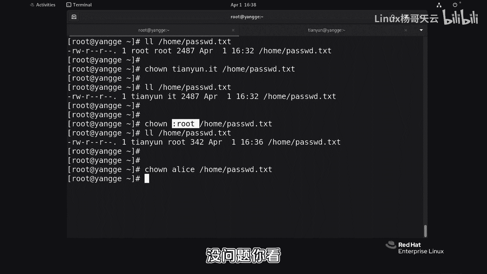

**第二步**：使用数字表示法更改文件权限为`700`。
```bash
sudo chmod 700 /home/newfile.txt
```
*   **权限数字`700`解析**：
    *   第一个数字`7`（二进制`111`）代表所有者(`u`)的权限：读(`r`)、写(`w`)、执行(`x`)。
    *   第二个数字`0`代表组(`g`)的权限：无任何权限。
    *   第三个数字`0`代表其他人(`o`)的权限：无任何权限。

通过这两步操作，我们就精确地实现了预设的安全目标。

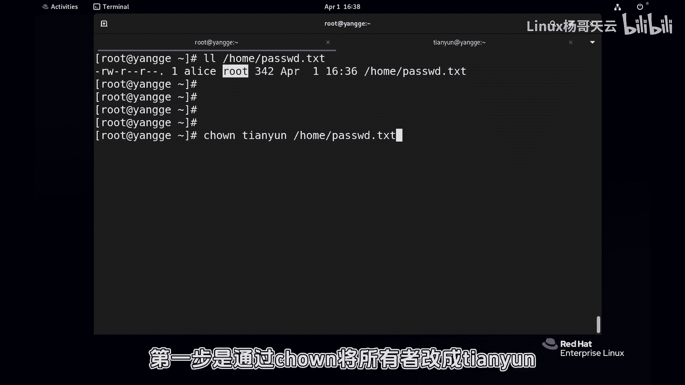

---

## 命令总结

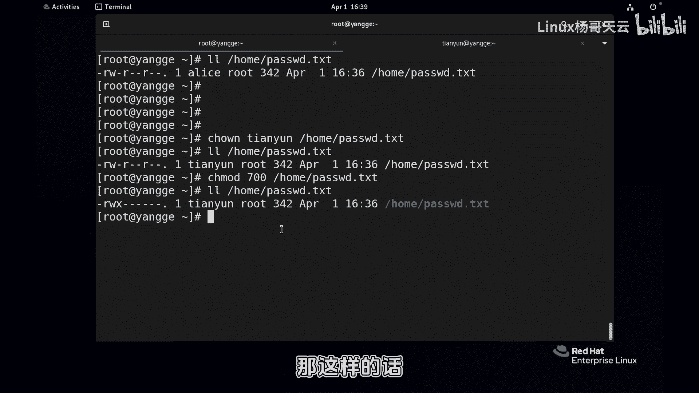

本节课中我们一起学习了两个关键的命令：

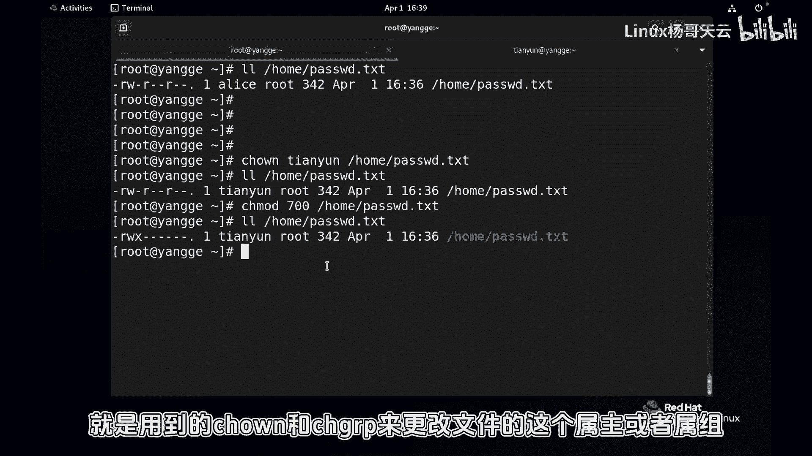

*   **`chgrp`**：专门用于更改文件的**所属组**。语法简单：`chgrp [组名] [文件]`。
*   **`chown`**：功能更全面的命令，用于更改文件的**所有者**和/或**所属组**。其灵活的语法（使用`.`或`:`分隔）可以满足各种更改需求。

理解并熟练使用这两个命令，是进行Linux系统文件权限精细化管理的基础。在实际工作中，它们常与`chmod`命令结合使用，共同构建起系统的文件安全体系。

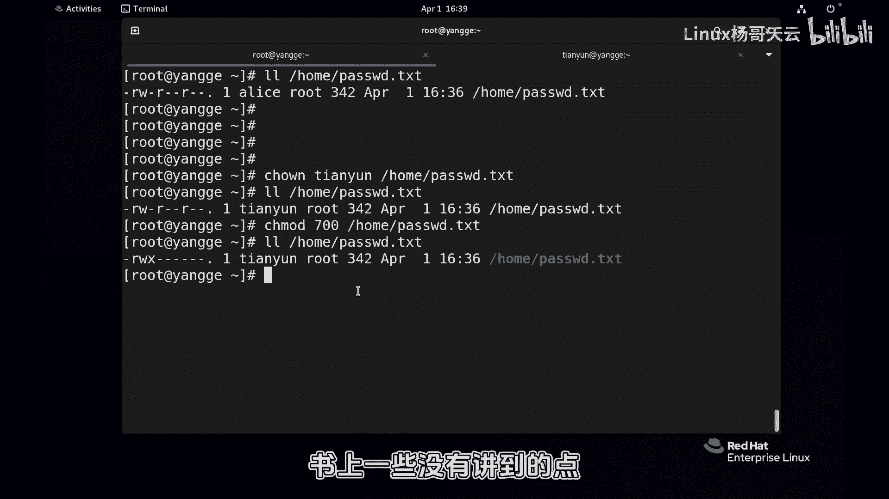

在接下来的课程中，我们将探讨这些命令在实际使用中可能遇到的更复杂情况和一些高级技巧。