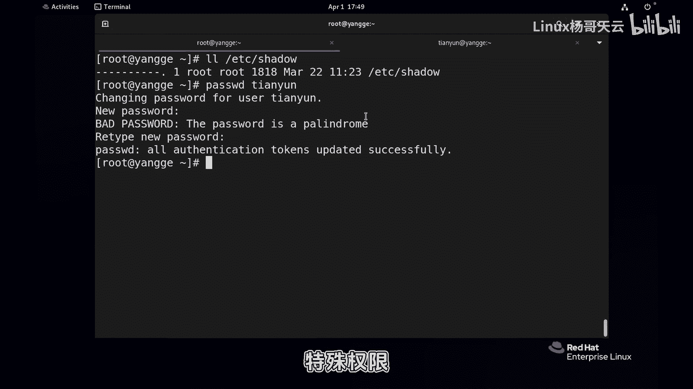
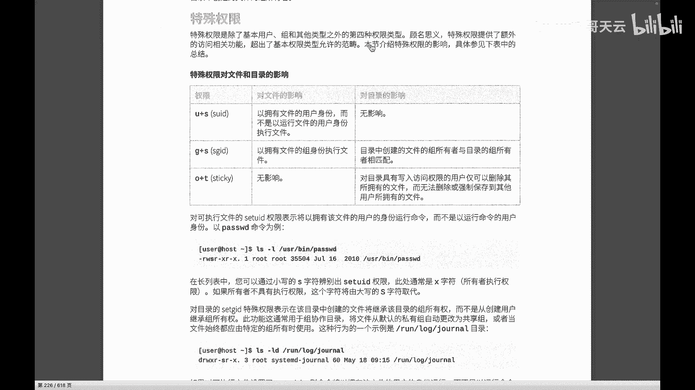
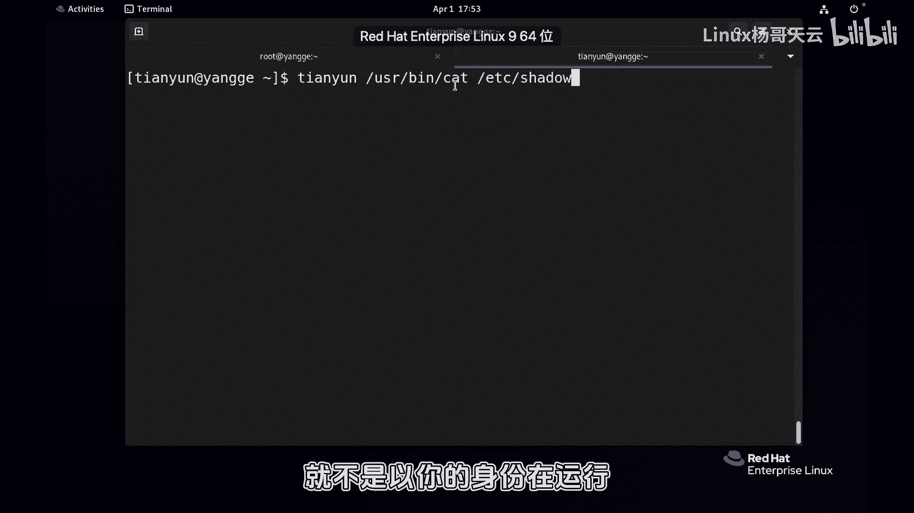
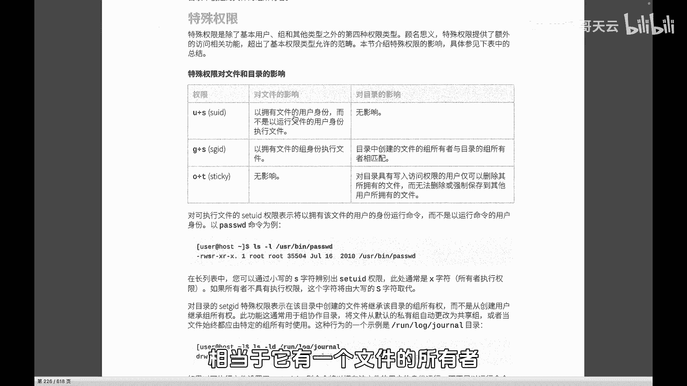
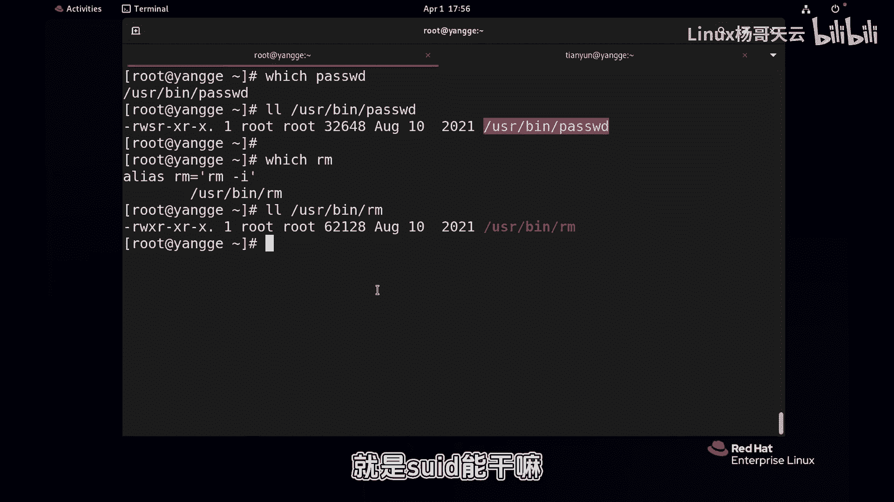
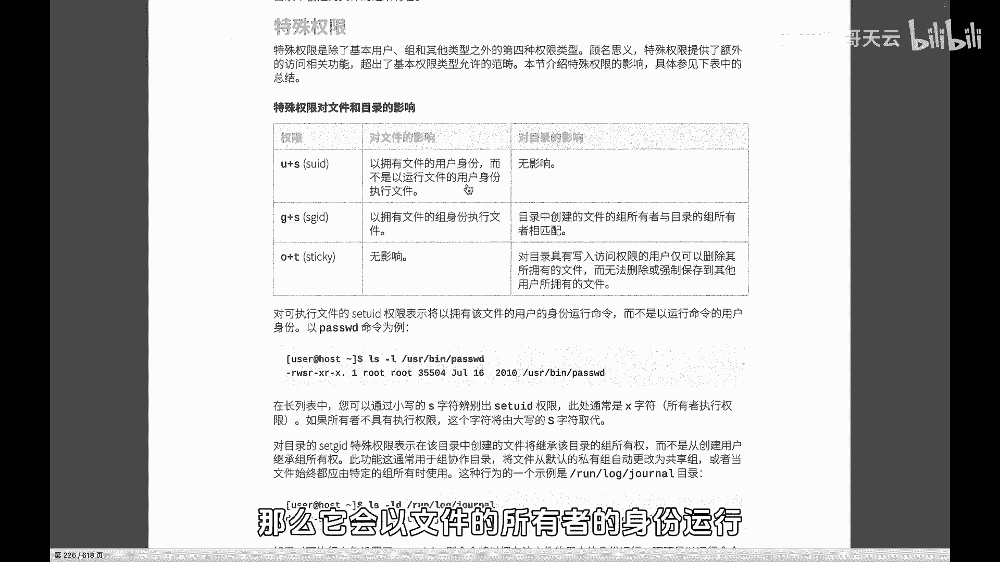
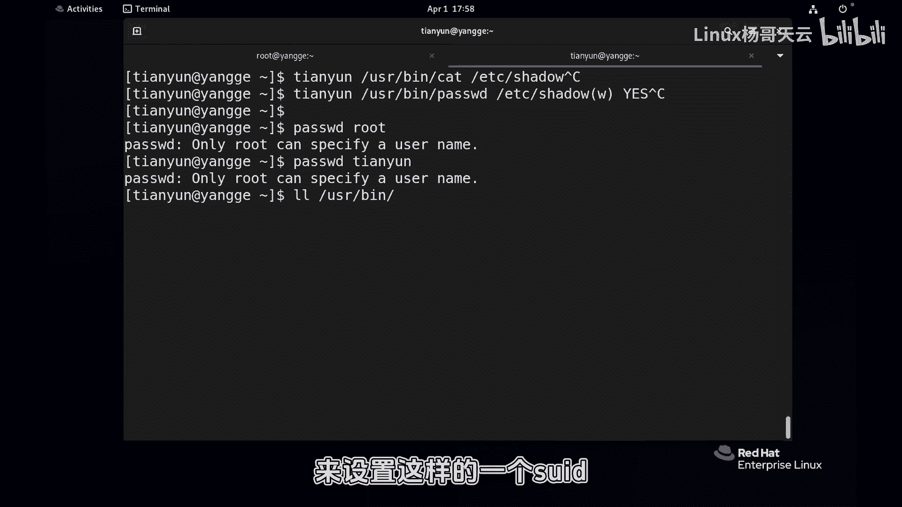
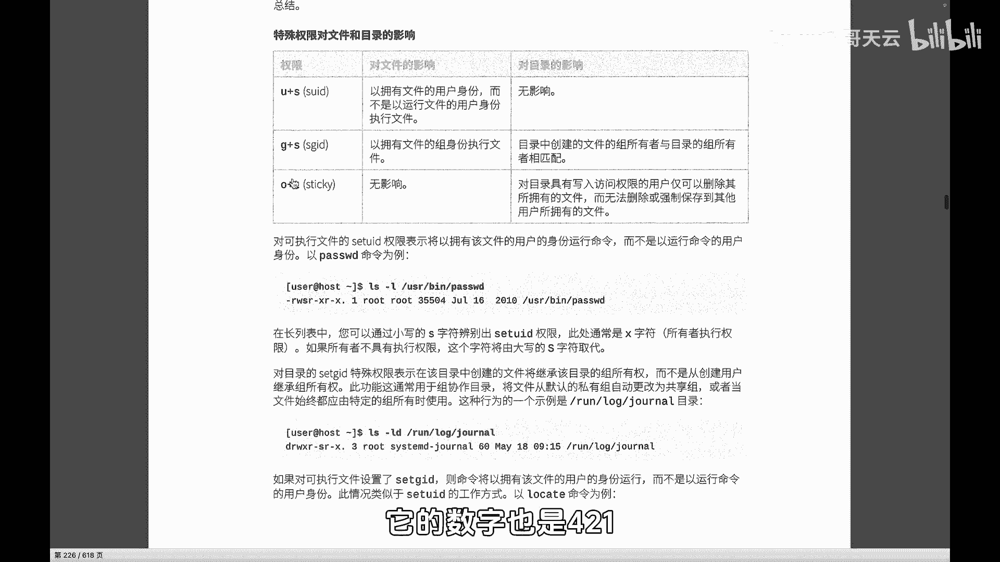
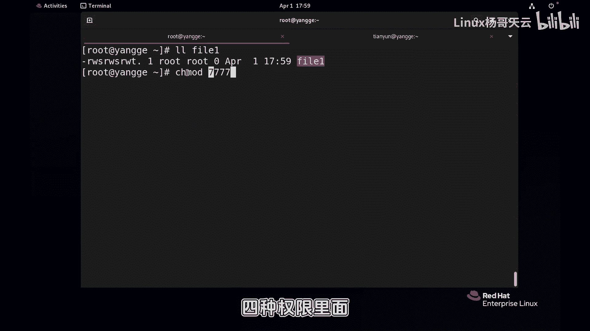
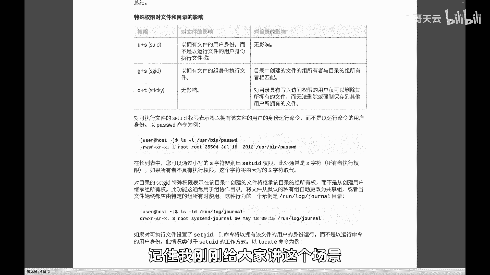

# Linux权限管理：P59：特殊权限SUID详解

## 概述
在本节课中，我们将要学习Linux文件系统中的一种特殊权限——SUID。我们将从一个具体的问题出发：为什么普通用户能够修改自己的密码，即使密码文件`/etc/shadow`对普通用户没有任何读写权限？通过分析这个现象，我们将深入理解SUID权限的工作原理、作用以及如何设置它。

---

## 问题引入：普通用户如何修改密码？

我们首先观察`/etc/shadow`文件。这个文件用于存储用户的加密密码，其安全等级非常高。

```bash
ls -l /etc/shadow
```

输出显示，该文件对普通用户没有任何权限（所有者`root`除外）。理论上，普通用户无法读取或修改此文件。



然而，当普通用户（例如用户`tianyun`）执行`passwd`命令更改自己的密码时，操作却成功了。这引出了一个核心矛盾：修改密码最终需要写入`/etc/shadow`文件，但普通用户并无此文件的写入权限。

这个现象是如何实现的？答案就在于我们今天要讲解的**特殊权限**。



---

## 认识特殊权限

Linux的文件权限并非只有我们常见的“所有者、所属组、其他人”这三类（对应`rwx`）。实际上，权限位共有四位。我们通常所说的`777`，完整表示应为`0777`，首位`0`即代表特殊权限位。

特殊权限主要有三种：
*   **SUID** (Set User ID)
*   **SGID** (Set Group ID)
*   **Sticky Bit** (粘滞位)

本节我们重点探讨**SUID**。

---

## SUID 权限的作用机制

为了理解SUID，我们先构建一个类比场景。

假设一个普通用户`tianyun`试图使用`cat`命令查看`/etc/shadow`文件：
```bash
# 以tianyun用户身份执行
cat /etc/shadow
```
结果会是“权限不足”。因为`cat`命令（工具）以执行者`tianyun`的身份运行，而`tianyun`对目标文件没有读取权限。

现在，我们改变一下“工具”。我们给`/usr/bin/cat`这个命令文件本身添加SUID权限：
```bash
# 需要root权限执行
chmod u+s /usr/bin/cat
ls -l /usr/bin/cat
```
你会看到，在文件所有者（`root`）的执行权限位`x`上，变成了`s`。

此时，再让用户`tianyun`执行`cat /etc/shadow`，操作**成功**了。



**核心原理**：
当一个可执行文件被设置了SUID权限后，**任何用户在执行此程序时，都将以该文件所有者的身份运行**，而非执行者自身的身份。



在上例中：
*   **用户**：`tianyun`（未改变）
*   **目标**：查看`/etc/shadow`（未改变）
*   **工具**：`/usr/bin/cat`（被赋予了SUID，变成了“尚方宝剑”）

因此，当`tianyun`执行带有SUID的`cat`命令时，程序实际上是以`root`的身份去读取`/etc/shadow`文件，故而成功。

---

## 回到 `passwd` 命令

理解了SUID机制，我们再来看`passwd`命令就一目了然了。

检查`/usr/bin/passwd`的权限：
```bash
ls -l /usr/bin/passwd
```
你会发现，它的所有者权限位正是`rws`（其中的`s`就是SUID标志）。

所以，当普通用户`tianyun`执行`passwd`时：
1.  他调用的是`/usr/bin/passwd`这个程序。
2.  由于该程序具有SUID权限，它是以文件所有者`root`的身份运行的。
3.  因此，程序获得了`root`的权限，从而能够向`/etc/shadow`文件写入新的密码信息。



**重要提示**：SUID权限非常强大，必须谨慎使用。例如，如果给`/usr/bin/rm`命令加上SUID，那么任何用户执行`rm`都将拥有`root`的删除权限，这可能导致灾难性后果。

---

## SUID 权限的设置与表示



SUID权限可以通过符号法或数字法进行设置。

**符号法**：
*   添加SUID：`chmod u+s 文件名`
*   移除SUID：`chmod u-s 文件名`

**数字法**：
特殊权限位可以用一个八进制数字表示，放在普通权限位（777）之前。
*   SUID 对应数字 **4**
*   SGID 对应数字 **2**
*   Sticky Bit 对应数字 **1**

例如，设置一个文件权限为`rwsr-xr-x`：
```bash
chmod 4755 文件名
```
这里的第一个数字`4`，就代表设置了SUID。

---



## 安全限制与总结



有同学可能会问：既然普通用户执行`passwd`时拥有了`root`权限，那他能否修改`root`用户的密码呢？



答案是否定的。系统对`passwd`命令做了逻辑限制：**普通用户只能修改自己的密码**。即使你拿着“尚方宝剑”（SUID），系统规则（命令内部的逻辑判断）也不允许你指向“皇帝”（`root`用户）。这是系统的一道重要安全防线。



**本节课总结**：
本节课我们一起学习了Linux中的SUID特殊权限。我们从一个实际现象出发，探讨了普通用户为何能修改密码。关键在于`/usr/bin/passwd`命令文件上设置的SUID位，它使得任何执行该程序的用户都能临时获得文件所有者（通常是`root`）的身份权限。SUID是一种强大的提权机制，常用于系统管理类工具（如`passwd`, `sudo`等），但使用时必须格外小心，避免引入安全风险。记住，SUID**只对可执行文件有效**，对目录没有影响。