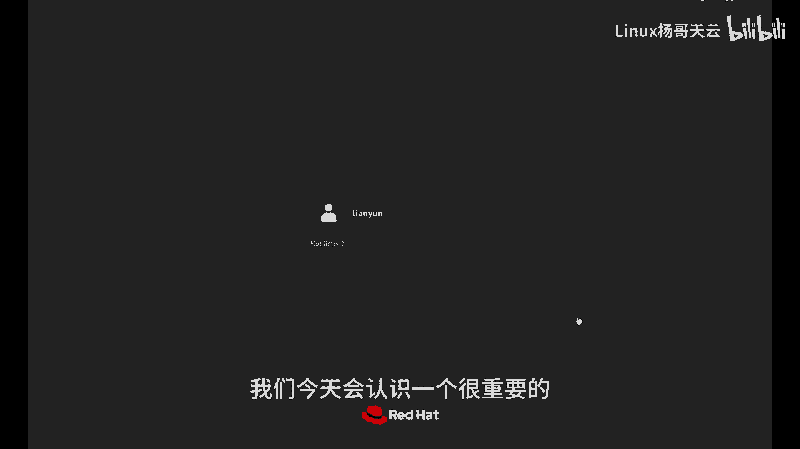
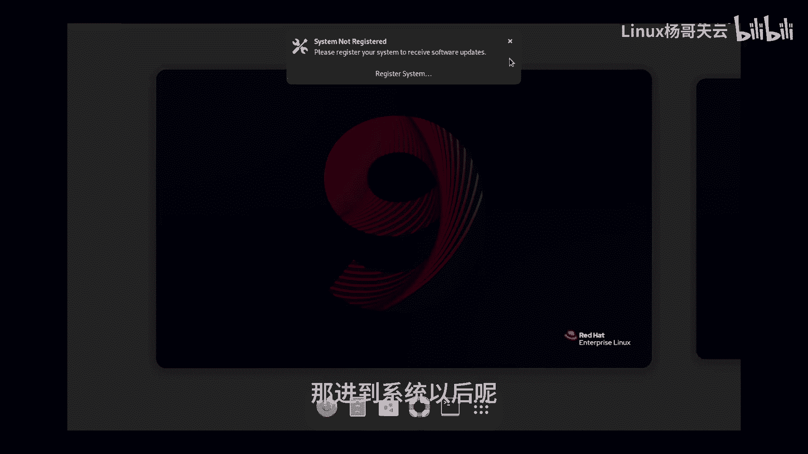
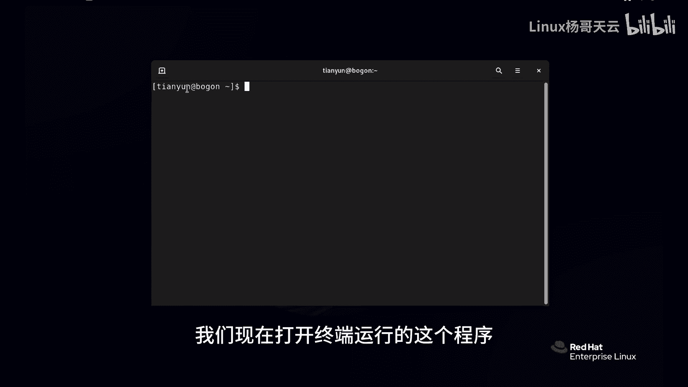
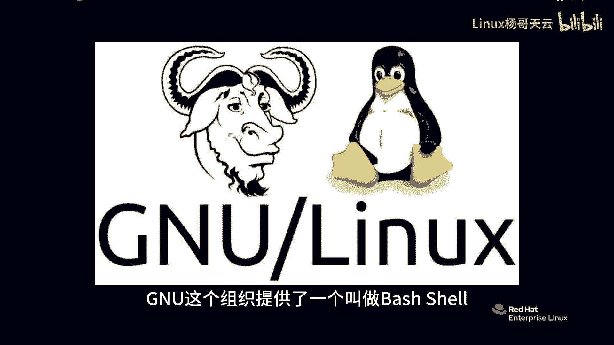
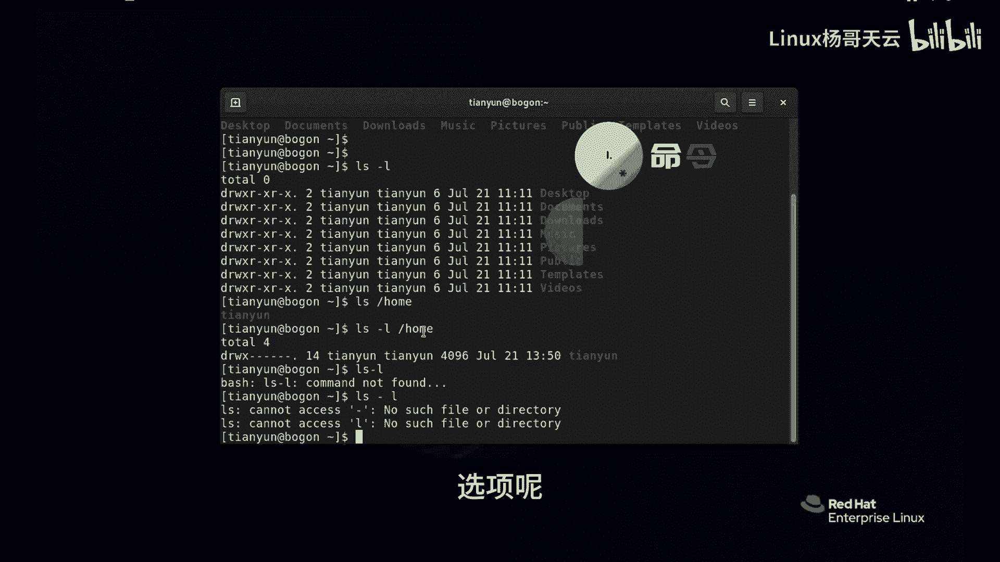

# Linux入门教程：P5：Linux命令的组成：命令、选项和参数 🖥️

在本节课中，我们将要学习Linux命令行的核心结构。理解命令、选项和参数是高效使用Shell的基础。

## 概述

我们将通过命令行对Linux系统进行基本管理。首先，我们需要认识一个重要的工具——Shell。

## 认识Shell

上一节我们提到了Shell，本节中我们来看看它的具体作用。

Shell是一个程序，它为我们提供了输入命令的接口。这个程序会将我们输入的命令传递给操作系统内核执行，并将结果输出到界面上。我们当前使用的Shell是GNU组织提供的**bash shell**，常简称为bash。

在bash shell的界面中，你会看到类似 `[用户名@主机名 当前目录]$` 的提示符。其中：
*   `$` 符号代表当前是普通用户级别（管理员用户显示为 `#`）。
*   `@` 前面是当前登录的用户名。
*   `@` 后面是主机名。
*   最后是当前所在的目录（`~` 是家目录的简写）。

例如，我们可以运行 `whoami` 命令来查看当前用户，运行 `date` 命令来查看当前时间。

## 命令的组成结构

在Shell中运行的命令通常由三部分组成：**命令**、**选项**和**参数**。

以下是这三部分的详细解释：

*   **命令**：这是主体，代表我们要执行的操作。例如，`ls` 命令用于列出目录内容。
*   **选项**：用于微调命令的行为，通常以单个短横线 `-` 或两个短横线 `--` 开头。例如，`ls -l` 中的 `-l` 选项表示以“长列表”格式显示详细信息。
*   **参数**：这是命令作用的对象，通常是文件或目录的路径。例如，`ls /home` 中的 `/home` 就是参数，表示要查看 `/home` 目录的内容。

一个完整的命令示例是 `ls -l /home`，它结合了命令、选项和参数。

> **重要规则**：命令、选项和参数之间必须用**空格**隔开。例如，`ls -l` 是正确的，而 `ls-l` 会被Shell认为是一个不存在的命令名，从而导致错误。

## 总结

本节课中我们一起学习了Linux命令的基本组成。我们认识了Shell作为命令解释器的作用，并详细拆解了命令的三个核心部分：**命令**是操作主体，**选项**用于调整行为，**参数**是作用对象。牢记它们之间的空格分隔规则，是正确使用命令行工具的第一步。