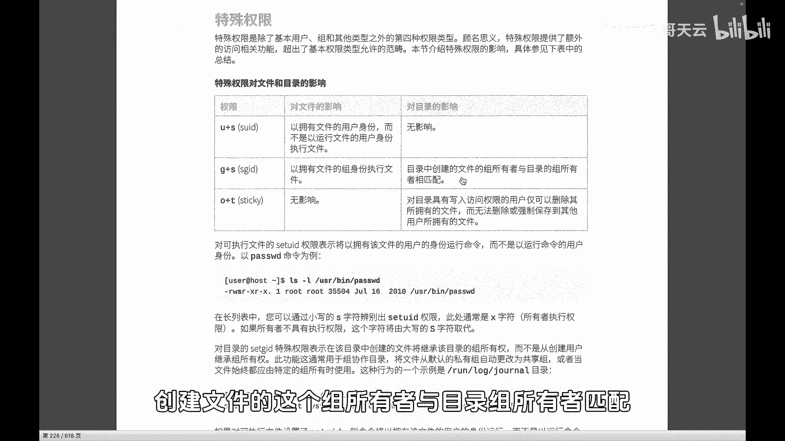
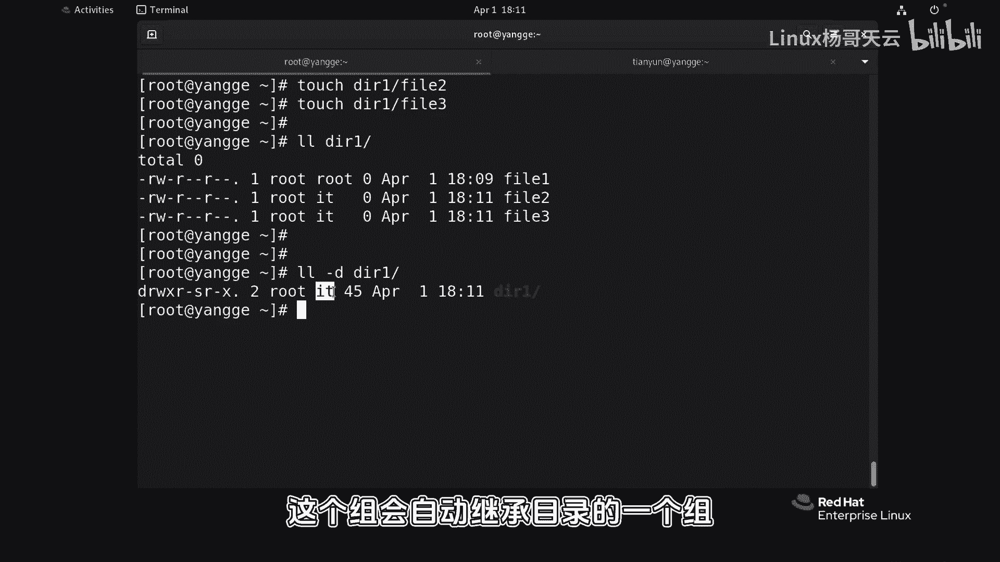
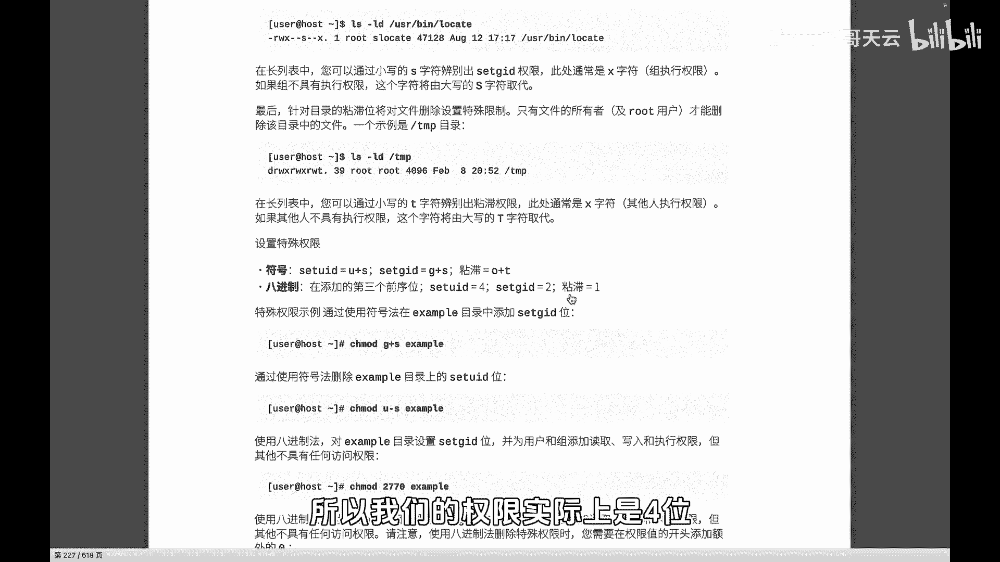

# Linux权限管理：P60：SGID权限详解

## 概述
在本节课中，我们将要学习Linux系统中的另一个特殊权限——SGID。我们将了解SGID权限的含义、它与SUID的区别、它的主要应用场景，以及如何设置和查看SGID权限。

上一节我们介绍了SUID权限，它主要作用于可执行文件，允许用户在执行文件时暂时获得文件所有者的权限。本节中我们来看看SGID权限，它同样是一种提升权限的机制，但作用对象和场景有所不同。

## SGID权限的核心概念
SGID，即“Set Group ID”，其核心作用是：**当一个目录被设置了SGID权限后，任何用户在此目录下创建的新文件或子目录，其所属组将自动继承该目录的所属组，而非创建者自身的主要组。**

这可以通过一个简单的公式来理解：
*   **未设置SGID的目录**：`新文件的所属组 = 文件创建者的主要组`
*   **设置了SGID的目录**：`新文件的所属组 = 所在目录的所属组`

## 场景演示：SGID如何工作
为了更好地理解，我们通过一个实际操作场景来演示SGID的效果。

首先，我们创建一个名为 `dir` 的目录，并将其所属组修改为 `it` 组。

```bash
mkdir dir
chgrp it dir
```

此时，我们在 `dir` 目录下创建一个文件 `file1`。



```bash
touch dir/file1
```

查看 `dir/file1` 的详细信息，会发现它的所属组是创建者（例如 `root`）的主要组，而不是 `it` 组。这说明新文件没有“继承”其父目录的组属性。

接下来，我们为 `dir` 目录设置SGID权限。设置特殊权限的符号法是 `g+s`。

```bash
chmod g+s dir
```

设置完成后，查看 `dir` 目录的权限，会发现其所属组的执行位（`x`）被替换成了 `s`。这表示SGID权限已生效。

现在，我们再次在 `dir` 目录下创建新文件 `file2` 和 `file3`。

```bash
touch dir/file2 dir/file3
```

最后，我们对比查看 `dir` 目录下的所有文件。

```bash
ls -l dir/
```

观察结果，你会发现：
*   `file1` 的所属组是创建者的主要组（因为在创建它时，目录尚未设置SGID）。
*   `file2` 和 `file3` 的所属组自动变成了 `it` 组（与目录 `dir` 的所属组一致）。

这个实验清晰地展示了SGID权限的作用：**它确保了在特定目录下协作时，所有新创建的文件都归属于同一个组，从而方便了组内成员的共享与访问。**

## SGID与SUID的对比及应用场景
以下是SGID与SUID的主要区别和典型应用场景：

*   **作用对象**：
    *   **SUID**：主要针对**可执行文件**。
    *   **SGID**：主要针对**目录**（对文件也有作用，但场景较少）。

*   **核心功能**：
    *   **SUID**：用户执行文件时，临时获得文件**所有者**的权限。
    *   **SGID**：在目录下创建文件时，新文件自动继承目录的**所属组**。

*   **常见应用**：
    *   **SUID**：系统命令如 `/usr/bin/passwd`，允许普通用户修改自己的密码（需要写入 `/etc/shadow` 的权限）。
    *   **SGID**：用于团队协作的共享目录。例如，一个项目组共享一个目录，设置SGID后，无论哪个成员创建文件，都属于项目组，组内其他成员都能方便地访问或修改。

## 权限的数字表示法
我们之前使用 `u+s`、`g+s` 这样的符号法设置特殊权限。它们同样可以用数字表示法设置。

Linux文件权限实际上是一个4位的八进制数：
*   第1位：代表特殊权限（SUID, SGID, Sticky Bit）。
*   后3位：代表所有者、所属组、其他人的标准权限（rwx）。

特殊权限对应的数字是：
*   **SUID** = 4
*   **SGID** = 2
*   **Sticky Bit** = 1

因此，要为目录设置SGID权限（假设标准权限是755），可以使用以下命令：

```bash
chmod 2755 dir
```
这里的 `2` 就代表设置SGID权限。



## 总结
本节课中我们一起学习了Linux的SGID权限。



我们首先明确了SGID权限的定义：当目录拥有此权限时，其下创建的新文件将自动继承目录的所属组。接着，通过一个完整的实验演示，我们直观地看到了设置SGID前后新文件所属组的变化。然后，我们对比了SGID与SUID在作用对象和核心功能上的区别，并列举了它们各自的应用场景。最后，我们介绍了使用数字表示法（如 `2755`）来设置包含SGID在内的完整权限。

理解SGID对于管理需要团队协作的共享目录至关重要，它能有效简化权限管理，确保组内文件的统一归属。下一节，我们将介绍最后一个特殊权限——Sticky Bit（粘滞位）。