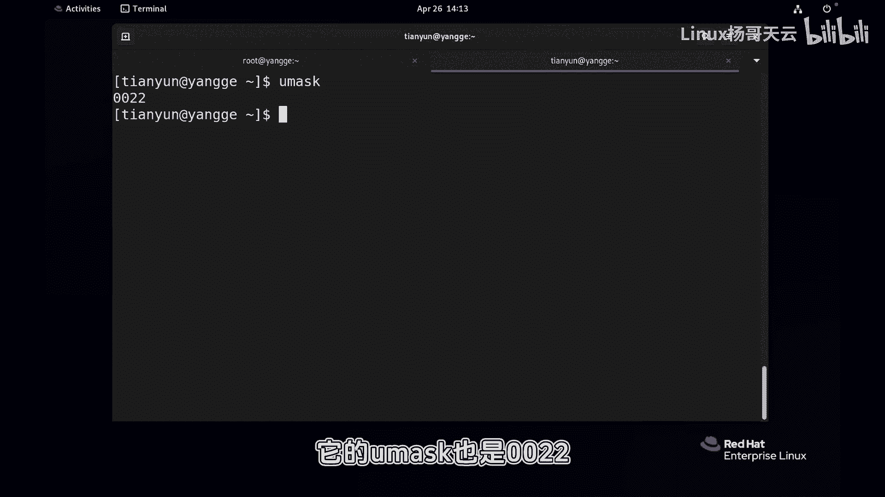
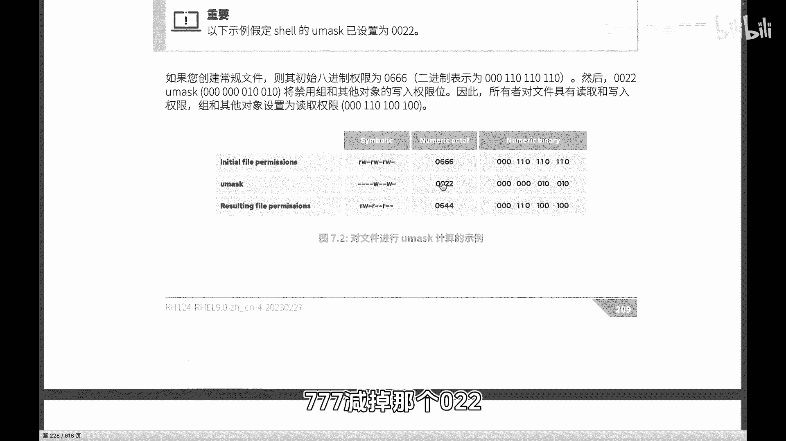
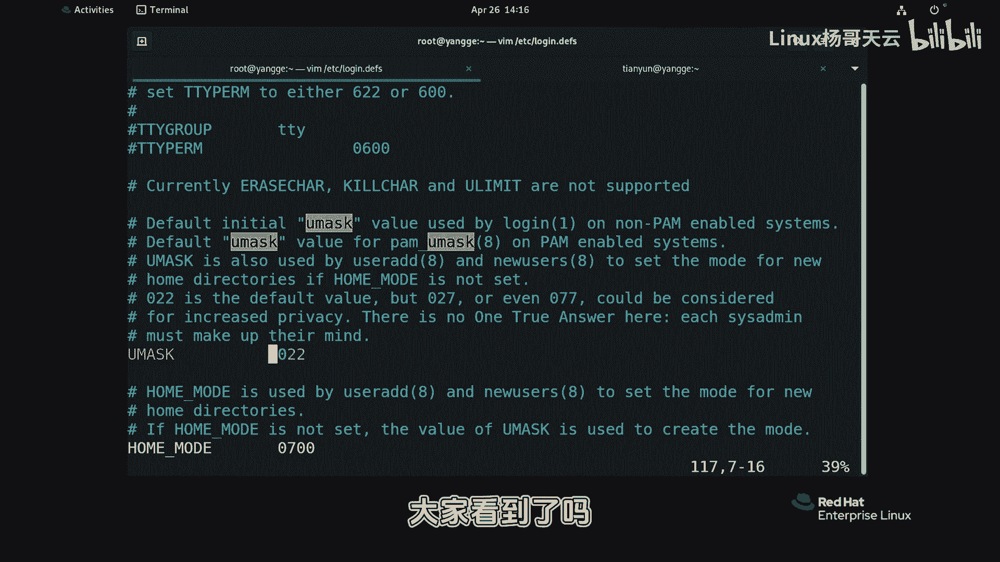
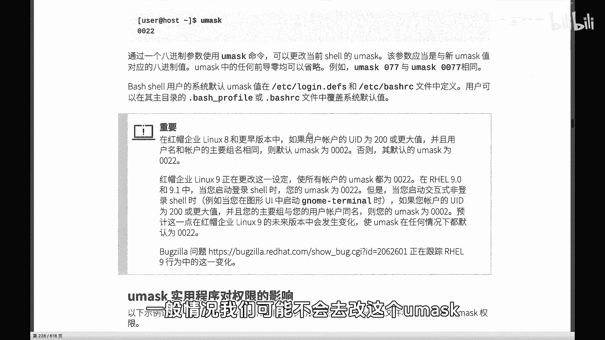
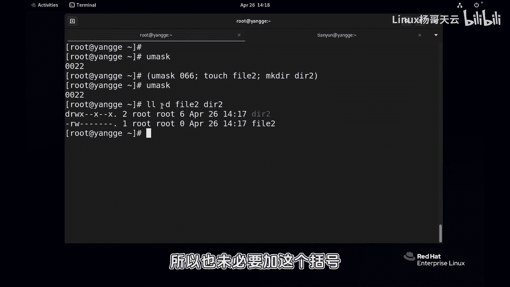

# Linux入门与RHCE认证：P64：是谁决定了新建文件的默认权限 - umask

## 概述
在本节课中，我们将学习Linux系统中一个重要的概念——`umask`。它决定了我们创建新文件或目录时的默认权限。理解`umask`的工作原理，对于管理文件系统安全和权限至关重要。

## 默认权限现象
首先，我们来观察一个常见的现象。在Linux系统中，无论是管理员还是普通用户，新建一个文件时，其默认权限通常是`644`。新建一个目录时，默认权限通常是`755`。

例如，创建一个文件：
```bash
touch file1.txt
ls -l file1.txt
```
输出结果中，权限部分显示为 `-rw-r--r--`，对应的数字权限是 `644`。

再创建一个目录：
```bash
mkdir dir1
ls -ld dir1
```
输出结果中，权限部分显示为 `drwxr-xr-x`，对应的数字权限是 `755`。

目录比文件多了一个执行权限`x`。对于文件而言，执行权限意味着可以运行，具有一定风险；而对于目录而言，执行权限是进入该目录所必需的。

## 核心概念：umask
那么，是什么决定了这些默认权限呢？答案就是 `umask`（用户文件创建掩码）。

我们可以通过命令查看当前用户的 `umask` 值：
```bash
umask
```
对于管理员（root）用户，输出通常是 `0022` 或 `022`。对于普通用户，在较新的系统版本（如RHEL 9）中，通常也是 `0022`。这与早期版本（如RHEL 8）中普通用户默认为 `0002` 有所不同。



`umask` 是一个八进制数，它像一张“面具”，会“遮盖”掉一部分权限，从而得出新文件或目录的最终默认权限。

## umask 的计算方式
要理解 `umask` 如何工作，需要知道文件和目录的“初始最高权限”：
*   文件的初始最高权限是 `666` (`rw-rw-rw-`)。
*   目录的初始最高权限是 `777` (`rwxrwxrwx`)。

`umask` 值表示需要从初始权限中“减去”（即屏蔽掉）的权限。计算时，我们使用按位“与”和非运算，但可以简单理解为“初始权限”减去“umask值”得到“最终权限”。

**计算公式（便于理解）**：
```
文件最终默认权限 = 666 - umask
目录最终默认权限 = 777 - umask
```
**注意**：这里的减法是针对八进制权限位的逻辑减法，并非直接的数学减法。`umask`的每一位数字代表要屏蔽掉的权限（读`r`=4，写`w`=2，执行`x`=1）。

**举例说明**：
当前 `umask` 为 `022`：
*   创建文件：`666 - 022 = 644`。即文件所有者有读写权限(`6`)，所属组和其他用户只有读权限(`4`)。
*   创建目录：`777 - 022 = 755`。即目录所有者有全部权限(`7`)，所属组和其他用户有读和执行权限(`5`)。

`umask` 的 `022` 意味着屏蔽掉“所属组”和“其他用户”的“写”权限(`w`，值为2)。



## umask 的设置位置
`umask` 的默认值通常设置在全局配置文件中。

以下是 `umask` 常见的设置位置：
*   `/etc/profile`：系统全局配置文件，为所有用户设置初始环境。
*   `/etc/bashrc` 或 `/etc/bash.bashrc`：系统级的bash shell配置文件。
*   `~/.bash_profile` 或 `~/.bashrc`：用户个人的shell配置文件。

例如，在 `/etc/profile` 文件中，你可能会找到类似这样的行：
```bash
umask 022
```
这行代码为所有登录用户设置了默认的 `umask` 值。





## 临时修改 umask
有时，我们可能需要为特定的操作临时设置不同的默认权限。这时可以在子Shell中临时修改 `umask`。

例如，我们希望运行一个脚本，该脚本创建的文件只允许所有者读写，而禁止所有其他用户的任何访问。这意味着我们需要屏蔽掉“所属组”和“其他用户”的所有权限（读`r`=4，写`w`=2，执行`x`=1，合计为7）。

可以这样做：
```bash
(umask 077; touch secret_file.txt; mkdir secret_dir)
```
这条命令的含义是：
1.  括号 `()` 会开启一个子Shell。
2.  在子Shell中，先将 `umask` 临时设置为 `077`。
3.  然后执行 `touch` 和 `mkdir` 命令。
4.  命令执行完毕后，子Shell结束，父Shell中的 `umask` 值保持不变。

现在检查创建的文件和目录：
```bash
ls -ld secret_file.txt secret_dir
```
你会发现 `secret_file.txt` 的权限是 `600` (`rw-------`)，`secret_dir` 的权限是 `700` (`rwx------`)。这正是因为 `umask 077` 屏蔽了“所属组”和“其他用户”的所有权限。

这种方法在编写脚本时非常有用，可以确保脚本创建的文件具有特定的安全权限。

## 总结
本节课我们一起学习了 `umask` 的概念和作用。

*   `umask`（用户文件创建掩码）决定了新建文件和目录的默认权限。
*   文件的初始权限基数为 `666`，目录的初始权限基数为 `777`。
*   `umask` 值通过“屏蔽”特定权限位来计算最终默认权限。公式可理解为：`默认权限 = 基数 - umask`。
*   `umask` 的默认值在 `/etc/profile` 等系统配置文件中设置。
*   可以使用 `(umask XXX; command)` 的语法在子Shell中临时修改 `umask`，以控制特定命令创建文件的权限。



理解并合理运用 `umask`，是进行Linux系统文件安全管理和自动化脚本编写的重要基础。