Linux入门与红帽认证：65：Linux文件权限总结篇 🔒

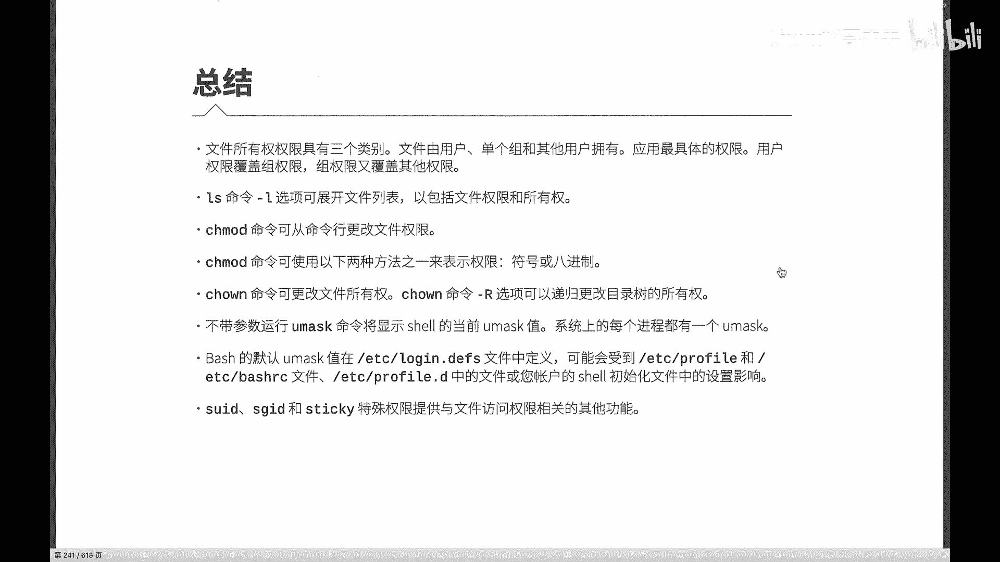

在本节课中，我们将对Linux文件权限这一重要章节进行总结，回顾核心概念、命令及特殊权限，帮助你巩固知识体系。

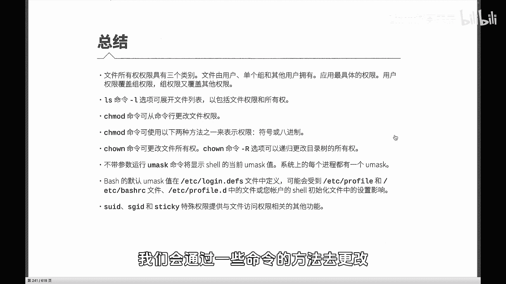

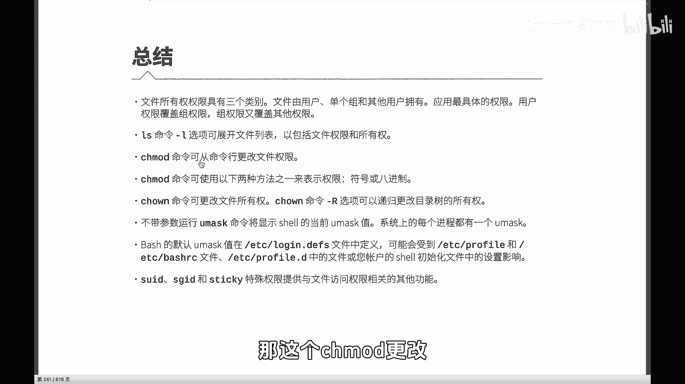

上一节我们介绍了文件权限的查看与修改，本节中我们来看看权限管理的完整总结。

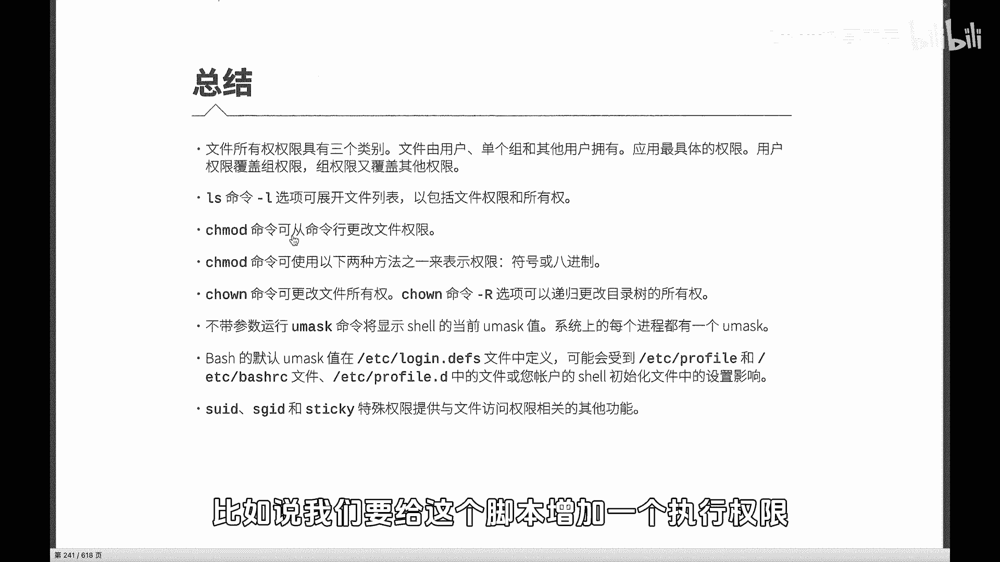

### 查看文件权限
我们可以使用 `ls -l` 命令查看文件的详细信息，其中包括文件的权限信息。

### 修改文件权限
文件权限可以通过 `chmod` 命令进行更改。`chmod` 命令有两种主要的权限设置方法。

以下是两种方法的说明：
*   **符号法**：使用 `u`（所有者）、`g`（所属组）、`o`（其他人）、`a`（所有人）配合 `+`（增加）、`-`（移除）、`=`（设置）和 `r`（读）、`w`（写）、`x`（执行）符号进行操作。例如，给一个脚本增加执行权限的命令是 `chmod +x script.sh`。
*   **数字法**：使用三位八进制数字表示权限，分别对应所有者、所属组和其他人。每位数字是 `r`（4）、`w`（2）、`x`（1）权限值的和。例如，权限 `755` 表示所有者拥有读、写、执行权限（4+2+1=7），而所属组和其他人拥有读和执行权限（4+1=5）。

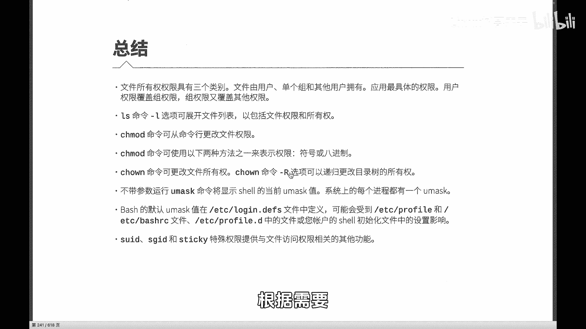

### 更改文件所有者和属组
我们可能需要更改文件的所有者或所属组，相关命令如下。

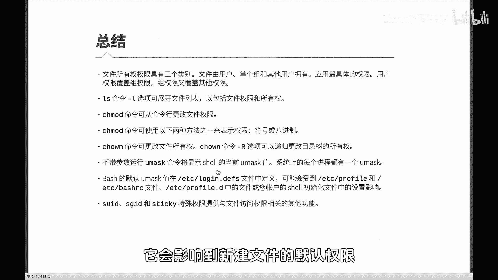

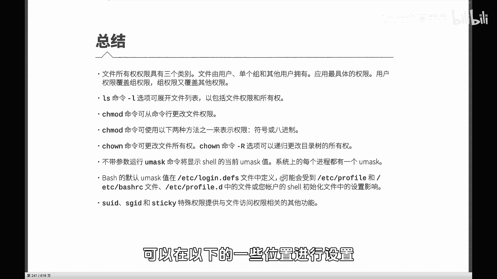

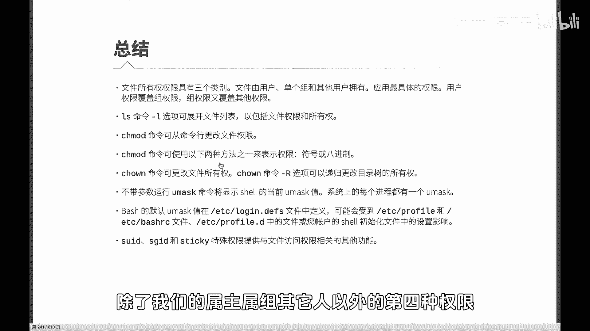

以下是相关的命令：
*   `chown`：用于更改文件的所有者和所属组。命令格式为 `chown [新所有者]:[新属组] 文件名`。
*   `chgrp`：专门用于更改文件的所属组。命令格式为 `chgrp [新属组] 文件名`。

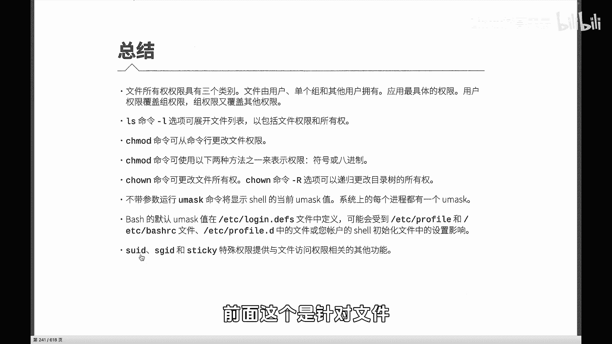

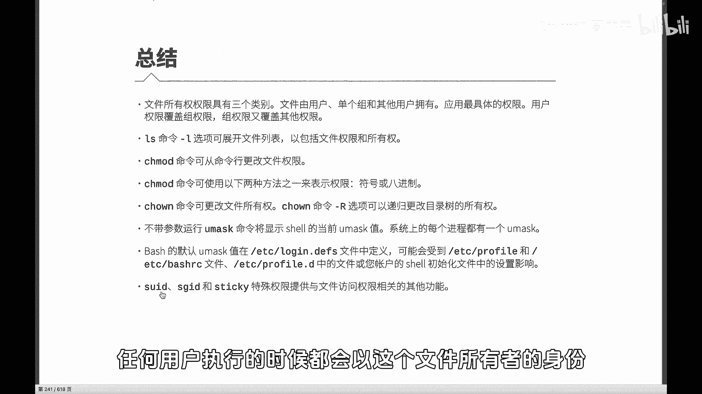

在对目录进行权限或属组修改时，可以加上 `-R` 选项以实现递归操作，即同时更改目录及其内部所有文件和子目录的权限。此选项仅对目录有效。

### 默认权限与特殊权限
除了基本权限，系统还有新建文件的默认权限设置（由umask值控制）和三种重要的特殊权限。

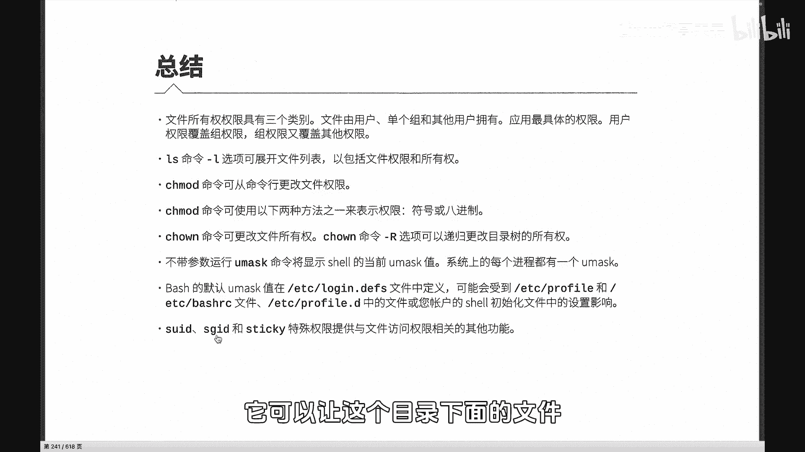

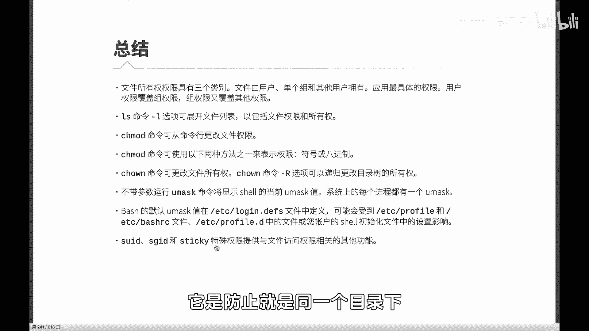

以下是三种特殊权限的说明：
*   **SUID（Set User ID）**：当设置在可执行文件上时，任何用户执行该文件期间，都会暂时拥有文件所有者的权限。其数字表示为 **4**，符号表示为 `u+s`。
*   **SGID（Set Group ID）**：
    *   当设置在目录上时，在该目录下新建的文件或子目录，会自动继承该目录的所属组。
    *   当设置在可执行文件上时，任何用户执行该文件期间，会暂时拥有文件所属组的权限。
    其数字表示为 **2**，符号表示为 `g+s`。
*   **Sticky Bit（粘滞位）**：通常设置在公共目录（如 `/tmp`）上。它允许所有用户在该目录中创建文件，但每个用户只能删除或重命名自己创建的文件，无法删除他人的文件。其数字表示为 **1**，符号表示为 `o+t`。

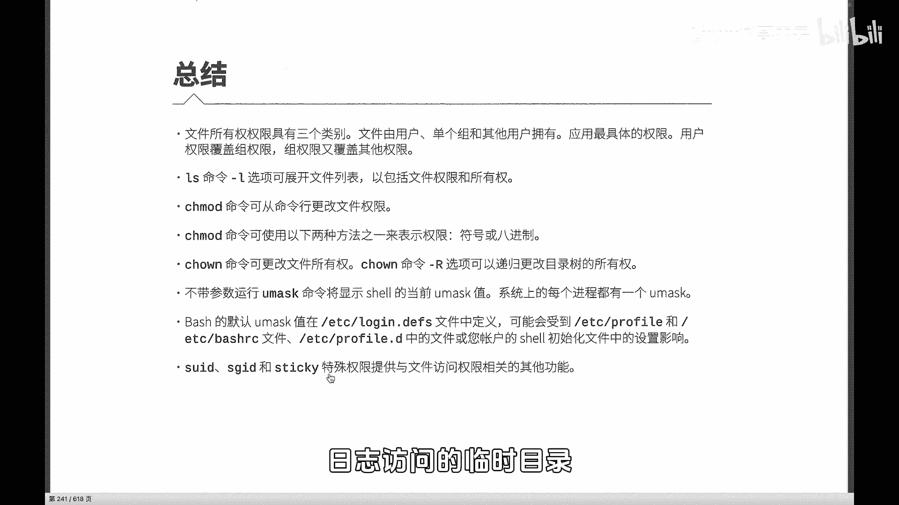

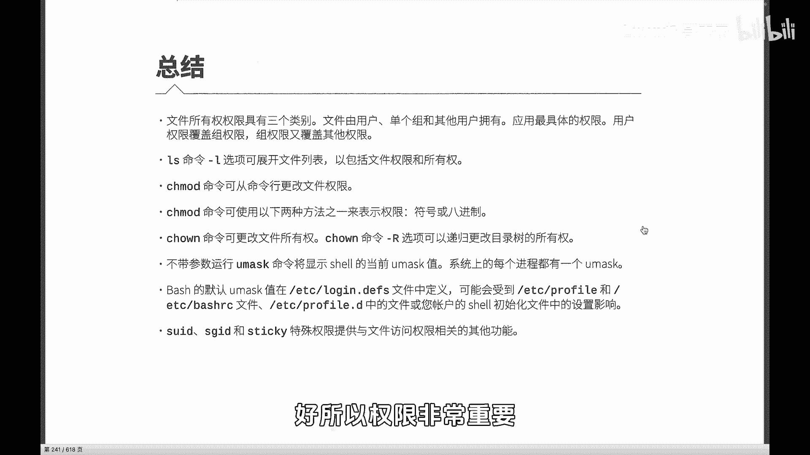

本节课中我们一起学习了Linux文件权限的核心知识，包括如何查看权限、使用 `chmod` 的两种方法修改权限、使用 `chown` 和 `chgrp` 更改所有者和属组，以及SUID、SGID、Sticky Bit这三种特殊权限的作用。文件权限是Linux系统安全和管理的基础，请务必加强练习，以便在后续的学习和工作中熟练运用。