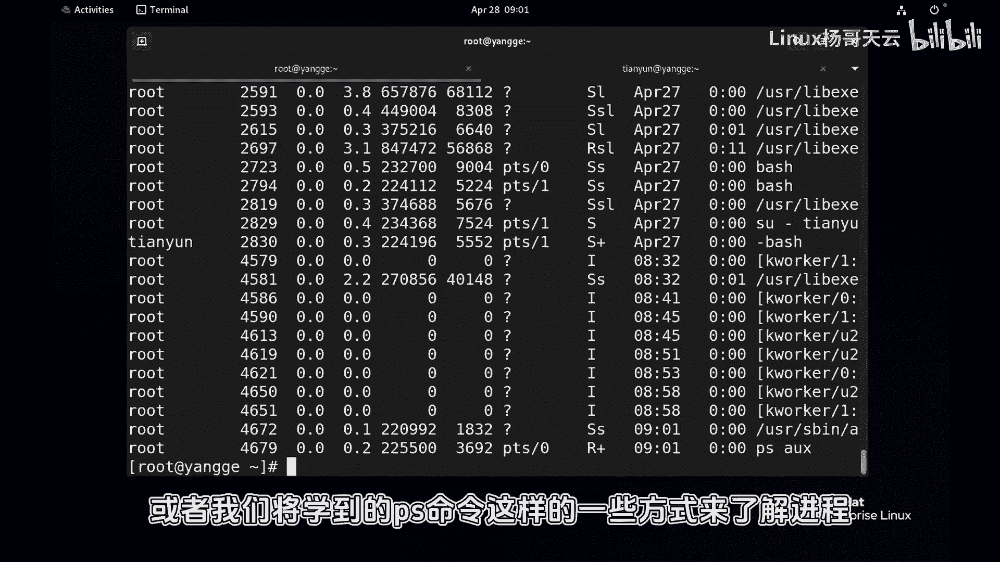
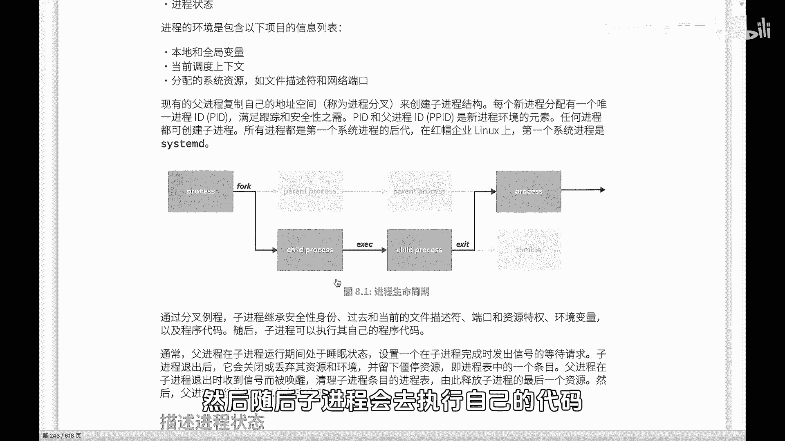
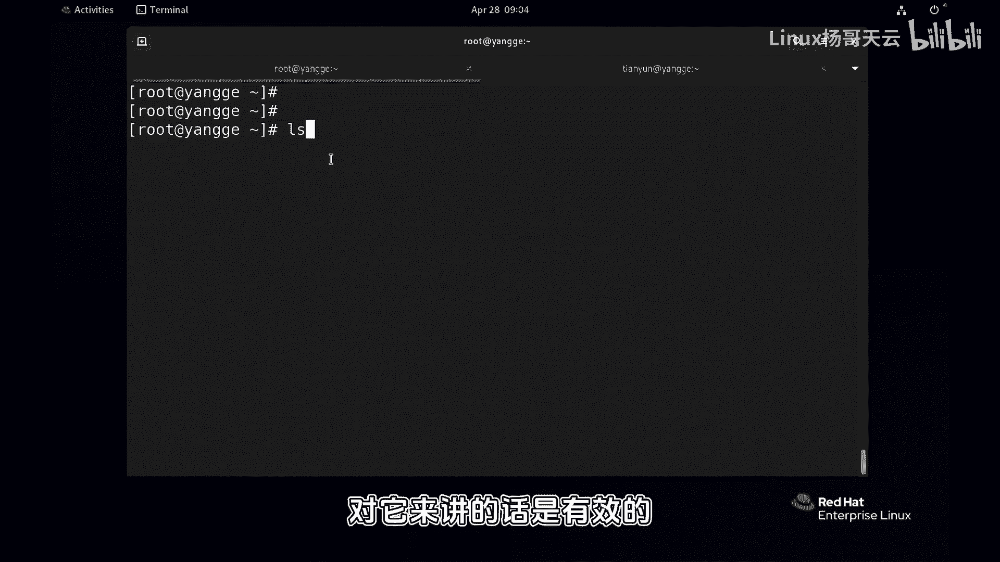
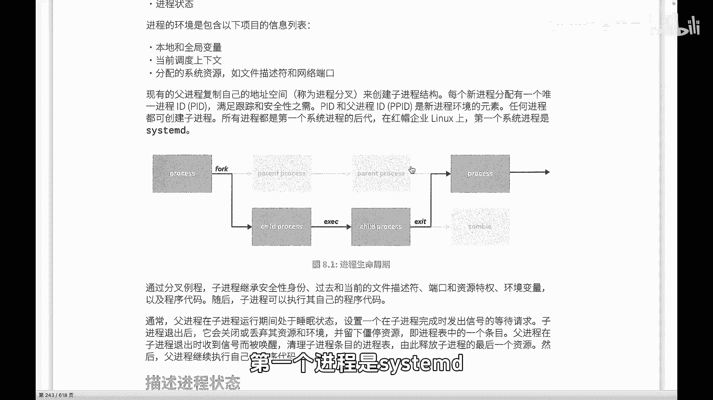
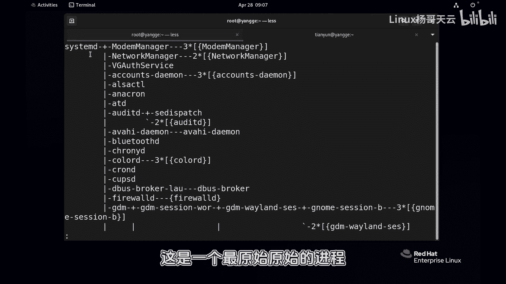
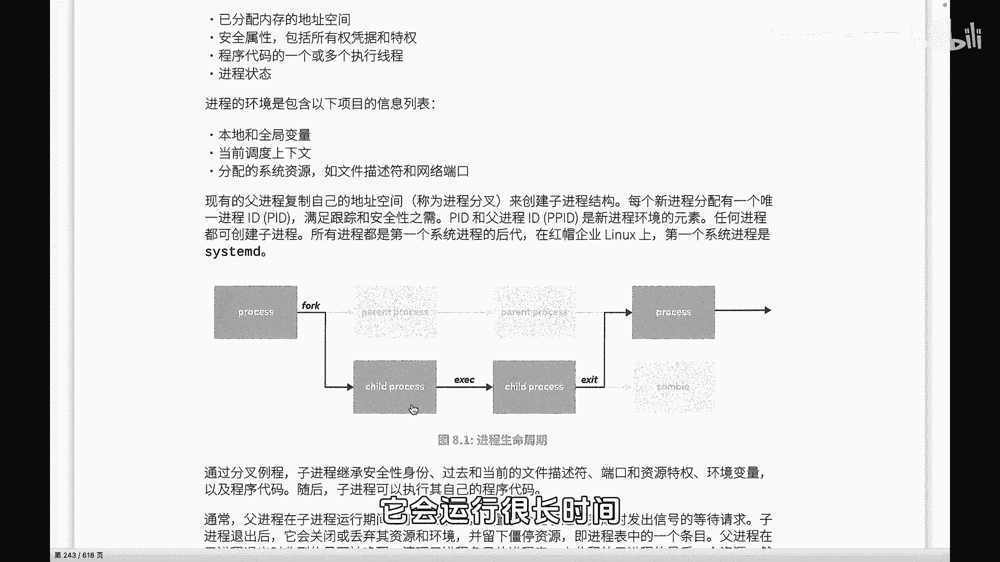

# Linux进程管理：P66：进程的状态

在本节课中，我们将要学习Linux系统中进程的基本概念与生命周期。理解进程如何创建、运行和结束，是进行后续进程管理操作的基础。

## 概述：什么是进程

进程是一个程序运行的过程，也可以称为运行中的实例。有些程序运行时间非常短，例如执行一条`ls`命令，其对应的进程会迅速启动并结束。但有些进程运行时间很长，例如系统守护进程或像MySQL、Nginx这样的服务进程。这些长期运行的进程，以及运行中的程序，都需要我们进行查看和管理。

## 进程的基本信息

我们可以使用`top`命令查看当前系统中的进程状态。该命令会显示许多信息，例如进程总数、运行状态、以及每个进程的详细信息。

以下是`top`命令可能显示的部分关键信息：
*   **进程ID (PID)**：每个进程的唯一标识符。
*   **用户 (USER)**：运行该进程的用户身份。
*   **优先级 (PR/NI)**：进程的优先级，影响CPU调度。
*   **CPU使用率 (%CPU)**：进程占用CPU时间的百分比。
*   **内存使用率 (%MEM)**：进程占用物理内存的百分比。



通过观察这些信息，我们可以判断哪些进程消耗了过多的CPU或内存资源，从而进行相应的管理。这在排查系统性能问题或识别恶意进程时非常有用。

上一节我们介绍了如何查看进程，本节中我们来看看进程管理的更深层基础——进程的生命周期。

## 进程的生命周期

进程管理不仅仅是查看状态，还包括向进程发送信号（例如重启、结束）等操作。在深入学习管理命令前，我们需要了解进程的一些核心概念。

### 进程的创建：fork（分叉）

每个进程都由其父进程创建。创建过程主要通过 **`fork()`** 系统调用实现。

其基本模型如下：
1.  **父进程复制自身**：父进程调用`fork()`，复制自己的地址空间、环境变量、文件描述符等资源，创建一个几乎完全相同的副本，这个副本就是**子进程**。
2.  **分配唯一PID**：系统为新建的子进程分配一个唯一的**进程ID (PID)**，用于跟踪和管理进程。
3.  **继承资源**：子进程会继承父进程的安全身份、打开的文件、网络端口和资源环境。





**代码示例：**
在C语言中，创建进程的典型代码如下：
```c
pid_t pid = fork(); // 调用fork()创建子进程
if (pid == 0) {
    // 这里是子进程执行的代码
    execvp(“ls”, args); // 例如，执行ls命令
} else if (pid > 0) {
    // 这里是父进程执行的代码
    wait(NULL); // 等待子进程结束
}
```

### 进程的运行与结束

创建完成后，子进程开始执行自己的代码（例如，通过`exec()`系列函数加载新的程序，如`ls`）。此时，父进程通常会进入睡眠状态，等待子进程结束。

子进程执行完毕后，其生命周期进入尾声：
1.  **子进程终止**：子进程代码执行结束，关闭或释放所有使用的资源（如内存、文件句柄），但它在系统进程表中仍保留一个条目，此时进程变为 **“僵尸状态 (Zombie)”**。
2.  **通知父进程**：处于僵尸状态的子进程会向父进程发送一个 **`SIGCHLD`** 信号，通知父进程自己已经终止。
3.  **父进程回收**：父进程被唤醒，接收到`SIGCHLD`信号后，调用 **`wait()`** 或 **`waitpid()`** 系统调用，读取子进程的退出状态，并清理进程表中子进程的条目。至此，子进程被完全销毁，所有资源得到释放。
4.  **父进程继续**：父进程完成清理工作后，继续执行自己的后续代码。

**核心关系总结：**
*   所有进程都由父进程创建（通过`fork`）。
*   子进程首先继承父进程的上下文，然后执行自己的代码。
*   子进程终止后，必须由父进程进行回收（`wait`），否则会长期滞留为僵尸进程。
*   如果父进程先于子进程结束，子进程会成为“孤儿进程”，并被`init`进程（或`systemd`）接管和回收。

### 系统的第一个进程



在Linux系统中，所有进程的祖先是第一个启动的进程。在旧式系统中是 **`init`** 进程（PID 为 1），在现代系统中（如RHEL 7/8）则是 **`systemd`** 进程。我们可以使用`ps`命令验证这一点。



**命令示例：**
```bash
ps -ef | head -2
```
输出通常会显示`systemd`（或`init`）作为PID 1的进程，它是所有用户空间进程的最终父进程。

## 总结

本节课中我们一起学习了Linux进程的核心概念：
1.  **进程定义**：程序的一次动态执行过程。
2.  **进程信息**：使用`top`等工具可以查看进程的PID、用户、资源占用等关键信息。
3.  **生命周期**：进程通过`fork`创建，子进程继承父进程资源后执行自身代码，结束后通过`wait`由父进程回收，避免僵尸进程。
4.  **进程树**：系统中所有进程形成一棵树状结构，根节点是`init`或`systemd`进程。



理解进程从创建、运行到回收的完整流程，是掌握进程管理、信号发送和系统调试的重要基础。在接下来的课程中，我们将学习具体的进程管理命令。