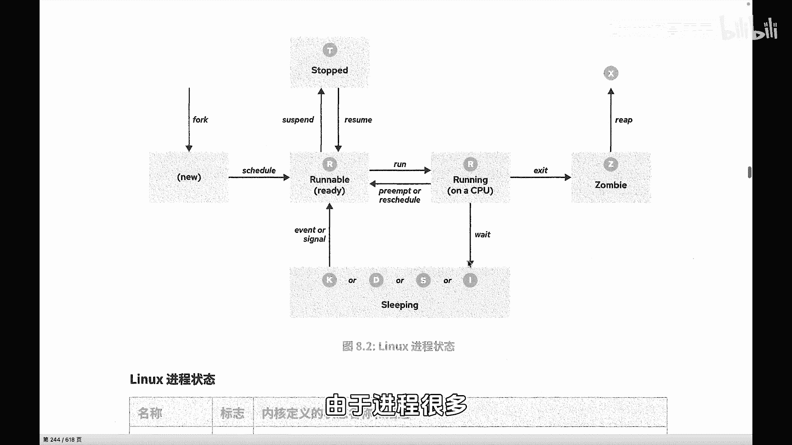
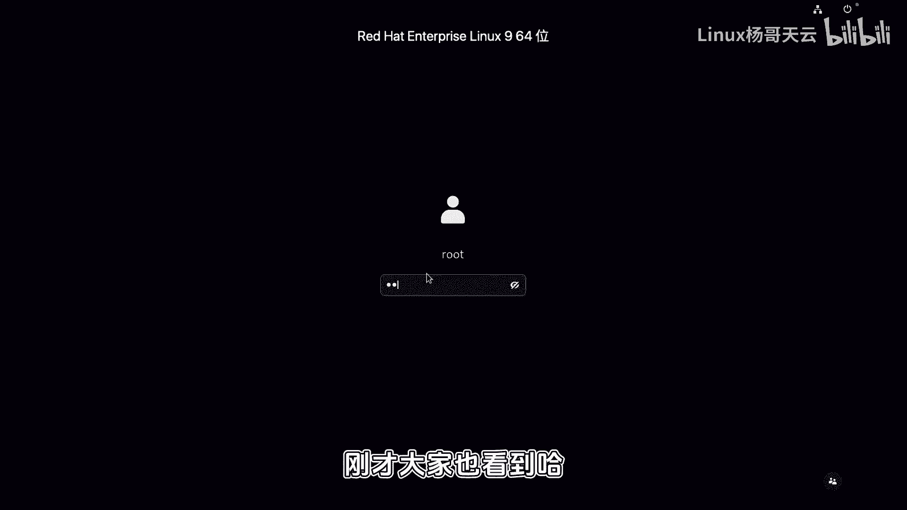
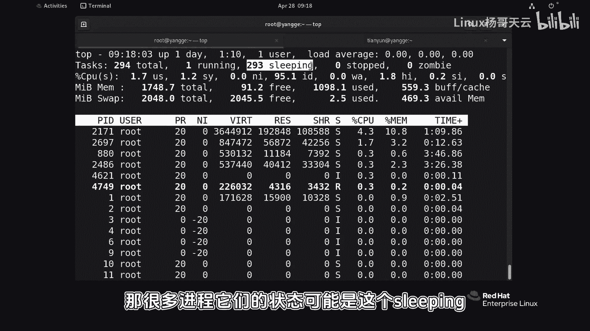
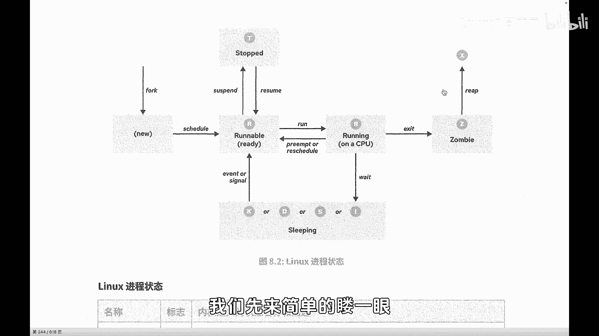
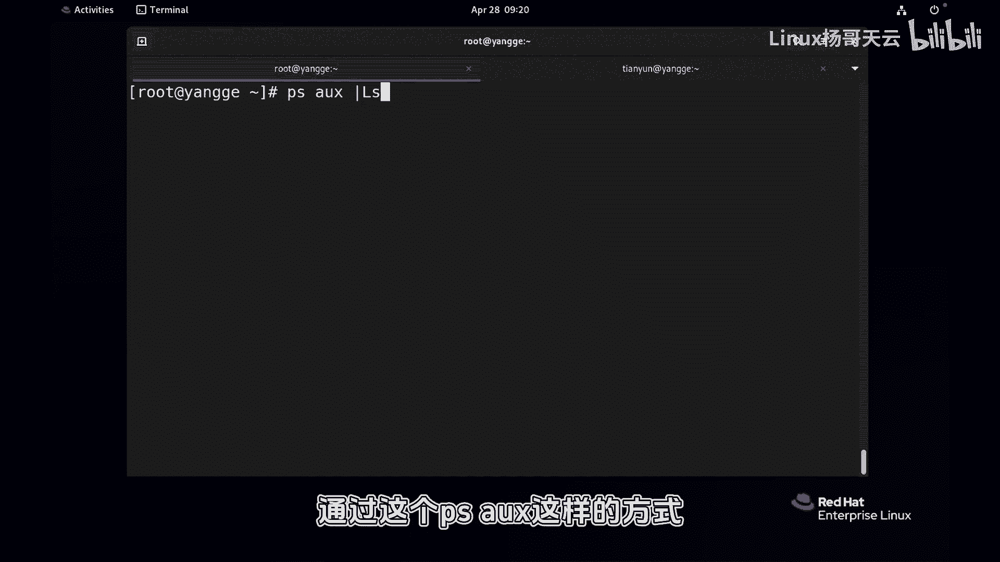
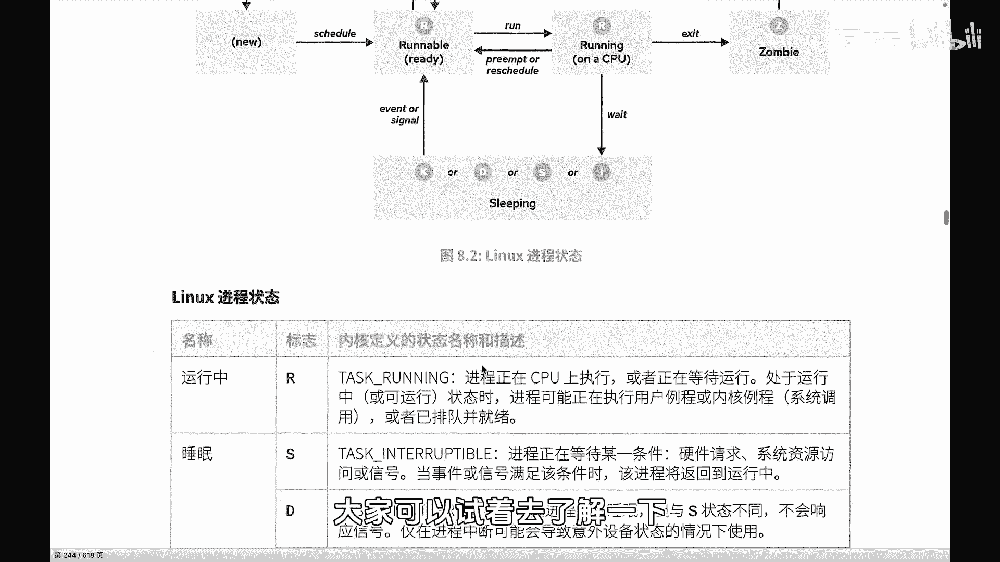

# Linux入门教程：67：进程的生命周期（上）

在本节课中，我们将要学习进程在操作系统中的不同状态，理解为什么不是所有进程都能同时运行，以及进程状态之间是如何转换的。这对于理解Linux系统如何管理多个任务至关重要。

## 进程状态概述

上一节我们介绍了进程的基本概念，本节中我们来看看进程在运行时的具体状态。操作系统是多任务系统，这意味着它可以同时处理多个任务。然而，CPU在同一时间能执行的任务数量是有限的。

例如，一个CPU（或一个逻辑CPU核心）在同一时间只能处理一个任务。因此，当多个进程都需要CPU来执行运算时，它们必须排队等待。并非所有进程都能在同一时刻处于运行状态。

## 进程状态图解

由于进程数量众多（系统中通常有数百个进程），它们的状态各不相同。以下图片描述了进程可能处于的各种状态。许多进程可能处于睡眠（sleeping）、停止（stopped）或僵尸（zombie）状态，因为同一时间只有一个进程能在CPU上运行。

## CPU时间片轮转

虽然一个CPU核心同一时间只能运行一个进程，但进程切换的速度非常快。可以想象所有进程在分享CPU的时间片。

例如，有三个小朋友分享一个玩具，每人玩一秒。从宏观上看，三个小朋友都在玩。如果把时间片设想得更极端，比如每人玩0.0001秒，那么看起来他们就像在同时玩耍。如果有多个CPU核心（多个“玩具”），则能同时“玩耍”的进程就更多了。

## 进程的初始状态与调度

当一个子进程被父进程（通过`fork`系统调用）创建出来后，它就进入了生命周期。但子进程并非立即就能获得CPU时间片，这取决于系统的调度策略。

调度策略决定了进程获取CPU资源的优先级和时间片长度。例如，可以设置某个进程拥有特权，获得比其他进程更长的时间片。调度策略的细节我们将在后续课程讨论。目前只需理解，进程状态受调度规则影响。

## 主要进程状态详解

进程有多种状态，我们主要关注以下几种，它们可以通过命令如 `ps aux` 或 `ps x` 查看。

以下是进程的主要状态：

*   **R (Running 或 Runnable)**
    *   **含义**：表示进程正在CPU上执行，或者正在等待运行（已就绪，在运行队列中排队）。这两种情况都归类为R状态。
    *   **状态转换**：进程可能在“就绪等待”和“正在运行”之间快速切换，因为CPU时间片是共享的。

*   **S (Interruptible Sleep)**
    *   **含义**：可中断睡眠状态。进程正在等待某个条件达成，例如等待硬件响应、资源可用或等待一个信号。在条件满足前，它不需要CPU。
    *   **特点**：这种睡眠可以被信号中断。

*   **D (Uninterruptible Sleep)**
    *   **含义**：不可中断睡眠状态。进程通常正在等待I/O操作完成，例如从磁盘读取数据。
    *   **特点**：此状态下的进程不会响应任何信号，不能被强行中断，必须等待操作完成。它与S状态的主要区别在于“不可中断”。

*   **T (Stopped)**
    *   **含义**：进程已被停止（挂起），例如通过发送`SIGSTOP`信号。

*   **Z (Zombie)**
    *   **含义**：僵尸状态。进程已终止，但其退出状态等信息尚未被父进程读取（回收）。

*   **X (Dead)**
    *   **含义**：死亡状态。进程已完全结束，即将被系统清理。此状态通常瞬间出现，很难被观察到。

在运维工作中，**R**、**S**、**D** 状态最为常见。其中，S和D状态都表示进程暂时不需要CPU，区别在于睡眠是否可被中断，有时也通俗地称S为“浅睡眠”，D为“深睡眠”。K和I等其他状态与开发关联更密切，相对少见。

## 总结

本节课中我们一起学习了进程的生命周期状态。我们了解到，由于CPU资源的有限性，进程会处于不同的状态：**R（运行/就绪）**、**S（可中断睡眠）**、**D（不可中断睡眠）** 等。进程在这些状态间转换，核心机制是CPU时间片的轮转共享。理解这些状态是分析系统性能、进行进程管理的基础。下一节，我们将继续探讨进程状态之间的完整转换流程。