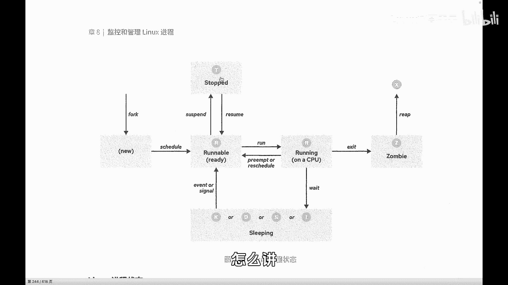
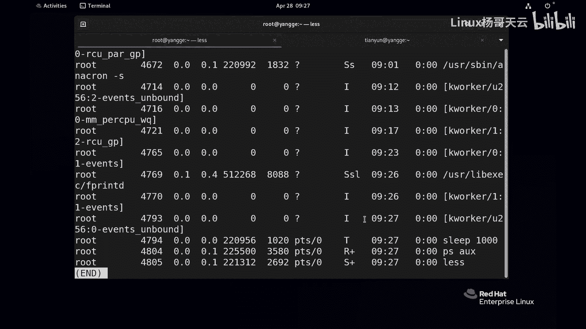
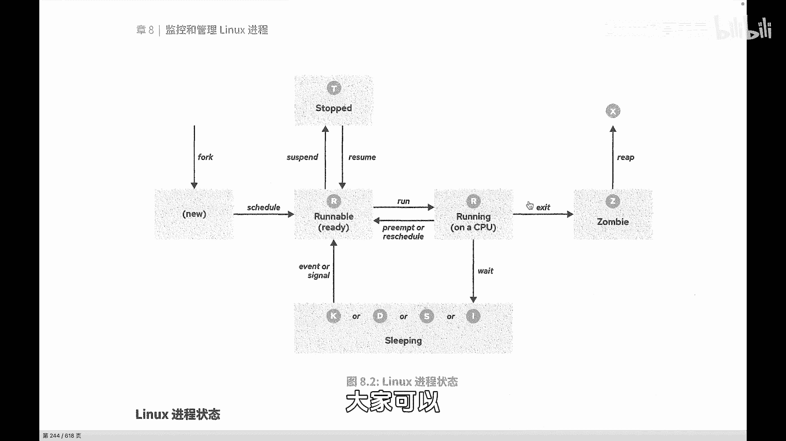

Linux入门与红帽认证RHCE：68：进程的生命周期（下）

在本节课中，我们将继续深入学习进程的生命周期，重点探讨进程的停止、睡眠、僵尸及死亡状态。理解这些状态对于系统管理和故障排查至关重要。

上一节我们介绍了进程的创建与运行状态，本节中我们来看看进程的其他几种关键状态。

无论是睡眠（sleeping）、运行（running）还是停止（stop），这些进程都尚未结束，都处于整个进程的生命周期之中。等待（wait）状态是指进程在等待某个信号或事件。

停止（stop）状态通常是人为干预的结果，类似于暂停和恢复操作。例如，当发现某个进程占用过多CPU资源，而当前希望其他进程能获得更多资源时，除了调整调度策略或优先级，我们也可以将特定进程暂停，并在适当时机恢复。进程被暂停通常是用户或其他进程向其发送了暂停信号（如 `SIGSTOP`），当收到继续执行的信号（如 `SIGCONT`）时，进程会恢复运行。

简单来说，R状态（运行或可运行）是一类。此外，还有睡眠状态，其中常见的是S（可中断睡眠）和D（不可中断睡眠）。T状态（停止状态）也属于此类。




我们可以尝试创建一个处于T状态的进程来观察。例如，运行一个需要长时间执行的命令并用 `Ctrl+Z` 暂停它：
```bash
sleep 1000
```
（然后按下 `Ctrl+Z` 暂停该进程）



此时，使用 `ps` 命令查看进程状态，可能会看到状态显示为 `T`。
```bash
ps aux | grep sleep
```

无论是T（停止）还是S/D（睡眠），都是进程在运行中可能进入的状态。睡眠是进程在等待资源时主动让出CPU，可被唤醒；而停止则是被强制暂停，需要特定信号才能恢复。

当子进程执行完毕后，它会释放自身占用的资源，并向其父进程发送一个退出信号，告知父进程自己已结束，请求父进程进行回收。此时，子进程会进入僵尸（Z）状态。

僵尸状态（Z）一般很少在正常系统中大量出现。它意味着子进程已结束，但其父进程未能成功回收它。僵尸进程本身不占用系统资源（如内存），但会占用进程ID。如果系统中存在过多僵尸进程，可能会影响新进程的创建。通常需要通过向父进程发送信号或重启父进程等方式来强制处理。

最后，当父进程成功清理了子进程的残留信息后，子进程会进入死亡（X）状态。X状态意味着进程已被系统彻底释放和清除。需要注意的是，这个状态是瞬时的，无法通过 `ps` 等命令直接观察到，就像进程的“鬼魂”一样，存在但不可见。

以下是进程状态的一个简单总结：
*   **R**： 进程正在运行或在运行队列中等待。
*   **S/D**： 进程处于睡眠状态，等待事件或资源。
*   **T**： 进程被作业控制信号暂停。
*   **Z**： 僵尸进程，已终止但未被父进程回收。
*   **X**： 死亡状态，进程已彻底被系统清理（不可见）。



本节课中我们一起学习了进程的停止、睡眠、僵尸和死亡状态。理解这些状态有助于你更有效地监控和管理Linux系统中的进程，为后续学习进程间通信和高级系统管理打下坚实基础。