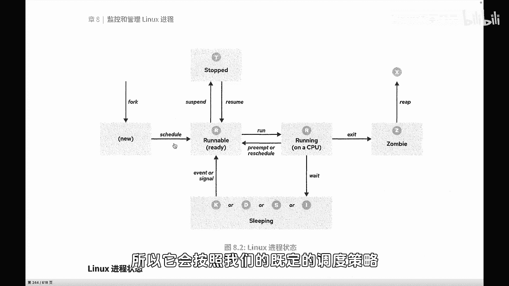
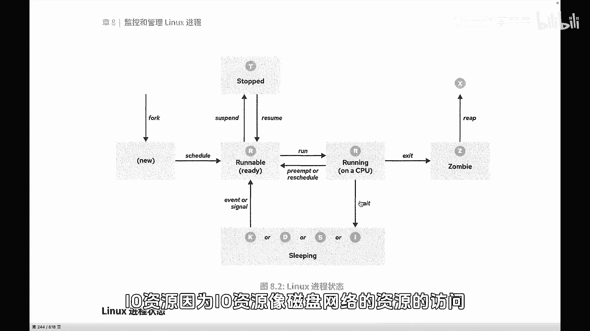
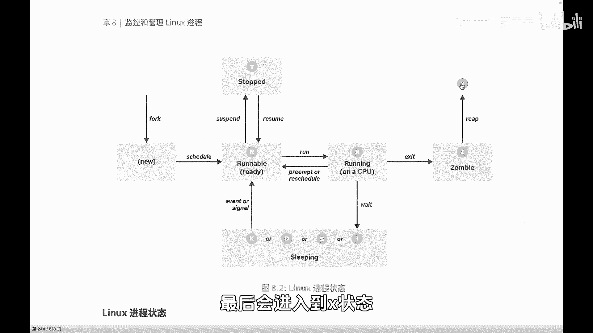
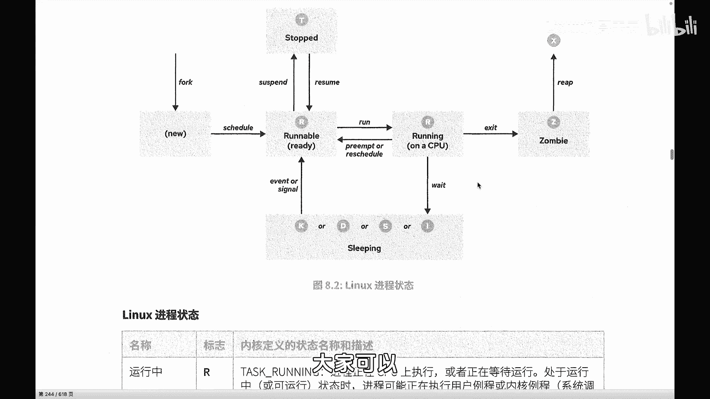

Linux入门教程：P69：进程的生命周期（总结）

在本节课中，我们将总结进程从创建到结束的完整生命周期，理解进程在不同阶段的状态变化及其背后的原因。

上一节我们介绍了进程的创建与调度，本节中我们来看看进程的完整生命周期。

当子进程被创建出来以后，它需要CPU时间来进行处理和运算。所有进程都需要CPU资源，因此它会根据系统既定的调度策略以及进程自身的优先级，进入CPU时间分配和轮循的大环境中。因为系统中同时存在多个进程，所以CPU时间需要被公平分配。

进程不会一次性获得所需的全部CPU时间。例如，进程A可能需要3秒的CPU时间来完成运算，但系统不会连续分配3秒给它。相反，系统会让它运行一个很短的时间片（例如0.1秒），然后让它重新回到等待队列中排队，等待下一次被调度。这是一种分时复用的机制。

在运行过程中，进程可能需要访问比CPU慢得多的外部资源，例如磁盘或网络（统称为I/O资源）。当等待这些慢速资源时，进程会进入睡眠（Sleeping）状态。

进程也可能被人为地暂停或恢复。

最后，当进程结束其任务时，它会进入僵尸（Zombie）状态，等待其父进程来回收其进程标识符（PID）等资源。回收完成后，进程最终会进入消亡（X）状态。

以上就是进程的整个生命周期状态流转。

---

以下是进程生命周期中涉及的核心状态及其简要说明：

*   **运行/就绪**：进程正在使用CPU或准备就绪等待CPU调度。
*   **睡眠**：进程因等待I/O等慢速资源而暂停执行。
*   **暂停**：进程被人为信号（如 `SIGSTOP`）暂停。
*   **僵尸**：进程已终止，但其资源未被父进程完全回收。使用命令 `ps aux | grep Z` 可以查看僵尸进程。
*   **消亡**：进程已被完全回收，从系统中消失。

---

本节课中我们一起学习了进程的完整生命周期，理解了进程从创建、运行、等待、暂停到最终结束（僵尸与消亡）的各个状态及其转换条件。掌握这些概念有助于我们更好地进行进程管理和系统调试。