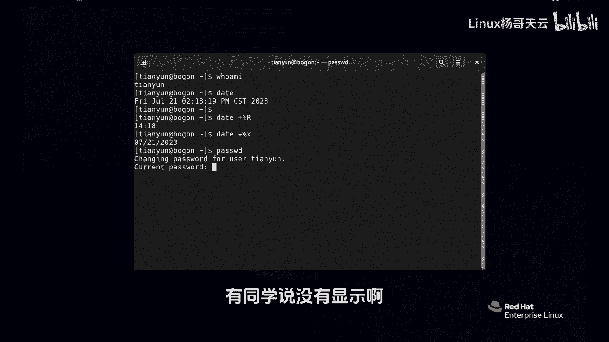
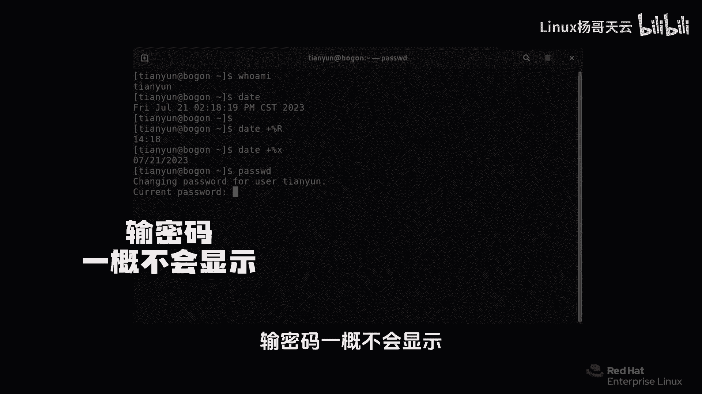
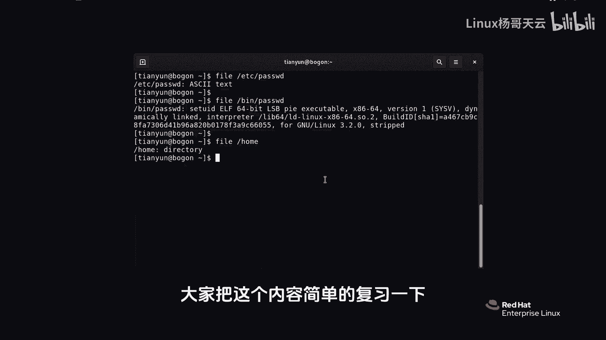

# Linux入门教程：P6：如何使用bash shell执行命令？ 🖥️


在本节课中，我们将学习如何在bash shell中执行命令。我们将通过几个基础命令的演示，了解命令的基本结构、参数的使用以及Linux文件系统的一些特点。

---

上一节我们介绍了bash shell的基本概念，本节中我们来看看如何实际执行命令。

## 命令执行基础

在bash shell中，输入命令后按回车键即可执行。例如，输入 `whoami` 命令可以查看当前登录的用户名。

```bash
whoami
```

输入 `date` 命令可以查看当前的系统日期和时间。

```bash
date
```

## 使用命令参数

许多命令可以通过添加参数来改变其输出或行为。参数通常以连字符（`-`）或双连字符（`--`）开头，有时也使用加号（`+`）配合特定格式。



例如，`date` 命令可以使用 `+%R` 参数来仅显示时间（小时和分钟）。



```bash
date +%R
```

要显示日期，可以使用 `+%x` 参数。请注意，Linux系统区分大小写。

```bash
date +%x
```

这些参数的具体含义和用法无需死记硬背，后续课程将介绍如何使用帮助系统进行查询。

## 修改用户密码

`passwd` 命令用于修改当前用户的密码。执行该命令后，系统会提示您输入当前密码和新密码。

```bash
passwd
```

在Linux的bash shell中输入密码时，出于安全考虑，屏幕上不会显示任何字符（不回显）。这并不代表系统没有接收到输入。

如果新密码不符合安全要求（例如长度不足），系统会给出相应提示并要求重新设置。

## 查看文件类型

在Windows系统中，文件类型通常通过扩展名（如 `.doc`、`.txt`、`.exe`）来识别。然而，在Linux系统中，文件并不依赖扩展名来定义类型。表面名称相同的文件，其本质可能完全不同。

`file` 命令用于揭示文件的真实类型。以下是其基本用法：

```bash
file [文件路径]
```

例如，查看系统密码配置文件：

```bash
file /etc/passwd
```
输出结果会显示这是一个文本文件。

再查看可执行的 `passwd` 程序文件：

```bash
file /bin/passwd
```
输出结果会显示这是一个二进制可执行文件。

尽管两个文件都叫“passwd”，但 `file` 命令能清晰区分它们的类型。

此外，`file` 命令也可以用于查看目录：

```bash
file /home
```
输出会显示这是一个目录。



---


本节课中我们一起学习了bash shell执行命令的基础操作。我们实践了 `whoami`、`date`、`passwd` 和 `file` 等命令，了解了命令参数的基本用法，并认识到Linux系统不依赖文件扩展名来区分文件类型。请务必动手练习这些命令，下一节我们将学习如何获取命令的帮助信息。