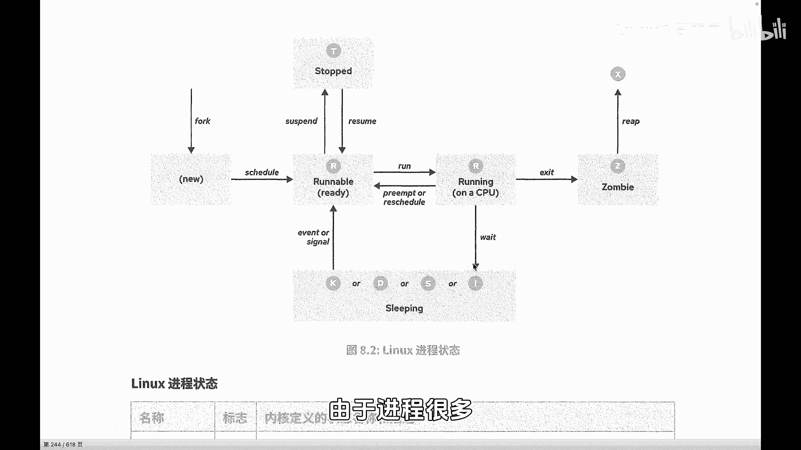
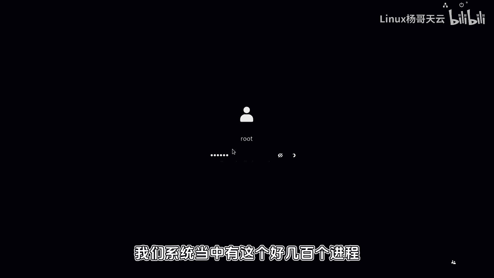
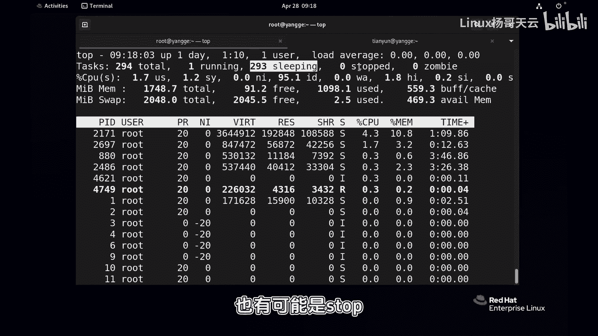
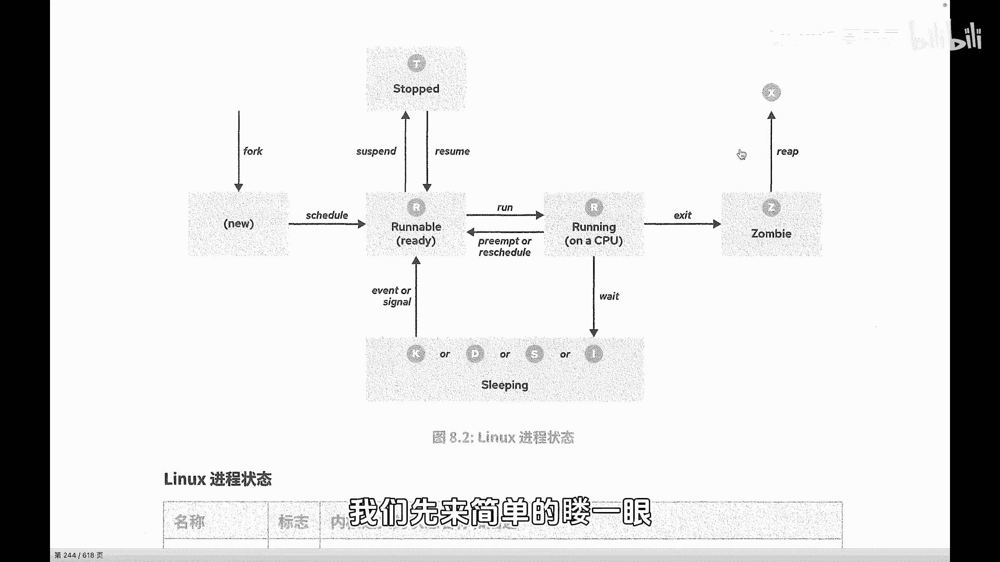
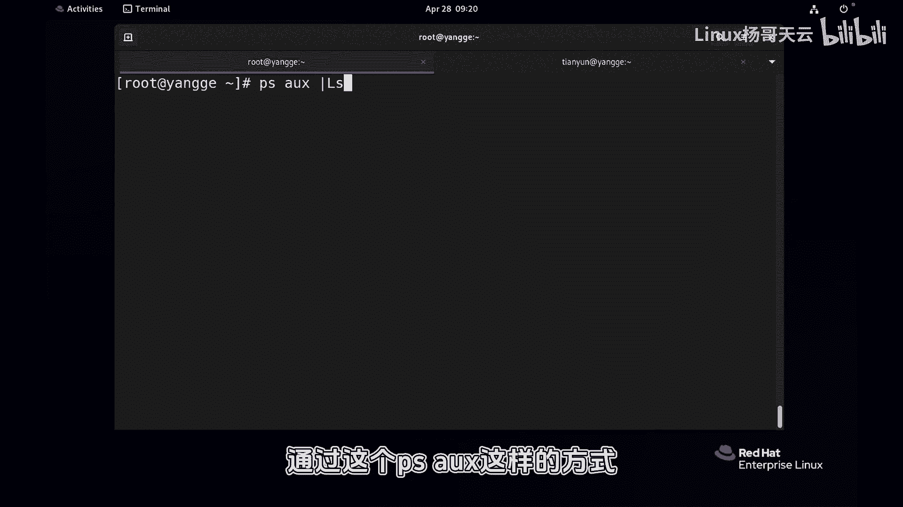
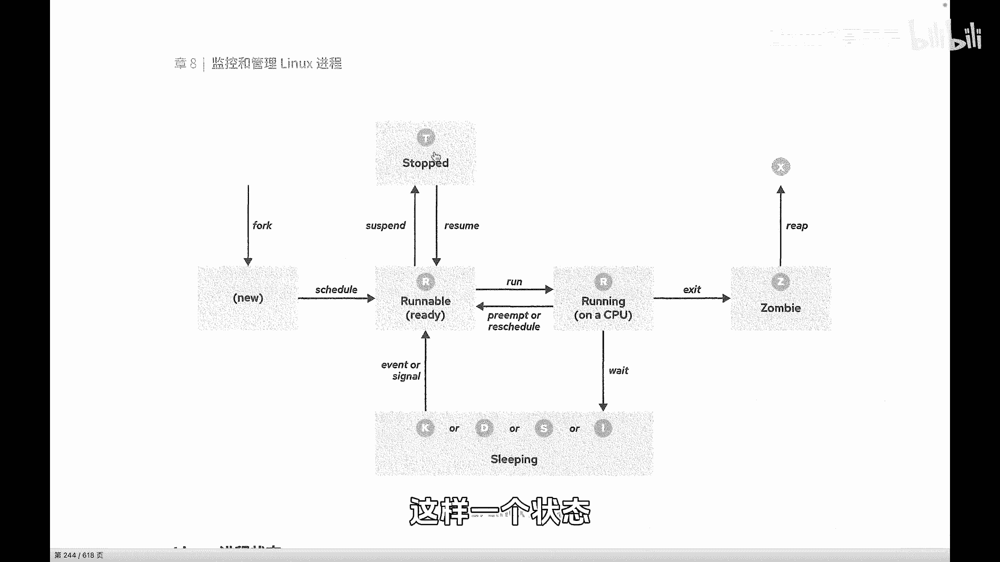
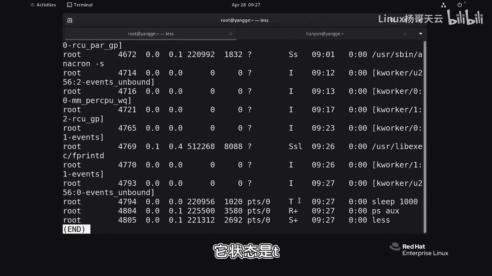
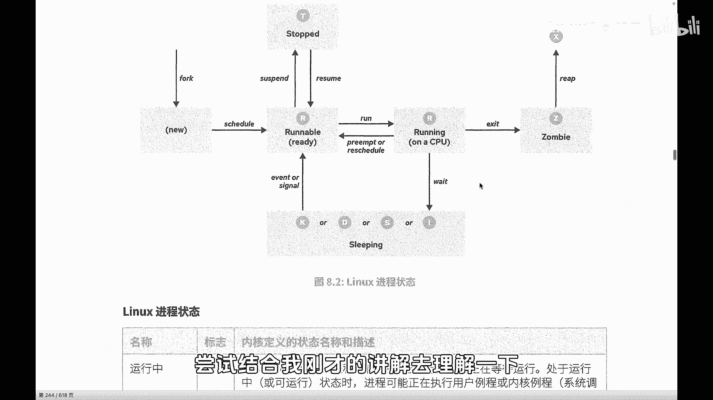

# Linux进程管理：P70：进程的生命周期

在本节课中，我们将要学习Linux系统中进程的生命周期及其各种状态。理解进程如何创建、运行、等待、暂停和终止，是掌握Linux系统管理的基础。

上一节我们介绍了进程的基本概念，本节中我们来看看进程在其生命周期中会经历哪些具体状态。

## 进程状态概述

Linux是一个多任务操作系统。这意味着它可以同时处理多个任务。每个CPU可能有多个核心或多个线程。最终，系统有几个逻辑上的CPU，它在同一时间就能处理几个任务。例如，如果只有一个CPU，那么在同一个时间，就只能处理一个任务。

所有进程在需要CPU执行代码和运算时，都必须进行排队。并非所有进程都能在同一时间运行。因此，在进程运行时，它们会对CPU的时间和资源进行分配。这个过程就像排队，有些进程正在运行，有些即将运行，有些则在队伍后面等待。所以，它们的状态是不同的。

由于系统中通常有数百个甚至更多的进程，并非所有进程都能处于运行状态。很多进程的状态可能是睡眠、停止或僵尸状态。因为同一时间，一个逻辑CPU只能运行一个进程。但进程切换的速度非常快，可以理解为所有进程在轮转分享CPU的时间片。

## 进程状态详解

当一个进程被`fork`创建后，子进程就进入其生命周期。注意，子进程并非立即就能获得CPU时间片，这取决于系统的调度策略。调度策略可以设置，例如可以赋予某个进程更高的优先级，使其获得更多CPU时间。今天我们暂不深入讨论调度策略。

进程创建后，会进入一个就绪队列，遵循调度规则。进程可能进入以下几种状态，我们统称为进程状态。

以下是进程的主要状态及其描述：

*   **R (Running 或 Runnable)**
    *   此状态表示进程正在CPU上执行，或者正在等待运行（已就绪，在调度队列中）。无论是正在运行还是准备运行，都显示为R状态。

*   **S (Interruptible Sleep)**
    *   此状态表示进程处于可中断的睡眠状态。它正在等待某个条件达成，例如等待硬件请求、资源访问或一个信号。条件满足后，进程会被唤醒。

*   **D (Uninterruptible Sleep)**
    *   此状态表示进程处于不可中断的睡眠状态。与S状态不同，它不会响应常规信号。通常发生在进程正在访问磁盘或网络等慢速I/O资源时，此时不能被打断。

*   **T (Stopped)**
    *   此状态表示进程被暂停（停止）。这通常是人为操作的结果，例如用户向进程发送了暂停信号（如`SIGSTOP`）。在需要时，可以发送继续信号（如`SIGCONT`）来恢复其运行。

*   **Z (Zombie)**
    *   此状态表示进程处于“僵尸”状态。子进程运行结束后，会向父进程发送一个退出信号，并释放大部分资源，但会在进程表中保留一个条目等待父进程读取其退出状态。如果父进程未能及时回收，子进程就会变成僵尸进程。僵尸进程不占用系统资源，但过多存在会影响系统。

*   **X (Dead)**
    *   此状态表示进程已死亡，被彻底释放。当父进程清理完僵尸子进程的残留信息后，子进程就会进入X状态。这个状态是瞬时且无法被观察到的。

## 状态转换与生命周期

现在，我们结合进程的生命周期来理解这些状态的转换。

当子进程被父进程`fork`出来后，它需要CPU时间进行运算。它会根据系统的整体调度策略和自身的优先级，进入CPU时间片轮转的队列中。

如果进程排到了队首或即将运行，它就处于R状态（就绪或运行）。运行一段时间后（可能只运行了极短的时间片，例如0.01秒），它可能因为时间片用完而重新回到就绪队列排队，等待下一次调度，而不是一直独占CPU直到任务完成。

在运行过程中，如果进程需要访问比CPU慢得多的资源（如磁盘I/O、网络I/O），它可能会进入S或D睡眠状态，以等待这些操作完成。

进程也可能被人为地暂停（T状态）或恢复。

最后，当进程执行完毕，它会进入Z（僵尸）状态，等待父进程回收其进程ID（PID）等残留信息。父进程成功回收后，该进程最终进入X（死亡）状态，从系统中彻底消失。

本节课中我们一起学习了Linux进程的生命周期及其核心状态：运行/就绪（R）、可中断睡眠（S）、不可中断睡眠（D）、停止（T）、僵尸（Z）和死亡（X）。理解这些状态及其转换过程，对于监控系统性能、诊断进程问题至关重要。