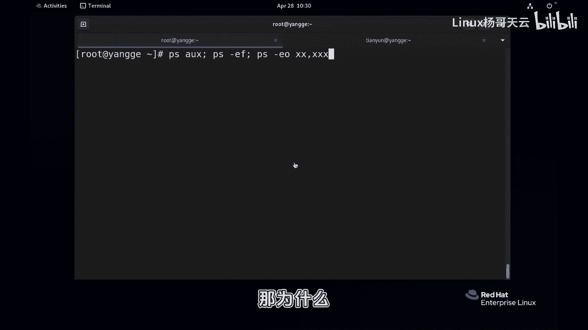
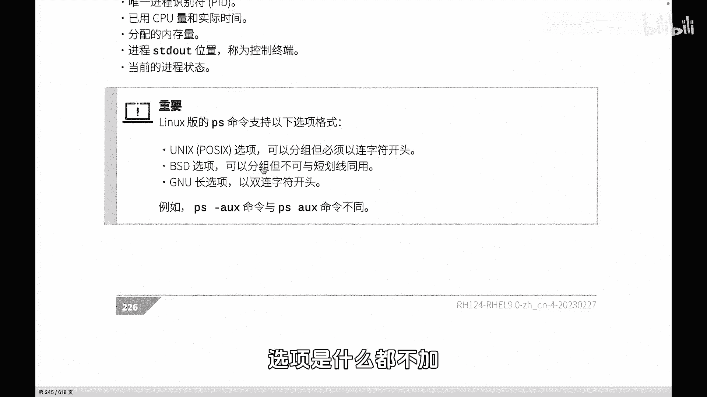
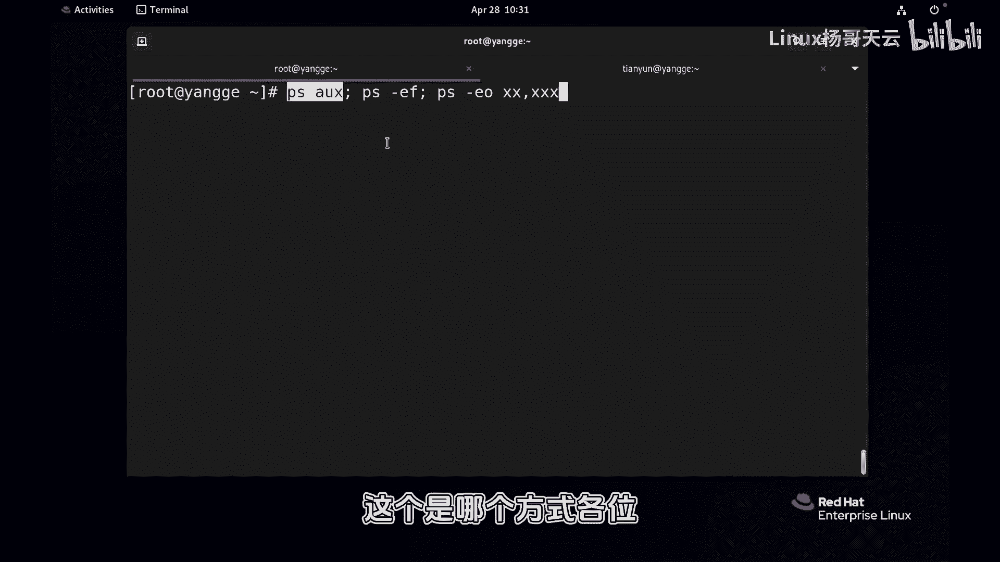
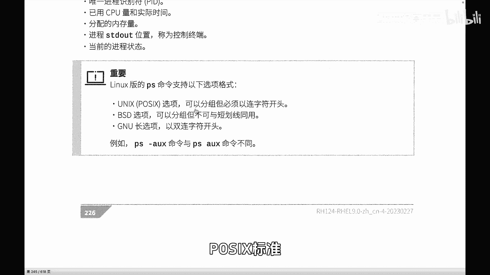
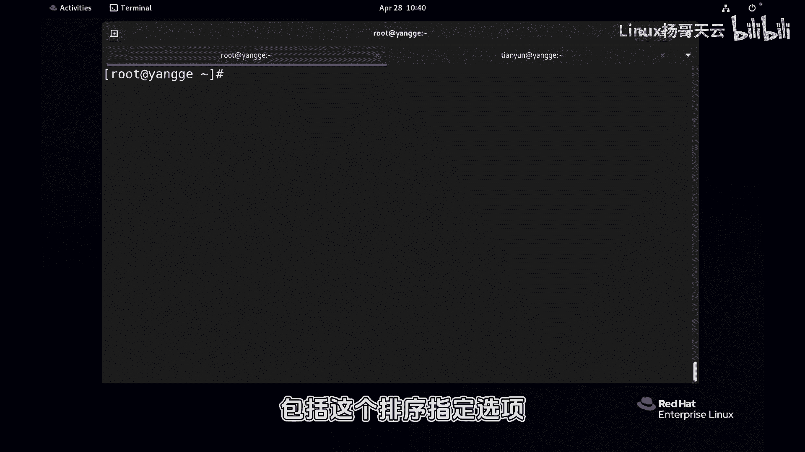

# Linux进程管理：P71：使用top与ps命令查看进程

在本节课中，我们将学习Linux系统中两个核心的进程查看命令：`top`和`ps`。我们将了解它们各自的用途、基本用法以及如何通过`ps`命令自定义输出和排序，以便高效地监控和管理系统进程。

---

## 进程查看命令概述

在Linux中，查看进程主要使用两个命令：`top`和`ps`。`top`命令用于实时动态查看进程状态及系统资源使用情况。`ps`命令则用于获取系统在某个特定时间点的进程快照。实时查看会消耗一定的系统资源，在系统负载已经很重时，使用`ps`命令获取快照有时更为实用。

上一节我们介绍了进程的基本概念，本节中我们来看看这两个具体的查看工具。

---

## 使用top命令实时查看进程



`top`命令不仅能显示进程信息，还能展示CPU负载、系统负载等整体状态信息。

首先，我们来看`top`命令界面中关于进程的部分。界面中有一行显示进程的整体状态，包括总进程数及其分布情况，例如正在运行（running）、睡眠（sleeping）、停止（stopped）的进程数量。

接下来我们详细看看进程列表的各列含义：
以下是`top`命令输出中常见列的含义：
*   **PID**：进程的唯一标识符（进程ID）。无论是向进程发送信号，还是处理父子进程间的通信，都需要通过PID来完成。
*   **USER**：启动该进程的用户。
*   **PR** 和 **NI**：进程的优先级。
*   **VIRT**、**RES**、**SHR**：这三个是与内存相关的列。`VIRT`是虚拟内存大小，`RES`是实际使用的物理内存大小，`SHR`是共享内存大小。
*   **S**：进程状态（State）。
*   **%CPU**：该进程当前占用CPU时间占总CPU时间的百分比。
*   **%MEM**：该进程占用内存占总内存的百分比。
*   **TIME+**：进程自启动以来所占用的总CPU时间。
*   **COMMAND**：启动该进程的命令名称。

---





## 使用ps命令查看进程快照



与`top`不同，`ps`命令提供了更灵活的方式来查看特定时刻的进程信息。对于初学者，掌握以下三种常用格式即可：

1.  `ps aux`
2.  `ps -ef`
3.  `ps -eo` 自定义字段

这里有一个重要的提醒：`ps`命令的选项有三种风格。
*   UNIX选项：以连字符`-`开始，如 `ps -ef`。
*   BSD选项：不以任何短线开始，如 `ps aux`。
*   GNU长选项：以两个连字符`--`开始。

我们不必深究其历史，只需记住上述三种常用格式即可。未来遇到其他用法时，可以再查阅手册。

---

### 解析ps aux输出

我们先分析`ps aux`命令的输出内容。
以下是`ps aux`输出的典型列：
*   **USER**：进程所有者。
*   **PID**：进程ID。
*   **%CPU**：CPU使用百分比。
*   **%MEM**：内存使用百分比。
*   **VSZ**：虚拟内存大小。
*   **RSS**：实际内存大小。
*   **TTY**：进程启动的终端。显示为`?`表示该进程不依赖于任何终端，常见于系统守护进程。
*   **STAT**：进程状态。这是一个重要的字段，它可能包含一个大写字母（如S）和附加字符（如`<`）。这关系到进程的优先级、是前台进程组还是后台进程等。我们鼓励大家在评论区探讨不同状态字符的含义。
*   **START**：进程启动时间。
*   **TIME**：进程占用CPU的总时间。
*   **COMMAND**：启动进程的命令名称。

---

### 解析ps -ef输出

现在，我们来看看`ps -ef`命令的输出，它的显示风格与`ps aux`有所不同。
以下是`ps -ef`输出的典型列：
*   **UID**：用户ID，等同于`ps aux`中的USER。
*   **PID**：进程ID。
*   **PPID**：父进程ID。
*   **C**：CPU利用率。
*   **STIME**：进程启动时间。
*   **TTY**：启动终端。
*   **TIME**：占用CPU总时间。
*   **CMD**：命令名称。

---

### 自定义ps输出与排序

使用`ps aux`或`ps -ef`时，输出默认并未按资源使用率排序。在实际排查问题时，我们常常需要找出占用CPU或内存最多的进程。这时，就需要使用`ps -eo`选项来自定义输出字段。

`ps -e`表示显示所有进程，`-o`用于指定自定义输出的字段。

首先，我们可以查看`ps`命令支持哪些字段：
```bash
ps L
```
假设我们想查看所有进程的PID、PPID、CPU使用率和内存使用率，并按照CPU使用率降序排列。可以这样操作：
```bash
ps -eo pid,ppid,%cpu,%mem,comm --sort=-%cpu | less
```
在`--sort`选项中，`-`号表示降序排列（数值大的在前）。如果去掉`-`号，则为升序排列（数值小的在前）。通常我们更关心资源占用高的进程，所以使用降序。

**字段名说明**：
*   `%cpu` 也可以写作 `pcpu`，两者等价。
*   `%mem` 也可以写作 `pmem`。

这样，我们就能清晰地看到系统中CPU占用率最高的进程列表。如果想按内存排序，只需将`--sort=-%cpu`替换为`--sort=-%mem`。

如果想同时指定多个排序条件，可以用逗号分隔：
```bash
ps -eo pid,ppid,%cpu,%mem,comm --sort=-%cpu,-%mem
```

---

## 总结

本节课中我们一起学习了Linux下查看进程的两个核心命令。
1.  **top命令**：用于实时、动态地监控进程状态和系统负载，适合观察系统实时变化。
2.  **ps命令**：用于获取进程快照，更加灵活。我们重点掌握了三种用法：
    *   `ps aux`：BSD风格，显示详细信息。
    *   `ps -ef`：UNIX风格，显示进程父子关系。
    *   `ps -eo`：自定义输出字段，并结合`--sort`进行排序，便于快速定位资源消耗大的进程。



掌握这些基本用法，足以应对日常的进程查看和管理需求。更复杂的用法可以在需要时通过 `man ps` 命令查询详细手册。