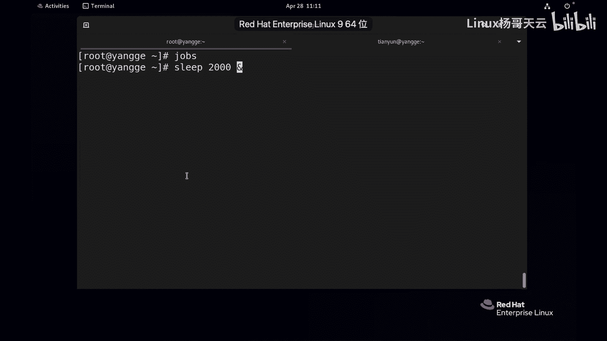
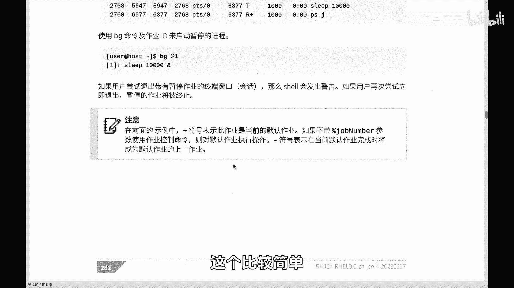
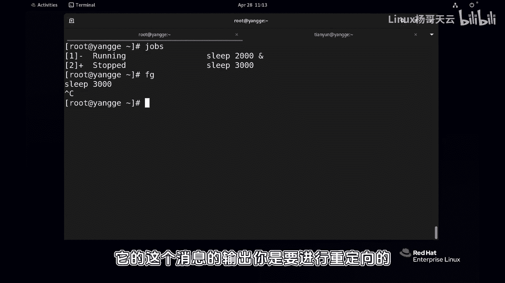

# Linux入门教程：P72：shell作业控制

## 概述
在本节课程中，我们将学习Linux Shell中的作业控制。作业控制允许我们在一个终端会话中同时运行和管理多个程序，这对于提高工作效率至关重要。我们将学习如何将程序放到后台运行、如何查看后台作业、以及如何在前台和后台之间切换作业。

---

## 现象观察
首先，我们观察一个常见的现象。在一个Shell终端中，当我们运行一个命令时，例如 `ls`，它会快速执行完毕，然后终端会立刻准备好接受下一个命令。

然而，当我们运行一个需要长时间执行的命令时，例如 `sleep 10`，这个命令会让程序运行10秒。在这10秒期间，终端会被这个程序占据，我们无法输入新的命令。

这意味着，在默认情况下，一个Shell终端在同一时间只能运行一个程序。为了能够同时运行多个程序，我们需要掌握作业控制。

---

## 启动后台作业
假设我们运行一个长时间执行的命令，例如 `sleep 1000`。一旦执行，终端将被占用。有两种方法可以解决这个问题。

第一种方法是在启动命令时，直接将其放到后台运行。方法是在命令的末尾加上一个 `&` 符号。

**命令示例：**
```bash
sleep 1000 &
```
执行后，Shell会返回类似以下信息：
```
[1] 12345
```
其中，`[1]` 是作业号，`12345` 是该进程的PID。这两个标识符都可以用来管理这个后台作业。

---

## 暂停与恢复前台作业
第二种情况是，一个程序已经在前台运行了，我们想临时把它放到后台。这时，我们可以使用快捷键 `Ctrl + Z`。

按下 `Ctrl + Z` 后，当前正在运行的前台程序会被暂停，并放到后台。Shell同样会给出作业号提示。

要查看当前Shell会话中的所有后台作业，可以使用 `jobs` 命令。

**命令示例：**
```bash
jobs
```
输出可能如下：
```
[1]-  Running                 sleep 1000 &
[2]+  Stopped                 sleep 2000
```
这里显示了两个后台作业。一个状态是 `Running`（正在运行），另一个是 `Stopped`（已暂停）。作业号前面的 `+` 号和 `-` 号有特殊含义，我们稍后会解释。

---

## 管理后台作业
上一节我们介绍了如何查看后台作业，本节中我们来看看如何管理它们。

### 让暂停的作业在后台运行
如果一个作业被暂停（状态为 `Stopped`），我们可以使用 `bg` 命令让它转到后台继续运行。

**命令示例：**
```bash
bg %2
```
或者简写为：
```bash
bg 2
```
执行后，作业号为2的进程就会在后台开始运行。再次使用 `jobs` 命令查看，其状态会变为 `Running`。

### 将后台作业调回前台
如果想把一个后台作业调回前台，可以使用 `fg` 命令。

**命令示例：**
```bash
fg %1
```
或者简写为：
```bash
fg 1
```
这个作业就会被调回前台继续执行。**注意**：`%1` 指的是作业号为1的作业，而 `1`（没有百分号）指的是PID为1的进程，两者有本质区别。

对于在前台运行的进程，我们可以使用 `Ctrl + C` 来终止它。

### 终止后台作业
要终止一个后台作业，有两种方法：
1.  先用 `fg` 命令将其调到前台，然后按 `Ctrl + C` 终止。
2.  使用我们后续会学到的 `kill` 命令，直接通过作业号或PID来终止它。

---

## 重要注意事项
通过作业控制，我们可以在一个终端上运行多个程序。通常，我们习惯在命令后加上 `&` 符号来启动后台作业。但这里有几个关键点需要注意：

1.  **输出重定向**：在后台运行的进程，其输出信息默认依然会打印到前台终端，这可能会干扰你的工作。因此，在设置后台作业时，通常需要考虑使用输出重定向来处理其消息。
    **命令示例：**
    ```bash
    some_command > output.log 2>&1 &
    ```



2.  **输入限制**：在后台运行的进程**不能**接受来自键盘的输入。只有在前台运行的进程才可以与用户进行交互。

---

## 加号与减号的含义
在 `jobs` 命令的输出中，作业号旁边的 `+` 号和 `-` 号有特定含义：
*   `+` 号：表示**默认作业**。当使用 `fg` 或 `bg` 命令而不指定作业号时，操作的对象就是这个带 `+` 号的作业。
*   `-` 号：表示**下一个默认作业**。当默认作业（`+`）结束后或移除后，带 `-` 号的作业就会成为新的默认作业。



例如，依次启动 `sleep 2000 &` 和 `sleep 3000 &`。使用 `jobs` 查看，最新的作业（`sleep 3000`）会标记为 `+`。如果直接输入 `fg` 而不加参数，被调到前台的将是这个 `sleep 3000` 作业。

---

## 管道与作业控制
当使用管道连接多个命令时，例如 `command1 | command2 | command3 &`，Shell显示的作业号和PID是管道中**最后一个命令**（即 `command3`）的作业号和PID。这一点了解即可。

---

## 总结
本节课中，我们一起学习了Linux Shell的作业控制。核心内容包括：
*   使用 `&` 在启动时将程序放入后台。
*   使用 `Ctrl + Z` 暂停前台程序并放入后台。
*   使用 `jobs` 命令查看所有后台作业。
*   使用 `bg` 命令让暂停的作业在后台继续运行。
*   使用 `fg` 命令将后台作业调回前台。
*   理解了作业号前 `+` 和 `-` 符号的含义。
*   掌握了作业控制的关键注意事项：**后台作业的输出需要重定向**，且**后台作业无法接受键盘输入**。



通过作业控制，你可以有效地在单个终端会话中管理多个任务，极大地提升了在命令行环境下的工作效率。