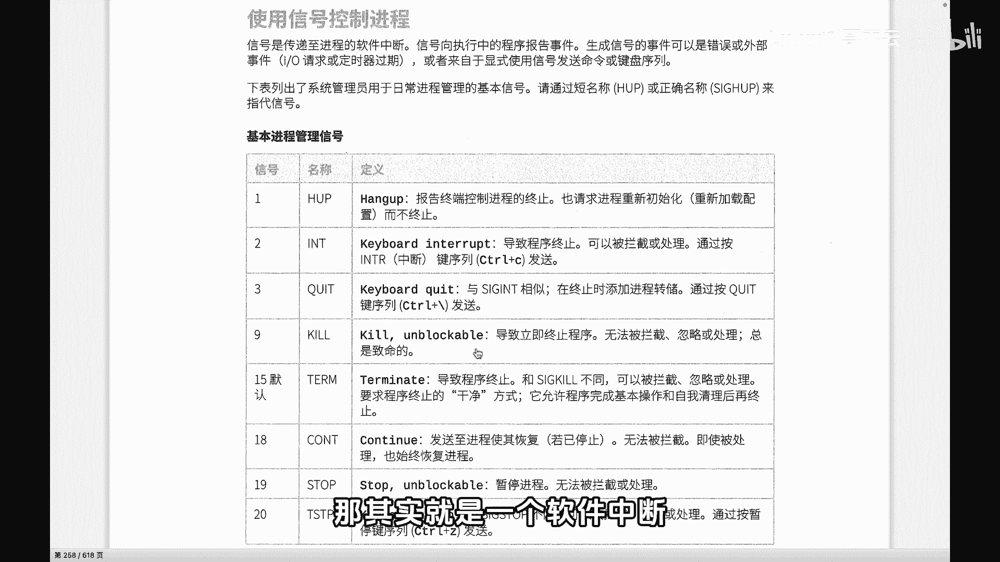
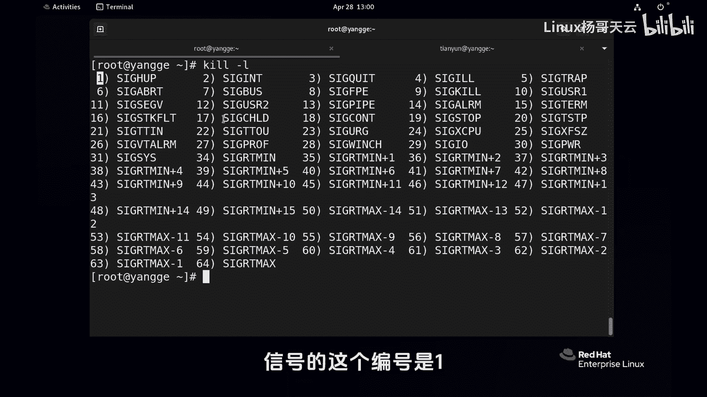
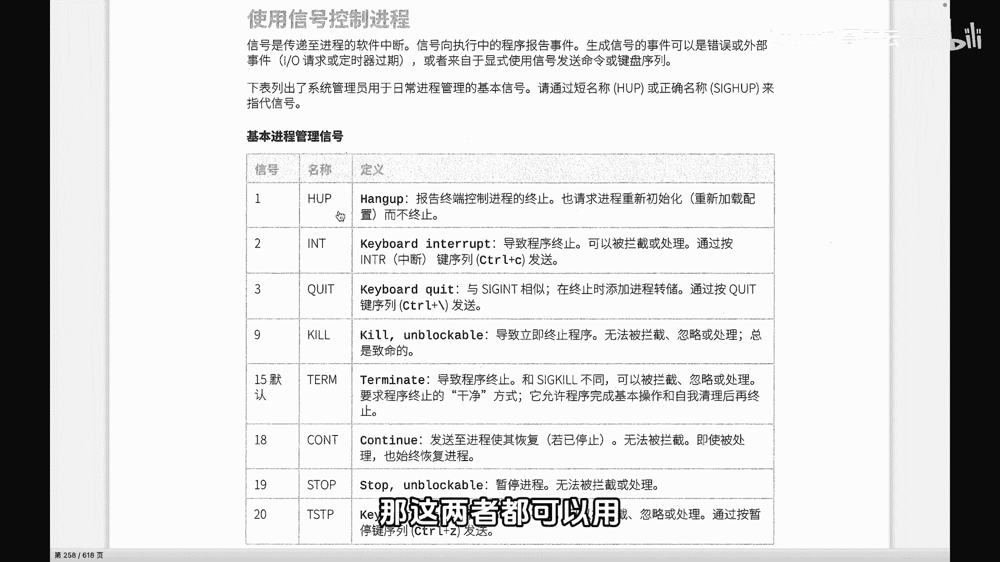
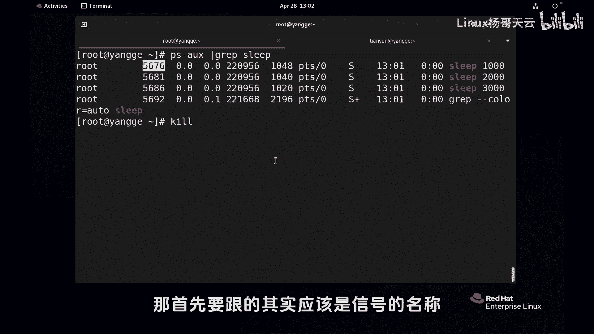
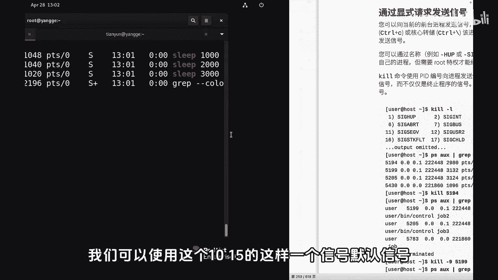
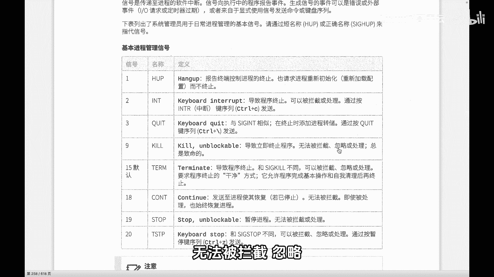
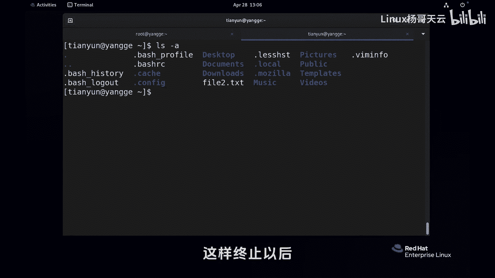
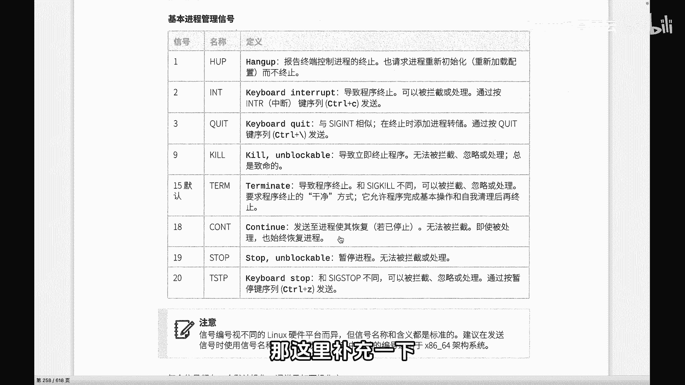
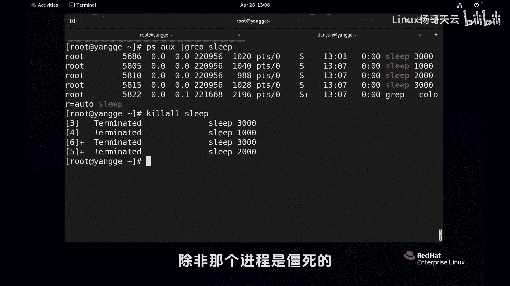

Linux进程管理：73：进程信号控制



在本节课中，我们将要学习如何使用信号来控制Linux系统中的进程。信号是一种软件中断，用于通知进程发生了某个事件或请求进程执行特定操作。理解不同信号的含义和正确使用方式，是进行有效进程管理的关键。

上一节我们介绍了进程的基本概念，本节中我们来看看如何向进程发送信号。



### 常见信号列表
以下是Linux系统中一些常见的信号及其含义：



*   **SIGHUP (1)**：挂起信号。通常用于通知守护进程重新读取配置文件。
*   **SIGINT (2)**：中断信号。通常由终端按下 `Ctrl+C` 产生，用于请求进程终止。
*   **SIGQUIT (3)**：退出信号。通常由终端按下 `Ctrl+\` 产生，进程在终止前会生成核心转储文件。
*   **SIGKILL (9)**：强制终止信号。进程无法捕获或忽略此信号，会立即被终止。
*   **SIGTERM (15)**：终止信号。这是 `kill` 命令默认发送的信号，请求进程正常终止。
*   **SIGSTOP (19)**：停止信号。暂停进程的执行。
*   **SIGCONT (18)**：继续信号。让一个停止的进程继续执行。

### 发送信号的命令
主要通过 `kill` 和 `killall` 命令向进程发送信号。





**1. `kill` 命令**
`kill` 命令通过指定进程ID（PID）来发送信号。其基本语法为：
```bash
kill [-信号] <PID>
```
如果不指定信号，默认发送 `SIGTERM (15)`。

首先，我们需要找到目标进程的PID。例如，查找名为 `sleep` 的进程：
```bash
ps aux | grep sleep
```
假设找到的PID是 `5676`，我们可以发送信号：
*   正常终止进程：`kill 5676` 或 `kill -15 5676`
*   强制终止进程：`kill -9 5676`

**2. `killall` 命令**
`killall` 命令通过进程名称来发送信号，可以一次性终止所有同名进程。其基本语法为：
```bash
killall [-信号] <进程名>
```
例如，终止所有名为 `sleep` 的进程：
```bash
killall sleep
```



### SIGTERM与SIGKILL的区别
这是信号控制的核心概念，理解两者的区别至关重要。

*   **SIGTERM (15)**：这是一个**正常终止**请求。进程收到此信号后，可以执行清理工作（如保存数据、关闭文件、释放资源），然后自行退出。这类似于一个人安排好“后事”再离开。
*   **SIGKILL (9)**：这是一个**强制终止**信号。进程无法捕获或忽略此信号，会立即被系统强制结束，没有机会进行任何清理操作。这类似于突然被“击毙”。

**示例演示：**
1.  用 `vi` 编辑器打开一个文件并修改内容，但不保存。
2.  使用 `kill -9 <vi的PID>` 强制杀死 `vi` 进程。
3.  再次打开文件时，可能会发现系统生成了一个交换文件（如 `.file.swp`），这是因为 `vi` 进程被突然终止，未来得及清理临时文件。
4.  相反，如果使用 `kill -15 <vi的PID>`，`vi` 进程通常会提示用户保存更改，然后正常退出，不会留下混乱的临时文件。

**最佳实践：** 在需要终止进程时，应优先尝试使用 `SIGTERM (15)`，给予进程正常退出的机会。只有当进程无响应（“僵死”状态）时，才考虑使用 `SIGKILL (9)` 进行强制终止。



### 其他信号与交互式控制
除了使用命令，我们也可以在前台运行程序时，通过键盘快捷键发送特定信号：



*   **Ctrl + C**：发送 `SIGINT (2)` 信号，通常用于中断前台进程。
*   **Ctrl + Z**：发送 `SIGTSTP (20)` 信号，用于挂起（暂停）前台进程，并将其放入后台。
*   之后可以使用 `fg` 命令将挂起的进程恢复到前台，或用 `bg` 命令使其在后台继续运行（相当于发送了 `SIGCONT (18)`）。

---



本节课中我们一起学习了Linux进程的信号控制机制。我们了解了常见信号的含义，掌握了使用 `kill` 和 `killall` 命令发送信号的方法，并重点理解了 `SIGTERM`（正常终止）与 `SIGKILL`（强制终止）之间的关键区别。记住，合理使用信号是进行优雅进程管理的基础，应尽量避免滥用强制终止信号。