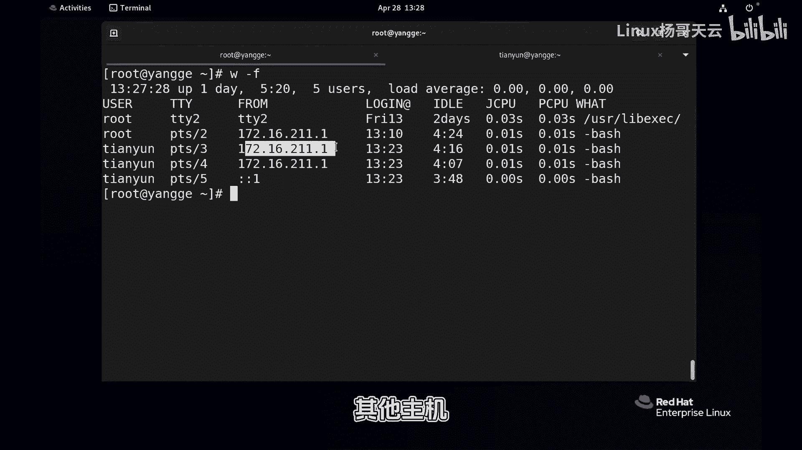
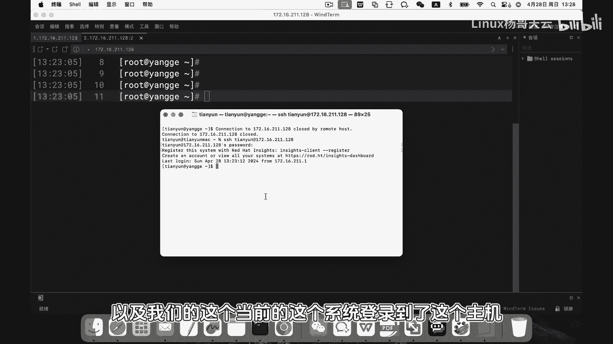
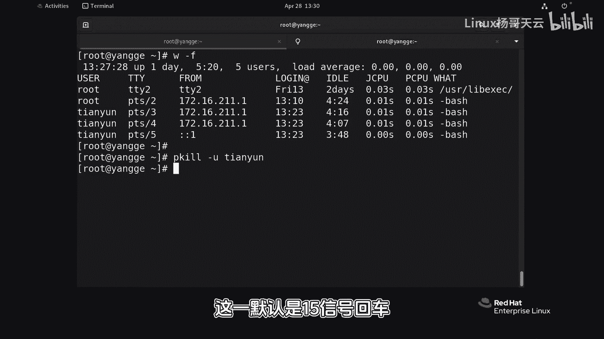
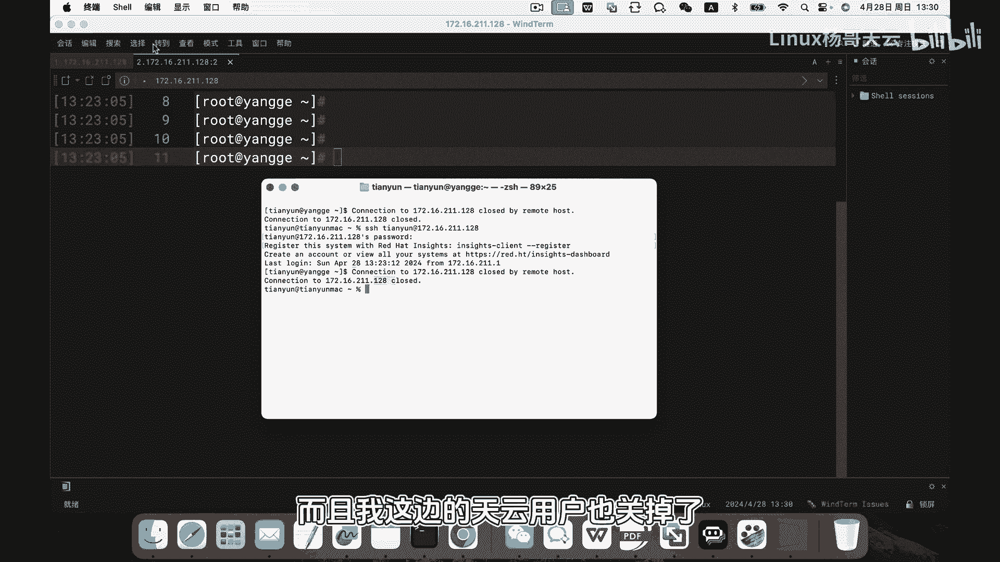
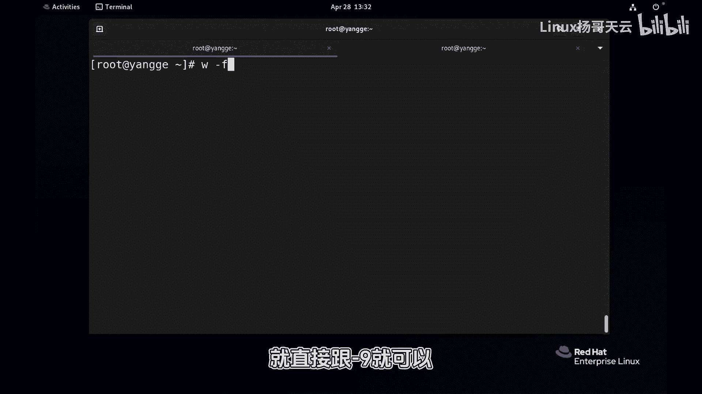

Linux入门教程：P74：74.3秒断开危险用户的访问

在本节课中，我们将学习如何快速识别并强制注销系统中已登录的用户。这在怀疑有用户进行不安全操作时，是一项重要的系统管理技能。

上一节我们介绍了用户管理的基础知识，本节中我们来看看如何管理已登录的会话。



首先，我们需要查看当前有哪些用户登录到了系统。使用 `w` 或 `who` 命令可以清晰地看到所有登录用户、他们的来源以及正在运行的进程。



以下是使用 `w -f` 命令查看登录用户的示例：
```bash
w -f
```
命令输出会显示类似以下信息：
*   `root` 用户从本地终端（`tty2`）登录。
*   `tianyun` 用户从远程主机通过SSH登录。
*   另一个 `tianyun` 用户从本地通过控制台登录。

假设我们怀疑 `tianyun` 用户行为异常，需要立即将其所有登录会话强制注销。这时，我们可以使用 `pkill` 命令。

`pkill` 命令能根据用户名、终端等条件向相关进程发送信号。最常用的信号是 **SIGTERM (15)**，它请求进程正常终止；若进程不响应，则需使用 **SIGKILL (9)** 信号强制终止。

以下是注销指定用户所有登录会话的命令：
```bash
pkill -9 -u tianyun
```
执行此命令后，所有属于 `tianyun` 用户的登录进程（如SSH会话、终端）都将被立即终止。





如果需要更精确地控制，例如只注销来自特定终端（如 `pts/2`）的 `root` 用户会话，可以使用以下命令：
```bash
pkill -9 -t pts/2
```
此命令会终止在 `pts/2` 这个伪终端上运行的所有进程，从而达到注销该登录会话的目的。

操作完成后，可以再次运行 `w` 命令来验证目标用户是否已成功注销。



本节课中我们一起学习了如何使用 `w` 命令查看登录用户，以及如何使用 `pkill` 命令通过指定用户名 (`-u`) 或终端 (`-t`) 并发送 **SIGKILL (9)** 信号来强制注销危险的用户会话。这是维护系统安全时的一项实用技能。