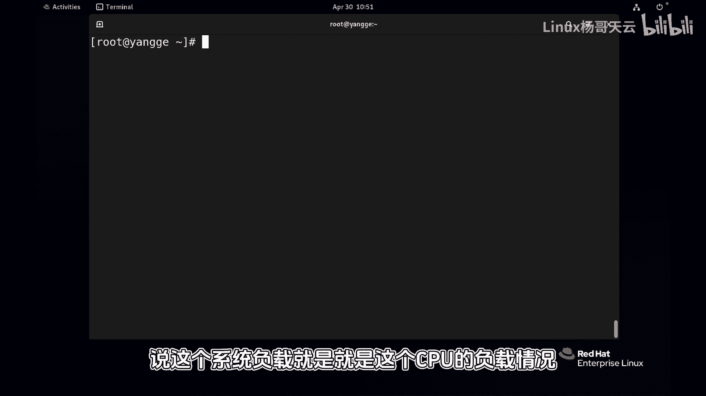
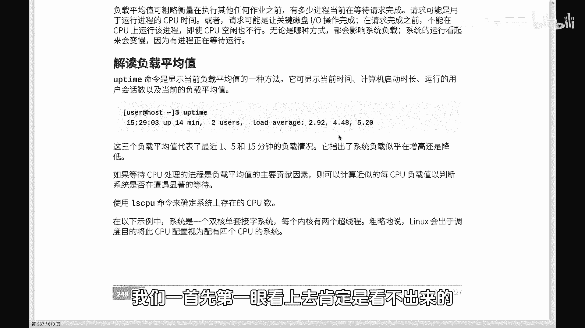
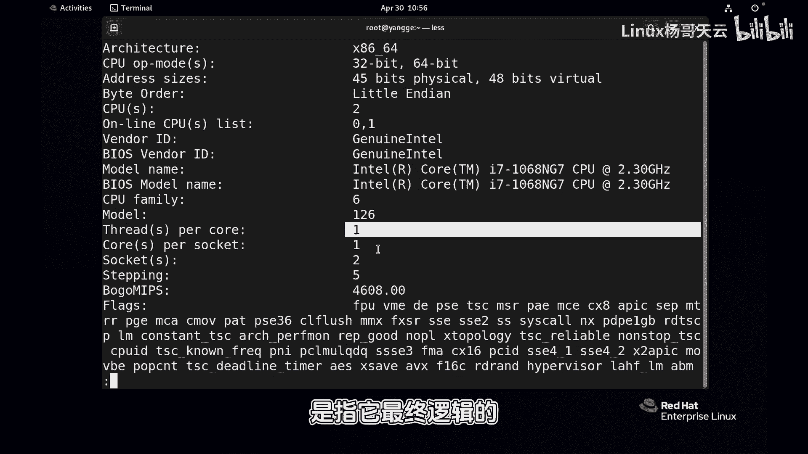
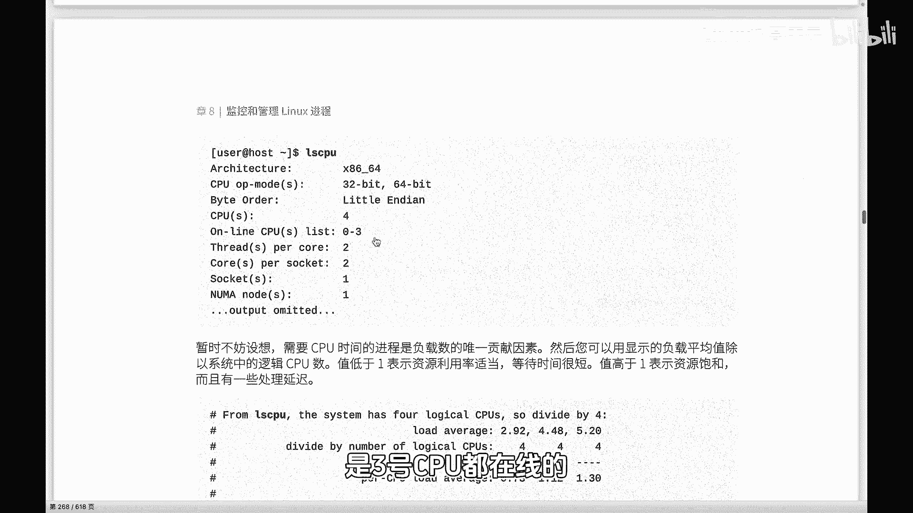
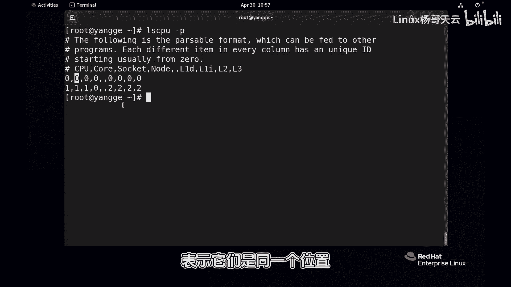
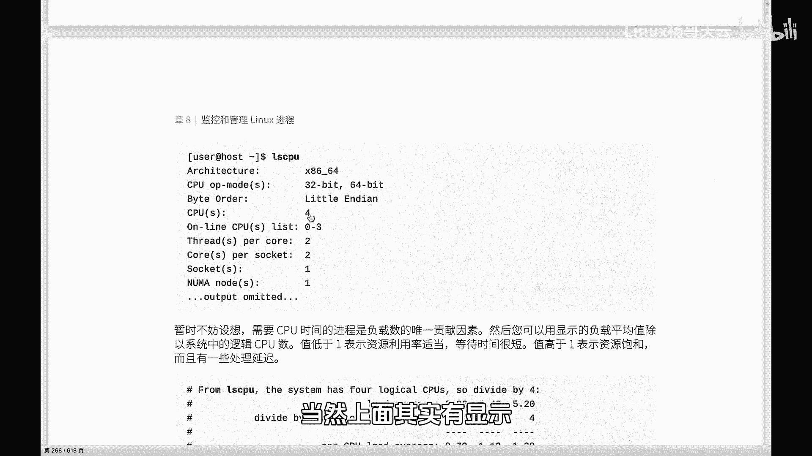

# Linux系统管理：P75：你真的会查看Linux系统负载吗？-上

## 概述
在本节课中，我们将学习如何正确解读Linux系统的负载情况。系统负载是衡量系统繁忙程度的重要指标，理解其含义对于系统管理和性能调优至关重要。我们将介绍查看负载的命令、负载值的构成以及如何结合CPU数量进行解读。

## 查看系统负载的两种方式
有两种主要方式可以查看当前系统的负载情况。

以下是具体方法：
*   **使用 `uptime` 命令**：执行 `uptime` 命令后，输出行末会显示三个数字，分别代表系统在最近1分钟、5分钟和15分钟内的平均负载。该命令同时会显示当前系统时间、系统已运行时长以及当前登录用户数。
*   **使用 `top` 命令**：在 `top` 命令的显示界面中，通常第一行也会显示与 `uptime` 命令相同的负载平均值信息。

## 系统负载的含义
上一节我们介绍了如何查看负载，本节中我们来看看系统负载到底代表什么。

从字面理解，系统负载反映了整个系统的繁忙程度。许多初学者会狭义地将其理解为CPU的负载，但实际上并非如此。系统负载是一个反映系统整体压力的指标。

我们看到的1分钟、5分钟和15分钟负载值，是系统在该时间段内负载情况的一个指数平均值。如果负载过重，用户体验会变差，系统整体压力也会升高，此时可能需要考虑增加服务器、升级CPU或改善网络等。

根据官方解读，平均负载值是通过报告**准备在CPU上运行的进程数**和**等待磁盘I/O、网络I/O完成的进程数**来确定的。因此，它不仅仅是传统理解的CPU排队进程数。

## 负载的主要贡献者
CPU确实是系统负载最主要的贡献者，但磁盘I/O和网络I/O同样重要。由于磁盘和网络操作相较于CPU运算速度慢很多，它们也会为系统负载贡献相应的值。

具体来说，对负载有贡献的进程主要分为两类：
*   **状态为 `R` (Running 或 Runnable) 的进程**：这些是正在使用CPU或准备使用CPU的进程。
*   **状态为 `D` (Uninterruptible sleep) 的进程**：这些通常是正在等待或进行I/O操作的进程，处于不可中断状态。

这两类进程分别代表了对CPU资源、内存资源以及磁盘或网络I/O资源的访问情况。一些传统的Unix系统仅考虑CPU使用率，而Linux系统的负载平均值则包含了磁盘和网络的负载情况。当然，CPU的贡献度仍然是最大的。

## 如何解读负载值
仅仅看负载的数值本身，无法直接判断系统负载是重还是轻，因为不同系统的CPU配置不同。因此，第一步需要了解系统的CPU数量。

查看CPU数量有两种方式：
*   **查看 `/proc/cpuinfo` 文件**：执行 `cat /proc/cpuinfo` 命令。其中：
    *   `physical id` 表示物理CPU插槽（Socket）的数量。
    *   `cpu cores` 表示每个物理CPU的核心数。
    *   `siblings` 表示每个核心的线程数（逻辑CPU数）。
    逻辑CPU总数 = 物理CPU数 × 每CPU核心数 × 每核心线程数。
*   **使用 `lscpu` 命令**：执行 `lscpu` 命令可以更简洁地查看CPU架构信息，其中会明确列出 `CPU(s)`（逻辑CPU总数）、`Core(s) per socket`（每插槽核心数）和 `Socket(s)`（物理插槽数）等关键信息。

## 总结
本节课中我们一起学习了如何查看和解读Linux系统的负载。我们掌握了使用 `uptime` 和 `top` 命令查看负载平均值，理解了负载值不仅包含CPU压力，也包含磁盘和网络I/O的等待进程。更重要的是，我们学会了必须结合系统的逻辑CPU总数来解读负载数值，单个负载值本身没有绝对意义。这是进行系统性能监控和容量规划的基础。