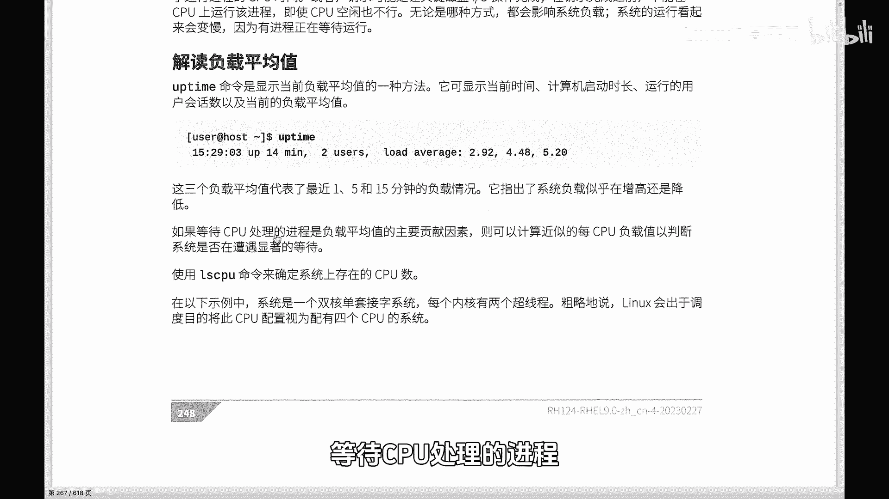
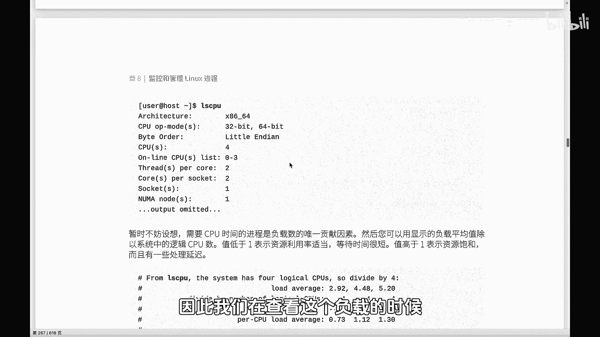

# Linux系统管理：P76：你真的会查看Linux系统负载吗？-下

## 概述
在本节课中，我们将深入探讨如何解读Linux系统的平均负载值。我们将学习如何结合逻辑CPU数量来准确判断系统负载的轻重，并理解负载值背后的核心含义。

## 系统负载的主要贡献因素
上一节我们介绍了系统负载的来源包括CPU和I/O。本节中我们来看看如何具体分析。

系统负载不仅仅是等待CPU处理进程的贡献值，还包括来自I/O的情况，包括网络I/O以及磁盘I/O。但等待CPU处理进程是平均负载值的一个主要贡献因素。因此我们在查看负载时，可能更重要的关注点是放在这一块的。

## 如何结合CPU数量解读负载
我们需要先知道当前系统当中CPU的逻辑CPU的数量。系统中也会给到你这个逻辑CPU的数量。

所以系统中也给我们的一个这样的定义，就是我们暂时不妨假想一下，需要CPU时间的进程是负载数的唯一贡献因素。注意这里给了一个前提。并不是这样的。实际上，因为我们还有I/O，但是主要因素我们现在考虑的是主要贡献因素，那就是等待CPU要运行的进程，主要是R状态的两种进程。Runnable等待的，还有一个就是排队的。一个是正在running的。

所以我们可以用这种显示的方式去计算一下，通过CPU的数量，以及进程的负载值去大致的判断一下系统的负载的情况。

如果这个值低于一表示资源利用率适当等待时间比较短。如果时间过长的话，那表示整个的等待时间很长，资源饱和，换言就是处理就会延迟。

以下是解读方法：
我们来看一个案例。案例中显示通过`lscpu`命令看到有4个逻辑CPU。在这样一个情况下，案例中给到的负载值是`2.92`，`4.48`和`5.22`。注意这个是一分钟的，这个是5分钟的，这个是15分钟的。然后逻辑CPU的数量是4。运算下来以后，每1个CPU的负载`0.73`，`1.12`和`1.30`。那么这个是最近一分钟的负载情况，这个是5分钟的。

到底是高还是低呢？这里有一些变量，其中最关键的变量就是我们CPU的数量。如果说你的CPU逻辑CPU达到16个或者32个，那你这个上面就可以更大。

下面来解读一下：
*   **最近一分钟负载**：它是73%左右，也就是说对CPU的利用率其实并没有达到饱和。等待时间比较短。这个时候系统还是比较轻松的，并没有饱和。
*   **5分钟负载**：这个5分钟，很显然，超过一，已经overload，负载的可能就比较重，达到了超过了12%。
*   **15分钟负载**：这个超过了30%。

那说明系统在最近一分钟没问题。但是在过去的5分钟和15分钟，系统负载是比较重的。这个时候我们可能要去查一下到底在过去的5分钟和15分钟到底是哪些进程，导致系统负载比较重。所以大家不要盲目的或者说直观的看到一个数字就觉得高，主要和你的CPU的数量去做一个简单的运算。

## 负载值的精确性与核心概念
但这个运算方法实际上并不是特别精确的。因为负载不只是等待CPU要运行这样一个进程的贡献因素。但是这是主要的。我们可以先把别的忽略不计，先看这个。

每个CPU我们知道空闲的CPU队列数为0。也就是现在没有任何一个进程在运行。那这个地方就是零。

每个等待CPU只要是等待CPU处理的进程就会使负载加一。那就相当于这呢你可以认为就是一个进程。如果说一个进程在CPU运行负载就是一。

我们这里的running在前面跟大家讲过，有runnable等待，还有是running。如果资源没有处在使用状态，没有等待请求，如果该进程运行了整个一分钟，那么它对这一分钟的负载平均值应约就是一。

同时我们还有就是因为磁盘和网络I/O的情况，也会去增大系统的负载。

所以我们可以看，基本上这个一的话在一以下，那说明我们的负载是比较轻的，或者接近一左右，说明整个系统的负载比较轻，同时它的利用率还是比较高的。如果明显的超过一的话，那说明我们的利用率倒是很高。但实际上整个的负载就会很重，就会导致很多的资源变得很慢。

所以大家要结合CPU结合一些实际情况去看。那大家看一下自己的这个服务器，到底负载是怎么样子，如果负载过重的话，肯定你的应用，不管是数据库还是你的网站都会有这个影响。

## 总结
本节课中我们一起学习了如何结合逻辑CPU数量来解读Linux系统的平均负载。我们明白了负载值需要除以CPU核心数来判断实际压力，并了解到负载长期过高可能意味着系统资源饱和，需要进一步排查进程。记住，负载分析是一个综合判断的过程，需要结合多个时间点的数据和系统具体配置来进行。