# Linux入门教程：P77：实时监控工具top详解 🖥️

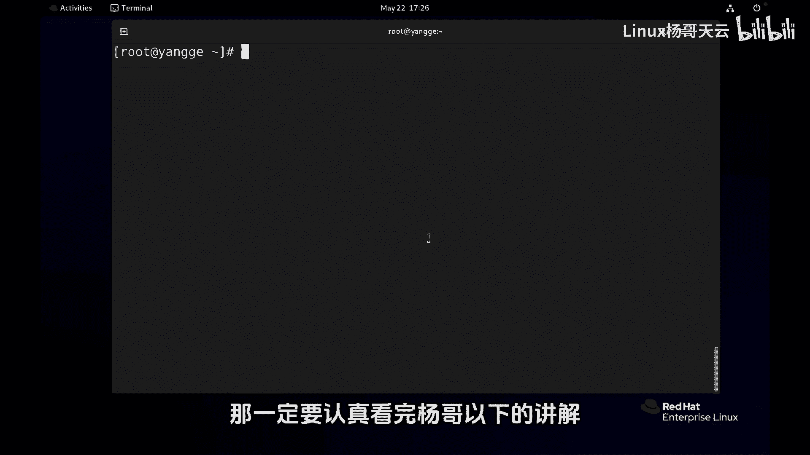

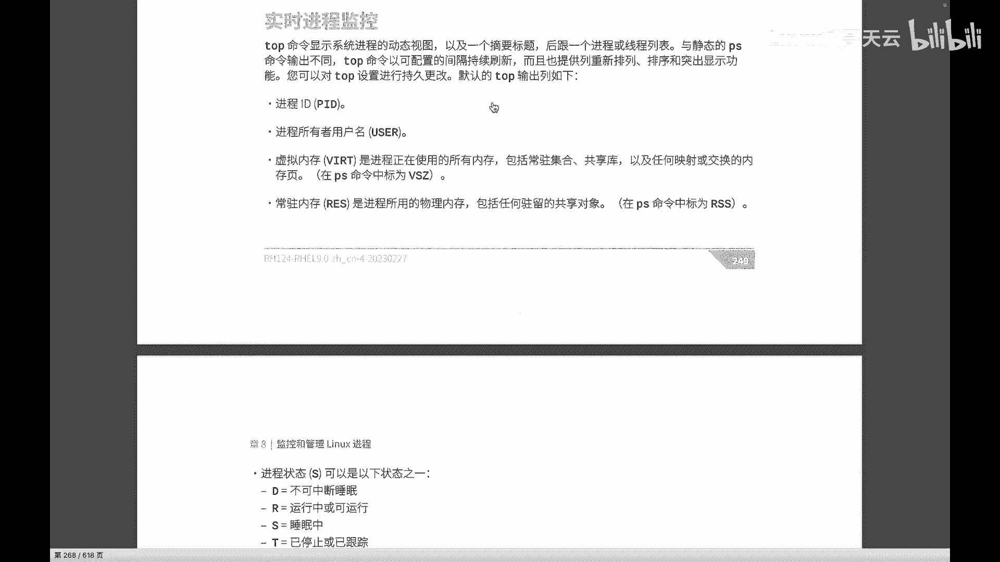

在本节课中，我们将深入学习Linux系统中强大的实时进程监控工具 `top`。我们将详细讲解其界面信息、常用交互命令以及如何自定义显示内容，帮助你高效地监控和管理系统进程。

---

## 界面概览 📊

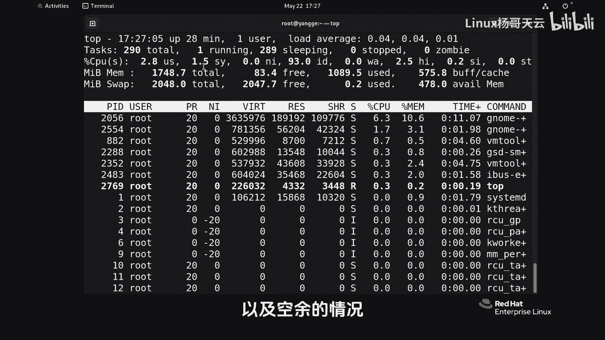

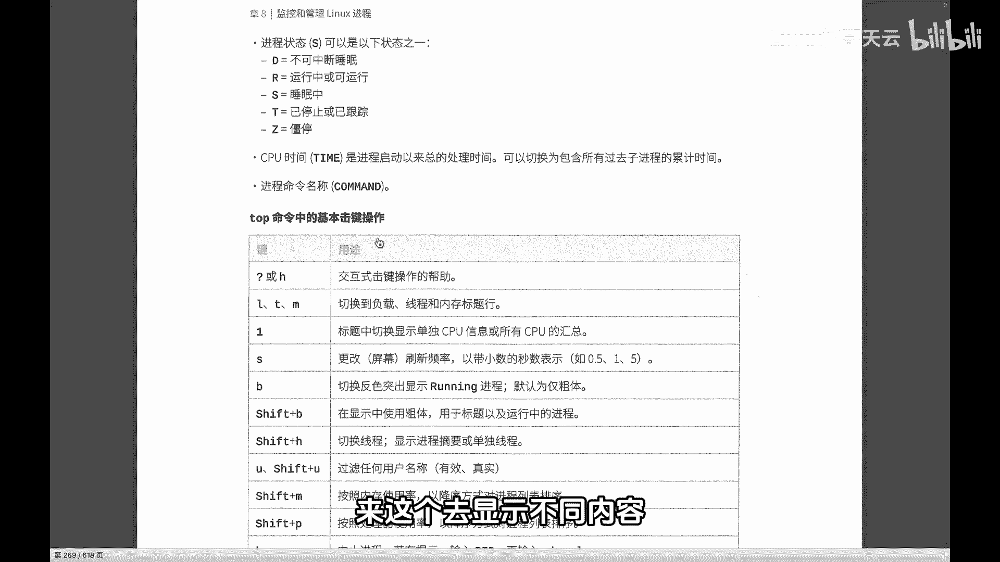

上一节我们介绍了进程的基本概念，本节中我们来看看如何使用 `top` 工具进行实时监控。启动 `top` 命令后，界面主要分为两个部分：顶部的系统摘要信息和下方的进程列表。

系统摘要信息包括：
*   **系统负载**：显示系统在1分钟、5分钟、15分钟内的平均负载。
*   **进程数量**：显示进程总数、运行中的进程数、睡眠中的进程数等。
*   **CPU使用情况**：以百分比显示用户态、系统态、空闲等CPU状态。
*   **内存使用情况**：显示物理内存和交换分区的总量、已用量和空闲量。

进程列表则默认显示各个进程的详细信息，例如：
*   **PID**：进程ID。
*   **USER**：进程所有者。
*   **%CPU**：进程的CPU使用率。
*   **%MEM**：进程的内存使用率。
*   **COMMAND**：启动进程的命令名称。

---

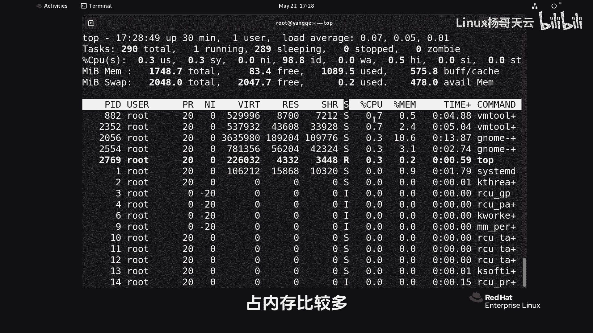

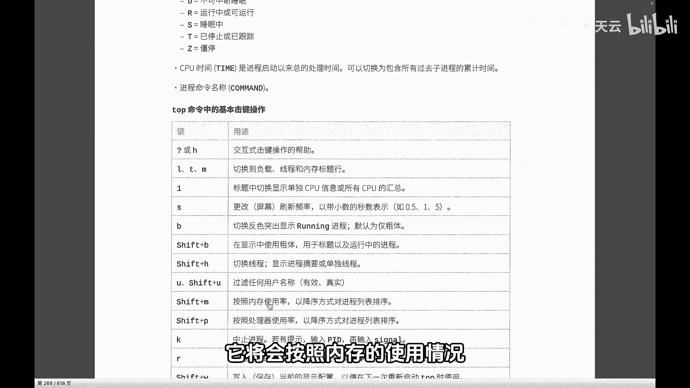

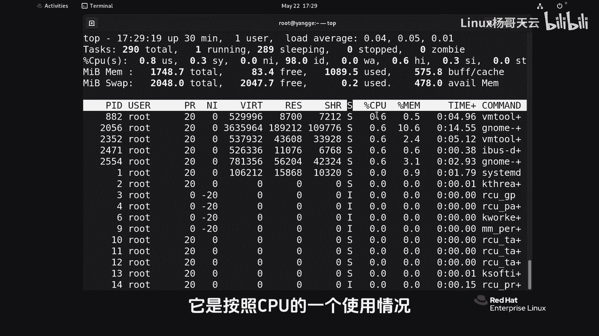

## 常用交互命令 ⌨️

在 `top` 运行界面中，可以通过快捷键执行各种操作来调整显示内容和行为。以下是几个核心且常用的交互命令：

*   **按 `1`**：切换显示所有逻辑CPU核心的详细使用情况。再次按 `1` 可收起，恢复为总体CPU摘要。
*   **按 `Shift + M`**：按照内存使用率（%MEM）对进程列表进行降序排序，便于快速找出消耗内存最多的进程。
*   **按 `Shift + P`**：按照CPU使用率（%CPU）对进程列表进行降序排序，便于快速找出消耗CPU最多的进程。
*   **按 `k`**：向指定进程发送信号（默认为终止信号 `SIGTERM`）。输入进程PID后按回车即可。
*   **按 `r`**：调整指定进程的优先级（即 `nice` 值）。输入进程PID和新优先级值后按回车。
*   **按 `q`**：退出 `top` 程序。

---

## 自定义显示字段 🔧

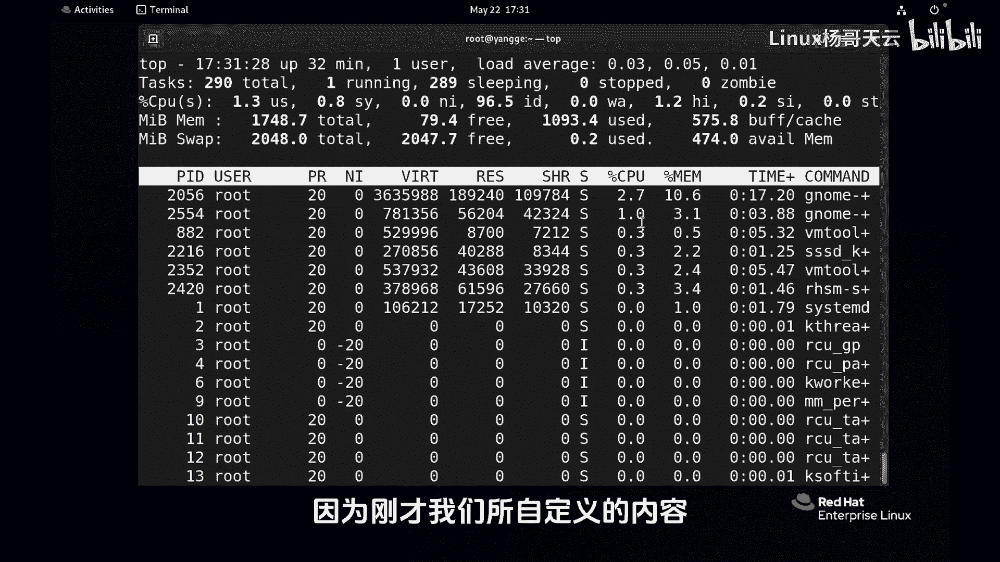

默认的进程信息字段可能无法满足所有需求，`top` 允许我们自定义显示的字段及其顺序。

以下是自定义显示字段的步骤：
1.  在 `top` 界面中，按下 `f` 键进入字段管理界面。
2.  使用上下方向键移动光标选择想要显示或隐藏的字段。
3.  按空格键 `Space` 可以切换该字段的选中状态（显示/隐藏）。
4.  选中某个字段后，使用左右方向键可以调整该字段在列表中的显示顺序。
5.  调整完毕后，按 `q` 或 `Esc` 键返回主界面。

需要注意的是，这样自定义的配置在退出 `top` 后会丢失。若想永久保存配置，可以在调整好字段后，按 `Shift + W` 将当前配置写入用户主目录下的隐藏配置文件（`~/.toprc`）中。下次启动 `top` 时，将自动加载此配置。

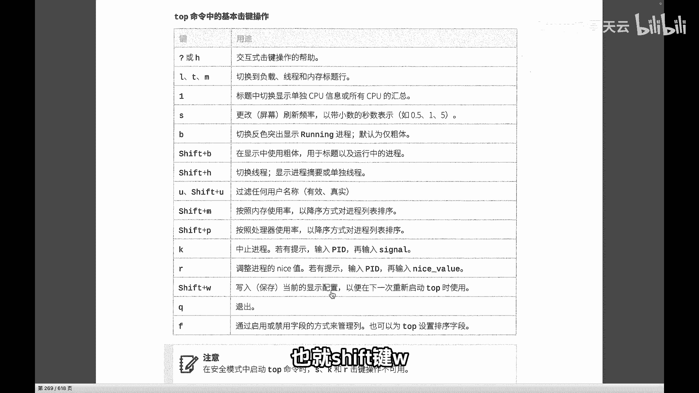

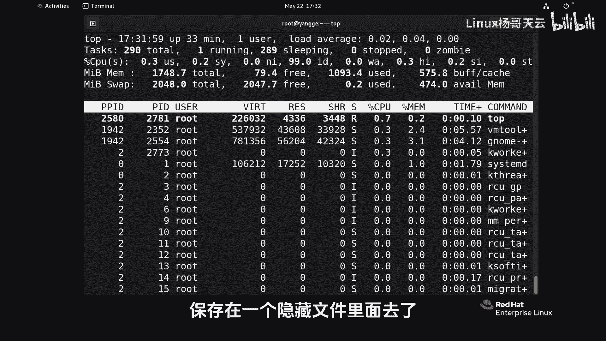

---

## 总结与思考 💡

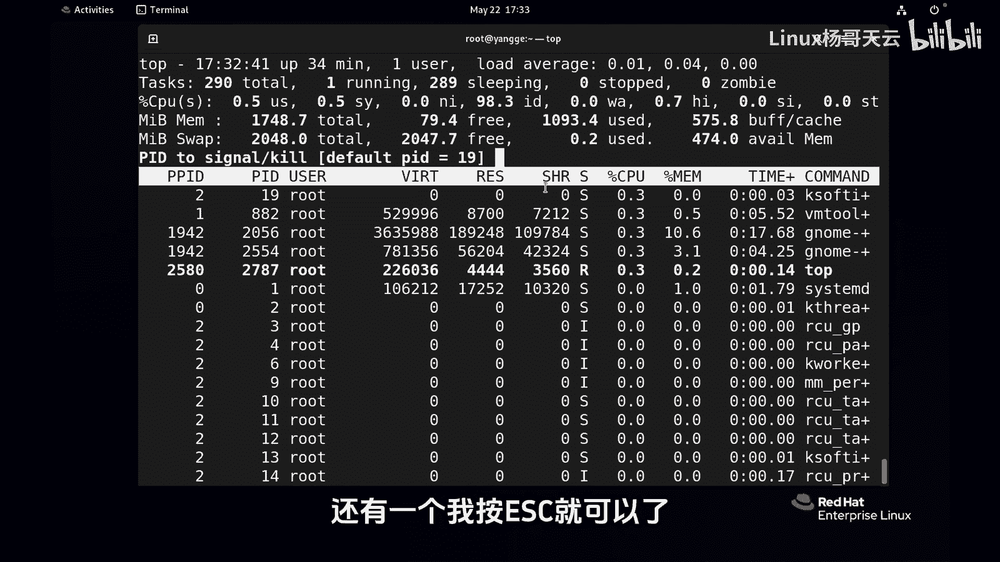

本节课中我们一起学习了 `top` 工具的核心用法。我们了解了其界面信息的含义，掌握了通过快捷键进行排序（按CPU/内存）、管理进程（发送信号、调整优先级）以及自定义显示字段等实用技巧。

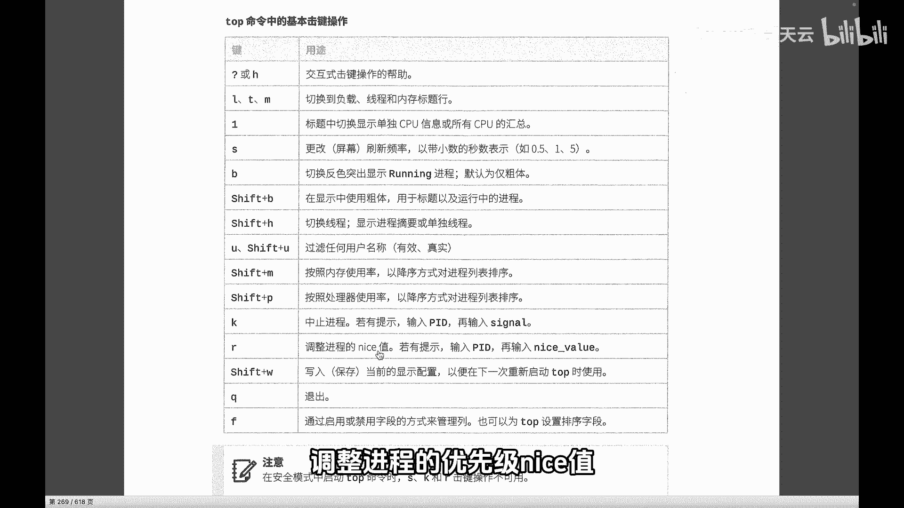

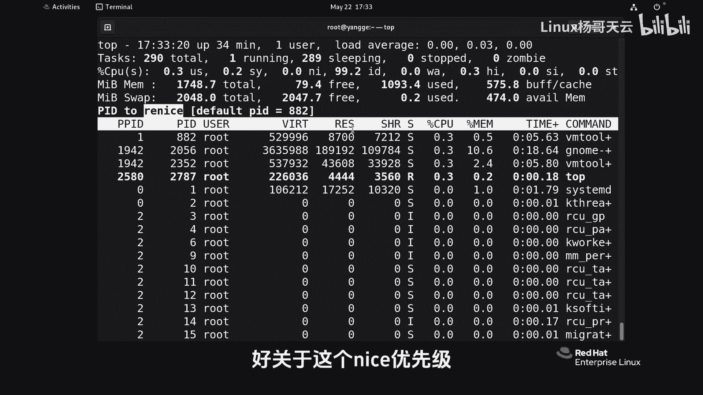

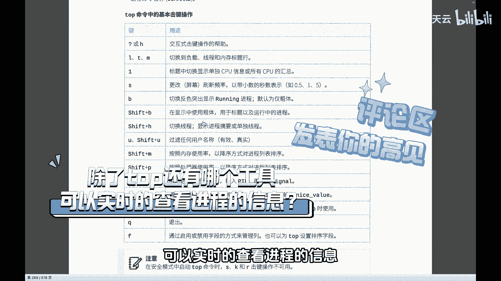

掌握 `top` 是进行系统性能监控和故障排查的基础。除了 `top`，Linux 系统中还有其他强大的实时监控工具，例如功能更丰富的 `htop`。你可以尝试探索一下，并在实践中巩固今天学到的知识。