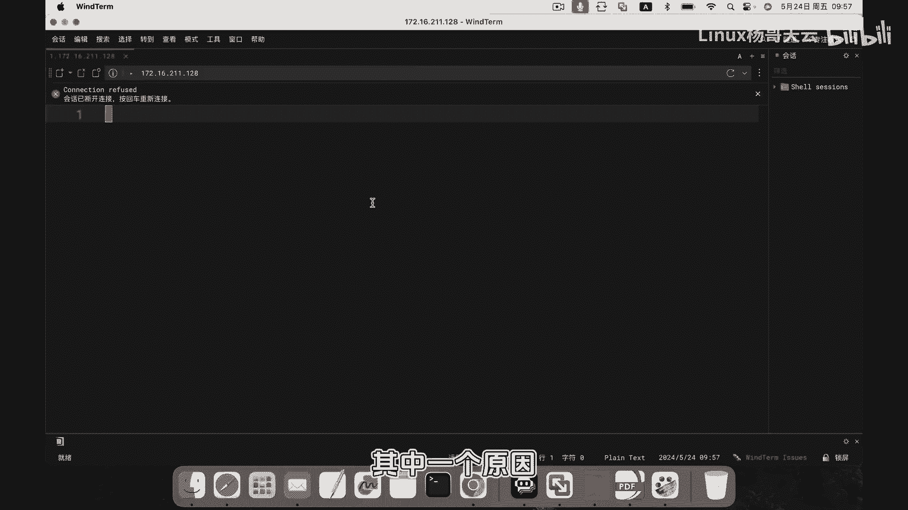
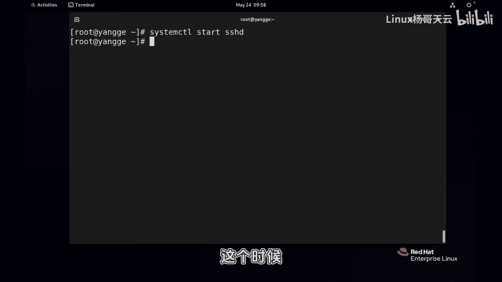
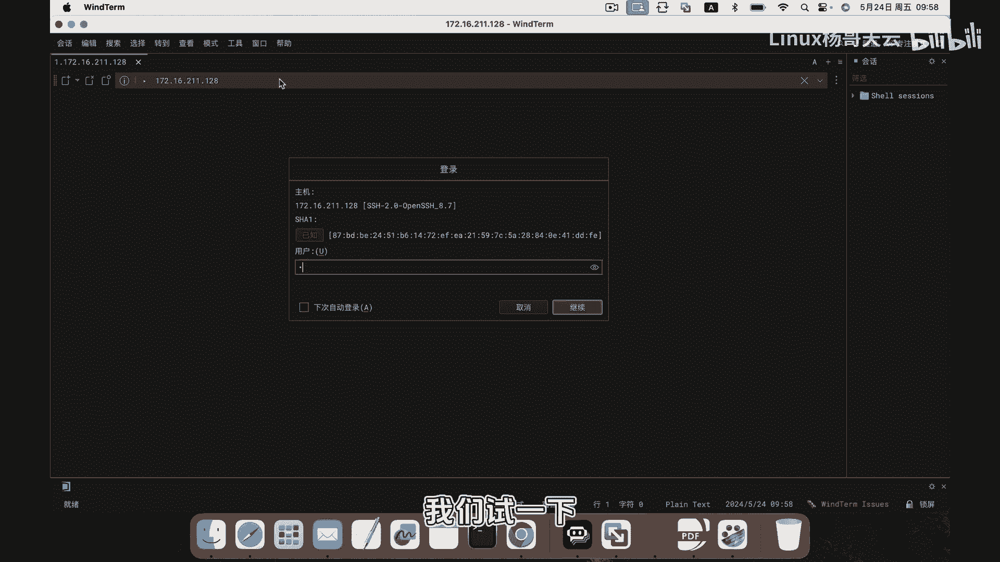
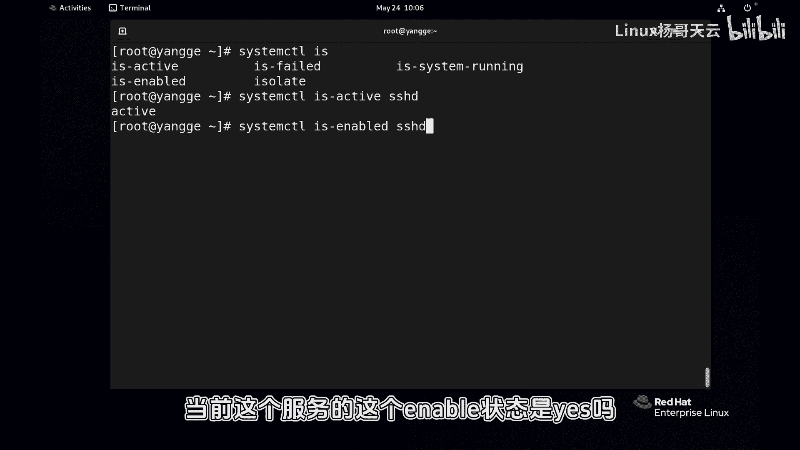
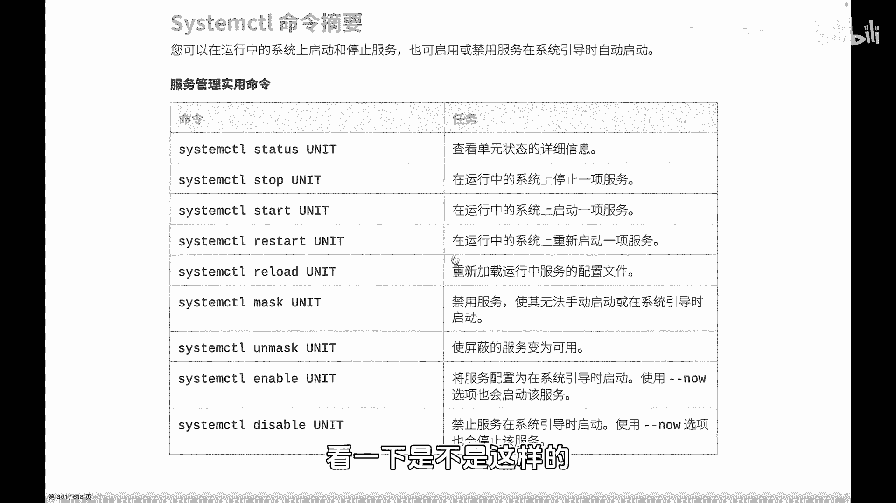

Linux入门与红帽认证RHCE通关教程：P78：SSH服务连接故障排查与systemctl服务管理



## 概述
在本节课中，我们将学习SSH远程服务连接失败的常见原因，并重点掌握使用`systemctl`命令对Linux系统服务进行启动、停止、状态查看及设置开机自启等核心管理操作。

---



## SSH连接失败的常见原因
上一节我们探讨了网络和防火墙问题，本节中我们来看看服务本身的状态。SSH服务连接不上，可能的原因有很多，例如端口未开放、防火墙规则阻止等。但一个最基础且容易被忽略的原因是：**SSHD服务本身没有运行**。如果守护进程未启动，连接自然无法建立。



## 使用systemctl管理服务
接下来，我们学习如何使用`systemctl`工具来管理系统服务。

### 检查服务状态
首先，我们需要检查SSHD服务的当前运行状态。只有`sshd`这个守护进程处于活动状态，才能接受远程连接。

执行以下命令查看服务状态：
```bash
systemctl status sshd.service
```
或者使用简写：
```bash
systemctl status sshd
```
命令输出会显示服务状态。若状态为`inactive`，则表示服务未启动，这是导致无法连接的根本原因。

### 启动与停止服务
既然发现了服务未启动，我们就需要启动它。以下是管理服务状态的核心命令。

以下是`systemctl`用于控制服务运行状态的基本命令：
*   **启动服务**：`systemctl start sshd`
*   **停止服务**：`systemctl stop sshd`
*   **重启服务**：`systemctl restart sshd`
*   **重新加载配置**：`systemctl reload sshd`

启动服务后，再次尝试SSH连接，输入正确的用户名和密码，即可成功登录。

启动后，可以再次使用`systemctl status sshd`命令验证，此时状态应变为`active (running)`。

### 设置服务开机自启
仅仅手动启动服务是不够的。在实际生产环境或红帽认证考试中，必须确保服务在系统重启后能自动运行，否则可能导致服务失效。

以下是管理服务开机自启状态的命令：
*   **启用开机自启**：`systemctl enable sshd`
*   **禁用开机自启**：`systemctl disable sshd`

使用`enable`命令后，服务单元文件会被链接到相应的系统目录，确保下次开机时自动加载。使用`status`命令查看时，会显示`enabled`。反之，`disable`命令会移除这些链接，状态显示为`disabled`。

**重要提示**：`enable`命令只设置开机自启，并不立即启动服务。如果需要**立即启动服务并同时设置开机自启**，可以使用一条组合命令：
```bash
systemctl enable --now sshd
```
这条命令等价于先后执行`systemctl start sshd`和`systemctl enable sshd`。

### restart与reload的区别
在管理服务时，理解`restart`和`reload`的区别很重要。

*   **`restart` (重启)**：先停止服务进程，再启动一个新进程。这个过程会导致服务短暂中断，所有现有连接会被断开。在生产环境中需谨慎使用。
*   **`reload` (重载)**：让正在运行的服务进程重新加载其配置文件，而**不中断**当前正在处理的连接。这是更新服务配置时更推荐的方式，但并非所有服务都支持此操作。





## 总结
本节课我们一起学习了SSH连接故障的一个关键排查点——服务状态，并深入掌握了使用`systemctl`命令管理Linux系统服务的全套方法。核心要点包括：检查服务状态(`status`)、控制服务运行(`start`, `stop`, `restart`, `reload`)、以及配置服务开机自启(`enable`, `disable`)。请务必动手练习这些命令，确保服务在设置后能够正常远程访问。