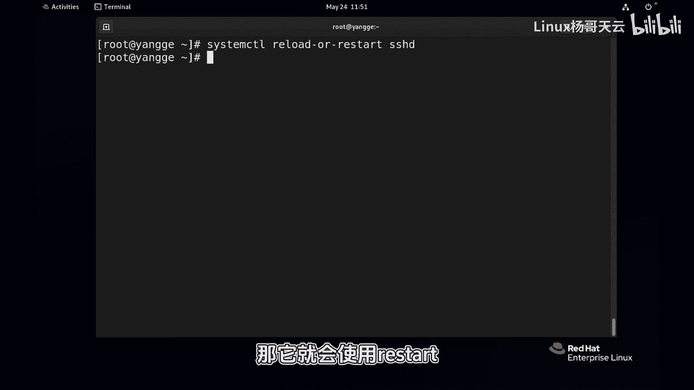

# Linux服务管理：79：restart与reload的区别 🔄

在本节课中，我们将要学习Linux系统服务管理中两个关键操作：`restart`和`reload`的区别。理解它们的不同对于高效、安全地管理服务至关重要。

## 进程ID的观察

上一节我们介绍了服务的基本概念，本节中我们来看看如何观察一个服务的进程。以SSHD服务为例，我们可以通过命令查看其进程ID（PID）。

```bash
ps -ef | grep sshd
```

或者使用`systemctl`命令查看状态：


```bash
systemctl status sshd
```

执行命令后，可以看到SSHD服务有一个主进程ID，并且可能伴随多个子进程。主进程ID是服务管理的核心标识。

## restart操作的影响

当我们修改了服务的配置文件后，一种选择是使用`restart`操作。这个操作会完全重启服务。

以下是执行`restart`的步骤和影响：

1.  执行重启命令：
    ```bash
    systemctl restart sshd
    ```
2.  观察进程ID变化。执行`restart`后，服务的主进程ID会发生变化，这意味着旧的进程被关闭，然后启动了一个全新的进程。

这种方式的缺点是，对于某些需要保持连接状态或进行监控的服务，进程ID的改变可能会造成影响。

## reload操作的影响

另一种选择是使用`reload`操作。这个操作旨在让服务重新加载其配置文件，而不中断其主进程。

以下是执行`reload`的步骤和影响：

1.  记住服务当前的进程ID。
2.  执行重载命令：
    ```bash
    systemctl reload sshd
    ```
3.  再次观察进程ID。执行`reload`后，服务的主进程ID保持不变。

`reload`方式的优点是，它不会改变进程ID，因此对依赖于该ID的其他进程或连接影响最小。修改配置文件后，应优先考虑使用`reload`。

## 智能选择：reload-or-restart

有时我们不确定一个服务是否支持`reload`操作。为此，`systemd`提供了一个智能命令。

以下是关于`reload-or-restart`命令的介绍：

`systemctl`提供了`reload-or-restart`命令。该命令的执行逻辑是：系统会首先尝试`reload`操作；如果服务不支持`reload`或重新加载配置失败，系统将自动执行`restart`操作。这是一种“先礼后兵”的稳妥策略。



本节课中我们一起学习了`restart`和`reload`的核心区别：`restart`会重启服务并改变其进程ID，而`reload`则重新加载配置并保持进程ID不变。在修改服务配置后，应优先使用`reload`，若不明确服务是否支持，则可以使用`reload-or-restart`命令作为最佳实践。