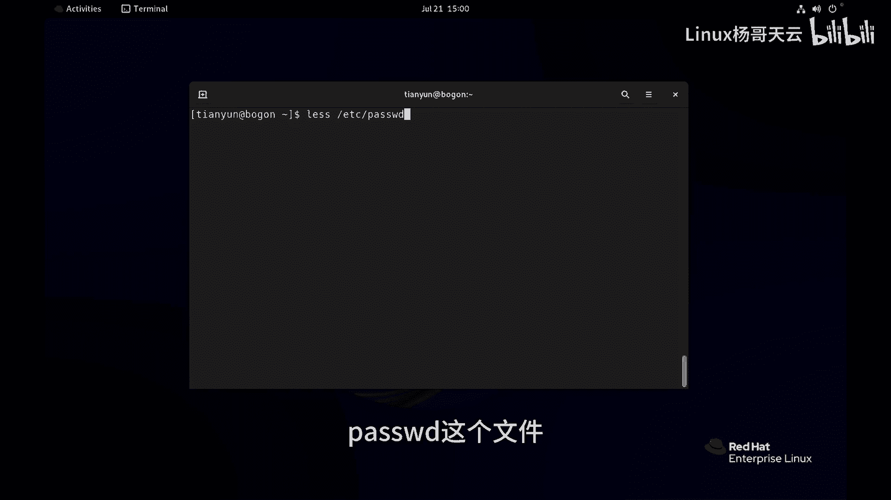
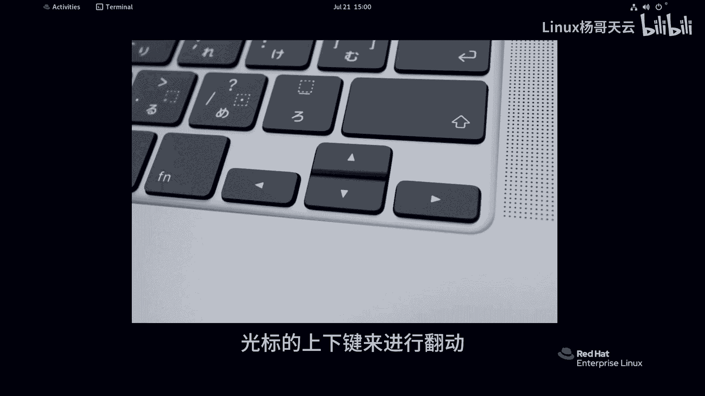
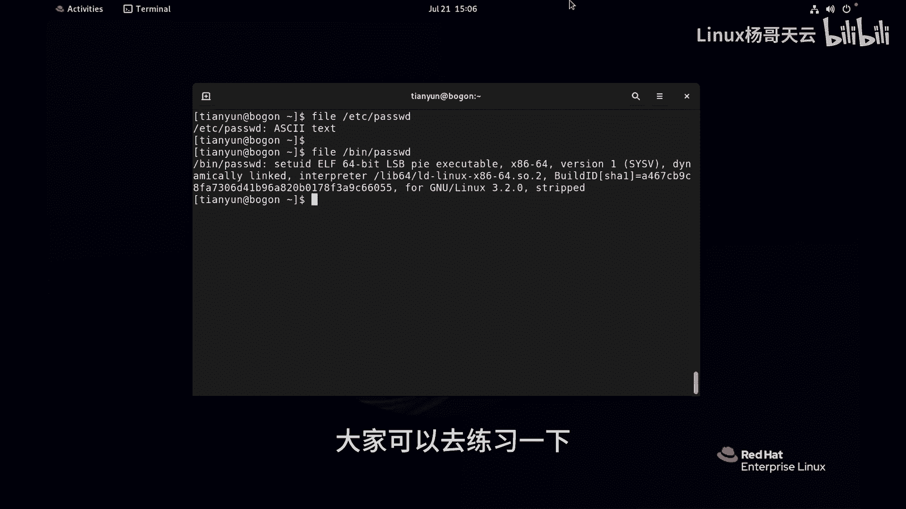

Linux入门教程：P7：如何在Linux中查看文件内容？ 📄

## 概述
在本节课中，我们将学习如何在Linux系统中查看文件的内容。这是文件管理的基础操作，掌握不同的查看命令能帮助我们高效地处理文本信息。

上一节我们介绍了Linux的基本操作，本节中我们来看看如何查看文件的具体内容。





## 使用 `cat` 命令查看文件
`cat` 命令适合查看内容较少的文件。其基本语法是：
```bash
cat [文件名]
```
例如，查看 `/etc/hosts` 文件：
```bash
cat /etc/hosts
```
如果文件内容很长，例如 `/etc/passwd`，使用 `cat` 命令会导致内容快速滚过屏幕，不便阅读。

## 使用 `less` 命令分页查看
对于内容较多的文件，推荐使用 `less` 命令。它可以分页显示，方便上下翻看。
```bash
less [文件名]
```
例如：
```bash
less /etc/passwd
```
在 `less` 的浏览界面中，可以使用**上下方向键**或**Page Up/Page Down**键翻页。按 **`q`** 键即可退出浏览模式。

## 查看文件的开头与结尾
有时我们只需要查看文件的开头或结尾部分。

以下是查看文件开头的命令：
`head` 命令默认显示文件的前10行。使用 `-n` 选项可以指定显示的行数。
```bash
head [文件名]
head -n 5 [文件名] # 显示前5行
```
例如，查看 `/etc/passwd` 的前两行：
```bash
head -n 2 /etc/passwd
```

以下是查看文件结尾的命令：
`tail` 命令默认显示文件的末尾10行。同样可以使用 `-n` 选项。
```bash
tail [文件名]
tail -n 5 [文件名] # 显示末尾5行
```
例如，查看 `/etc/passwd` 的末尾五行：
```bash
tail -n 5 /etc/passwd
```

## 使用 `wc` 命令统计文件信息
`wc` 命令用于统计文件的行数、单词数和字符数。
```bash
wc [文件名]
```
其输出格式为：**行数 单词数 字符数 文件名**。
例如，统计 `/etc/passwd`：
```bash
wc /etc/passwd
```
可以使用选项进行特定统计：
*   `-l`： 仅统计行数。
*   `-w`： 仅统计单词数。
*   `-c`： 仅统计字符数。
例如：
```bash
wc -l /etc/passwd # 只显示文件行数
```

## 重要提醒：查看文本文件
请注意，以上命令主要用于查看**文本文件**。如果尝试用它们查看二进制文件（如可执行程序），屏幕上会显示乱码。
可以使用 `file` 命令来确认文件类型：
```bash
file /etc/passwd # 显示为 ASCII text
file /bin/bash    # 显示为 ELF 64-bit LSB executable
```
就像无法用记事本正常打开一个视频文件一样，不要用文本查看命令去处理二进制文件。



## 总结
本节课中我们一起学习了在Linux中查看文件内容的几种核心命令：
*   `cat`： 快速查看短小文件。
*   `less`： 分页浏览长文件。
*   `head`/`tail`： 查看文件的开头或结尾。
*   `wc`： 统计文件的基本信息。
同时，我们明确了这些命令主要针对**文本文件**进行操作。熟练掌握这些命令，是进行后续文件管理和系统分析的基础。