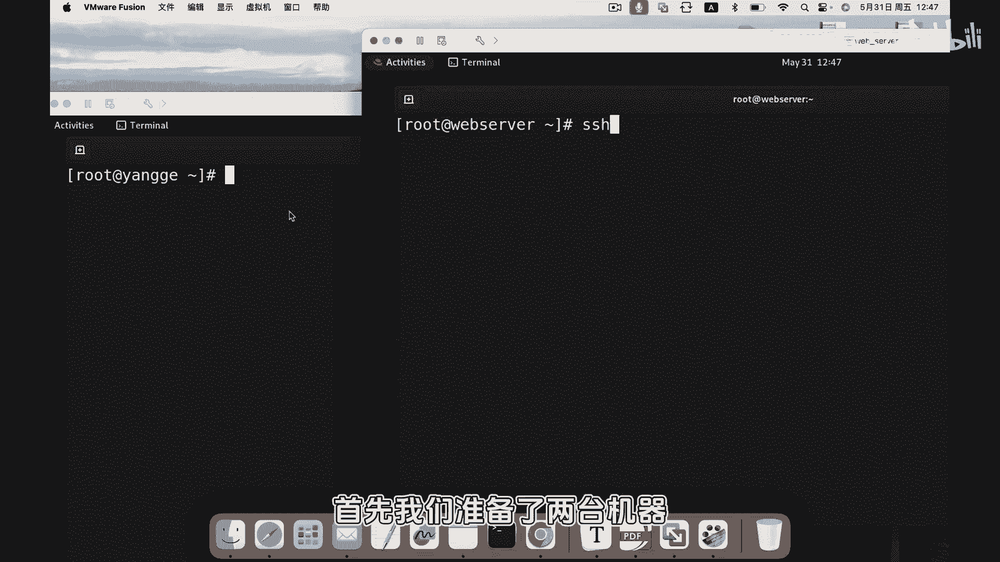
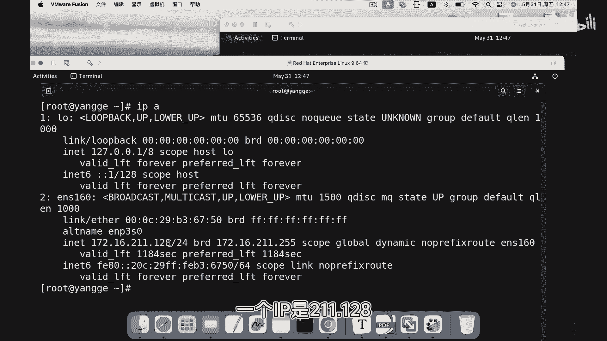
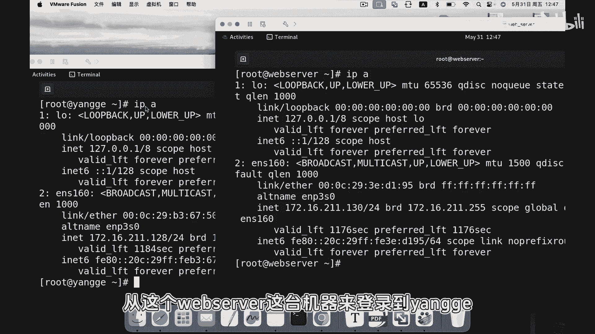
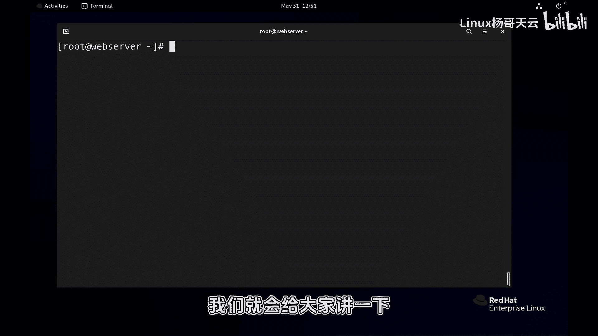

# Linux入门教程：P80：SSH登录远程服务器

## 概述
在本节课中，我们将学习如何使用SSH协议登录远程Linux服务器。SSH是远程管理服务器的重要工具，无论从Linux还是Windows系统，都可以通过SSH客户端连接到服务器进行操作。

## 准备工作
在开始登录之前，我们需要确认网络连通性。以下是检查步骤。





首先，我们准备了两台机器。一台服务器的IP地址是`192.168.211.128`，主机名为“杨哥”。另一台客户机的IP地址是`192.168.211.130`，主机名为“webs server”。我们将从`webs server`登录到“杨哥”服务器。

### 检查网络连通性
在连接之前，应先使用`ping`命令探测目标主机是否可达。



```bash
ping 192.168.211.128
```
命令执行后，如果收到回复，说明网络是通的。在Linux中，`ping`命令默认会持续发送数据包，可以使用 `Ctrl + C` 终止。

## SSH登录操作
上一节我们确认了网络连通性，本节中我们来看看如何使用SSH客户端进行登录。

### 默认用户登录
使用SSH命令连接时，如果不指定用户名，客户端会尝试以当前本地用户名进行连接。

执行以下命令：
```bash
ssh 192.168.211.128
```
如果是第一次连接该服务器，系统会提示接受主机的公钥指纹，输入 `yes` 确认。
随后，系统会提示输入目标主机上对应用户（本例中为`root`）的密码。输入正确密码后，即可登录成功。命令提示符会变为目标主机的信息。

### 指定用户登录
如果需要以特定的用户身份登录，可以在命令中指定用户名。

执行以下命令格式：
```bash
ssh username@host_ip
```
例如，要以用户 `tianyun` 登录：
```bash
ssh tianyun@192.168.211.128
```
接下来，输入用户 `tianyun` 在目标服务器上的密码即可登录。

**核心概念**：SSH登录命令的基本格式是 `ssh [用户名@]主机名或IP地址`。如果不提供用户名，则默认使用当前本地用户名。

### 登录身份验证过程
以下是SSH登录过程中的关键步骤：
1.  **发起连接**：客户端向服务器发起连接请求。
2.  **密钥交换**：首次连接时，服务器会发送其公钥，客户端需要确认并接受。
3.  **身份验证**：客户端提供用户名和密码（或其他认证方式）给服务器进行验证。
4.  **建立会话**：验证通过后，在客户端打开一个远程终端会话。

## 其他环境登录说明
从Linux系统登录远程服务器的方式如上所述。如果要从Windows系统登录，需要安装SSH客户端工具，例如PuTTY、Xshell或Windows 10及以上版本自带的OpenSSH客户端。其连接原理和需要的信息（主机IP、用户名、密码）与在Linux中相同。

## 注意事项与后续内容
在实际生产环境中，出于安全考虑，可能会禁用`root`用户的远程SSH登录。因此，通常使用普通用户登录后，再通过`su`或`sudo`命令切换权限。

在后面的课程中，我们将讲解如何配置SSH服务，例如禁用root远程登录、使用密钥对认证等安全加固行为。



## 总结
本节课中我们一起学习了SSH远程登录的基本操作。我们首先通过`ping`命令测试了网络连通性，然后使用`ssh`命令以默认用户和指定用户两种方式登录了远程服务器，并了解了登录的基本流程。记住核心命令格式 `ssh user@host`，你就可以轻松地从一台机器管理另一台服务器了。