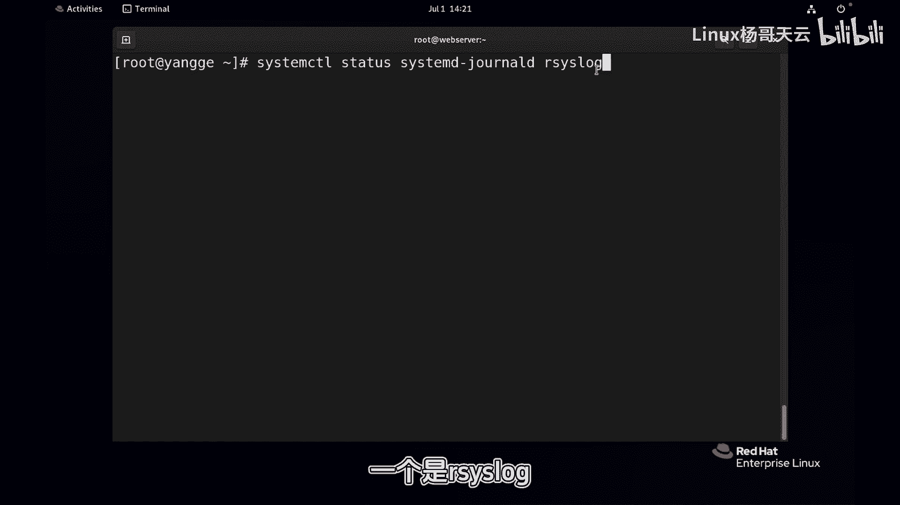
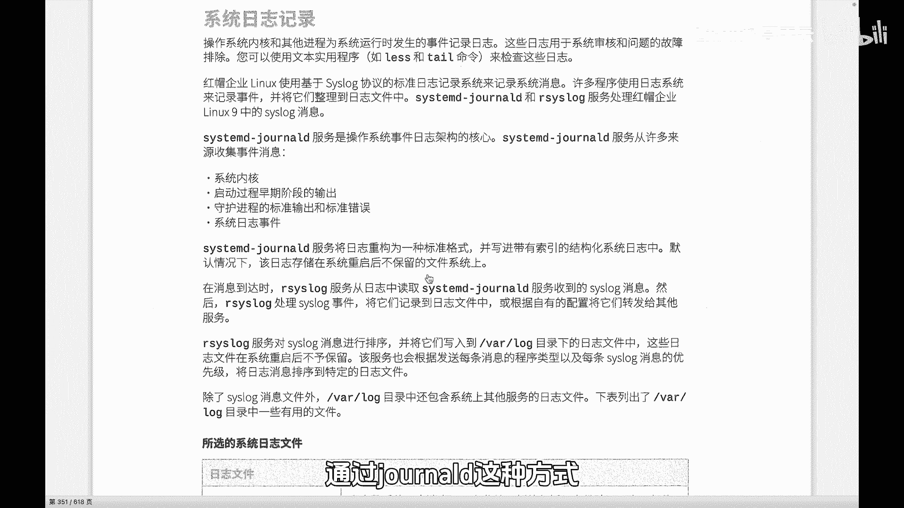
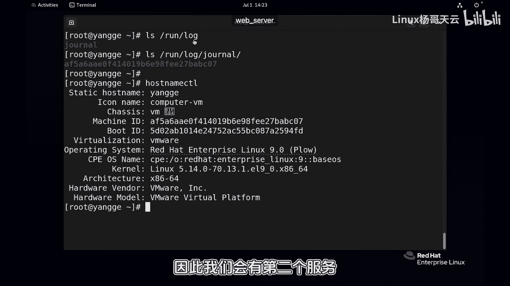
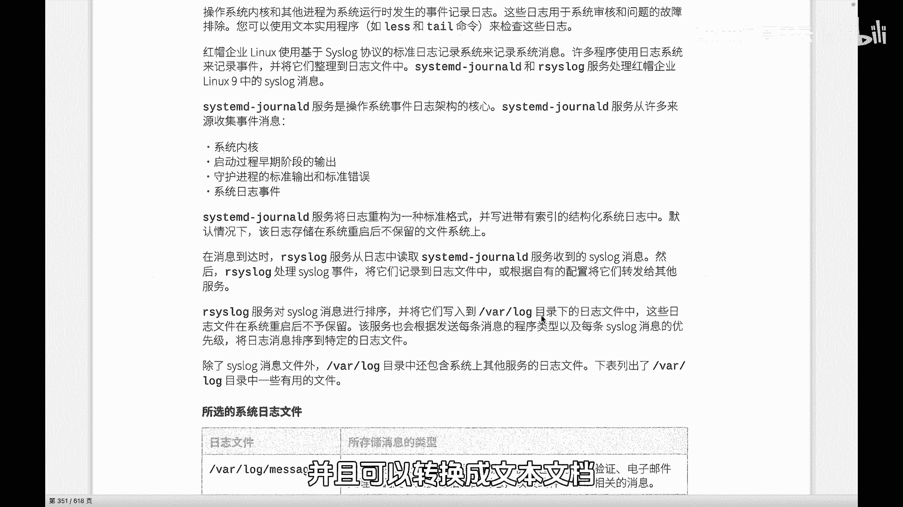
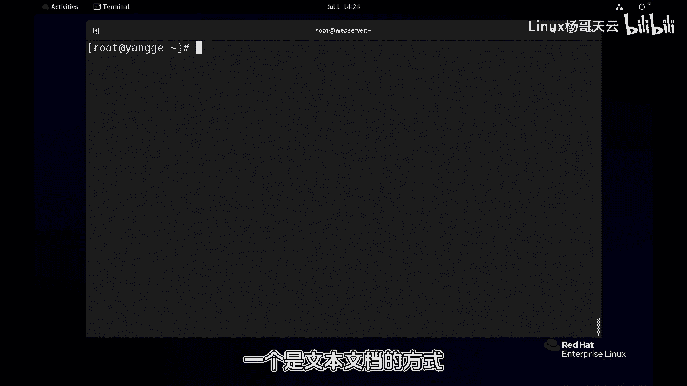
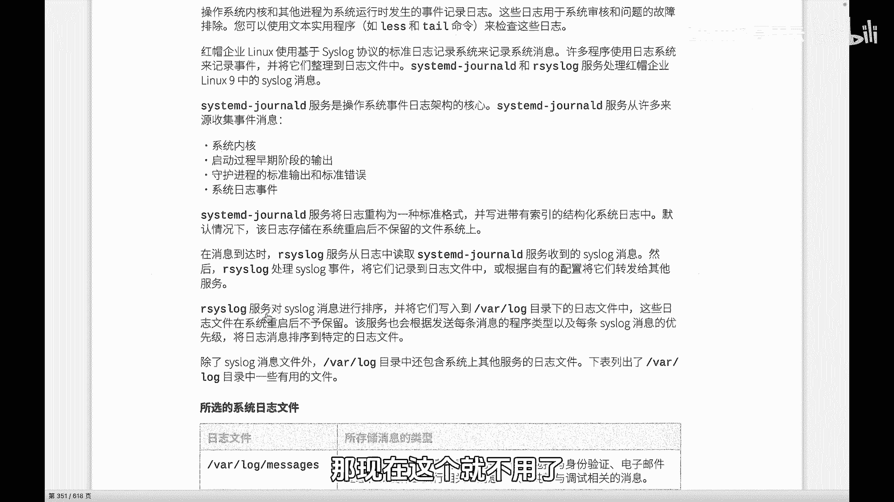

Linux入门教程：P84：systemd-journald和rsyslog

在本节课中，我们将要学习Linux系统中两个重要的日志服务：`systemd-journald`和`rsyslog`。我们将探讨它们各自的作用、区别以及它们如何协同工作来管理系统日志。

---

### 🎼 为什么系统中有两个日志服务？

我们的系统中同时运行着`systemd-journald`和`rsyslog`两个日志服务。本节将讲解这两个服务的核心区别。

`systemd-journald`是系统最核心的日志架构。它会从多个来源收集日志，包括：
*   系统内核
*   系统启动过程
*   各种守护进程的标准输出和错误输出
*   系统事件

日志对于排查系统问题和故障至关重要，因此查看日志是一项非常重要的技能。

那么，`systemd-journald`和`rsyslog`具体有何不同呢？



---

### 🎼 systemd-journald：二进制日志收集器

上一节我们介绍了两个日志服务并存的现象，本节中我们来看看`systemd-journald`的特点。



首先，`systemd-journald`负责收集日志。其日志经过压缩和格式化处理，并以**二进制数据**的形式存储。这种格式使得日志的查看和定位速度非常快。我们将在后续课程中讲解如何使用`journalctl`命令来快速定位日志。

以下是`systemd-journald`日志的存储位置：
```bash
/run/log/journal/
```
在该目录下，可以找到以主机ID（例如`AF5A...`）命名的目录，其中存储了该主机的相关日志。可以通过命令`hostnamectl`查看本机的主机ID。

需要重点注意的是，存储在`/run/`目录下的日志是**非持久化**的，即它们保存在内存中。当系统重启后，这些日志会全部消失，并且它们也只保留有限的时间。因此，`systemd-journald`无法长久地记录日志。

---

### 🎼 rsyslog：持久化的文本日志

由于`systemd-journald`的日志无法持久保存，因此我们引入了第二个服务：`rsyslog`。

`rsyslog`会从`systemd-journald`获取日志信息，并将其转换为**文本文档**格式。这些文本日志通常保存在`/var/log/`目录下。与内存存储不同，硬盘上的存储是**持久化**的。

两者的主要区别在于存储格式和位置：一个是二进制的、临时的；另一个是文本的、永久的，便于直接查看。



---



### 🎼 系统启动日志的收集



两者还有一个重要区别涉及系统启动过程的日志记录。

在系统开机过程中，`rsyslog`服务可能尚未启动。这意味着，在`rsyslog`成功启动之前产生的日志（例如开机日志），默认情况下是无法被它记录的。过去，这部分日志由一个名为`klog`的服务负责记录，然后再转发给`rsyslog`。

但现在，这个任务已经由`systemd-journald`接管。现代的`systemd-journald`能够完成包括开机日志在内的所有系统日志的收集工作。

---

### 总结



本节课中我们一起学习了Linux的两个核心日志服务。`systemd-journald`作为二进制日志收集器，速度快但日志非持久化；而`rsyslog`则从前者获取日志，并将其转换为持久化的文本格式存储在`/var/log/`目录下。同时，`systemd-journald`也负责收集系统启动阶段的日志，确保了日志记录的完整性。理解二者的分工与协作，是有效进行系统日志管理的基础。