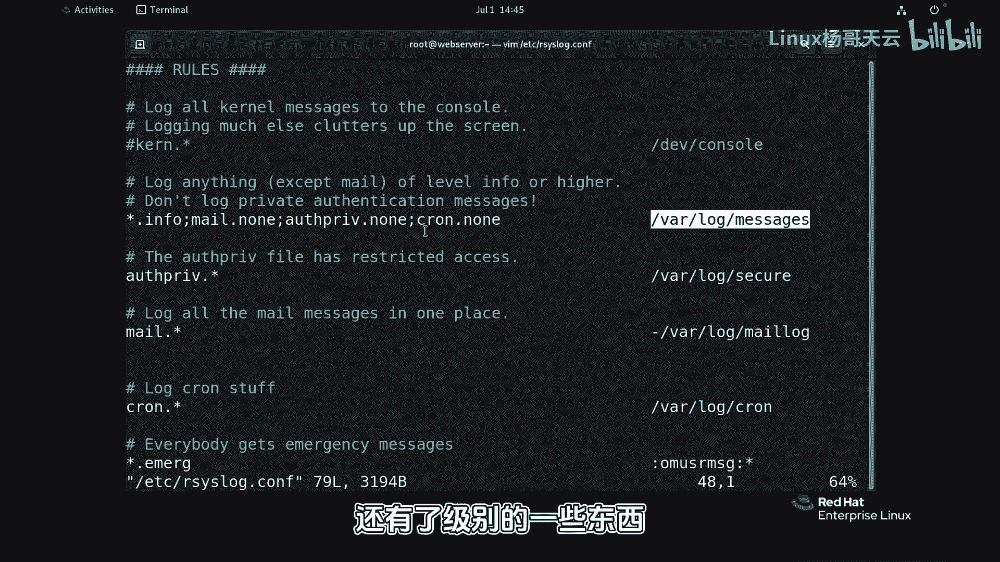
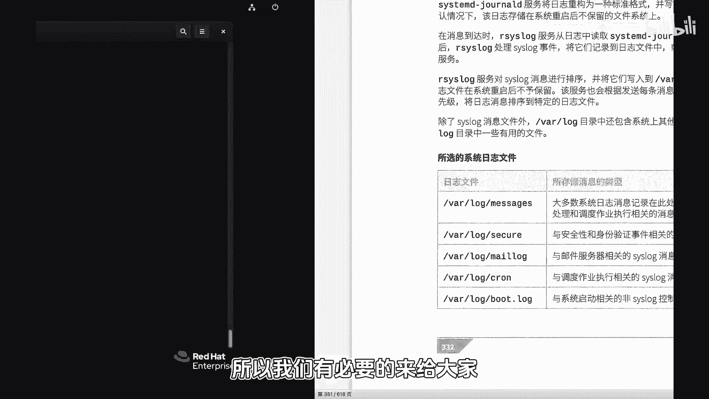
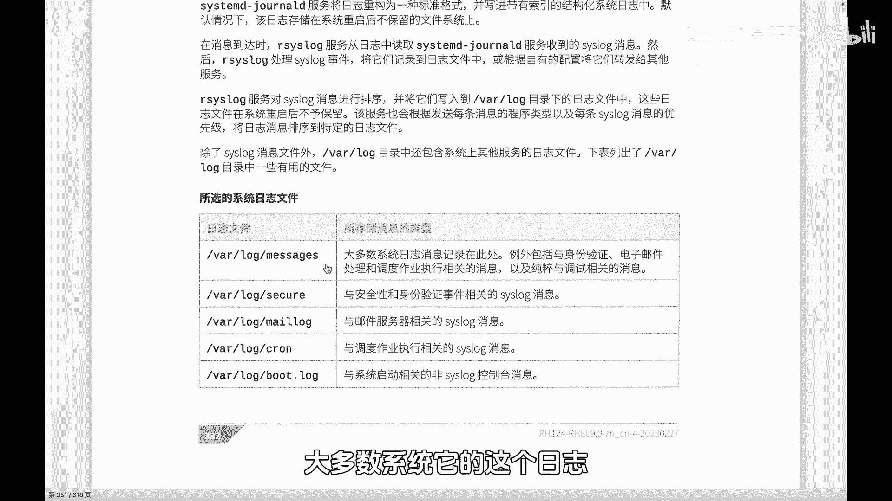
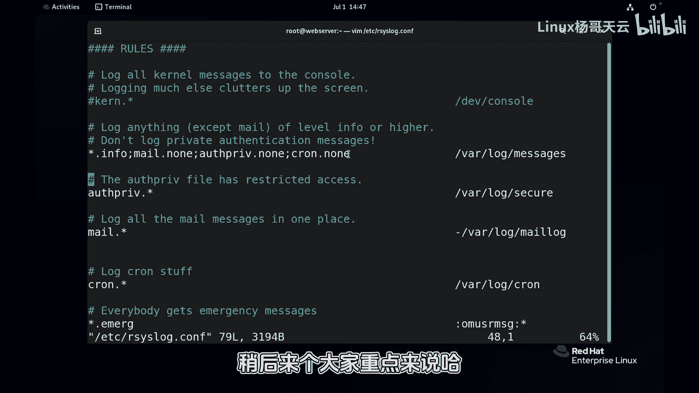
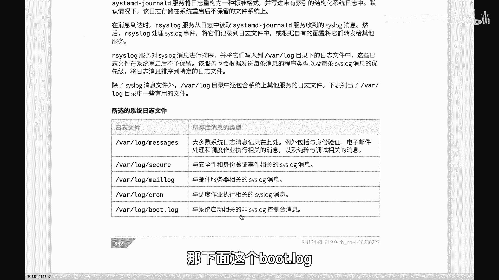
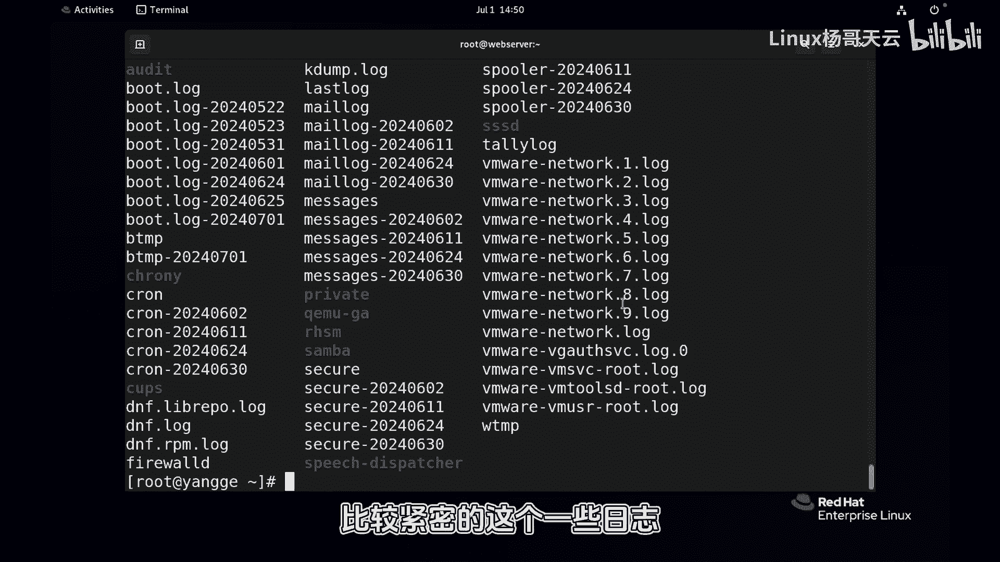

# Linux入门与RHCE认证：85：Linux常见的日志

在本节课中，我们将要学习Linux系统中日志的分类与常见日志文件。日志是系统运行状态的记录，理解它们对于系统管理和故障排查至关重要。

## 日志的分类与处理机制

上一节我们介绍了日志的基本概念，本节中我们来看看日志是如何被分类和处理的。

在 `/var/log` 目录下，你会看到许多日志文件，例如 `boot.log`、`cron` 以及带有时间戳的日志和 `dnf.log` 等。这表明日志是分类存储的。



然而，有一点需要注意：`/run/log/journal` 目录下的日志（由 `systemd-journald` 服务管理）是不分类的。它是一个整体，以二进制特殊格式存储，便于高效查看和检索。`systemd-journald` 负责收集日志，但它本身不进行分类。

而 `rsyslog` 服务（或较新系统的 `journald` 配合 `rsyslog`）则负责读取日志数据，并根据预定义的规则进行分类和存储。例如，打开 `/etc/rsyslog.conf` 配置文件，你会发现其中定义了规则，指定了不同级别和类型的日志应存储到哪个文件。



## 常见的日志文件

了解了日志的处理机制后，接下来我们认识一些关键的日志文件。记住，`/run/log/journal` 下的日志是未分类的二进制格式。我们通常需要将日志分类并持久化存储到不同文件中，`rsyslog` 默认就提供了这种持久化功能。



以下是系统中最常见和重要的日志文件：

*   **`/var/log/messages`**：这是系统的主日志文件。在 `rsyslog.conf` 配置规则中，通常将大多数设备和信息级别的日志记录在此处。这是系统管理员必须关注的核心日志。
*   **`/var/log/secure`**：这是安全日志，主要记录与系统安全相关的事件，例如用户登录成功或失败、认证过程等。
*   **`/var/log/maillog`**：这是与电子邮件服务相关的日志。
*   **`/var/log/cron`**：这是与计划任务（cron）相关的日志。
*   **`/var/log/boot.log`**：这是与系统启动过程相关的日志。

有一些例外情况，例如某些服务的日志量较大或有特殊需求，它们不会存储在 `messages` 文件中，而是有独立的日志文件。

## 查看日志的常用方法





认识日志文件后，我们来看看如何查看它们。

以下是几种查看日志的常用命令：

*   查看主日志文件的最新内容：
    ```bash
    tail -f /var/log/messages
    ```
    使用 `tail -f` 命令可以持续监控日志文件的尾部，任何新写入的日志都会实时显示出来。

*   查看系统启动过程的详细日志：
    ```bash
    journalctl -b
    ```
    此命令通过 `journalctl` 工具查看从本次系统引导到正常启动整个过程中的日志，包括硬件检测、驱动加载等。内容较多时，可以配合 `grep` 进行过滤。

*   查看所有用户账号最近一次登录的信息：
    ```bash
    lastlog
    ```
    此命令会显示每个系统账号最近一次登录的时间、终端或来源IP地址。它读取的是 `/var/log/lastlog` 等日志文件中的信息。

*   查看用户登录历史记录：
    ```bash
    last
    ```
    此命令显示系统近期的用户登录记录，包括登录用户、终端、来源IP和登录/登出时间。

需要注意的是，`last` 和 `lastlog` 等工具读取的是 `/var/log/wtmp`、`/var/log/btmp` 和 `/var/log/lastlog` 等由系统维护的特定日志文件。此外，一些自行安装的服务（如Web服务器、数据库）可能不依赖系统的 `rsyslog` 或 `journald`，它们拥有自己独立的日志处理方式和存储路径，通常记录与自身运行紧密相关的信息。



本节课中我们一起学习了Linux日志的分类机制、认识了 `/var/log/messages`、`/var/log/secure` 等关键日志文件，并掌握了使用 `tail`、`journalctl`、`lastlog` 和 `last` 等命令查看日志的基本方法。理解并熟练查看这些日志，是进行系统状态监控和问题诊断的基础技能。