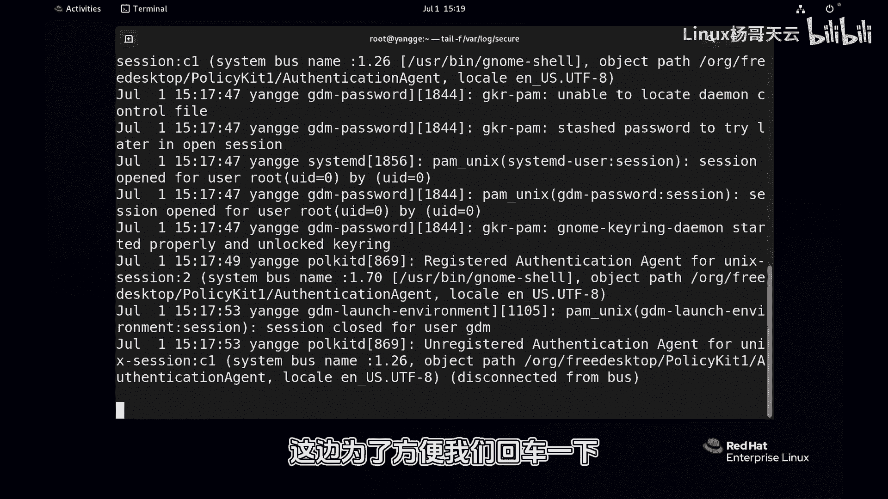
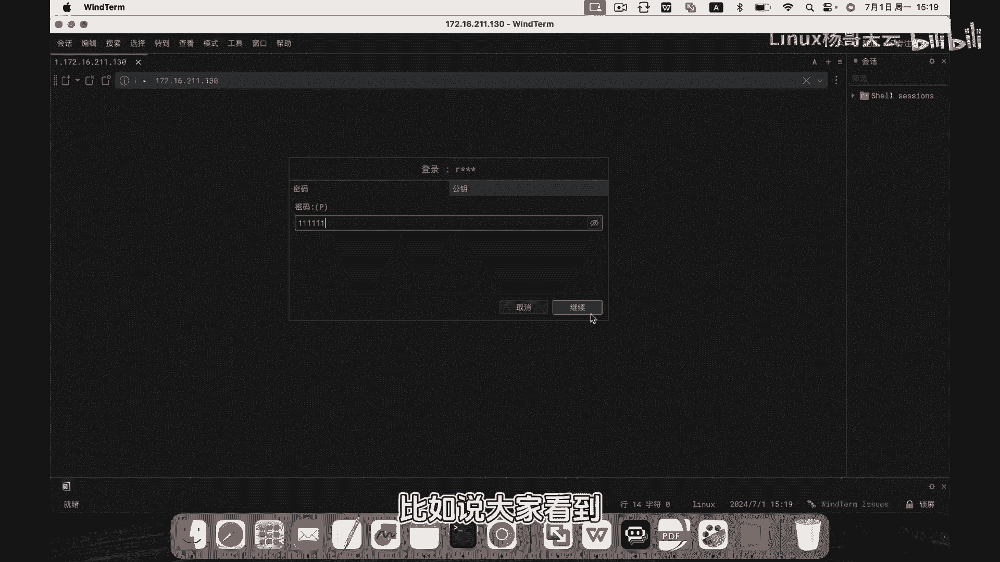
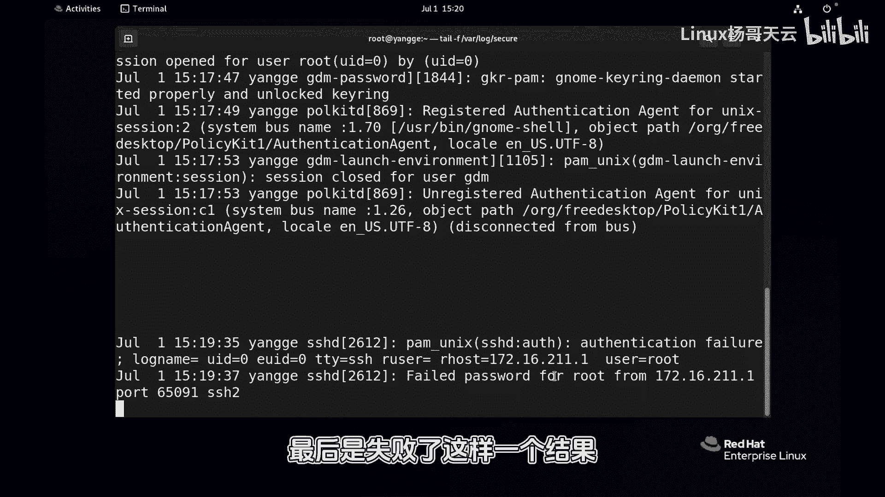
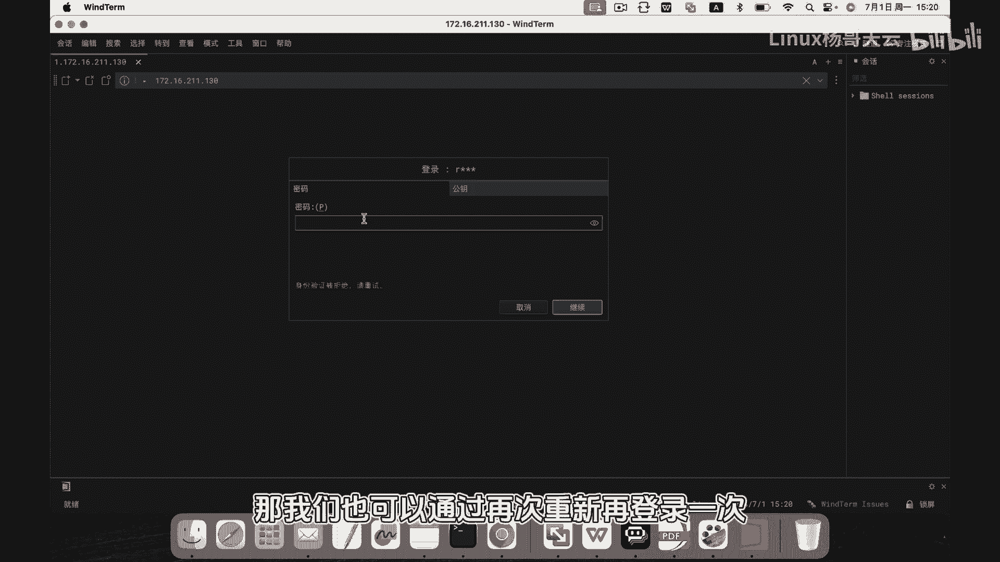
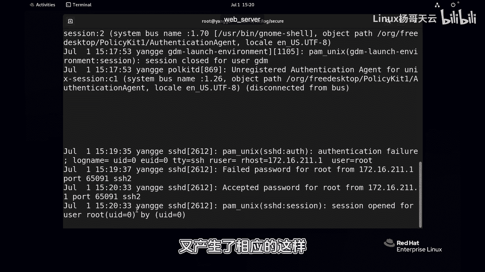

Linux入门与红帽认证RHCE：P86：通过日志监控登录失败的用户

在本节课中，我们将学习如何通过分析系统日志来监控和识别尝试登录失败的用户。这对于系统安全审计和故障排查至关重要。

上一节我们介绍了日志系统的基本概念，本节中我们来看看如何具体应用这些知识来监控登录行为。

首先，我们需要知道系统的安全日志通常存储在 `/var/log/secure` 文件中。我们可以使用 `tail` 命令配合 `-f` 参数来实时监控这个文件的更新。

```bash
tail -f /var/log/secure
```

执行上述命令后，终端会持续显示日志文件末尾的新内容。为了演示，我们可以在另一台机器上尝试使用 `root` 用户进行SSH登录，并故意输入错误的密码。

以下是登录失败时，日志文件可能产生的典型条目：

*   **时间戳**：记录事件发生的具体日期和时间，例如 `Jul 1 14:30:00`。
*   **主机名**：标识产生该日志的系统主机名。
*   **服务进程**：指明是哪个服务（如 `sshd`）产生的日志，并附有其进程ID（PID）。
*   **事件详情**：描述具体的认证事件，包括远程主机的IP地址、尝试登录的用户名以及认证结果（如 `Failed password`）。



例如，一条登录失败的日志可能如下所示：
```
Jul 1 14:30:00 localhost sshd[1234]: Failed password for root from 192.168.1.100 port 22 ssh2
```





当用户随后输入正确密码成功登录时，日志会记录一条成功的认证信息。



```
Jul 1 14:31:00 localhost sshd[1234]: Accepted password for root from 192.168.1.100 port 22 ssh2
```

通过持续监控 `/var/log/secure` 日志，系统管理员可以实时发现异常的登录尝试，例如来自未知IP的频繁失败登录，这可能是暴力破解攻击的迹象。及时发现这些行为有助于采取安全措施，如封锁IP或加强密码策略。



本节课中我们一起学习了如何使用 `tail -f /var/log/secure` 命令实时监控系统登录日志，并解读了日志条目的关键组成部分，包括时间戳、主机名、服务进程和事件详情。掌握这项技能是进行系统安全监控的基础。