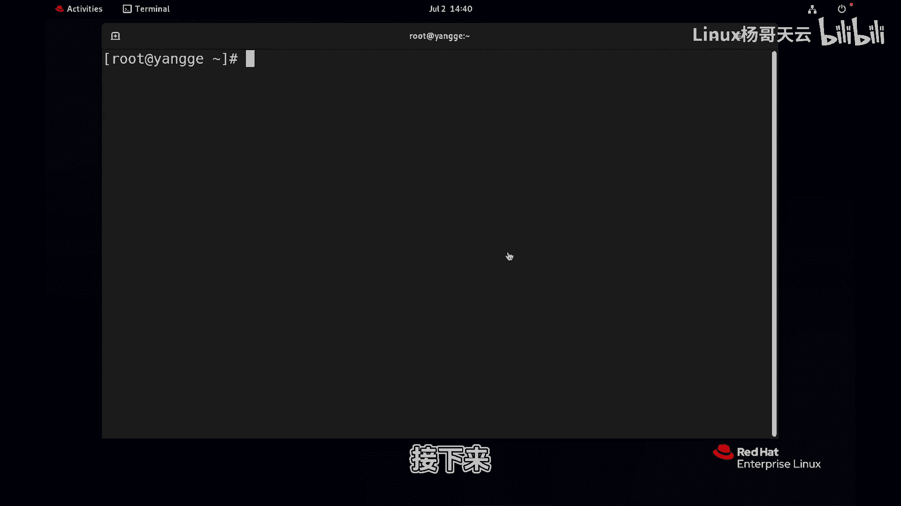
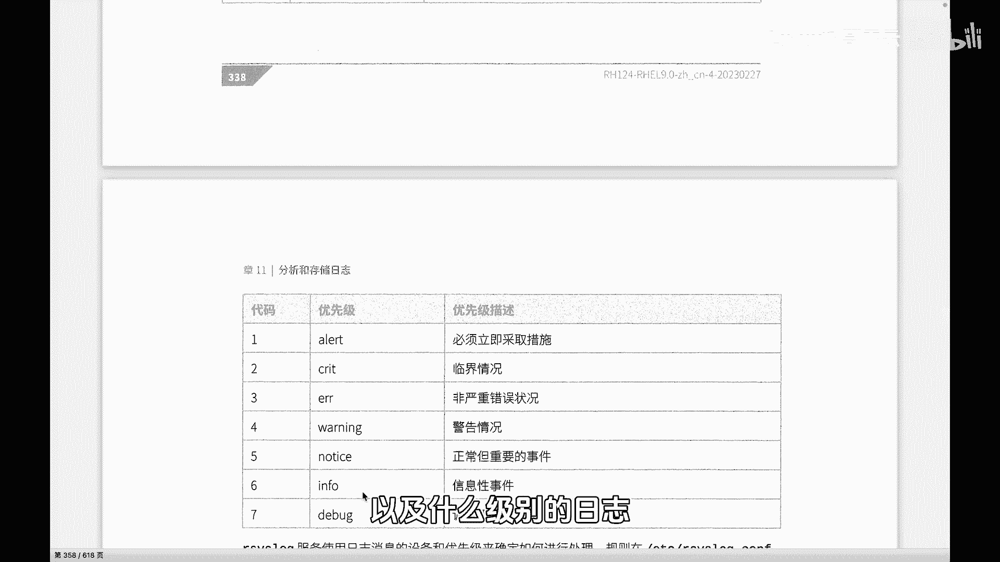

# Linux日志管理：P87：日志记录设备和优先级

在本节课中，我们将学习Linux系统日志的两个核心概念：日志设备（Facility）和优先级（Priority）。理解这两个概念是配置和管理系统日志规则的基础。

上一节我们介绍了日志系统的基本框架，本节中我们来看看日志消息的具体分类标准。

## 🎯 日志设备（Facility）

日志设备，也称为消息类型，用于标识产生日志消息的源头或子系统。它回答了“谁产生了这条消息”的问题。

以下是Linux系统中常见的日志设备及其含义：

*   **kern**：内核产生的消息。
*   **user**：用户级别的程序产生的消息。
*   **mail**：邮件系统相关的消息。
*   **daemon**：各种系统守护进程产生的消息。
*   **auth**：与用户认证和授权相关的消息。
*   **syslog**：`syslog` 服务自身产生的消息。
*   **lpr**：打印系统相关的消息。
*   **news**：网络新闻系统相关的消息。
*   **cron**：计划任务（cron）和时钟守护进程产生的消息。
*   **authpriv**：私有的认证消息（如SSH登录）。
*   **ftp**：FTP守护进程产生的消息。
*   **local0 - local7**：保留给用户自定义使用的日志设备。

需要注意的是，并非所有服务都使用系统的 `syslog` 机制，一些服务（如Web服务器、数据库）拥有自己独立的日志管理系统。上述设备主要对应与操作系统核心功能相关的进程。

## ⚠️ 日志优先级（Priority）

优先级定义了日志消息的严重程度。它决定了哪些消息需要被紧急处理，哪些可以作为普通信息记录。

优先级从高到低（从紧急到普通）排列如下：

*   **emerg**：系统不可用（最紧急），例如内核崩溃。此类消息通常会显示在所有用户的终端上。
*   **alert**：需要立即采取行动的事件。
*   **crit**：临界状态，例如某个关键软件无法启动。
*   **err**：错误状态，例如某个软件功能异常。
*   **warning**：警告信息，可能存在问题但不影响主要功能。
*   **notice**：普通但重要的事件通知。
*   **info**：一般性信息消息，用于记录正常运行状态。
*   **debug**：调试信息，通常在排查问题时才会启用。

此外，还有两个特殊的优先级：
*   **none**：不记录任何该设备的消息。
*   **`*`**：代表所有优先级。

## 🔗 设备与优先级的结合

在日志配置规则中，我们通过组合 **设备** 和 **优先级** 来精确筛选需要处理的日志消息。格式通常为 `facility.priority`。

例如：
*   `kern.emerg` 表示所有内核产生的紧急消息。
*   `mail.err` 表示邮件系统产生的错误及更高级别（err, crit, alert, emerg）的消息。
*   `*.info` 表示所有设备产生的信息性及更高级别的消息。
*   `cron.none` 表示不记录任何来自计划任务的日志。

## 📝 总结

本节课中我们一起学习了Linux日志管理的两个基石：**日志设备（Facility）** 和 **日志优先级（Priority）**。设备指明了日志的来源，优先级标定了消息的严重性。它们的组合构成了日志过滤规则的核心语法。在接下来的课程中，我们将运用这些知识，学习如何编写具体的日志规则，以决定将何种消息记录到何处，或采取何种行动。