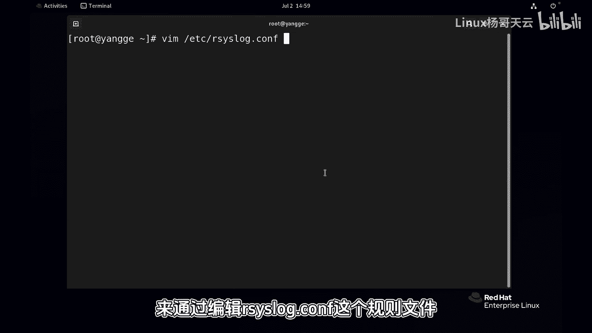
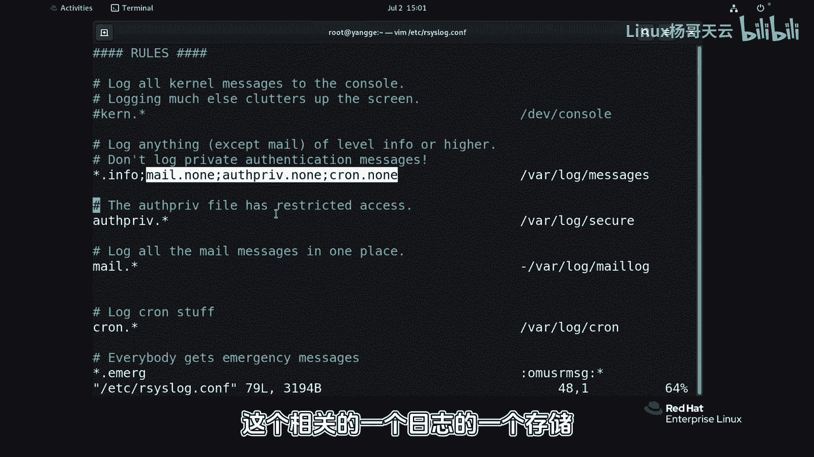
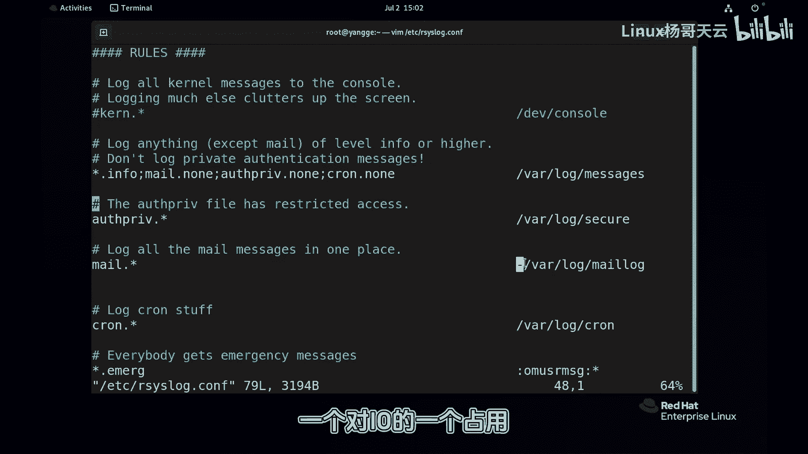
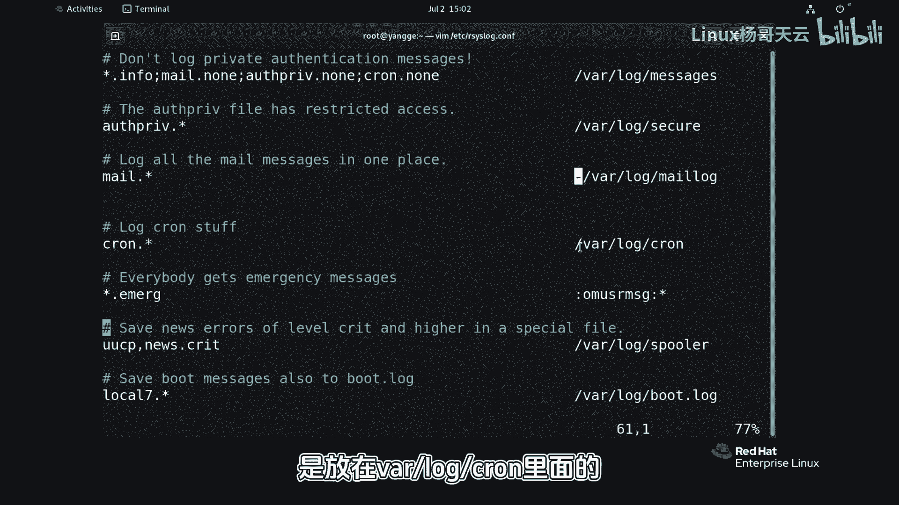
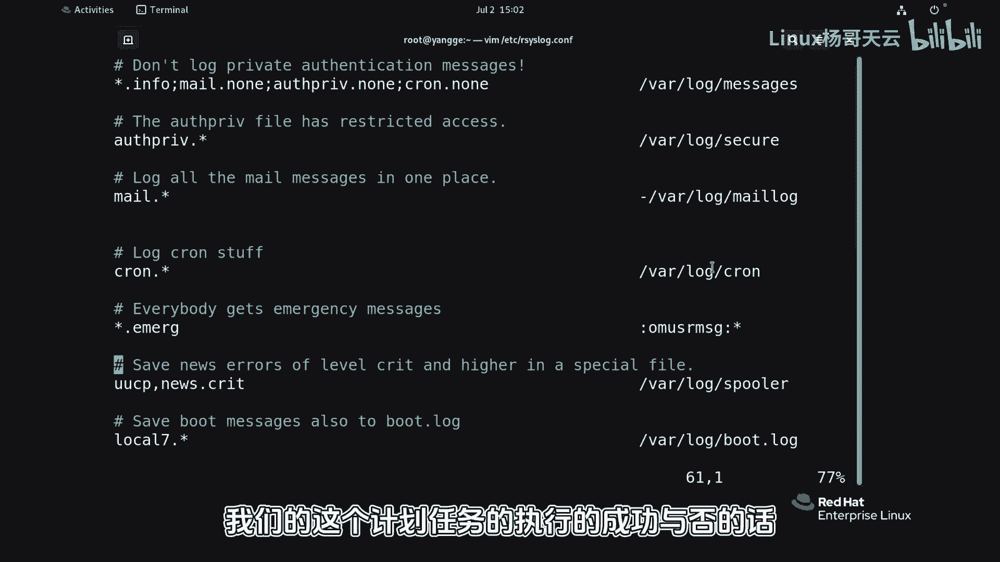
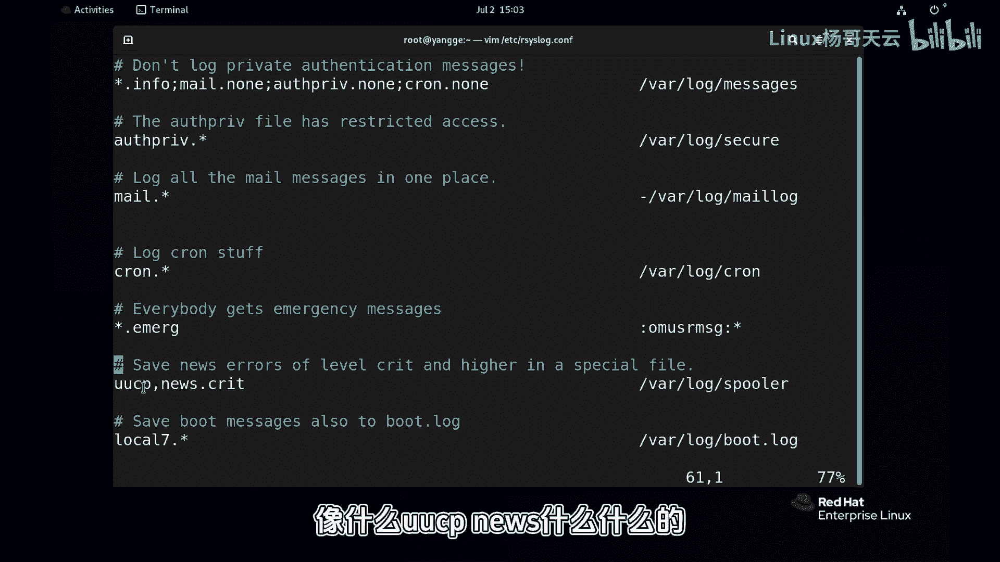
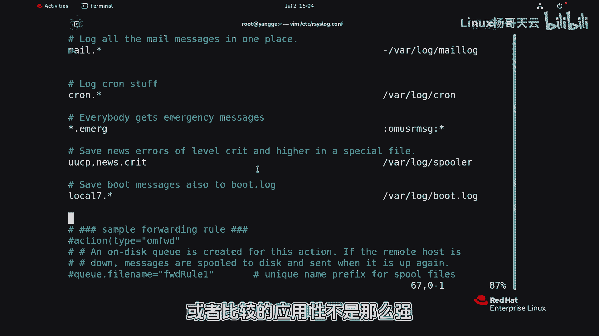

# Linux系统管理：P88：rsyslog规则详解

在本节课中，我们将要学习Linux系统中rsyslog服务的核心规则配置。我们将了解系统如何根据预定义的规则，将不同来源和级别的日志信息分类存储到指定的文件中。

上一节我们介绍了rsyslog服务的基本概念，本节中我们来看看其核心的规则配置文件是如何工作的。

## 规则文件的作用与位置

日志如何被记录，即什么样的设备、产生什么类型的消息、达到什么级别后应该存储到哪个文件，这些都由规则文件定义。我们可以通过编辑 `/etc/rsyslog.conf` 这个规则文件来配置这些行为。

## 规则文件内容解析

以下是规则文件中一些关键条目的解析：

*   **内核日志**：规则 `kern.* /dev/console` 表示所有级别（`*`）的内核（`kern`）日志都会发送到控制台（`/dev/console`）。
*   **主日志文件**：规则 `*.info;mail.none;authpriv.none;cron.none /var/log/messages` 是我们最常见的规则。
    *   `*.info` 表示所有设备（`*`）产生的 `info` 级别及更严重级别的日志。
    *   `mail.none;authpriv.none;cron.none` 表示排除（`.none`）邮件（`mail`）、认证（`authpriv`）和计划任务（`cron`）这三类设备的日志。
    *   最终，符合上述条件的日志都会记录到主日志文件 `/var/log/messages` 中。这里的所有设备指的是系统原生支持的设备，不包括像MySQL或X Window这样拥有独立日志管理机制的应用程序。

之所以将邮件、认证和计划任务的日志排除在主日志之外，是因为它们的日志量可能很大或需要单独分析，因此下面有专门为它们定义的存储规则。

## 特定设备的日志规则

以下是针对特定设备定义的独立存储规则：

*   **认证日志**：规则 `authpriv.* /var/log/secure` 将所有级别的认证相关日志保存在 `/var/log/secure` 文件中。
*   **邮件日志**：规则 `mail.* -/var/log/maillog` 将所有级别的邮件消息记录在 `/var/log/maillog` 中。规则前的 `-` 号表示采用异步写入方式。因为邮件日志量通常非常巨大，异步方式先将日志暂存于内存，达到一定量后再写入磁盘，可以减少对磁盘I/O的持续占用。
*   **计划任务日志**：规则 `cron.* /var/log/cron` 将所有级别的计划任务日志存放在 `/var/log/cron` 文件中。如果你想了解计划任务（如cron进程）的执行成功与否，可以查看这个文件。
*   **紧急消息广播**：规则 `*.emerg :omusrmsg:*` 是一个特殊规则。它表示所有设备（`*`）产生的紧急（`emerg`）级别（最严重级别）的日志，会通过 `:omusrmsg:*` 这个动作发送给当前所有已登录系统的用户。无论用户正在终端做什么，都会立即收到这条消息。
*   **引导日志**：规则 `uucp,news.crit /var/log/spooler` 以及 `local7.* /var/log/boot.log` 等规则，分别用于存储特定设备（如UUCP、新闻服务）的关键日志，以及系统引导（`boot`）相关的日志（通常存放在 `/var/log/boot.log`）。

## 规则的修改与扩展

以上便是系统默认的日志规则。通常情况下我们无需修改这些默认规则，但可以进行自定义。除了将日志记录在本地，我们还可以配置日志服务器，实现日志的集中式管理。这种方式借助系统自身的功能来实现统一管理。当然，在实际运维中，我们后期可能会使用更高效的运维工具（如ELK栈）来管理日志，因为rsyslog自带的集中管理功能相对简单，适用性有一定局限。

本节课中我们一起学习了rsyslog规则文件（`/etc/rsyslog.conf`）的结构与含义。我们了解了系统如何通过 `设备.级别` 的格式定义日志的过滤条件，以及如何通过指定文件路径或特殊动作（如`：omusrmsg：*`）来决定日志的存储或分发目的地。掌握这些规则是进行日志分析和自定义日志管理的基础。