Linux入门与红帽认证RHCE：P89：手动发送syslog消息

在本节课中，我们将学习如何使用`logger`命令手动向syslog系统发送日志消息，并验证这些消息是否被正确地记录到指定的日志文件中。

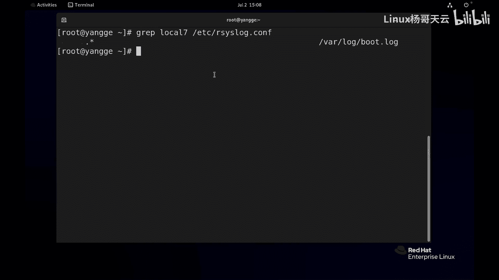

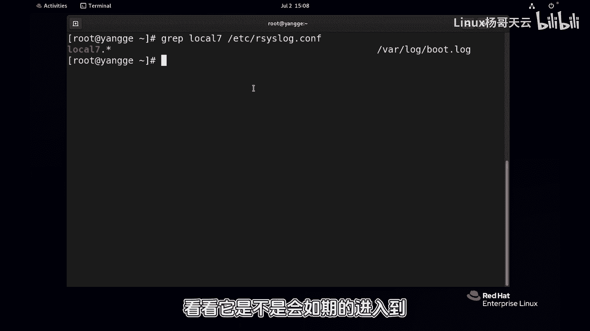

上一节我们介绍了syslog的配置规则，本节中我们来看看如何通过命令行工具主动生成日志。

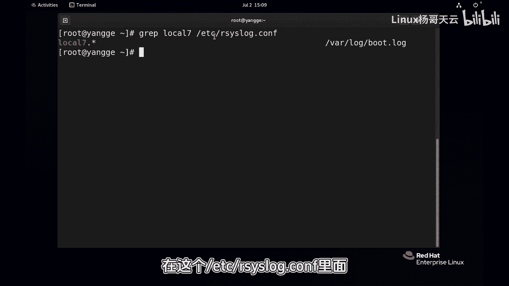

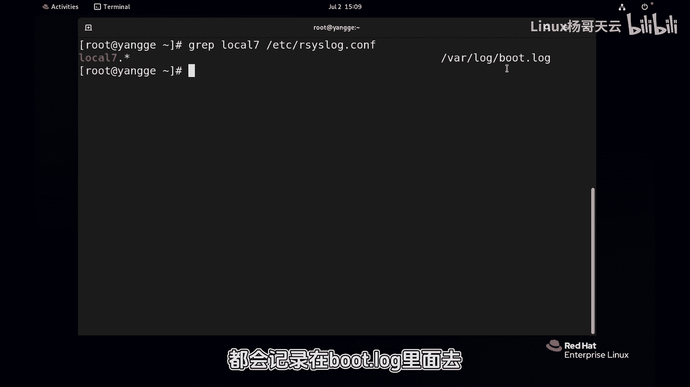

首先，根据当前配置，所有来自`local7`设备的日志，无论级别如何，都会被记录到`/var/log/boot.log`文件中。我们可以先查看该文件的最后几行，确认当前没有相关日志记录。

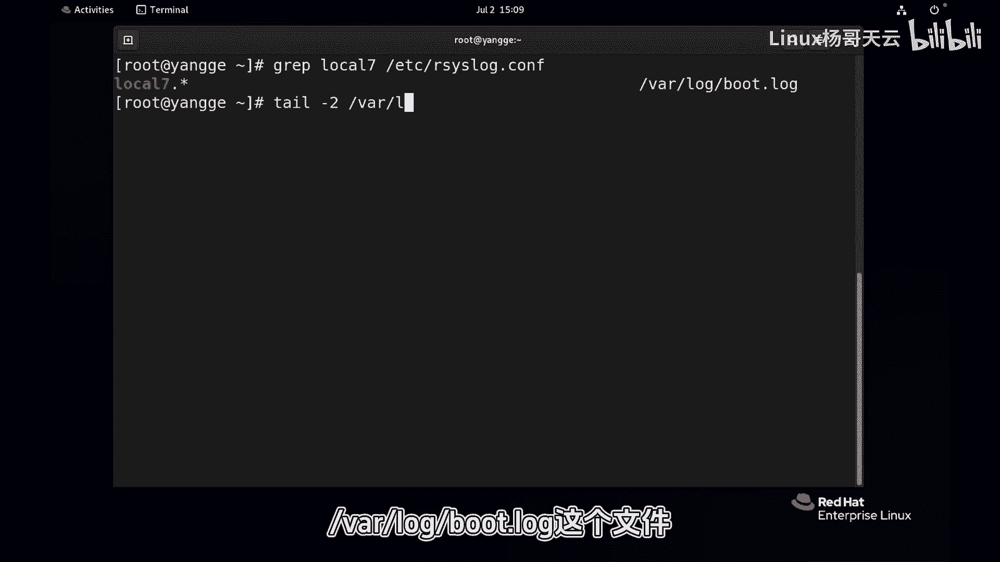

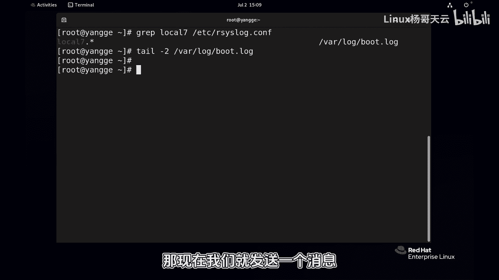

以下是查看文件末尾的命令：
```bash
tail -f /var/log/boot.log
```

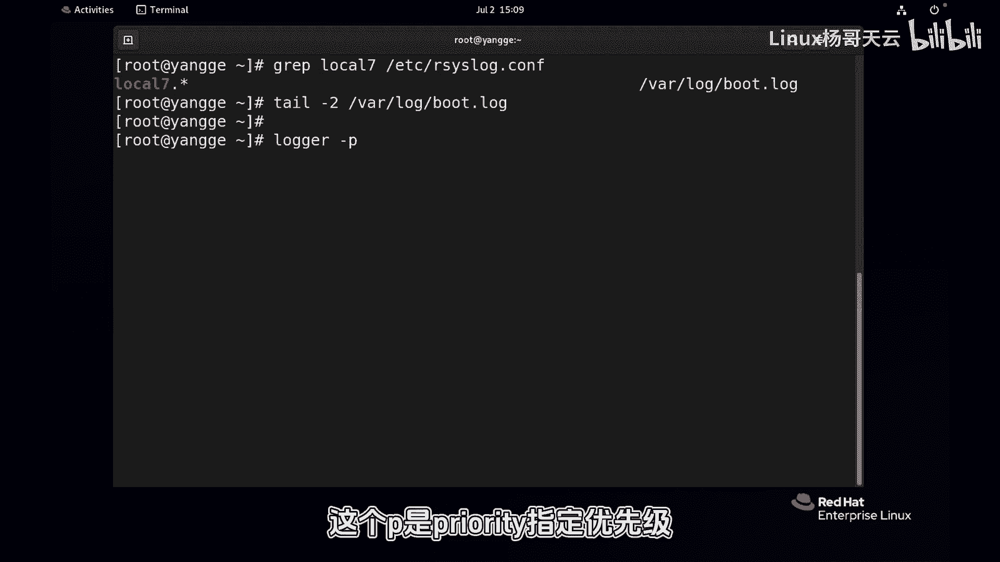

现在，我们使用`logger`命令发送一条消息。该命令的`-p`选项用于指定消息的优先级（Priority），其格式为`设备.级别`。

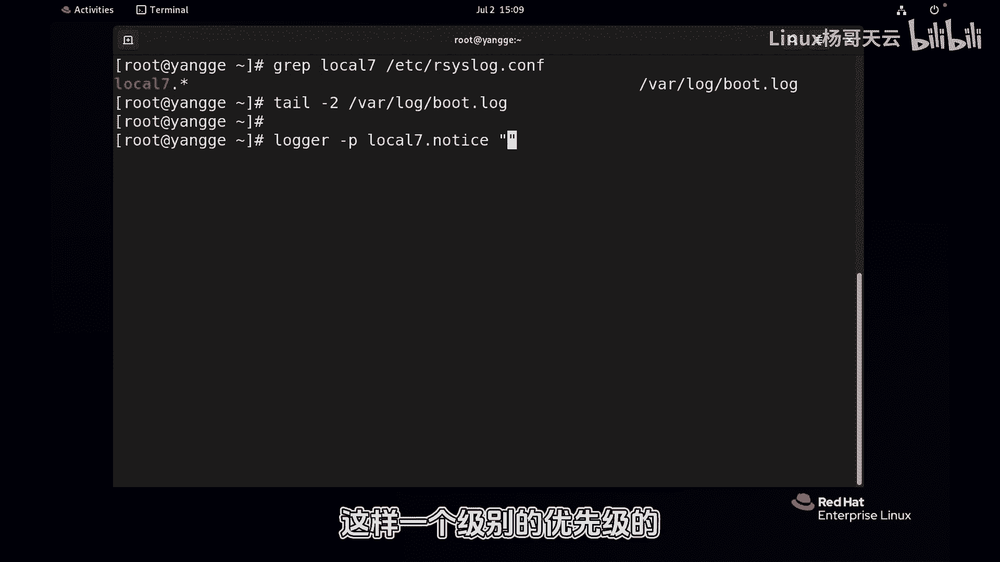

以下是发送一条`local7.notice`级别消息的命令：
```bash
logger -p local7.notice “hello杨哥”
```

命令执行后，屏幕上不会显示任何输出，因为`notice`级别的消息默认不会显示在终端上。

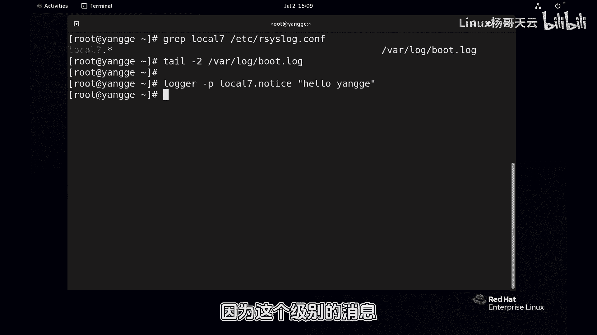

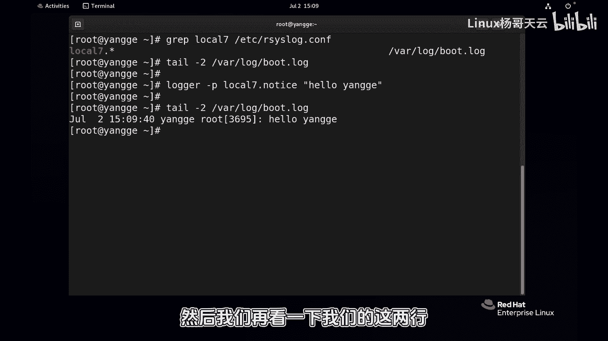

接下来，我们再次检查`/var/log/boot.log`文件。可以看到，syslog服务已经收到了我们手动发送的消息，并根据配置规则，将这条来自`local7`设备的`notice`级别日志记录到了该文件中。

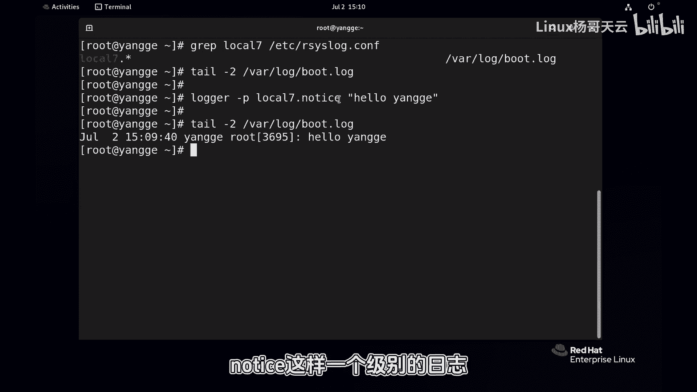

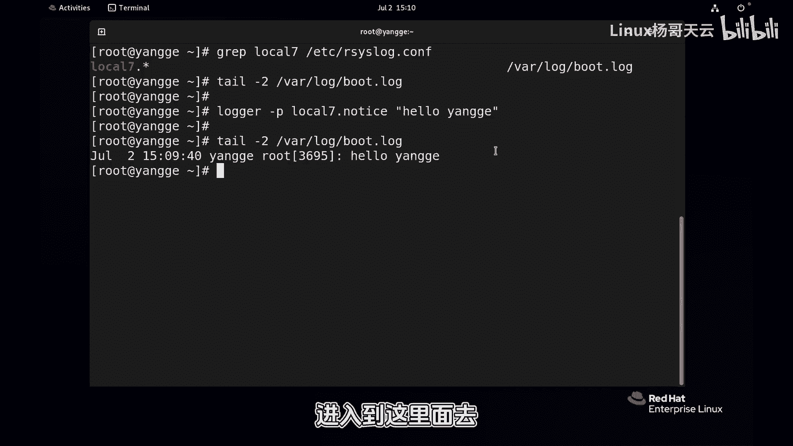

本节课中我们一起学习了如何使用`logger`命令手动生成系统日志。通过指定优先级参数`-p`，我们可以控制日志的设备来源和严重级别，这有助于测试syslog配置规则是否生效，也是在脚本中进行日志记录的常用方法。