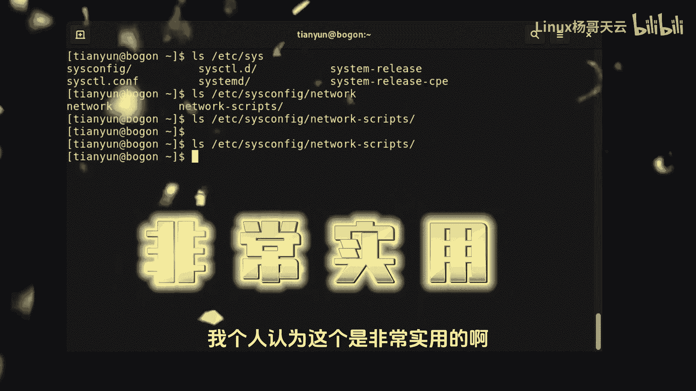
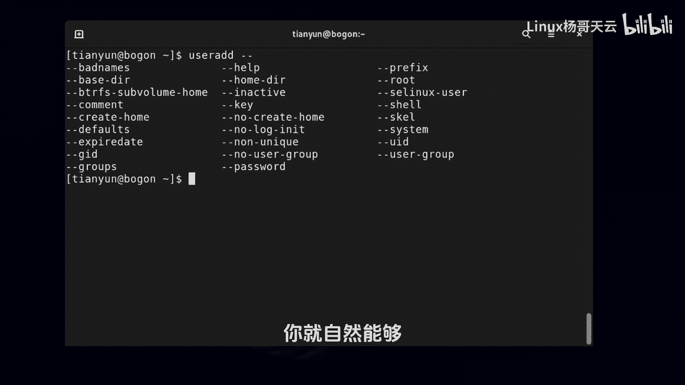

Linux入门教程：8：Linux自动补全技巧

在本节课中，我们将要学习Linux系统中一个极其重要的效率工具——自动补全。掌握补全技巧可以显著提升命令输入的速度和准确性，是每位Linux用户必须熟练使用的技能。

上一节我们介绍了Linux的基本操作，本节中我们来看看如何利用自动补全来简化命令输入过程。Linux的自动补全主要分为三类：命令补全、文件路径补全和命令选项补全。

### 命令补全

命令补全功能可以帮助我们快速输入命令名称。其工作原理是：当你输入命令的前几个字母后，按下 `Tab` 键，系统会根据已输入的字符尝试补全唯一的命令。

如果按一次 `Tab` 键没有反应，通常是因为当前输入的字符不足以确定一个唯一的命令。此时，连续按两次 `Tab` 键，系统会列出所有以已输入字符开头的命令供你选择。

以下是命令补全的一个具体例子：
*   输入 `pas` 后按一次 `Tab` 键，可能无法补全，因为存在多个以 `pas` 开头的命令（如 `passwd`, `paste` 等）。
*   此时按两次 `Tab` 键，系统会列出所有候选命令。
*   继续输入直到命令具有唯一性，例如输入 `passw` 后再按 `Tab` 键，系统就会自动补全为 `passwd`。

### 文件路径补全

文件路径补全在日常操作中非常实用。它可以帮助我们快速输入文件或目录的长路径，既能验证路径是否正确，又能极大提高输入效率。

其使用方法是：在需要输入文件路径的地方，输入路径的前几个字符后按 `Tab` 键。如果路径唯一，则自动补全；如果不唯一，按两次 `Tab` 键可以列出所有可能的匹配项。

以下是文件路径补全的操作步骤：
1.  输入 `/etc/pass`。
2.  按下 `Tab` 键，系统会自动补全为 `/etc/passwd`。
3.  对于更复杂的路径，如 `/etc/sysconfig/network-scripts/`，可以只输入前几个字母（如 `/etc/sysco`）后尝试补全。
4.  如果无法补全，按两次 `Tab` 键查看该目录下的所有条目，然后继续输入直至可以唯一补全。

**提示**：`Tab` 键使用频率极高，建议使用左手小指按压。如果不熟悉标准指法，可以通过打字练习软件进行强化。

### 命令选项补全

许多Linux命令拥有复杂的选项（包括短选项如 `-g` 和长选项如 `--gid`）。选项补全功能可以帮助我们快速、准确地输入这些选项。

使用方法是：在输入命令后，先输入 `-` 或 `--`，然后按 `Tab` 键。系统会列出该命令所有可用的选项。

以下是选项补全的应用示例：
*   输入命令 `useradd --` 后，连续按两次 `Tab` 键，会显示 `useradd` 命令所有可用的长选项列表。
*   如果想指定用户组ID，可以输入 `useradd --g` 然后按 `Tab` 键。如果以 `g` 开头的选项不唯一，系统会列出所有相关选项（如 `--gid`, `--groups` 等），此时继续输入直至可唯一补全，例如输入 `--gi` 后再按 `Tab` 键即可补全为 `--gid`。

本节课中我们一起学习了Linux的三种自动补全技巧：命令补全、文件路径补全和命令选项补全。这些技巧是提升Linux操作效率的核心，请务必在后续的练习中反复使用，形成肌肉记忆。熟练运用 `Tab` 键，将使你的命令行操作更加流畅和精准。