Linux入门与红帽认证RHCE：P90：日志轮转logrotate

在本节课中，我们将要学习Linux系统中一个重要的服务——`logrotate`。它的主要功能是自动轮转、压缩、删除和邮寄日志文件，防止单个日志文件过大，从而影响系统性能和管理效率。

---

上一节我们介绍了日志的基本概念，本节中我们来看看如何通过`logrotate`服务来管理日志文件的大小和生命周期。

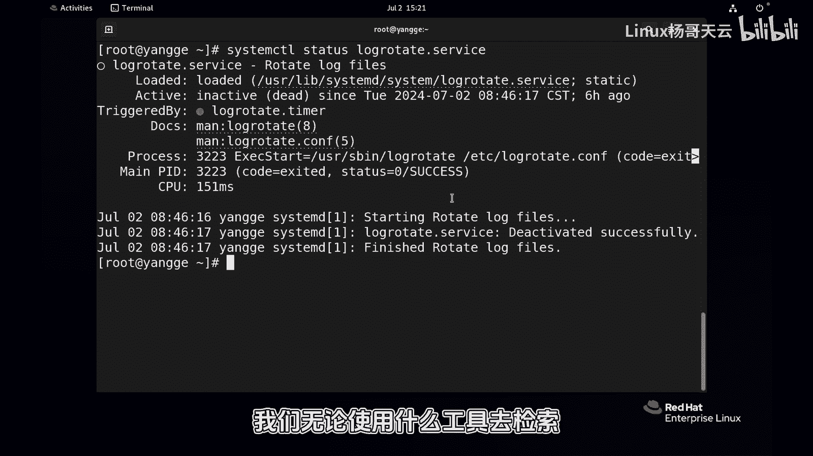

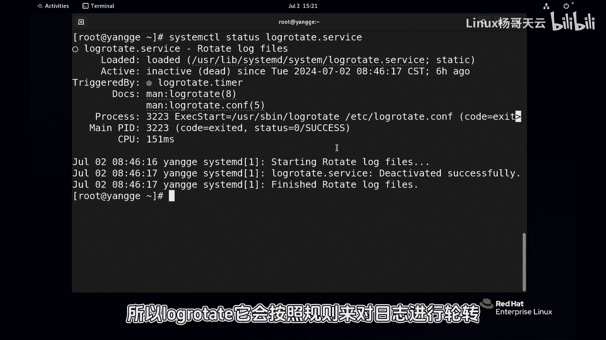

`logrotate`服务默认是开启的。如果没有它，日志文件会日积月累变得非常大。对于大文件，无论使用什么工具进行检索都会变得非常缓慢和困难。`logrotate`会按照预设的规则对日志进行轮转，相当于让日志文件周期性地“重生”。

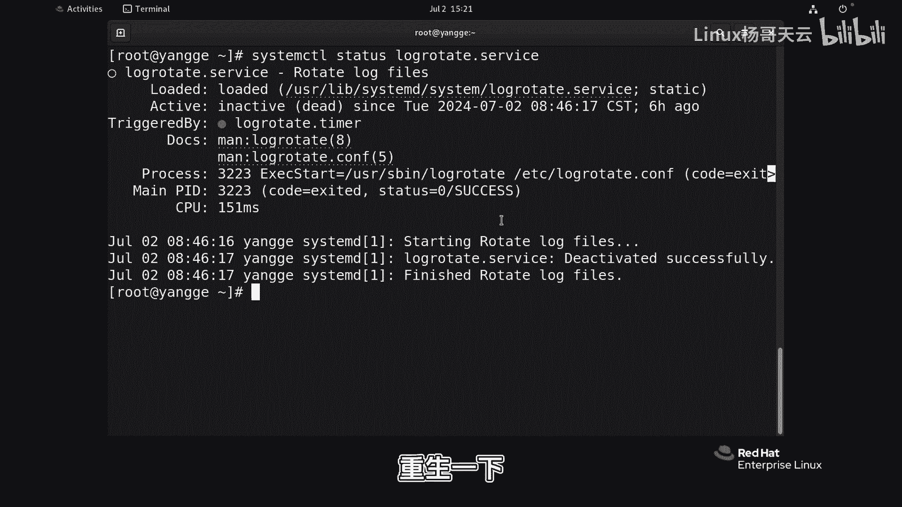

我们可以观察到系统日志（如`/var/log/messages`）的轮转成果。除了当前的`messages`文件，还存在许多以日期（如年月日）命名的归档文件，这就是日志轮转和切割的结果。

---

### **logrotate的工作原理与配置文件**

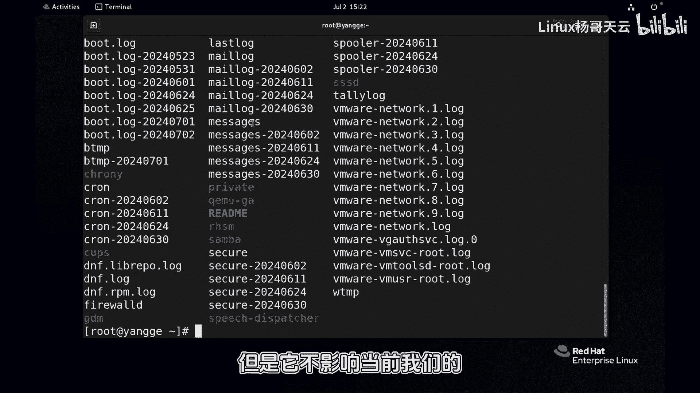

`logrotate`的行为由配置文件控制。其配置文件主要分为两部分：主配置文件`/etc/logrotate.conf`和目录`/etc/logrotate.d/`下的子配置文件。

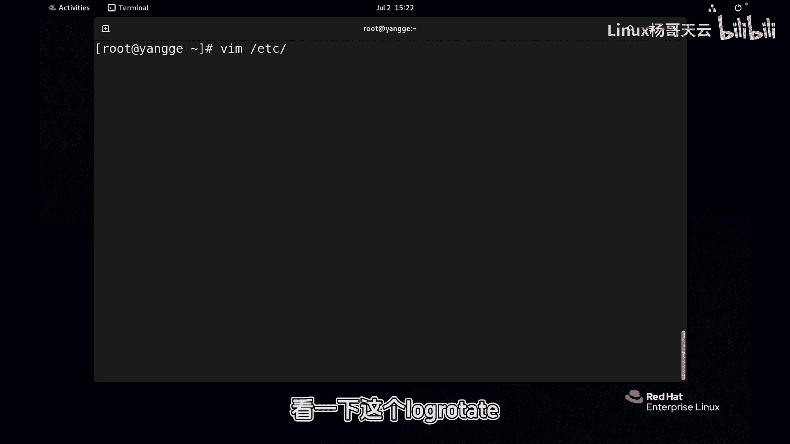

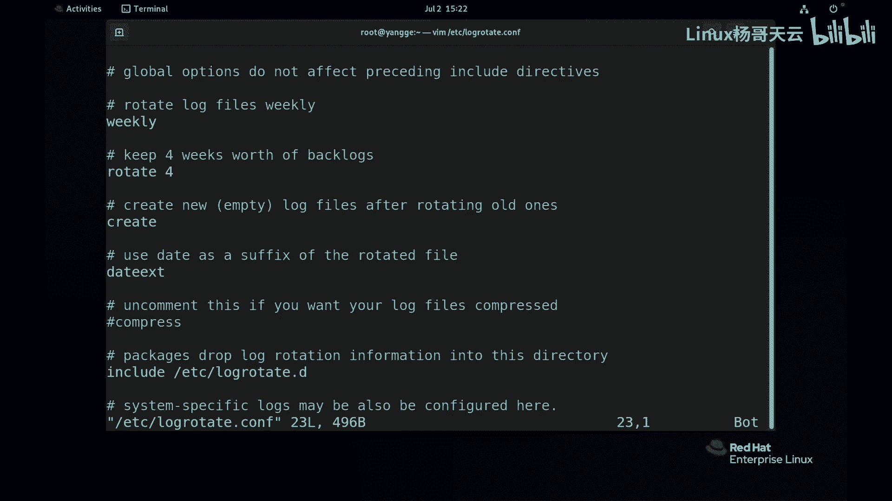

主配置文件定义了全局的默认轮转规则。如果某个日志没有单独配置，则遵循此处的规则。

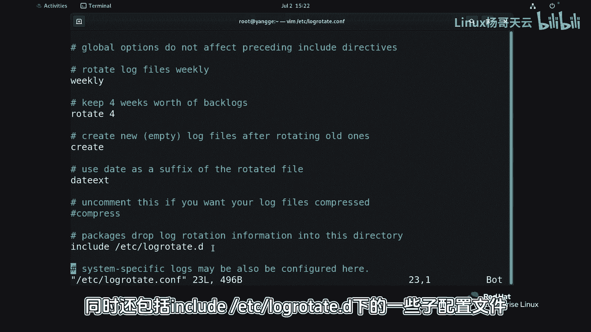

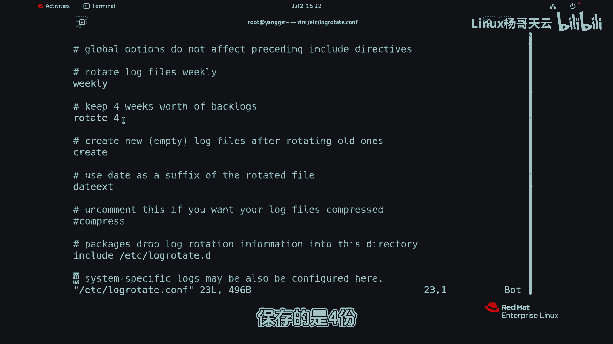

以下是主配置文件中一些核心参数的含义：

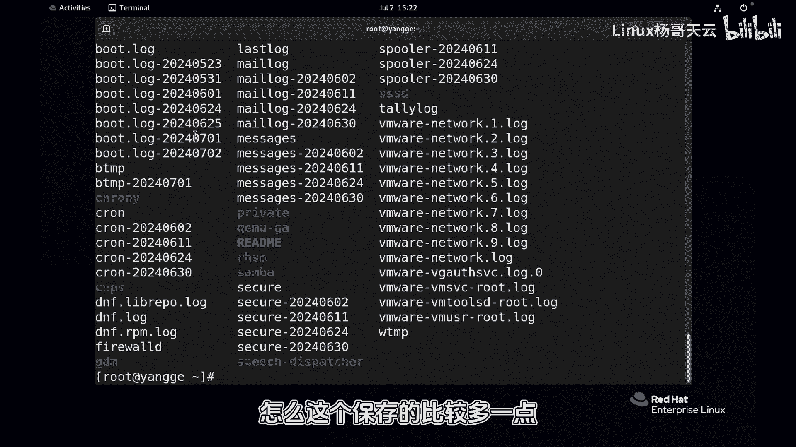

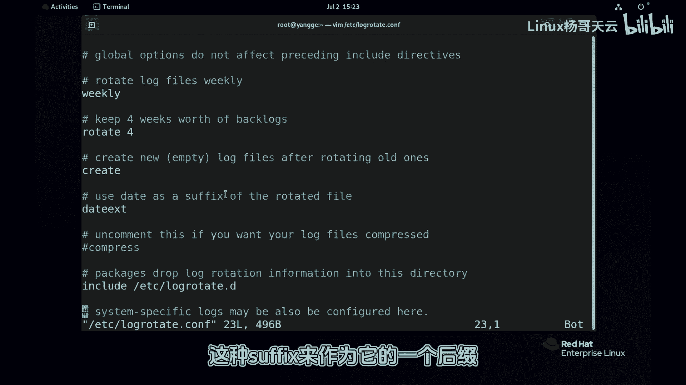

*   **`weekly`**: 轮转周期，表示每周轮转一次。其他选项还有`daily`（每日）、`monthly`（每月）等。
*   **`rotate 4`**: 保留的旧日志文件份数。表示保留4份轮转后的历史日志。
*   **`create`**: 轮转后，创建一个新的空日志文件。
*   **`dateext`**: 使用日期作为轮转后日志文件的后缀。
*   **`include /etc/logrotate.d`**: 包含`/etc/logrotate.d`目录下的所有子配置文件。

---

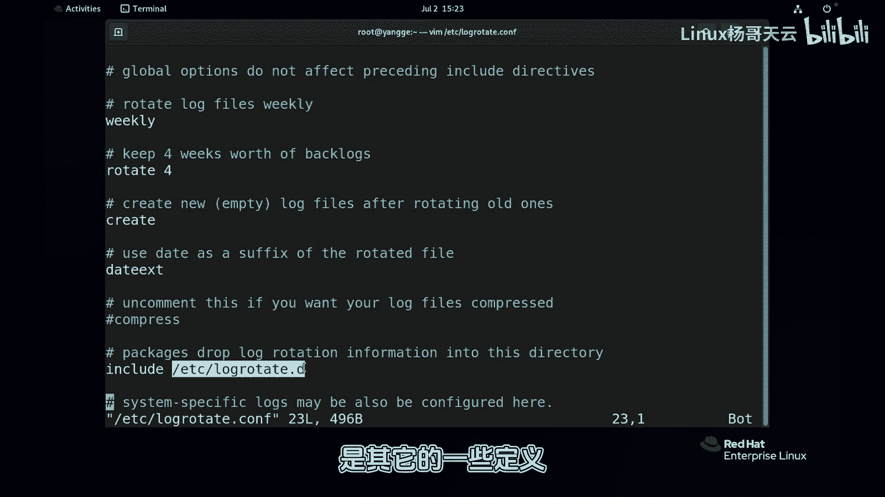

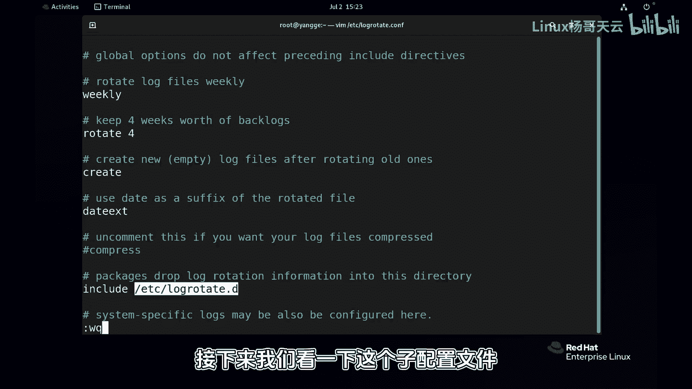

### **子配置文件与常见日志规则**

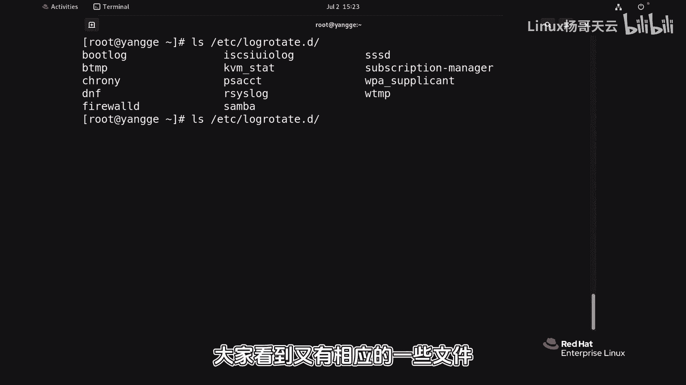

`/etc/logrotate.d/`目录下包含了针对特定服务或日志的详细配置。系统常见的日志，如`messages`、`cron`（计划任务）、`secure`（安全）等，都在这里有独立的配置。

这些子配置文件通常会继承主配置的规则，并添加一些特定指令。例如，针对`rsyslog`（系统日志服务）的配置可能会包含以下内容：

```
/var/log/messages
{
    missingok
    sharedscripts
    postrotate
        /bin/kill -HUP `cat /var/run/syslogd.pid 2> /dev/null` 2> /dev/null || true
    endscript
}
```

以下是其中关键指令的解释：

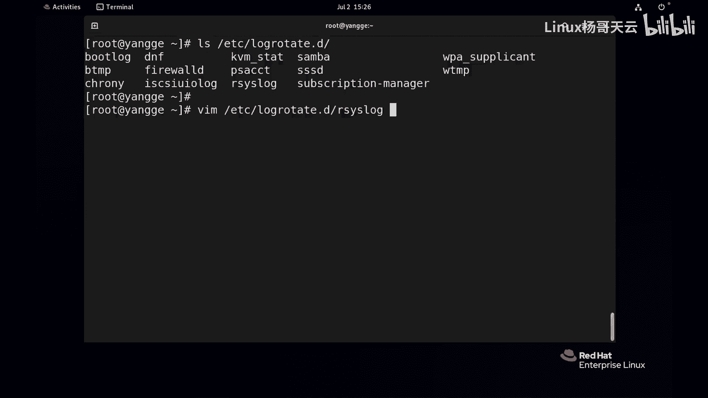

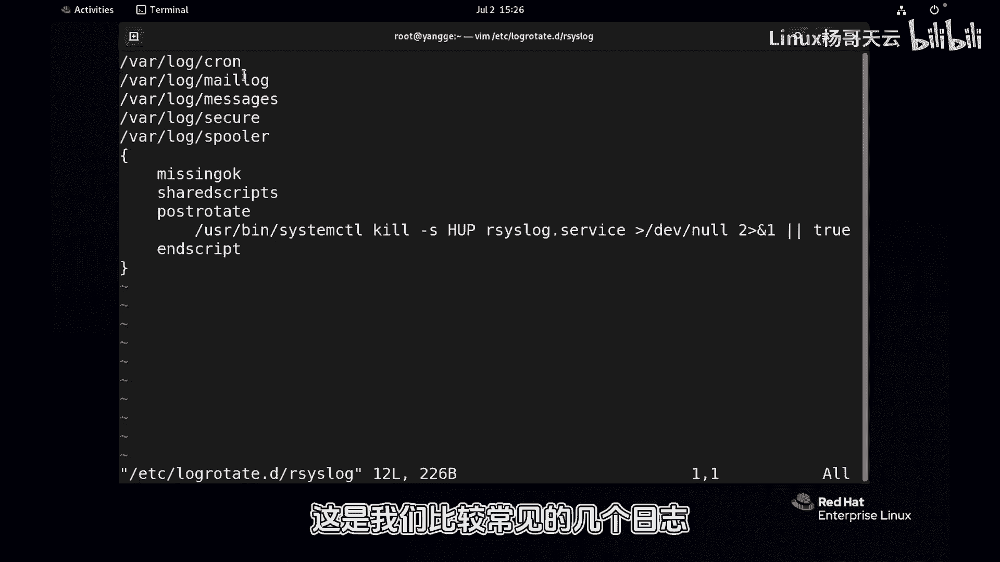

*   **`missingok`**: 如果日志文件丢失，不报错，继续轮转下一个。
*   **`sharedscripts`**: 对于匹配该配置的所有日志文件，`prerotate`和`postrotate`脚本只运行一次，而不是为每个轮转的文件都运行一次。
*   **`postrotate` / `endscript`**: 在日志轮转**之后**执行的脚本块。这里发送一个`HUP`信号（重启信号）给`syslogd`进程。这是因为轮转后创建了一个新的日志文件，原来的服务进程可能还持有旧文件的描述符。通过重启服务（或发送特定信号），可以使其识别并开始向新的日志文件写入数据。

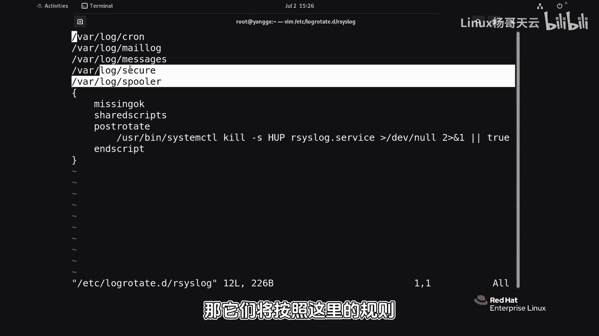

---

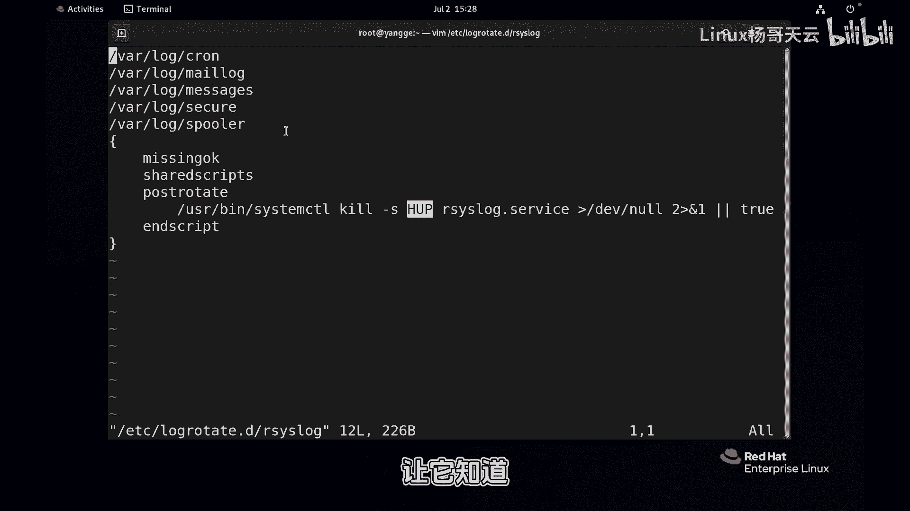

本节课中我们一起学习了`logrotate`服务的作用及其配置方法。我们了解到，通过在主配置文件`/etc/logrotate.conf`中设置全局规则（如轮转周期`weekly`、保留份数`rotate 4`），并在`/etc/logrotate.d/`目录下为特定日志配置细节（如使用`postrotate`脚本通知服务），可以有效地自动化管理日志文件，防止其无限增长，确保系统的可维护性。