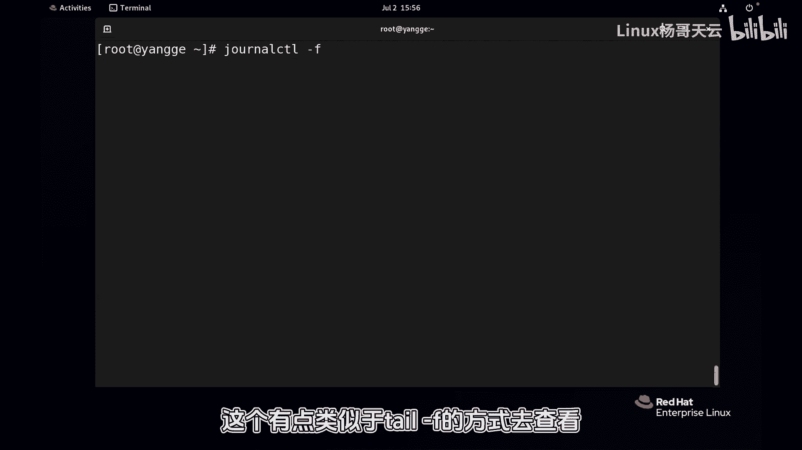
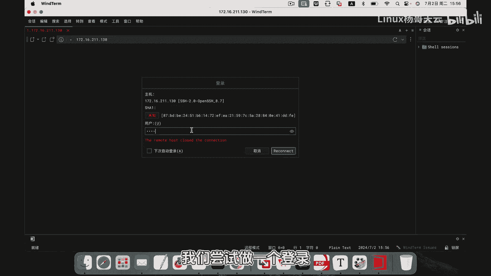
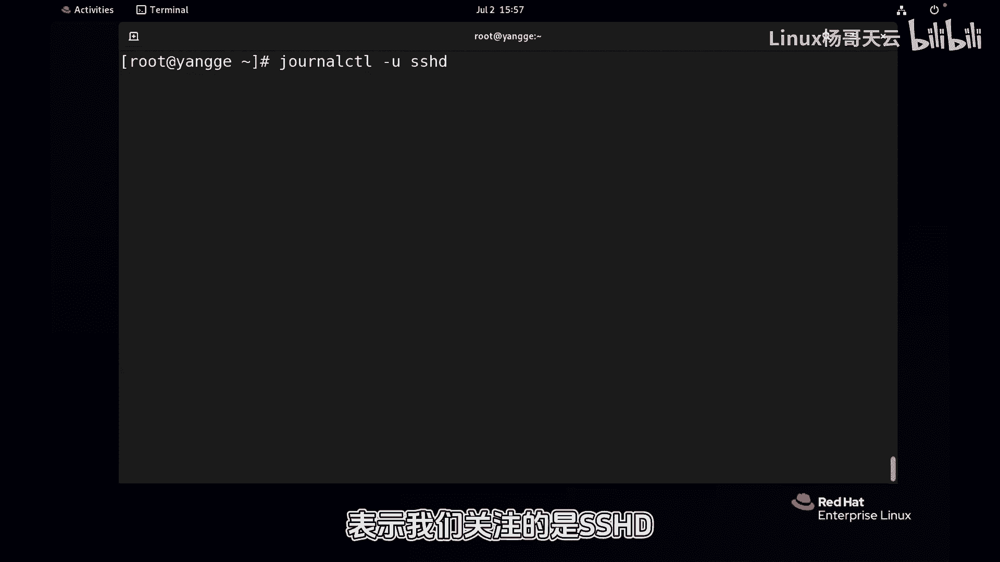
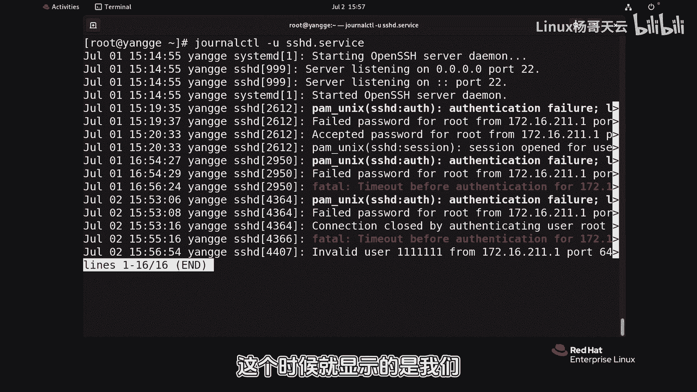
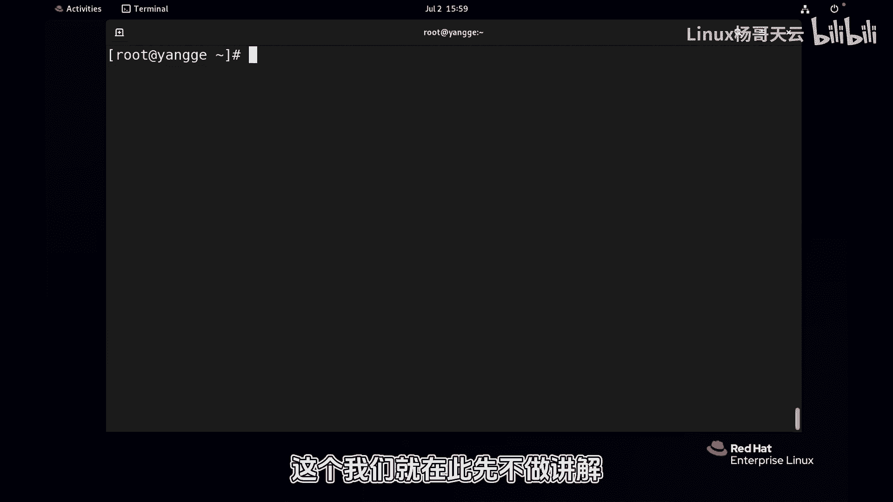

Linux入门与红帽认证RHCE：P91：journalctl查看内存日志 🐧

在本节课程中，我们将学习如何使用 `journalctl` 命令查看由 systemd 服务管理的、存储在内存中的系统日志。这种日志采用结构化二进制格式，便于检索，但默认只保存自系统启动以来的记录。

---

上一节我们介绍了系统日志的基本概念，本节中我们来看看如何具体查看这些内存日志。

查看内存日志的核心命令是 `journalctl`。如果直接执行该命令，它会显示所有的日志条目。



以下是 `journalctl` 命令的一些基本用法：



*   **显示所有日志**：直接运行 `journalctl` 命令。
*   **搜索关键词**：使用 `-g` 或 `--grep` 选项。例如，`journalctl -g “关键词”` 可以过滤出包含特定关键词的日志。
*   **显示最近条目**：使用 `-n` 选项。例如，`journalctl -n 5` 会显示最近的5条日志。
*   **实时跟踪日志**：使用 `-f` 选项，类似于 `tail -f` 命令，可以实时查看日志的新增内容。

例如，在一个终端执行 `journalctl -f` 后，在另一个终端尝试用错误密码登录，就能实时看到类似 `“Failed password for invalid user root”` 的认证失败日志。按 `Ctrl+C` 可以终止实时跟踪，在日志浏览界面按 `Q` 键可以退出。

---

除了查看全局日志，我们还可以专注于查看特定系统单元（如某个服务）的日志。



以下是查看特定单元日志及按时间过滤的方法：



*   **查看特定服务日志**：使用 `-u` 选项指定单元名称。例如，查看 SSH 服务的日志可以执行 `journalctl -u sshd` 或 `journalctl -u sshd.service`。
*   **指定开始时间**：使用 `--since` 选项。例如，`journalctl --since “2024-06-30 10:10:00”`。
*   **指定结束时间**：使用 `--until` 选项。例如，`journalctl --until “2024-07-01 00:00:00”`。
*   **组合时间范围**：可以同时指定开始和结束时间来查看某个时间段的日志。例如：
    ```bash
    journalctl --since “2024-06-30” --until “2024-07-01”
    ```
*   **查看相对时间**：使用更简便的相对时间格式。例如，`journalctl --since “-1 hour”` 可以查看过去一小时的日志。

---

`journalctl` 命令是系统故障排查的利器。当服务启动失败时，系统提示常常会建议使用 `journalctl -xe` 或 `journalctl -u 服务名` 来快速查看相关错误日志。这些日志不仅记录了事件，有时还会附带解决问题的建议线索。



本节课中我们一起学习了 `journalctl` 命令的核心用法，包括查看全部日志、按关键词过滤、实时跟踪、查看特定服务日志以及按时间范围筛选。这些技能对于日常系统监控和故障诊断至关重要。需要注意的是，默认的内存日志在重启后会丢失，但也可以配置为持久化存储，这部分内容我们将在后续课程中探讨。